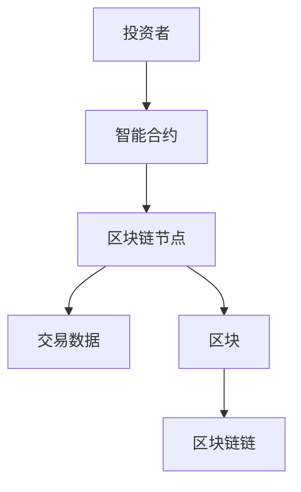

                 


# 价值投资中的区块链技术应用

> 关键词：区块链技术、价值投资、智能合约、分布式账本、去中心化金融（DeFi）

> 摘要：区块链技术作为一种革命性的分布式账本技术，正在改变传统金融行业的运作方式。本文将深入探讨区块链技术在价值投资中的应用，分析其如何通过提高透明度、增强信任机制和优化投资流程来重构传统价值投资模式。通过结合区块链的核心原理与价值投资的实践案例，本文旨在为投资者和技术创新者提供理论支持和实践指导。

---

## 第1章：区块链与价值投资的结合

### 1.1 区块链技术的基本概念

#### 1.1.1 区块链的定义与特点

区块链是一种去中心化的分布式账本技术，通过密码学和分布式共识机制确保数据的安全性和不可篡改性。其特点包括去中心化、透明性、不可篡改性和可追溯性。

#### 1.1.2 区块链的核心技术原理

- 数据结构：区块链由一系列区块组成，每个区块包含交易数据和哈希指针。
- 共识机制：通过共识算法（如PoW、PoS、BFT等）确保所有节点达成一致。
- 智能合约：基于区块链的自动化执行脚本，用于实现复杂的业务逻辑。

#### 1.1.3 区块链在金融领域的应用潜力

区块链技术在金融领域的应用包括支付清算、资产管理、证券交易等领域，其去中心化和高效性为传统金融行业带来了革新。

### 1.2 价值投资的基本原理

#### 1.2.1 价值投资的定义与核心理念

价值投资是一种长期投资策略，强调通过深入分析企业的基本面，寻找被市场低估的投资标的。其核心理念包括安全边际、长期持有的投资理念和对企业的深入研究。

#### 1.2.2 传统价值投资的局限性

- 信息不对称：传统投资中，投资者难以获取完全透明的企业信息，容易受到市场操纵和虚假信息披露的影响。
- 中介机构依赖：传统投资依赖于银行、券商等中介机构，增加了交易成本和潜在的利益冲突。
- 缺乏技术支撑：传统投资主要依赖人工分析，难以实现高效、精准的决策支持。

#### 1.2.3 区块链如何赋能价值投资

- 提高透明度：区块链技术可以实现企业信息的公开透明，投资者可以实时查看企业的财务数据和运营情况。
- 增强信任机制：通过区块链的不可篡改性，投资者可以信任数据的真实性，降低信息不对称的风险。
- 优化投资流程：区块链技术可以实现自动化的交易和结算，提高投资流程的效率和透明度。

### 1.3 区块链与价值投资的结合点

#### 1.3.1 区块链技术如何提升投资透明度

- 通过区块链的分布式账本技术，投资者可以实时查看企业的财务数据和运营信息，确保信息的透明性和真实性。
- 区块链技术可以实现企业数据的实时共享，投资者可以随时获取最新的企业动态。

#### 1.3.2 区块链如何增强投资信任机制

- 区块链的不可篡改性确保了数据的真实性和完整性，投资者可以信任数据的来源和内容。
- 通过智能合约的自动化执行，投资行为可以更加透明和可靠，减少了人为干预和道德风险。

#### 1.3.3 区块链如何优化投资流程

- 自动化交易：通过智能合约，投资者可以实现自动化的交易和结算，减少人工操作的成本和时间。
- 高效的资金管理：区块链技术可以实现资金的实时划转和管理，提高资金使用效率。

### 1.4 本章小结

本章主要介绍了区块链技术的基本概念和其在金融领域的应用潜力，重点分析了区块链技术如何赋能价值投资。通过区块链技术的透明性、不可篡改性和自动化执行能力，可以有效解决传统价值投资中的信息不对称和信任机制问题，优化投资流程，提升投资效率。

---

## 第2章：区块链技术的核心原理

### 2.1 区块链的数据结构

#### 2.1.1 区块链的基本数据结构

- 链表：区块链由一系列区块组成，每个区块包含交易数据和哈希指针。
- Merkel树：一种用于高效验证数据完整性的数据结构，用于存储交易的哈希值。

#### 2.1.2 区块链的哈希函数

- 哈希函数用于将数据转换为固定长度的哈希值，确保数据的唯一性和完整性。
- 常用的哈希函数包括SHA-256、RIPEMD-160等。

#### 2.1.3 区块链的区块结构

- 区块头：包含区块高度、时间戳、Merkle根哈希、 nonce等信息。
- 区块体：包含交易数据和交易的哈希值。

### 2.2 区块链的共识机制

#### 2.2.1 工作量证明机制（PoW）

- 通过计算随机数，找到符合条件的哈希值来证明计算工作，确保网络安全。
- 适用于比特币等加密货币。

#### 2.2.2 权益证明机制（PoS）

- 根据节点持有的代币数量来分配记账权，减少能源消耗。
- 适用于以太坊2.0等项目。

#### 2.2.3 拜占庭容错共识（BFT）

- 通过节点之间的投票达成共识，适用于小规模网络。
- 常用于联盟链和私有链。

### 2.3 区块链的智能合约

#### 2.3.1 智能合约的定义与特点

- 智能合约是一种基于区块链的自动化执行脚本，用于实现复杂的业务逻辑。
- 其特点包括自动化、不可篡改性和去中心化。

#### 2.3.2 智能合约的实现原理

- 智能合约运行在区块链的虚拟机（如以太坊的EVM）中，通过编译和部署实现。
- 智能合约可以通过Solidity等编程语言进行开发。

#### 2.3.3 智能合约的安全性与可靠性

- 智能合约的安全性依赖于代码的正确性和运行环境的安全性。
- 通过代码审计和漏洞修复，可以提高智能合约的安全性。

### 2.4 本章小结

本章详细讲解了区块链的核心技术原理，包括数据结构、共识机制和智能合约。通过这些技术，区块链实现了去中心化、透明性和不可篡改性，为价值投资提供了强有力的技术支持。

---

## 第3章：区块链技术在价值投资中的应用场景

### 3.1 区块链技术如何重构价值投资流程

#### 3.1.1 信息不对称的解决

- 通过区块链的透明性，投资者可以实时获取企业的财务数据和运营信息，减少信息不对称的风险。

#### 3.1.2 投资决策的优化

- 利用区块链技术实现数据的实时分析和自动化决策，提高投资决策的效率和准确性。

#### 3.1.3 投资风险的降低

- 通过区块链的不可篡改性和智能合约的自动化执行，减少人为干预和道德风险，降低投资风险。

### 3.2 区块链如何提升投资透明度

#### 3.2.1 企业信息的实时共享

- 通过区块链技术，投资者可以实时查看企业的财务数据和运营信息，确保信息的真实性和透明性。

#### 3.2.2 交易的可追溯性

- 区块链技术可以实现交易的全生命周期追溯，确保交易的透明性和可查性。

### 3.3 区块链如何优化投资流程

#### 3.3.1 自动化交易与结算

- 通过智能合约实现自动化的交易和结算，减少人工操作的成本和时间。

#### 3.3.2 高效的资金管理

- 区块链技术可以实现资金的实时划转和管理，提高资金使用效率。

### 3.4 本章小结

本章主要探讨了区块链技术在价值投资中的应用场景，包括重构投资流程、提升透明度和优化投资流程等方面。通过区块链技术的应用，价值投资可以实现更加高效、透明和安全的投资环境。

---

## 第4章：区块链技术与价值投资的系统设计

### 4.1 系统功能设计

#### 4.1.1 投资信息的区块链存储

- 通过区块链技术实现投资信息的分布式存储，确保数据的安全性和不可篡改性。

#### 4.1.2 智能合约的自动化执行

- 利用智能合约实现投资行为的自动化执行，减少人工干预和时间成本。

#### 4.1.3 投资数据的实时分析

- 通过区块链技术实现投资数据的实时分析和动态调整，提高投资决策的效率和准确性。

### 4.2 系统架构设计

#### 4.2.1 系统架构图



#### 4.2.2 系统接口设计

- 投资者接口：用于提交投资指令和查询投资信息。
- 区块链节点接口：用于处理交易数据和维护区块链账本。
- 智能合约接口：用于定义投资行为的自动化执行逻辑。

### 4.3 系统交互设计

#### 4.3.1 投资者发起投资指令

- 投资者通过投资者接口提交投资指令，系统将指令发送到智能合约。

#### 4.3.2 智能合约执行交易

- 智能合约根据投资指令执行交易，生成交易数据并提交到区块链节点。

#### 4.3.3 区块链节点确认交易

- 区块链节点通过共识机制确认交易的合法性，并将交易数据写入区块链账本。

### 4.4 本章小结

本章详细讲解了区块链技术在价值投资中的系统设计，包括功能设计、架构设计和系统交互设计。通过系统的架构设计和接口设计，可以实现投资信息的安全存储、智能合约的自动化执行和投资数据的实时分析，为价值投资提供了强有力的技术支持。

---

## 第5章：项目实战——基于区块链的智能合约投资系统

### 5.1 环境安装与配置

#### 5.1.1 安装以太坊环境

- 安装以太坊的节点客户端（如Geth）和智能合约开发环境（如Solidity）。

#### 5.1.2 配置区块链网络

- 配置以太坊的本地测试网络，用于开发和测试智能合约。

### 5.2 智能合约核心实现

#### 5.2.1 定义智能合约

```solidity
pragma solidity ^0.8.0;

contract InvestmentContract {
    mapping(address => uint256) private balances;

    function invest(address _to, uint256 _amount) public {
        balances[_to] += _amount;
        emit InvestmentEvent(_to, _amount);
    }

    function withdraw(uint256 _amount) public {
        require(balances[msg.sender] >= _amount, "Insufficient balance");
        balances[msg.sender] -= _amount;
        emit WithdrawEvent(msg.sender, _amount);
    }

    event InvestmentEvent(address indexed _to, uint256 _amount);
    event WithdrawEvent(address indexed _sender, uint256 _amount);
}
```

#### 5.2.2 编译与部署智能合约

- 使用Solidity编译智能合约，并部署到以太坊网络中。

### 5.3 系统实现与应用

#### 5.3.1 投资者发起投资指令

- 投资者通过以太坊钱包发起投资指令，调用智能合约的invest函数。

#### 5.3.2 智能合约执行交易

- 智能合约根据投资者的指令执行交易，更新投资人的余额，并记录交易日志。

### 5.4 项目小结

本章通过实际项目案例，详细讲解了基于区块链的智能合约投资系统的实现过程，包括环境安装、智能合约开发、系统实现和案例分析。通过本章的学习，读者可以掌握区块链技术在价值投资中的具体应用方法。

---

## 第6章：总结与展望

### 6.1 本章总结

本文详细探讨了区块链技术在价值投资中的应用，分析了区块链技术如何通过提高透明度、增强信任机制和优化投资流程来重构传统价值投资模式。通过系统的架构设计和实际项目案例，本文为投资者和技术创新者提供了理论支持和实践指导。

### 6.2 未来展望

随着区块链技术的不断发展和完善，其在价值投资中的应用潜力将更加广阔。未来，区块链技术可以结合人工智能、大数据分析等技术，进一步提升投资决策的智能化和自动化水平，为价值投资带来更大的创新和突破。

---

## 附录

### 附录A：区块链术语表

- 区块链：一种去中心化的分布式账本技术，通过密码学和分布式共识机制确保数据的安全性和不可篡改性。
- 智能合约：基于区块链的自动化执行脚本，用于实现复杂的业务逻辑。
- 共识机制：通过节点之间的投票或计算达成共识的机制，确保区块链网络的安全性和一致性。

### 附录B：参考文献

- [1] 《区块链技术及应用》，作者：区块链技术专家，出版社：某某出版社。
- [2] 《价值投资：从入门到精通》，作者：价值投资专家，出版社：某某出版社。

---

## 作者信息

作者：AI天才研究院/AI Genius Institute & 禅与计算机程序设计艺术/Zen And The Art of Computer Programming

