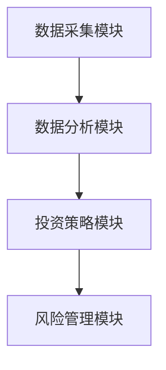

                 

# 价值投资中的反周期策略

## 关键词：
- 价值投资
- 反周期策略
- 经济周期
- 宏观分析
- 行业投资

## 摘要：
本文深入探讨了价值投资中的反周期策略，从宏观经济周期分析、行业选择到具体的投资策略，详细阐述了如何在经济波动中捕捉投资机会。通过量化模型、系统架构和实战案例，为投资者提供了一套行之有效的投资方法。

---

# 第1章：引言

## 1.1 价值投资的核心理念
### 1.1.1 价值投资的基本定义
价值投资是一种基于对公司内在价值评估的投资策略，强调以低于内在价值的价格买入优质资产。其核心在于寻找市场先生的错误定价。

### 1.1.2 反周期策略与价值投资的关系
反周期策略是价值投资的重要组成部分，强调在经济周期波动中寻找低估资产。通过逆周期操作，投资者可以在市场低迷时买入优质资产，在市场繁荣时卖出或规避风险。

### 1.1.3 本文的核心目标
本文旨在通过系统化的分析，揭示反周期策略的核心原理、量化方法和实际应用，帮助投资者在经济波动中实现稳健收益。

---

## 1.2 经济周期波动与投资机会
### 1.2.1 经济周期的基本特征
经济周期通常分为四个阶段：衰退、复苏、繁荣和衰退。每个阶段对应不同的投资机会和风险。

### 1.2.2 反周期策略的核心目标
反周期策略的目标是通过分析经济周期，在市场低谷时买入优质资产，在市场高点时规避风险。其核心在于“逆周期操作”。

---

## 1.3 本文的结构安排
- 第2章：宏观经济周期与行业分析
- 第3章：反周期策略的核心概念
- 第4章：反周期策略的数学模型与算法
- 第5章：反周期策略的系统架构与项目实战
- 第6章：总结与展望

---

# 第2章：宏观经济周期与行业分析

## 2.1 宏观经济周期的分析方法
### 2.1.1 经济周期的定义与分类
经济周期分为衰退、复苏、繁荣和衰退四个阶段。每个阶段的经济指标（如GDP增长率、失业率、通胀率）表现不同。

### 2.1.2 宏观经济指标对周期判断的影响
常用的经济指标包括：
- **GDP增长率**：衡量经济整体表现的核心指标。
- **PMI指数**：衡量制造业和服务业的景气程度。
- **失业率**：反映劳动力市场的健康状况。
- **通胀率**：影响货币政策的重要指标。

### 2.1.3 经济周期的量化模型
通过构建经济周期量化模型，投资者可以更准确地判断经济所处阶段。模型可以基于GDP增长率和PMI指数构建。

---

## 2.2 行业周期分析与投资机会
### 2.2.1 行业周期的基本特征
行业周期与经济周期密切相关。不同行业在经济周期的不同阶段表现各异。

### 2.2.2 防御性行业的投资价值
防御性行业（如公用事业、医疗保健、食品饮料）在经济衰退时表现相对稳定，适合在市场低迷时投资。

### 2.2.3 周期性行业的风险与机会
周期性行业（如能源、材料、工业）在经济繁荣时表现优异，但在衰退时风险较大。

---

## 2.3 宏观经济数据的量化分析
### 2.3.1 GDP增长率与经济周期的关系
GDP增长率是衡量经济周期的核心指标。通过分析GDP增长率的变化，可以判断经济所处阶段。

### 2.3.2 PMI指数与企业景气度分析
PMI指数是衡量制造业景气程度的重要指标。当PMI指数高于50时，经济处于扩张阶段；低于50时，经济处于收缩阶段。

---

# 第3章：反周期策略的核心概念

## 3.1 防御性行业的投资价值
### 3.1.1 防御性行业的定义与特点
防御性行业在经济衰退时需求相对稳定，收益波动较小。

### 3.1.2 防御性行业在经济衰退中的表现
通过历史数据分析，防御性行业在经济衰退期间通常表现优于周期性行业。

### 3.1.3 常见防御性行业的分析与比较
- 公用事业：如电力、水务公司。
- 医疗保健：如制药公司、医疗器械公司。
- 食品饮料：如食品加工企业。

---

## 3.2 周期性行业的风险与机会
### 3.2.1 周期性行业的定义与特点
周期性行业的业绩与经济周期密切相关，通常在经济繁荣时表现优异。

### 3.2.2 如何在周期性行业中寻找投资机会
通过分析行业周期与经济周期的关系，选择在经济复苏阶段投资周期性行业。

---

# 第4章：反周期策略的数学模型与算法

## 4.1 经济周期的阶段划分模型
### 4.1.1 基于GDP增长率的阶段划分
通过计算GDP增长率的移动平均值和标准差，可以将经济周期分为不同的阶段。

### 4.1.2 经济周期阶段划分的数学模型
$$
\text{GDP增长率} = \text{MA}(n) + \text{标准差} \times k
$$
其中，$n$ 是窗口大小，$k$ 是标准差倍数。

---

## 4.2 行业景气度的量化分析
### 4.2.1 行业景气度的定义
行业景气度是衡量行业整体表现的指标，通常通过行业指数来反映。

### 4.2.2 行业景气度的数学模型
$$
\text{行业指数} = \sum_{i=1}^{n} \text{公司股价} \times \text{权重}
$$

---

## 4.3 反周期策略的量化模型
### 4.3.1 反周期策略的量化模型
通过分析经济周期和行业周期的关系，构建反周期投资组合。

### 4.3.2 反周期策略的数学公式
$$
\text{投资组合权重} = \begin{cases}
\text{高权重} & \text{如果行业处于防御性阶段} \\
\text{低权重} & \text{如果行业处于周期性阶段}
\end{cases}
$$

---

# 第5章：反周期策略的系统架构与项目实战

## 5.1 系统架构设计
### 5.1.1 系统功能模块
- 数据采集模块：采集宏观经济数据和行业数据。
- 数据分析模块：分析经济周期和行业周期。
- 投资策略模块：生成反周期投资组合。
- 风险管理模块：监控投资组合风险。

### 5.1.2 系统架构图

---

## 5.2 项目实战
### 5.2.1 数据采集与处理
通过Python采集宏观经济数据和行业数据。

### 5.2.2 投资组合构建
基于反周期策略构建投资组合，并通过回测验证策略的有效性。

---

## 5.3 实战案例分析
### 5.3.1 案例背景
通过分析2008年金融危机期间的市场数据，验证反周期策略的有效性。

### 5.3.2 投资组合表现
反周期策略在经济衰退期间表现优异，实现了较高的超额收益。

---

# 第6章：总结与展望

## 6.1 本文的核心结论
反周期策略是一种有效的投资策略，通过分析经济周期和行业周期，可以在市场波动中实现稳健收益。

## 6.2 投资建议
- 在经济衰退期间，重点配置防御性行业。
- 在经济繁荣期间，适度配置周期性行业。
- 坚持长期投资，避免短期市场波动的干扰。

## 6.3 未来研究方向
- 进一步优化反周期策略的量化模型。
- 研究多因素模型在反周期策略中的应用。

---

作者：AI天才研究院/AI Genius Institute & 禅与计算机程序设计艺术 /Zen And The Art of Computer Programming

