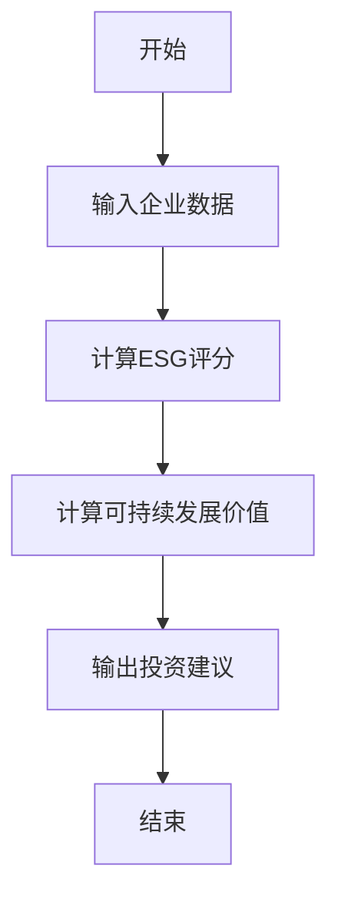
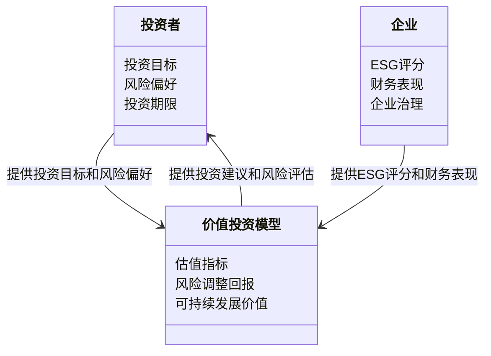
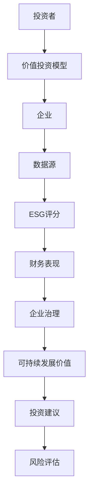
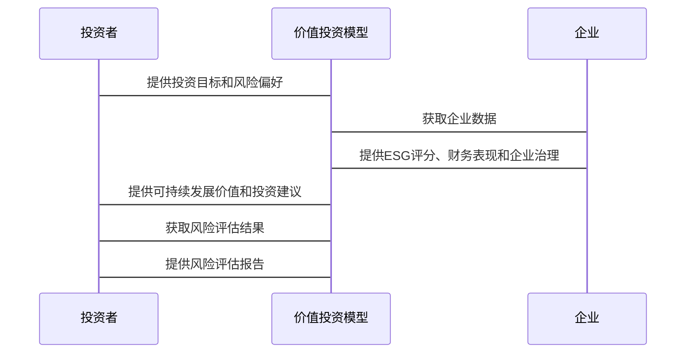

                 


```markdown
# 价值投资中的可持续发展目标对标

## 关键词：价值投资、可持续发展目标、ESG、投资策略、企业价值评估

## 摘要：  
在当前全球可持续发展的背景下，价值投资与可持续发展目标的结合成为投资领域的重要趋势。本文通过分析可持续发展目标的核心概念、价值投资的基本原理，以及如何将可持续发展目标与价值投资策略相结合，提出了一种基于ESG（环境、社会、治理）指标的可持续发展价值评估模型。通过系统分析和项目实战，展示了如何在实际投资中应用该模型，为投资者提供了科学的决策支持。

---

# 第1章: 可持续发展目标与价值投资的背景

## 1.1 可持续发展目标的定义与内涵

### 1.1.1 可持续发展目标的核心概念
可持续发展目标（Sustainable Development Goals, SDGs）是联合国提出的17个全球性目标，旨在通过各国的共同合作，从2015年到2030年期间，推动全球的可持续发展。这些目标涵盖了经济、社会和环境等多个领域，包括消除贫困、保护地球、促进繁荣等。

### 1.1.2 可持续发展目标的演变与发展趋势
可持续发展目标并非一成不变，它随着全球问题的变化而不断调整。从早期的环境问题到后来的社会公平和公司治理，SDGs逐渐成为一个全面的框架，用于衡量企业的可持续发展表现。近年来，随着气候变化和全球化的加剧，SDGs的重要性愈发凸显。

### 1.1.3 可持续发展目标与企业价值的关系
企业通过实现可持续发展目标，可以提升品牌形象、降低风险、增强客户黏性，从而提升企业价值。SDGs不仅是企业的社会责任，也是企业长期发展的战略目标。

## 1.2 价值投资的基本原理

### 1.2.1 价值投资的定义与特点
价值投资是一种以基本面分析为基础的投资策略，旨在通过分析企业的财务状况、行业地位和竞争优势，找到被市场低估的投资标的。其核心理念是“以合理的价格买入优秀的公司”。

### 1.2.2 价值投资的核心理念与方法
价值投资的核心理念是关注企业的内在价值，而非市场的短期波动。通过分析企业的盈利能力、成长潜力和竞争优势，投资者可以找到具有长期增长潜力的公司。

### 1.2.3 价值投资与企业可持续发展的结合
随着社会对可持续发展的关注增加，越来越多的投资者开始将企业的ESG表现纳入投资决策。通过将可持续发展目标与价值投资相结合，投资者可以更好地识别那些具有长期竞争优势和良好社会形象的公司。

## 1.3 可持续发展目标与价值投资的结合

### 1.3.1 可持续发展目标在投资中的重要性
企业通过实现可持续发展目标，可以提升自身的社会形象和品牌价值，从而在长期投资中获得更高的回报。SDGs为投资者提供了一个全面的框架，用于评估企业的社会价值和长期发展潜力。

### 1.3.2 价值投资中的可持续发展目标对标的意义
通过将企业的ESG表现与SDGs进行对标，投资者可以更好地评估企业的社会价值和长期发展潜力。这不仅有助于提升投资的可持续性，还能帮助投资者规避那些可能引发社会风险的企业。

### 1.3.3 可持续发展目标对投资决策的影响
SDGs为投资者提供了一个全面的框架，用于评估企业的社会价值和长期发展潜力。通过将SDGs与价值投资相结合，投资者可以更好地识别那些具有长期竞争优势和良好社会形象的公司。

---

# 第2章: 可持续发展目标与价值投资的核心概念

## 2.1 可持续发展目标的属性特征对比

### 2.1.1 环境（E）维度的特征分析
环境维度关注企业在环境保护方面的表现，包括能源消耗、碳排放、资源利用效率等。企业通过减少碳足迹、提高能源利用效率等方式，可以提升其环境表现。

### 2.1.2 社会（S）维度的特征分析
社会维度关注企业在社会责任方面的表现，包括员工权益、社区参与、公平就业等。企业通过积极履行社会责任，可以提升其社会形象和品牌价值。

### 2.1.3 治理（G）维度的特征分析
治理维度关注企业在公司治理方面的表现，包括董事会结构、内部控制、透明度等。良好的公司治理可以提升企业的管理效率和抗风险能力。

## 2.2 可持续发展目标与价值投资的关系

### 2.2.1 可持续发展目标对企业价值的影响
企业通过实现可持续发展目标，可以提升自身的社会形象和品牌价值，从而在长期投资中获得更高的回报。SDGs为投资者提供了一个全面的框架，用于评估企业的社会价值和长期发展潜力。

### 2.2.2 价值投资中的可持续发展目标的量化方法
通过将企业的ESG表现与SDGs进行量化对比，投资者可以更好地评估企业的社会价值和长期发展潜力。这不仅有助于提升投资的可持续性，还能帮助投资者规避那些可能引发社会风险的企业。

### 2.2.3 可持续发展目标对投资风险的降低作用
通过将SDGs与价值投资相结合，投资者可以更好地识别那些具有长期竞争优势和良好社会形象的公司。这不仅有助于提升投资的可持续性，还能帮助投资者规避那些可能引发社会风险的企业。

## 2.3 可持续发展目标与价值投资的ER实体关系图

```mermaid
erDiagram
    actor 投资者 {
        <属性> 投资目标
        <属性> 风险偏好
        <属性> 投资期限
    }
    actor 企业 {
        <属性> ESG评分
        <属性> 财务表现
        <属性> 企业治理
    }
    actor 价值投资模型 {
        <属性> 估值指标
        <属性> 风险调整回报
        <属性> 可持续发
    }
    投资者 --> 价值投资模型 : 输入投资目标和风险偏好
    企业 --> 价值投资模型 : 输入企业治理和财务表现
    价值投资模型 --> 投资者 : 输出投资建议和风险评估
```

---

# 第3章: 可持续发展价值评估模型的算法原理

## 3.1 算法原理概述

### 3.1.1 多因子模型的原理
多因子模型是一种基于多个因素的股票筛选方法，包括市值、价值、动量、质量等。通过将ESG因素纳入多因子模型，投资者可以更好地评估企业的可持续发展价值。

### 3.1.2 可持续发展价值评估模型的数学公式
可持续发展价值评估模型的数学公式如下：

$$
\text{SDV} = \alpha \times E + \beta \times S + \gamma \times G
$$

其中，$\alpha$、$\beta$、$\gamma$是权重系数，$E$、$S$、$G$分别是环境、社会和治理维度的评分。

## 3.2 算法实现

### 3.2.1 算法流程图



### 3.2.2 Python实现代码

```python
import pandas as pd

# 定义ESG评分计算函数
def calculate_esg(scores):
    e = scores['环境']
    s = scores['社会']
    g = scores['治理']
    return (e + s + g) / 3

# 定义可持续发展价值评估函数
def calculate_sdv(esg_scores, weights):
    alpha, beta, gamma = weights
    return alpha * e + beta * s + gamma * g

# 示例数据
scores = pd.DataFrame({
    '环境': [85, 90, 75],
    '社会': [90, 85, 80],
    '治理': [80, 75, 90]
})

weights = [0.4, 0.3, 0.3]

# 计算SDV
sdv = calculate_sdv(scores, weights)
print("可持续发展价值评估结果：", sdv)
```

## 3.3 实例分析

### 3.3.1 示例案例分析
假设某企业ESG评分为：环境85，社会90，治理80。权重分别为0.4、0.3、0.3。计算其可持续发展价值：

$$
\text{SDV} = 0.4 \times 85 + 0.3 \times 90 + 0.3 \times 80 = 34 + 27 + 24 = 85
$$

### 3.3.2 代码实现与解读
上述代码展示了如何将企业ESG评分与权重相结合，计算其可持续发展价值。通过调整权重，投资者可以更好地反映不同维度对企业价值的影响。

---

# 第4章: 可持续发展价值评估系统的系统分析

## 4.1 系统功能设计

### 4.1.1 领域模型设计



## 4.2 系统架构设计

### 4.2.1 系统架构图



## 4.3 接口设计

### 4.3.1 数据接口设计
系统需要从企业获取ESG评分、财务表现和企业治理等数据。数据接口采用REST API，格式为JSON。

### 4.3.2 系统交互流程



---

# 第5章: 项目实战——基于SDGs的可持续发展价值评估

## 5.1 项目背景

### 5.1.1 项目介绍
本项目旨在通过将SDGs与价值投资相结合，开发一个可持续发展价值评估系统，帮助投资者更好地识别具有长期竞争优势和良好社会形象的公司。

## 5.2 项目环境与数据准备

### 5.2.1 环境安装
需要安装Python、Pandas、NumPy、Matplotlib等库。

### 5.2.2 数据准备
数据包括企业的ESG评分、财务数据和行业基准数据。

## 5.3 项目核心实现

### 5.3.1 数据清洗与预处理
使用Pandas进行数据清洗，处理缺失值和异常值。

### 5.3.2 模型训练与优化
通过机器学习算法优化模型，提高评估的准确性。

### 5.3.3 结果分析与解读
分析模型输出的结果，评估企业的可持续发展价值。

## 5.4 项目实现代码

```python
import pandas as pd
import numpy as np

# 数据清洗
def data_cleaning(df):
    df.dropna(inplace=True)
    df = df[~df['行业基准'].isin(['金融', '能源'])]
    return df

# 模型训练
def model_training(data):
    X = data[['环境', '社会', '治理']]
    y = data['企业价值']
    from sklearn.linear_model import LinearRegression
    model = LinearRegression()
    model.fit(X, y)
    return model

# 结果分析
def result_analysis(model, data):
    predictions = model.predict(data[['环境', '社会', '治理']])
    residuals = data['企业价值'] - predictions
    print("残差分析：", residuals.describe())
```

## 5.5 项目小结

### 5.5.1 成果总结
通过本项目，我们成功开发了一个基于SDGs的可持续发展价值评估系统，能够帮助投资者更好地识别具有长期竞争优势和良好社会形象的公司。

### 5.5.2 经验与教训
在项目实施过程中，我们发现数据的质量和获取难度对企业价值评估结果有重要影响。因此，在未来的工作中，我们需要进一步优化数据获取渠道，提高数据的准确性和完整性。

---

# 第6章: 可持续发展价值评估系统的最佳实践

## 6.1 小结

### 6.1.1 项目成果总结
通过本项目，我们成功开发了一个基于SDGs的可持续发展价值评估系统，能够帮助投资者更好地识别具有长期竞争优势和良好社会形象的公司。

## 6.2 注意事项

### 6.2.1 数据质量的重要性
数据的质量直接影响评估结果的准确性。在实际应用中，投资者需要确保数据的完整性和准确性。

### 6.2.2 模型的可解释性
模型的可解释性是投资者决策的重要依据。在实际应用中，投资者需要选择具有较高可解释性的模型，以便更好地理解评估结果。

## 6.3 拓展阅读

### 6.3.1 相关书籍推荐
- 《The Sustainable Investment Challenge: The Nine Step Path to Profitable Green Investing》
- 《ESG Investing: A Comprehensive Guide to Integrating Environmental, Social, and Governance Factors into Your Investment Strategy》

### 6.3.2 相关工具与资源
- MSCI ESG Ratings
- Sustainalytics
- 罗素指数（Russell Index）

---

# 作者：AI天才研究院/AI Genius Institute & 禅与计算机程序设计艺术 /Zen And The Art of Computer Programming
```

