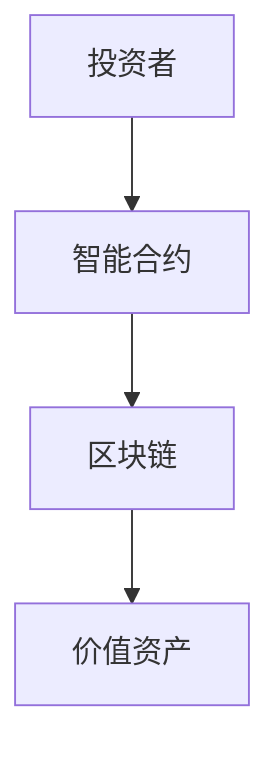
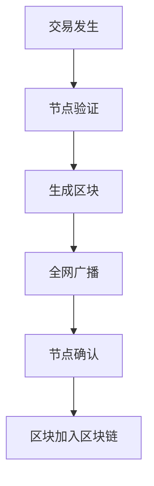
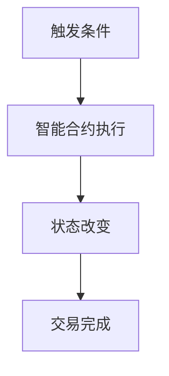
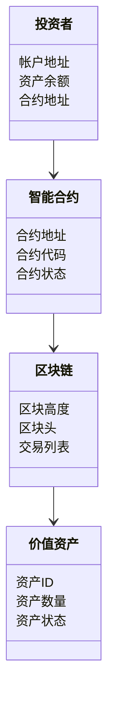
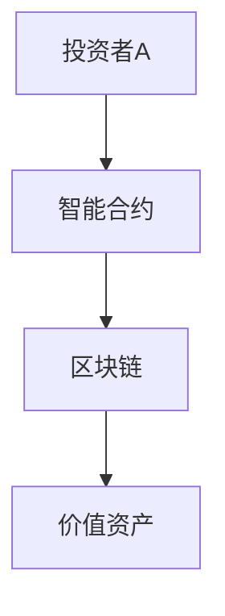

                 


# 价值投资中的可编程物质技术前景分析

---

## 关键词：
可编程物质技术、价值投资、区块链、智能合约、分布式系统、投资策略

---

## 摘要：
本文探讨了可编程物质技术在价值投资中的应用前景，分析了其技术基础、核心优势、实际案例及未来发展方向。通过结合区块链、智能合约等技术，可编程物质技术正在改变传统金融投资的方式，为投资者提供更加透明、高效和安全的投资环境。

---

## 第一部分: 可编程物质技术与价值投资的背景介绍

### 第1章: 可编程物质技术与价值投资概述

#### 1.1 可编程物质技术的定义与背景

##### 1.1.1 可编程物质技术的定义
可编程物质技术（Programmable Matter Technology）是指通过区块链、智能合约等技术，将物理世界与数字世界相结合，使得物质的属性、行为和价值能够被程序化控制的一种新兴技术。它利用区块链的去中心化特性，实现了资产的自动控制、流转和价值传递。

##### 1.1.2 价值投资的基本原理
价值投资是一种以基本面分析为基础的投资策略，旨在通过识别被低估的资产，长期持有以实现超额收益。传统价值投资依赖于对财务报表、行业趋势和市场情绪的分析，具有较高的主观性和不确定性。

##### 1.1.3 可编程物质技术与价值投资的结合
可编程物质技术通过智能合约、区块链等技术，将价值投资的决策过程自动化、智能化。投资者可以设定特定的条件和规则，由智能合约自动执行投资策略，从而提高投资效率和准确性。

#### 1.2 可编程物质技术的核心概念

##### 1.2.1 可编程物质技术的核心要素
- **区块链**：提供去中心化的账本和信任机制。
- **智能合约**：实现自动化的资产控制和价值传递。
- **分布式系统**：确保系统的高可用性和抗审查性。

##### 1.2.2 价值投资中的可编程物质技术属性
- **可编程性**：通过智能合约实现投资策略的自动化。
- **透明性**：区块链记录所有交易，确保信息的公开透明。
- **可追溯性**：通过区块链技术实现资产的全流程追踪。
- **自动执行性**：智能合约自动执行投资策略，减少人为干预。

##### 1.2.3 可编程物质技术的边界与外延
可编程物质技术的应用范围不仅限于金融领域，还可以扩展到供应链管理、物联网、智能制造等领域。但在本文中，我们将重点分析其在价值投资中的应用。

---

## 第二部分: 可编程物质技术的核心概念与联系

### 第2章: 可编程物质技术的原理与特征

#### 2.1 可编程物质技术的原理

##### 2.1.1 可编程物质技术的实现机制
可编程物质技术通过区块链和智能合约实现资产的自动化控制和价值传递。智能合约是可编程物质技术的核心，它能够根据预设的条件自动执行相应的操作。

##### 2.1.2 可编程物质技术的核心算法
可编程物质技术的核心算法包括哈希函数和区块链共识机制。哈希函数用于生成区块的唯一标识，共识机制用于确保区块链的安全性和一致性。

#### 2.2 可编程物质技术的特征对比

##### 2.2.1 特征对比表格

| 特征       | 可编程物质技术 | 传统金融工具 |
|------------|----------------|--------------|
| 可编程性   | 高             | 低           |
| 透明性     | 高             | 中           |
| 可追溯性   | 高             | 低           |
| 自动执行性  | 高             | 低           |

##### 2.2.2 可编程物质技术的ER实体关系图



---

## 第三部分: 可编程物质技术的算法原理讲解

### 第3章: 可编程物质技术的核心算法

#### 3.1 哈希函数与区块链共识机制

##### 3.1.1 哈希函数的定义与作用
哈希函数是一种将任意长度的数据映射为固定长度的值的函数。在区块链中，哈希函数用于生成区块的唯一标识，确保数据的完整性和一致性。

##### 3.1.2 区块链共识机制的实现流程
区块链共识机制通过节点之间的协作，确保区块链的安全性和一致性。常见的共识机制包括工作量证明（PoW）、权益证明（PoS）和 delegated proof of stake（DPoS）。



#### 3.2 智能合约的执行流程

##### 3.2.1 智能合约的定义
智能合约是运行在区块链上的自动执行程序，能够根据预设的条件自动执行相应的操作。

##### 3.2.2 智能合约的执行步骤



#### 3.3 数学模型与公式

##### 3.3.1 哈希函数的数学模型
$$ H(x) = \sum_{i=0}^{n-1} x_i \times 2^i \mod 2^{32} $$

##### 3.3.2 区块链共识机制的数学模型
$$ P = \prod_{i=1}^{k} H_i \mod N $$

---

## 第四部分: 可编程物质技术的系统分析与架构设计

### 第4章: 可编程物质技术的系统架构

#### 4.1 系统功能设计

##### 4.1.1 领域模型设计



---

## 第五部分: 项目实战与案例分析

### 第5章: 项目实战

#### 5.1 环境安装与配置

##### 5.1.1 安装以太坊环境
```bash
# 安装以太坊环境
sudo apt-get update
sudo apt-get install ethereum
```

##### 5.1.2 安装Solidity编译器
```bash
# 安装Solidity编译器
npm install -g solc
```

#### 5.2 核心实现

##### 5.2.1 编写智能合约
```solidity
// SPDX-License-Identifier: MIT
pragma solidity ^0.8.0;

contract ValueInvestment {
    mapping(address => uint256) public balances;

    function invest(address recipient, uint256 amount) external {
        balances[recipient] += amount;
    }

    function withdraw(address recipient, uint256 amount) external {
        require(balances[recipient] >= amount, "Insufficient balance");
        balances[recipient] -= amount;
    }
}
```

##### 5.2.2 智能合约的编译与部署
```bash
# 编译智能合约
solc -o contract.sol ValueInvestment.sol

# 部署智能合约到以太坊网络
ethers.js run contract.sol
```

#### 5.3 案例分析

##### 5.3.1 投资者A的投资策略
投资者A希望将资金投资于特定的区块链项目，设定智能合约在达到一定条件时自动执行投资。

##### 5.3.2 智能合约的执行流程


---

## 第六部分: 总结与展望

### 第6章: 总结与展望

#### 6.1 总结
可编程物质技术通过区块链和智能合约，实现了价值投资的自动化和智能化。它不仅提高了投资效率，还降低了交易成本和风险。

#### 6.2 展望
随着区块链技术的不断发展，可编程物质技术将在价值投资中发挥越来越重要的作用。未来，智能合约的功能将更加复杂，区块链的性能也将进一步提升，为投资者提供更加丰富和灵活的投资策略。

---

## 作者信息

作者：AI天才研究院/AI Genius Institute & 禅与计算机程序设计艺术/Zen And The Art of Computer Programming

---

以上是《价值投资中的可编程物质技术前景分析》的文章内容，涵盖了从背景介绍到系统架构设计，再到项目实战与展望的完整分析。希望对您了解可编程物质技术在价值投资中的应用有所帮助。

