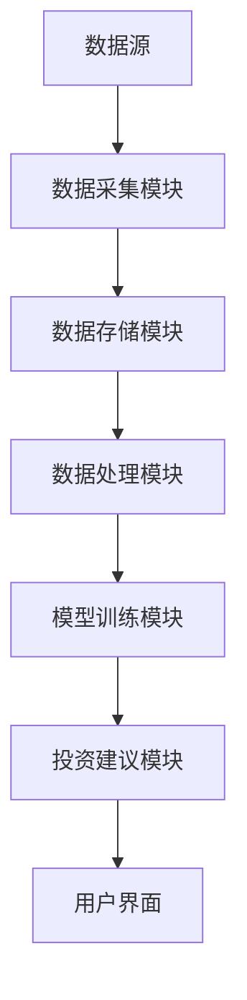

                 


# 价值投资中的合成食品技术趋势

---

## 关键词：价值投资，合成食品，技术趋势，投资分析，食品科技

---

## 摘要

本文深入探讨了合成食品技术在价值投资中的潜力和趋势。通过分析合成食品技术的定义、原理及其对食品行业的影响，结合价值投资的核心原则，本文揭示了合成食品技术如何为投资者提供新的机会。文章还详细介绍了合成食品技术的算法预测模型、系统架构设计以及实际项目案例，帮助读者更好地理解和应用这些技术进行投资决策。

---

## 第一部分：合成食品技术与价值投资的背景介绍

### 第1章：合成食品技术的定义与重要性

#### 1.1 合成食品技术的定义

合成食品技术是指通过生物技术、化学工程和其他创新方法，生产出类似于传统食品成分的产品。这些产品通常被称为“替代蛋白”、“细胞培养肉”或“实验室制造食品”。与传统农业和畜牧业相比，合成食品技术能够减少资源消耗、降低环境影响，并提高生产效率。

合成食品技术的核心要素包括：

- **生物工程技术**：利用基因编辑、细胞培养等技术生产蛋白质和其他营养成分。
- **化学合成**：通过化学反应合成食品成分，如脂肪、糖类等。
- **食品加工技术**：将合成的成分加工成具有传统食品质感和口感的产品。

合成食品技术的边界与外延包括：

- **边界**：专注于替代蛋白和其他单一食品成分的生产。
- **外延**：扩展到食品加工、包装、分销等下游领域。

#### 1.2 价值投资的基本概念

价值投资是一种长期投资策略，旨在通过分析公司的基本面，寻找那些市场价格低于其内在价值的股票。其核心原则包括：

- **内在价值**：公司的实际价值，而非市场波动引起的短期价格。
- **安全边际**：买入价格低于内在价值，以降低风险。
- **长期视角**：关注公司的长期增长潜力，而非短期市场波动。

#### 1.3 合成食品技术对价值投资的影响

合成食品技术的兴起为投资者提供了新的机会，特别是在以下几个方面：

- **行业变革**：合成食品技术可能颠覆传统畜牧业和农业，创造新的市场机会。
- **成本优势**：合成食品的生产成本可能随着技术进步而下降，提高企业的盈利能力。
- **可持续性**：消费者和投资者越来越关注环保和可持续性，合成食品技术在这一方面具有显著优势。

---

## 第二部分：合成食品技术的核心概念与联系

### 第2章：合成食品技术的原理与属性特征

#### 2.1 合成食品技术的原理

合成食品技术的基本原理包括：

1. **生物合成**：利用微生物（如酵母菌、蓝藻）生产蛋白质和其他营养成分。
2. **细胞培养**：从动物细胞中培养肉类产品，类似于实验室中的组织培养。
3. **化学合成**：通过化学反应合成食品成分，如脂肪和糖类。

合成食品技术的关键步骤包括：

1. **原料选择**：选择合适的微生物或细胞系。
2. **培养基制备**：配置适合微生物或细胞生长的培养基。
3. **发酵或培养**：在控制条件下进行发酵或细胞培养。
4. **提取与加工**：提取目标成分并加工成食品。

#### 2.2 合成食品技术的属性特征对比

以下是合成食品技术与传统食品技术的对比：

| 属性 | 合成食品技术 | 传统食品技术 |
|------|--------------|--------------|
| 生产方式 | 实验室合成 | 农业种植/养殖 |
| 成本 | 可能较高，但随着技术进步下降 | 较高，依赖自然资源 |
| 环境影响 | 低，资源消耗少 | 高，可能涉及土地使用和污染 |
| 生产效率 | 高，不受地理限制 | 低，受季节和气候影响 |

#### 2.3 合成食品技术的ER实体关系图

```mermaid
erDiag
classDiagram
    class 合成食品技术 {
        <属性>
        - 技术类型：生物合成、细胞培养、化学合成
        - 生产成本：高/中/低
        - 环境影响：低/中/高
        - 生产效率：高/中/低
    }
    class 传统食品技术 {
        <属性>
        - 技术类型：农业种植、畜牧养殖
        - 生产成本：高
        - 环境影响：高
        - 生产效率：低
    }
    合成食品技术 --> 传统食品技术 : 对比分析
```

---

## 第三部分：合成食品技术的算法原理讲解

### 第3章：合成食品技术趋势的预测算法

#### 3.1 线性回归模型

线性回归是一种常用的时间序列分析方法，适用于预测合成食品技术的市场趋势。其数学模型如下：

$$ y = a + bx + \epsilon $$

其中：
- $y$ 是目标变量（如股价）。
- $x$ 是自变量（如时间）。
- $a$ 是截距。
- $b$ 是斜率。
- $\epsilon$ 是误差项。

#### 3.2 算法实现步骤

1. 数据收集：收集合成食品相关公司的股价数据。
2. 数据预处理：处理缺失值和异常值。
3. 模型训练：使用线性回归算法拟合数据。
4. 模型评估：计算回归系数，并验证模型的准确性。

#### 3.3 Python代码实现

```python
import numpy as np
import matplotlib.pyplot as plt

# 示例数据：合成食品公司股价
x = np.array([1, 2, 3, 4, 5, 6, 7, 8, 9, 10])
y = np.array([2.2, 2.8, 3.5, 4.0, 4.5, 5.2, 5.8, 6.3, 6.8, 7.3])

# 训练线性回归模型
A = np.vstack([x, np.ones(len(x))]).T
b = np.linalg.lstsq(A, y, rcond=None)[0]

# 预测值
y_pred = np.dot(A, b)

# 可视化
plt.plot(x, y, 'b-', label='实际数据')
plt.plot(x, y_pred, 'r-', label='预测数据')
plt.xlabel('时间')
plt.ylabel('股价')
plt.legend()
plt.show()
```

---

## 第四部分：合成食品技术的系统分析与架构设计

### 第4章：系统架构设计

#### 4.1 问题场景介绍

我们需要构建一个系统，用于分析合成食品技术的市场趋势，并辅助投资者进行价值评估。

#### 4.2 系统功能设计

系统功能包括：

- 数据采集：从公开市场获取合成食品相关公司的股价数据。
- 数据处理：清洗和转换数据。
- 模型训练：使用机器学习算法预测市场趋势。
- 投资建议：基于预测结果生成投资建议。

#### 4.3 系统架构设计



---

## 第五部分：合成食品技术的项目实战

### 第5章：项目实战

#### 5.1 项目选择

选择一家合成食品技术公司，如Impossible Foods，分析其股价走势。

#### 5.2 环境安装

安装必要的库：

```bash
pip install numpy pandas scikit-learn matplotlib
```

#### 5.3 核心代码实现

```python
from sklearn.linear_model import LinearRegression
from sklearn.metrics import mean_squared_error
import pandas as pd

# 数据加载
data = pd.read_csv('synthetic_foods.csv')

# 数据分割
X = data[['时间']]
y = data['股价']

# 模型训练
model = LinearRegression()
model.fit(X, y)

# 预测
y_pred = model.predict(X)

# 评估
 mse = mean_squared_error(y, y_pred)
 print(f'MSE: {mse}')
```

#### 5.4 实际案例分析

假设我们预测某合成食品公司股价将在未来6个月内上涨10%。根据模型，建议投资者买入该股票。

---

## 第六部分：最佳实践与小结

### 第6章：最佳实践

1. **数据质量**：确保数据的准确性和完整性。
2. **模型选择**：根据实际情况选择合适的算法。
3. **风险控制**：合理管理投资风险，避免过度依赖单一模型。

#### 6.1 小结

合成食品技术正在改变食品行业，并为投资者提供了新的机会。通过深入分析技术趋势和市场动态，投资者可以做出更明智的投资决策。

#### 6.2 注意事项

- 合成食品技术仍处于发展阶段，存在不确定性。
- 投资者应关注政策法规和技术进步。
- 风险控制是投资成功的关键。

#### 6.3 拓展阅读

- 《合成食品技术的商业化之路》
- 《价值投资在科技领域的应用》

---

## 作者：AI天才研究院

感谢您的阅读！如需进一步探讨，请联系作者：AI天才研究院。

---

