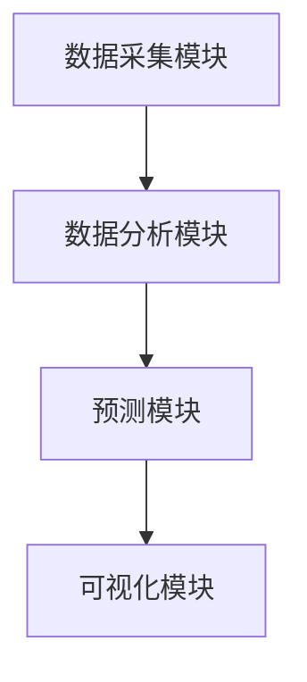
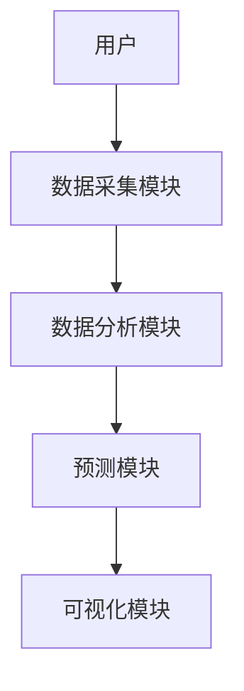

                 


# 价值投资中的周期性行业分析：把握行业起落

> 关键词：价值投资，周期性行业，时间序列分析，宏观经济，行业波动

> 摘要：本文深入探讨了周期性行业在价值投资中的重要性，通过分析供需关系、宏观经济影响、行业波动规律等核心要素，结合时间序列分析算法和系统架构设计，提供了一套完整的周期性行业分析框架。文章还通过实际案例分析，展示了如何利用这些方法进行投资决策，并总结了最佳实践和注意事项，帮助投资者更好地把握行业起落，实现稳健投资。

---

## 第一章: 周期性行业的基本概念

### 1.1 周期性行业的定义与特征

周期性行业是指其市场需求和供给会随着经济周期波动而变化的行业。这类行业的业绩表现与宏观经济波动密切相关。周期性行业的基本特征包括：

1. **波动性**：周期性行业的收入和利润会随着经济周期的波动而呈现周期性变化。
2. **敏感性**：周期性行业对宏观经济政策、市场供需变化和外部经济环境的变化高度敏感。
3. **周期性**：行业通常会经历繁荣期、衰退期、复苏期和扩张期的循环。

周期性行业与经济周期的关系可以通过以下表格对比：

| 经济周期阶段 | 行业表现 |
|--------------|----------|
| 繁荣期       | 高需求，高利润 |
| 衰退期       | 需求下降，利润下降 |
| 复苏期       | 需求逐步恢复，利润回升 |
| 扩张期       | 需求持续增长，利润稳定 |

### 1.2 周期性行业的分类

周期性行业可以分为以下几类：

1. **基础原材料行业**：如钢铁、煤炭、化工等，这类行业的需求与工业生产和建筑业密切相关。
2. **房地产行业**：房地产市场的波动与经济周期密切相关，通常在经济繁荣时增长迅速，而在衰退期大幅下降。
3. **汽车制造行业**：汽车的需求与消费者信心和经济状况密切相关，经济繁荣时销量增长，衰退期销量下降。

周期性行业与其他行业的对比可以通过以下表格展示：

| 行业类型       | 特点描述                     |
|----------------|------------------------------|
| 周期性行业     | 需求随经济周期波动           |
| 成长型行业     | 需求持续增长，较少受经济周期影响 |
| 防御型行业     | 需求相对稳定，受经济波动影响较小 |

---

## 第二章: 周期性行业分析的核心要素

### 2.1 周期性行业的供需关系

#### 2.1.1 供给分析

供给分析是周期性行业分析的重要组成部分。供给分析包括以下几个方面：

1. **产能利用率**：产能利用率高意味着行业供给紧张，价格可能上涨。
2. **生产成本**：生产成本的变化会影响供给的弹性，成本下降通常会增加供给。
3. **行业竞争格局**：行业集中度高通常意味着供给更稳定，竞争格局分散可能导致供给波动较大。

#### 2.1.2 需求分析

需求分析是周期性行业分析的核心。需求分析包括以下几个方面：

1. **消费者需求**：消费者需求的变化是影响周期性行业需求的最直接因素。
2. **市场容量**：市场容量的变化直接影响行业的供需关系。
3. **价格弹性**：价格弹性高的行业需求对价格变化更敏感。

#### 2.1.3 供需平衡与价格波动

供需平衡是周期性行业价格波动的核心原因。供需平衡可以通过以下公式表示：

$$ Q_s = Q_d $$

其中，\( Q_s \) 表示供给量，\( Q_d \) 表示需求量。当供给量等于需求量时，市场价格达到均衡。

---

### 2.2 周期性行业的财务指标分析

周期性行业的财务指标分析是投资者评估企业财务健康状况的重要工具。常用的财务指标包括：

1. **毛利率**：毛利率 = (收入 - 成本) / 收入。
2. **净利率**：净利率 = 净利润 / 收入。
3. **应收账款周转率**：应收账款周转率 = 销售收入 / 应收账款平均余额。

财务指标与周期性波动的关系可以通过以下表格展示：

| 财务指标       | 周期性波动影响 |
|----------------|----------------|
| 毛利率         | 供给成本变化影响毛利率 |
| 净利率         | 行业需求变化影响净利润 |
| 应收账款周转率 | 行业销售周期变化影响周转率 |

---

### 2.3 周期性行业的宏观经济影响

#### 2.3.1 宏观经济指标对周期性行业的影响

宏观经济指标是周期性行业分析的重要依据。常用的宏观经济指标包括：

1. **GDP增长率**：GDP增长率是衡量经济整体表现的重要指标，通常与周期性行业的需求密切相关。
2. **通货膨胀率**：通货膨胀率会影响周期性行业的成本和价格。
3. **利率水平**：利率水平的变化会影响周期性行业的融资成本和投资需求。

#### 2.3.2 政策变化对周期性行业的影响

政策变化对周期性行业的影响不容忽视。例如，政府出台的行业政策、税收政策和货币政策都可能对周期性行业产生重大影响。

#### 2.3.3 行业供需关系与宏观经济的互动

行业供需关系与宏观经济的互动可以通过以下公式表示：

$$ Q_s = Q_d + \Delta Q_{政策} $$

其中，\( \Delta Q_{政策} \) 表示政策变化对供需关系的影响。

---

## 第三章: 周期性行业分析的核心概念原理

### 3.1 周期性行业的核心要素

周期性行业的核心要素包括：

1. **供需关系**：供需关系的变化直接影响行业的价格和利润。
2. **宏观经济环境**：宏观经济环境的变化影响行业的市场需求和供给。
3. **行业政策**：行业政策的变化影响行业的竞争格局和市场结构。

---

## 第四章: 周期性行业分析的算法原理

### 4.1 时间序列分析

时间序列分析是一种常用的方法，用于预测周期性行业的未来走势。时间序列分析的步骤如下：

1. **数据采集**：收集周期性行业的历史数据。
2. **数据预处理**：对数据进行清洗和变换，例如差分处理。
3. **模型选择**：选择合适的模型，例如ARIMA模型。
4. **模型训练**：通过历史数据训练模型。
5. **预测与验证**：使用训练好的模型进行预测，并验证预测结果。

时间序列分析的ARIMA模型可以通过以下公式表示：

$$ ARIMA(p, d, q) $$

其中，\( p \) 表示自回归阶数，\( d \) 表示差分阶数，\( q \) 表示移动平均阶数。

---

## 第五章: 周期性行业分析的系统架构设计

### 5.1 项目介绍

周期性行业分析系统旨在帮助投资者分析周期性行业的供需关系、宏观经济影响和行业波动规律，从而做出更明智的投资决策。

### 5.2 系统功能设计

系统功能模块包括：

1. **数据采集模块**：采集周期性行业的历史数据。
2. **数据分析模块**：分析供需关系和宏观经济影响。
3. **预测模块**：预测行业的未来走势。
4. **可视化模块**：展示分析结果。

### 5.3 系统架构设计

系统架构设计可以通过以下Mermaid图表示：



### 5.4 系统接口设计

系统接口设计可以通过以下Mermaid图表示：



---

## 第六章: 项目实战

### 6.1 环境安装

需要安装以下Python库：

1. `pandas`：用于数据处理。
2. `numpy`：用于数值计算。
3. `matplotlib`：用于数据可视化。
4. `statsmodels`：用于时间序列分析。

### 6.2 核心代码实现

以下是时间序列分析的核心代码：

```python
import pandas as pd
import numpy as np
from statsmodels.tsa.arima_model import ARIMA
import matplotlib.pyplot as plt

# 数据加载
data = pd.read_csv('industry_data.csv')

# 数据预处理
diff_data = data['price'].diff().dropna()

# 模型训练
model = ARIMA(diff_data, order=(1, 1, 1))
model_fit = model.fit()

# 预测
future Forecast = model_fit.forecast(steps=5)

# 可视化
plt.plot(data['price'], label='实际价格')
plt.plot(future Forecast, label='预测价格')
plt.legend()
plt.show()
```

### 6.3 实际案例分析

以房地产行业为例，分析其周期性波动：

1. **数据采集**：收集房地产行业的历史价格数据。
2. **数据分析**：分析供需关系和宏观经济影响。
3. **预测与可视化**：使用ARIMA模型预测未来价格走势，并进行可视化。

---

## 第七章: 总结与展望

### 7.1 投资策略总结

周期性行业的投资策略总结如下：

1. **行业选择**：选择具有较高波动性和较高收益潜力的周期性行业。
2. **时机选择**：在行业低谷时买入，在行业高峰时卖出。
3. **风险管理**：合理控制投资比例，分散投资风险。

### 7.2 注意事项

投资者在进行周期性行业分析时需要注意以下事项：

1. **数据准确性**：确保数据来源可靠。
2. **模型局限性**：时间序列分析模型可能存在局限性。
3. **外部风险**：注意宏观经济波动和政策变化带来的风险。

### 7.3 拓展阅读

建议投资者阅读以下书籍和文章：

1. 《周期性行业的投资策略》
2. 《时间序列分析与预测》
3. 《宏观经济与投资分析》

---

## 作者信息

作者：AI天才研究院/AI Genius Institute & 禅与计算机程序设计艺术 /Zen And The Art of Computer Programming

---

以上就是《价值投资中的周期性行业分析：把握行业起落》的完整内容。通过系统化的分析和实际案例的讲解，希望能帮助投资者更好地理解周期性行业的波动规律，并做出更明智的投资决策。

