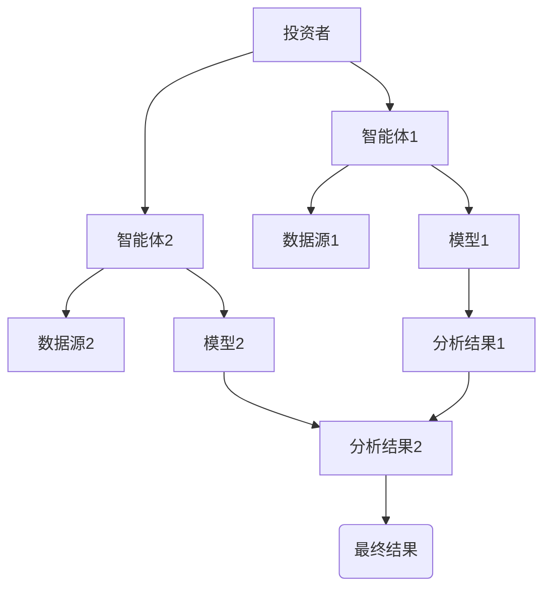
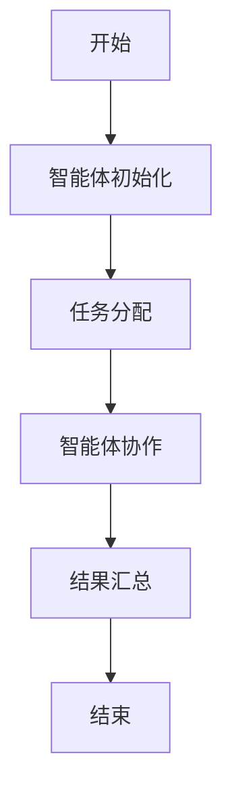
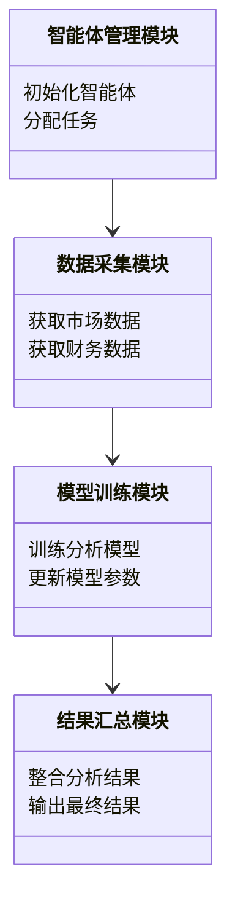
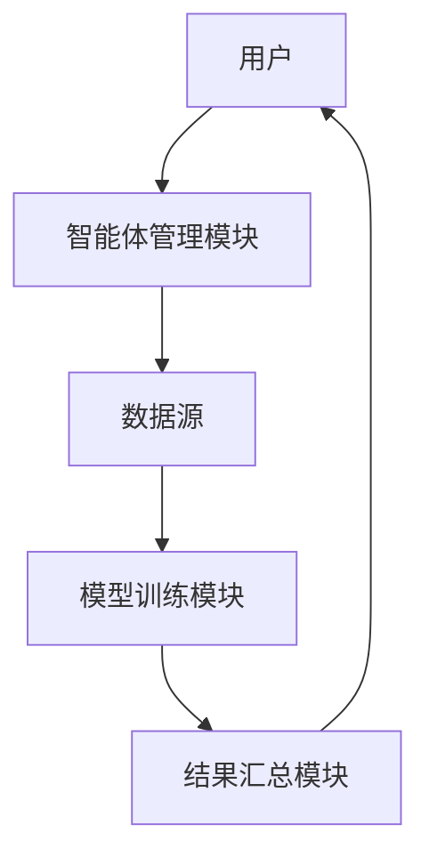
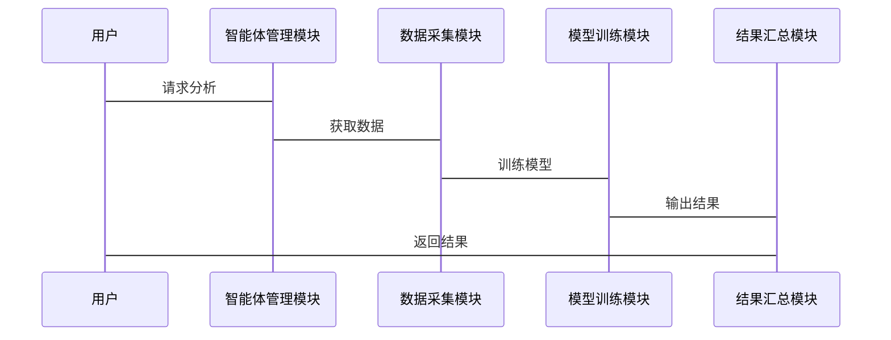

                 


# 价值投资中的多智能体AI工作资本分析系统

> 关键词：价值投资、多智能体AI、资本分析系统、协同算法、强化学习、博弈论

> 摘要：本文将深入探讨如何将多智能体人工智能技术应用于价值投资中的工作资本分析系统。通过分析多智能体AI的核心原理、资本分析系统的架构设计以及实际项目实现，本文旨在为读者提供一套高效、准确的资本分析解决方案。文章内容包括背景介绍、核心概念、算法原理、系统架构设计、项目实战以及最佳实践等部分，帮助读者全面理解并掌握多智能体AI在价值投资中的应用。

---

## 第一部分：背景介绍与核心概念

### 第1章：价值投资与AI的结合

#### 1.1 价值投资的定义与核心理念
价值投资是一种以内在价值为导向的投资策略，强调通过分析企业的基本面（如盈利能力、财务状况、行业地位等）来判断其股票的合理价格区间。传统价值投资依赖于分析师的主观判断和经验，存在以下问题：
- 分析效率低：需要手动收集和分析大量数据。
- 主观性较强：不同分析师可能得出不同的结论。
- 响应速度慢：面对市场波动，传统分析无法快速调整策略。

#### 1.2 多智能体AI的定义与特点
多智能体AI是一种由多个相互作用的智能体组成的系统，每个智能体都有自己的目标和决策机制，通过协同工作实现整体目标。其特点包括：
- 分布式计算：智能体之间通过通信和协作完成任务。
- 自主性：每个智能体都能独立决策。
- 社会性：智能体之间通过交互优化整体性能。

#### 1.3 工作资本分析系统的定义与作用
工作资本分析系统是一种用于评估企业短期偿债能力的财务分析工具。通过分析企业的流动资产和流动负债，可以评估企业的短期财务健康状况。多智能体AI在资本分析系统中的作用包括：
- 提高分析效率：多个智能体协同工作，快速处理大量数据。
- 增强决策准确性：通过多维度分析，降低人为判断的误差。
- 实时监控：实时更新数据，捕捉市场波动。

#### 1.4 本章小结
本章主要介绍了价值投资的核心理念、多智能体AI的定义与特点，以及工作资本分析系统的作用。通过对比传统投资分析的不足，提出了多智能体AI在资本分析中的重要性。

---

## 第二部分：核心概念与联系

### 第2章：多智能体AI与资本分析的关联

#### 2.1 多智能体AI的核心原理
多智能体AI的核心在于智能体之间的协同与通信。每个智能体负责特定的任务（如数据收集、模型训练、结果分析等），并通过通信机制共享信息，最终形成一致的分析结果。

#### 2.2 资本分析系统的属性特征对比
以下是多智能体AI与传统资本分析系统的属性对比：

| 属性       | 多智能体AI             | 传统资本分析系统         |
|------------|----------------------|--------------------------|
| 分析效率     | 高                    | 低                      |
| 决策准确性   | 高                    | 中                      |
| 实时性       | 高                    | 低                      |
| 可扩展性     | 高                    | 中                      |

#### 2.3 实体关系图架构
以下是多智能体AI与资本分析系统的实体关系图：



---

## 第三部分：算法原理讲解

### 第3章：多智能体AI的算法原理

#### 3.1 多智能体协同算法
以下是多智能体协同算法的流程图：



算法的数学模型如下：
$$
\text{最终结果} = \sum_{i=1}^{n} \text{智能体}_i \text{的贡献}
$$

#### 3.2 强化学习在资本分析中的应用
强化学习是一种通过试错机制来优化决策的算法。在资本分析中，智能体可以通过强化学习不断优化其分析策略。例如，智能体可以通过以下步骤学习如何选择最优的财务指标：

1. 状态定义：当前的市场环境（如市盈率、市净率等）。
2. 行动选择：选择关注的财务指标。
3. 奖励机制：根据分析结果的准确性给予奖励或惩罚。

#### 3.3 博弈论在多智能体AI中的应用
博弈论是研究多个主体在竞争环境下的决策行为的理论。在多智能体AI中，智能体之间的互动可以用博弈论模型来描述。例如，两个智能体分别负责分析流动资产和流动负债，最终的结果是两个智能体的“博弈”结果。

---

## 第四部分：系统分析与架构设计

### 第4章：系统架构设计方案

#### 4.1 问题场景介绍
在价值投资中，投资者需要实时了解企业的短期偿债能力。传统的资本分析系统无法快速响应市场变化，且分析结果可能存在较大误差。因此，我们需要设计一个基于多智能体AI的资本分析系统，以提高分析效率和准确性。

#### 4.2 系统功能设计
以下是资本分析系统的功能模块图：



#### 4.3 系统架构设计
以下是系统的整体架构图：



#### 4.4 系统接口设计
以下是系统接口的交互流程图：



---

## 第五部分：项目实战

### 第5章：多智能体AI资本分析系统的实现

#### 5.1 环境安装与配置
以下是项目所需的环境配置：

```bash
# 安装依赖库
pip install numpy pandas scikit-learn matplotlib
```

#### 5.2 系统核心实现
以下是系统核心功能的Python代码：

```python
import numpy as np
import pandas as pd
from sklearn import linear_model

# 初始化智能体
class Agent:
    def __init__(self, data_source):
        self.data_source = data_source
        self.model = linear_model.LinearRegression()
    
    def train(self, X, y):
        self.model.fit(X, y)
    
    def predict(self, X):
        return self.model.predict(X)

# 数据采集模块
class DataSource:
    def __init__(self, filename):
        self.data = pd.read_csv(filename)
    
    def get_X(self):
        return self.data[['市盈率', '市净率']]
    
    def get_y(self):
        return self.data['流动资产']

# 模型训练模块
class ModelTrainer:
    def __init__(self, agents):
        self.agents = agents
    
    def train_all(self):
        for agent in self.agents:
            X = agent.data_source.get_X()
            y = agent.data_source.get_y()
            agent.train(X, y)

# 结果汇总模块
class ResultAggregator:
    def __init__(self, agents):
        self.agents = agents
    
    def aggregate(self):
        results = []
        for agent in self.agents:
            X_test = agent.data_source.get_X()
            y_pred = agent.predict(X_test)
            results.append(y_pred)
        return np.mean(results, axis=0)

# 使用示例
data_source = DataSource('financial_data.csv')
agent = Agent(data_source)
trainer = ModelTrainer([agent])
trainer.train_all()
aggregator = ResultAggregator([agent])
final_result = aggregator.aggregate()
print(final_result)
```

#### 5.3 项目案例分析
以下是某企业的流动资产和流动负债分析案例：

假设某企业的流动资产为1000万元，流动负债为800万元，其流动比率（流动资产/流动负债）为1.25。根据行业标准，流动比率高于1通常被认为是健康的。因此，该企业的短期偿债能力较强。

---

## 第六部分：最佳实践与总结

### 第6章：最佳实践与注意事项

#### 6.1 最佳实践
1. 数据采集模块需要确保数据的实时性和准确性。
2. 模型训练模块需要定期更新模型参数，以适应市场变化。
3. 系统交互设计需要考虑智能体之间的通信效率。

#### 6.2 小结
本文详细介绍了如何将多智能体AI技术应用于价值投资中的资本分析系统。通过背景介绍、核心概念、算法原理、系统架构设计和项目实战的讲解，读者可以全面理解并掌握多智能体AI在资本分析中的应用。

#### 6.3 注意事项
1. 系统设计时需要考虑智能体之间的通信延迟。
2. 模型训练模块需要选择合适的算法和参数。
3. 系统实现时需要注意数据隐私和安全问题。

---

## 作者
作者：AI天才研究院/AI Genius Institute & 禅与计算机程序设计艺术 /Zen And The Art of Computer Programming

