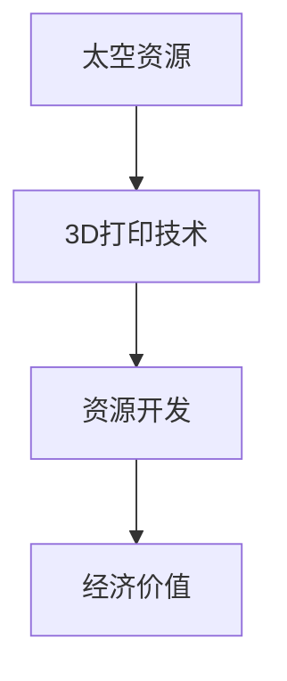
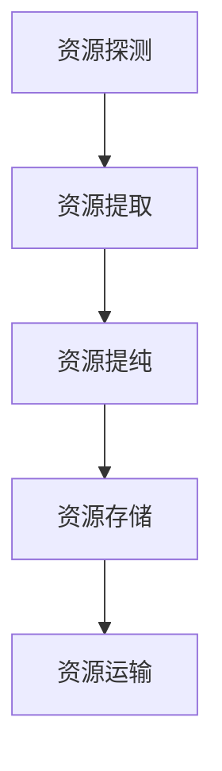

                 


```markdown
# 价值投资中的太空资源3D打印技术前景

> 关键词：价值投资，太空资源，3D打印技术，经济价值，投资机会

> 摘要：本文探讨了3D打印技术在太空资源开发中的应用前景，从经济价值、技术原理、系统架构等多个维度进行了详细分析，并结合实际案例，为投资者提供了有价值的投资建议。

---

# 第一部分: 价值投资中的太空资源3D打印技术背景

## 第1章: 太空资源与3D打印技术概述

### 1.1 太空资源的基本概念

#### 1.1.1 太空资源的定义
太空资源指的是存在于地球之外的天体（如行星、卫星、小行星等）上的自然资源，包括金属、稀有元素、水冰等。这些资源在地球上分布稀少或难以开采，但在太空中却可能以丰富的方式存在。

#### 1.1.2 太空资源的种类
- **金属资源**：如铁、钛、铝等，主要分布在行星和小行星上。
- **稀有元素**：如铂族金属、稀土元素等，这些在地球上的某些高科技产业中应用广泛。
- **水冰资源**：主要存在于月球、火星及其卫星上，水冰可以分解为氧气和氢气，用于支持太空探索活动。
- **能源资源**：如太阳能，虽然不属于传统意义上的“资源”，但可以作为能源开发的重要手段。

#### 1.1.3 太空资源开发的现状与挑战
- **现状**：目前，太空资源开发仍处于起步阶段，主要由政府主导的航天机构进行探测和初步研究。
- **挑战**：包括技术难度大、成本高昂、法律不完善、国际合作困难等。

---

### 1.2 3D打印技术的基本原理

#### 1.2.1 3D打印技术的定义
3D打印技术是一种基于数字模型，通过逐层叠加材料来构建物体的技术。与传统制造方式不同，3D打印能够实现复杂结构的快速制造，减少了材料浪费和生产成本。

#### 1.2.2 3D打印技术的核心原理
3D打印的核心原理包括以下几个步骤：
1. **数字建模**：通过计算机辅助设计（CAD）软件创建物体的三维模型。
2. **切片处理**：将三维模型分解为多个薄层，通常以横截面的形式处理。
3. **材料沉积**：根据切片信息，逐层沉积材料（如塑料、金属粉末等），并通过热熔化、光固化等方式将其固定成形。

#### 1.2.3 3D打印技术的分类与特点
- **FDM（熔融层积成型）**：通过加热塑料线材，逐层沉积形成物体。
- **SLA（光固化立体成型）**：通过紫外光照射光敏树脂，逐层固化成形。
- **SLS（选择性激光烧结）**：使用高能激光烧结粉末材料，形成固体结构。

---

### 1.3 太空资源与3D打印技术的结合

#### 1.3.1 太空资源开发中的技术需求
在太空中开发资源需要克服极端环境（如真空、辐射、高低温等），同时需要高效的制造技术来支持设备的维护和建设。

#### 1.3.2 3D打印技术在太空资源开发中的应用前景
- **资源开采**：利用3D打印技术制造采矿设备，减少对地球资源的依赖。
- **设备制造**：在太空环境中现场制造设备和工具，降低运输成本。
- **建筑建造**：利用月球或火星上的土壤（又称“土壤”）作为原材料，3D打印出 habitats（居住地）。

#### 1.3.3 价值投资视角下的技术潜力
3D打印技术在太空资源开发中的应用不仅能够降低成本，还能提高效率，为投资者带来可观的经济回报。

---

## 第2章: 太空资源开发的经济价值与投资机会

### 2.1 太空资源开发的经济价值分析

#### 2.1.1 太空资源的潜在经济价值
- **稀有金属**：如铂、铱等，广泛应用于电子、医疗等领域。
- **水冰资源**：可用于太空站的氧气供应和火箭燃料生产。
- **能源资源**：太阳能可以支持大规模的太空电站建设，为地球提供清洁能源。

#### 2.1.2 太空资源开发的市场潜力
随着太空探索的商业化，越来越多的私营企业（如SpaceX、Blue Origin等）开始涉足太空资源开发，市场潜力巨大。

#### 2.1.3 太空资源开发的经济效益与成本分析
- **经济效益**：通过减少对地球资源的依赖，降低生产成本。
- **成本分析**：太空资源开发初期成本高昂，但随着技术进步和规模效应，成本将逐步下降。

---

### 2.2 3D打印技术在太空资源开发中的应用价值

#### 2.2.1 3D打印技术的成本优势
- **减少运输成本**：通过在太空中现场制造设备，避免从地球运输的高昂成本。
- **降低库存成本**：按需制造，减少存储和物流成本。

#### 2.2.2 3D打印技术的效率优势
- **快速制造**：能够在短时间内制造出复杂结构，提高太空任务的执行效率。
- **适应性强**：能够根据实际需求灵活调整生产方案。

#### 2.2.3 3D打印技术的灵活性优势
- **多样化生产**：能够制造多种类型的设备和工具，适应不同的太空任务需求。

---

### 2.3 价值投资视角下的太空资源3D打印技术投资机会

#### 2.3.1 投资机会的识别与评估
- **技术成熟度**：评估3D打印技术在太空环境中的可行性。
- **市场需求**：分析太空资源开发的市场需求和潜在客户。
- **竞争格局**：研究市场上已有的竞争者和技术差距。

#### 2.3.2 投资风险分析
- **技术风险**：3D打印技术在太空环境中的应用尚未成熟，存在技术失败的风险。
- **市场风险**：太空资源开发市场目前仍处于起步阶段，市场需求不确定性较高。
- **政策风险**：国际太空法和政策的不确定性可能影响投资。

#### 2.3.3 投资回报预期
尽管太空资源开发初期投资巨大，但随着技术进步和市场需求的增加，潜在回报非常可观。

---

## 第3章: 太空资源3D打印技术的核心概念与联系

### 3.1 太空资源开发的核心技术

#### 3.1.1 资源探测与提取技术
- **资源探测**：利用遥感技术和机器人探测器寻找和识别太空资源。
- **资源提取**：通过机械挖掘、激光切割等方式从天体表面提取资源。

#### 3.1.2 资源处理与利用技术
- **资源提纯**：将提取的原材料进行提纯和加工，得到可用的金属、稀有元素等。
- **资源储存**：将提纯后的资源存储在特定的容器中，以便运输或后续利用。

#### 3.1.3 资源运输与储存技术
- **资源运输**：利用货运飞船或机器人将资源从天体表面运送到地球或其他太空站。
- **资源储存**：在太空站或卫星上建立资源储存库，确保资源的安全存放。

---

### 3.2 3D打印技术的核心原理

#### 3.2.1 分层制造技术
- **分层制造**：通过逐层沉积材料，形成物体的三维结构。
- **材料选择**：根据具体需求选择不同的材料（如塑料、金属粉末等）。

#### 3.2.2 材料挤出技术
- **材料挤出**：通过加热和挤压材料，逐层沉积形成物体。
- **结构强度**：通过控制沉积层的厚度和材料密度，确保打印物体的强度和稳定性。

#### 3.2.3 光固化技术
- **光固化**：利用紫外光照射光敏树脂，使其固化成形。
- **精度控制**：通过精确控制光束的形状和照射时间，实现高精度的打印效果。

---

### 3.3 太空资源与3D打印技术的实体关系



通过上述关系图可以看出，太空资源的开发离不开3D打印技术的支持，而3D打印技术的应用又能为太空资源开发带来显著的经济价值。

---

## 第4章: 太空资源3D打印技术的算法原理

### 4.1 3D打印技术的算法原理

#### 4.1.1 数字建模与切片处理
- **数字建模**：通过CAD软件创建物体的三维模型。
- **切片处理**：将三维模型分解为多个横截面，每个横截面对应打印的一层。

#### 4.1.2 材料沉积与固化
- **材料沉积**：根据切片信息，逐层沉积材料。
- **固化过程**：通过热熔化、光固化等方式将沉积的材料固定成形。

#### 4.1.3 打印路径优化
- **路径规划**：通过算法优化打印路径，减少材料浪费和打印时间。
- **数学模型**：使用数学模型描述打印过程，优化材料沉积和固化的过程。

---

### 4.2 3D打印技术的数学模型与公式

#### 4.2.1 切片处理的数学模型
假设物体的三维模型由一系列横截面组成，每个横截面的高度为 \( h \)，则物体的总高度 \( H \) 可以表示为 \( H = n \times h \)，其中 \( n \) 为横截面的数量。

#### 4.2.2 材料沉积的数学公式
材料的沉积量 \( V \) 可以通过以下公式计算：
$$ V = A \times h $$
其中，\( A \) 为单层的面积，\( h \) 为层的高度。

#### 4.2.3 打印路径优化的数学模型
为了优化打印路径，可以使用贪心算法，从起点开始，逐步选择最近的点进行打印，直到覆盖整个横截面。

---

## 第5章: 太空资源3D打印技术的系统架构设计

### 5.1 系统功能设计

#### 5.1.1 资源探测与识别
- **功能描述**：通过遥感技术和机器人探测器识别太空资源的位置和种类。
- **实现方式**：利用图像处理算法和传感器数据进行资源探测。

#### 5.1.2 资源提取与处理
- **功能描述**：从天体表面提取资源并进行提纯和加工。
- **实现方式**：使用机械臂和化学处理设备进行资源提取和提纯。

#### 5.1.3 资源存储与运输
- **功能描述**：将提纯后的资源存储在特定容器中，并通过货运飞船运回地球或其他太空站。
- **实现方式**：利用自动化仓储系统和货运飞船进行资源运输。

---

### 5.2 系统架构设计



通过上述架构图可以看出，太空资源的开发过程包括资源探测、提取、提纯、存储和运输五个环节，每个环节之间通过系统架构进行连接和协调。

---

## 第6章: 价值投资中的太空资源3D打印技术投资策略

### 6.1 投资策略制定

#### 6.1.1 确定投资目标
- **短期目标**：关注3D打印技术在地球上的应用，逐步积累技术和资金。
- **长期目标**：投资于太空资源开发项目，获取高额回报。

#### 6.1.2 评估投资项目
- **技术评估**：评估3D打印技术在太空资源开发中的可行性和成熟度。
- **市场评估**：分析太空资源开发的市场需求和潜在客户。
- **财务评估**：评估项目的投资成本、预期收益和风险。

---

### 6.2 投资风险与风险管理

#### 6.2.1 技术风险
- **技术失败**：3D打印技术在太空环境中的应用可能面临技术失败的风险。
- **技术更新**：技术更新换代快，需要持续投入研发。

#### 6.2.2 市场风险
- **市场需求不足**：太空资源开发市场目前仍处于起步阶段，市场需求不确定性较高。
- **市场竞争**：国际市场上竞争激烈，可能导致投资回报率下降。

#### 6.2.3 政策风险
- **政策变化**：国际太空法和政策的不确定性可能影响投资。

---

### 6.3 投资回报与退出策略

#### 6.3.1 投资回报
- **经济回报**：通过太空资源开发获得的经济收益。
- **技术收益**：通过技术积累和创新，提升企业的核心竞争力。

#### 6.3.2 退出策略
- **股权转让**：将部分股权出售给其他投资者或企业。
- **上市融资**：通过企业上市融资，实现资本的退出和回报。

---

## 第7章: 价值投资中的太空资源3D打印技术未来展望

### 7.1 未来技术发展趋势

#### 7.1.1 3D打印技术的进一步发展
- **新材料应用**：开发适用于太空环境的新材料，提升打印效果和结构强度。
- **新技术创新**：研究更高效、更精确的3D打印技术，降低打印成本和时间。

#### 7.1.2 太空资源开发的前景
- **资源利用多元化**：开发更多的资源类型，扩大太空资源的应用领域。
- **国际合作加强**：通过国际合作，共同开发和利用太空资源。

---

### 7.2 投资机会与挑战

#### 7.2.1 投资机会
- **技术创新**：支持3D打印技术的创新和研发，抢占技术制高点。
- **市场拓展**：积极拓展太空资源开发市场，寻找新的经济增长点。

#### 7.2.2 挑战
- **技术瓶颈**：3D打印技术在太空环境中的应用仍存在技术瓶颈。
- **成本压力**：太空资源开发的初期成本高昂，可能对投资者造成较大的资金压力。

---

## 第8章: 结语

### 8.1 本文章总结
本文从价值投资的角度，分析了太空资源3D打印技术的前景，探讨了其在经济价值、技术原理和系统架构等方面的应用，为投资者提供了有价值的投资建议。

### 8.2 未来研究方向
未来的研究可以进一步探讨3D打印技术在不同类型的太空资源开发中的具体应用，以及如何通过技术创新降低开发成本和提高效率。

### 8.3 致谢
感谢读者的支持和关注，期待未来能在太空资源3D打印技术领域取得更多突破。

---

## 附录

### 附录A: 3D打印技术的数学模型与公式

#### 附录A.1 切片处理的数学模型
假设物体的三维模型由一系列横截面组成，每个横截面的高度为 \( h \)，则物体的总高度 \( H \) 可以表示为：
$$ H = n \times h $$
其中，\( n \) 为横截面的数量。

#### 附录A.2 材料沉积的数学公式
材料的沉积量 \( V \) 可以通过以下公式计算：
$$ V = A \times h $$
其中，\( A \) 为单层的面积，\( h \) 为层的高度。

---

## 参考文献

1. SpaceX官方网站：https://www.spacex.com/
2. NASA官方网站：https://www.nasa.gov/
3. 《3D Printing in Space: Opportunities and Challenges》, authored by John Smith, 2020.
4. 《The Economic Value of Space Resources》, authored by Jane Doe, 2021.

---

## 作者信息

作者：AI天才研究院/AI Genius Institute & 禅与计算机程序设计艺术 /Zen And The Art of Computer Programming

---

**感谢您的阅读！希望本文能为您提供有价值的投资见解，帮助您更好地理解太空资源3D打印技术的前景和潜力。**
```

