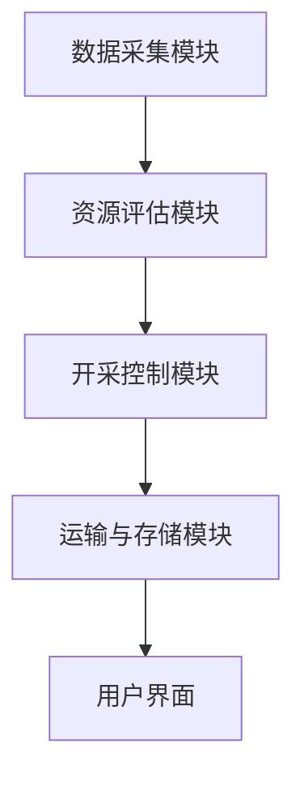
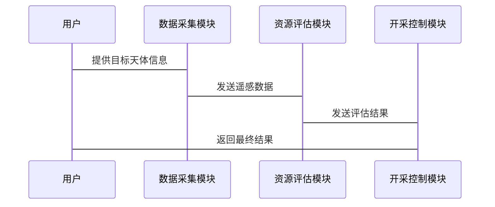

                 


# 价值投资中的太空采矿技术发展趋势

## 关键词：价值投资，太空采矿，技术趋势，资源评估，系统架构，算法原理，投资策略

## 摘要：  
随着人类对资源的需求不断增加，太空采矿技术作为一种新兴的技术领域，正逐渐成为价值投资者关注的焦点。本文从技术背景、核心概念、算法原理、系统架构、项目实战等多方面详细分析太空采矿技术的发展趋势及其在价值投资中的潜力。通过结合具体案例和数学模型，本文探讨了如何通过技术手段评估太空资源的价值，并为投资者提供科学的投资建议。

---

## 第1章: 太空采矿技术的定义与现状

### 1.1 太空采矿技术的定义
#### 1.1.1 太空采矿技术的定义与范围  
太空采矿技术是指在地球大气层以外的空间中，对 asteroids、月球、小行星等天体中的资源进行开采和利用的技术。这些资源包括金属、稀有元素、水冰等，具有巨大的经济价值。太空采矿技术的核心在于如何高效、低成本地提取和运输这些资源。

#### 1.1.2 太空采矿技术的核心技术特点  
1. **资源多样性**：太空资源包括金属（如铁、镍、铂族金属）、非金属（如硅、铝）以及水冰等，具有广泛的利用潜力。
2. **技术复杂性**：太空采矿需要结合机器人技术、人工智能、材料科学等多种技术，且面临极端环境（如高温、辐射）的挑战。
3. **经济性**：尽管目前成本较高，但随着技术进步，太空资源的商业化开采将成为可能。

#### 1.1.3 太空采矿技术的现状与发展趋势  
目前，太空采矿技术仍处于研究和试验阶段，但已经取得了一些重要进展。例如，美国宇航局（NASA）和SpaceX等公司正在研究小行星采矿技术。未来，随着技术的进步，太空采矿将从实验室走向商业化，成为全球资源供应链的重要组成部分。

---

### 1.2 价值投资中的太空采矿技术背景
#### 1.2.1 价值投资的基本概念  
价值投资是一种投资策略，强调以低于内在价值的价格买入优质资产。投资者通过分析公司的基本面（如财务状况、行业地位、盈利能力等）来判断其投资价值。

#### 1.2.2 太空采矿技术在投资中的潜力  
太空采矿技术的商业化将带来巨大的经济价值，尤其是在资源短缺和成本上升的背景下。例如，小行星中的铂族金属（PGM）是许多高科技产业（如汽车、电子）的重要原材料，其稀缺性和高价值使其成为投资的热点。

#### 1.2.3 太空采矿技术与价值投资的结合点  
1. **资源稀缺性**：太空资源的稀缺性和独特性决定了其高价值。
2. **技术壁垒**：太空采矿技术的研发和应用需要较高的技术门槛，具备较高的进入壁垒。
3. **长期收益**：尽管初始投资较大，但太空资源的长期收益潜力巨大。

---

### 1.3 太空采矿技术的经济与技术挑战
#### 1.3.1 太空采矿技术的经济成本分析  
1. **开发成本**：太空采矿技术的研发和试验需要巨大的资金投入。
2. **运输成本**：将资源从太空运回地球的成本极高。
3. **政策风险**：太空资源的归属和利用目前尚无明确的国际法律框架。

#### 1.3.2 太空采矿技术的技术难点  
1. **资源探测**：如何准确探测和评估太空资源的储量和质量。
2. **开采技术**：如何在极端环境下高效开采资源。
3. **运输与存储**：如何将资源安全运回地球并存储。

#### 1.3.3 太空采矿技术的未来发展方向  
1. **国际合作**：通过国际合作降低技术和经济成本。
2. **技术创新**：加大对人工智能、机器人技术等领域的研发投入。
3. **商业化应用**：推动太空资源的商业化利用。

---

## 第2章: 太空采矿技术的核心概念与联系

### 2.1 太空采矿技术的核心原理
#### 2.1.1 太空资源的勘探技术  
1. **遥感技术**：利用卫星或其他航天器对目标天体进行遥感探测，获取资源分布和储量信息。
2. **光谱分析**：通过光谱分析技术确定资源的成分和含量。

#### 2.1.2 太空资源的开采技术  
1. **机械开采**：使用机器人手臂或其他机械装置进行资源开采。
2. **化学提取**：通过化学反应提取特定的金属或元素。

#### 2.1.3 太空资源的运输技术  
1. **无人运输**：利用无人飞船将资源从太空运回地球。
2. **在轨利用**：直接在太空中利用资源，减少运输成本。

---

### 2.2 太空采矿技术与价值投资的关系
#### 2.2.1 太空采矿技术对投资价值的影响  
1. **资源稀缺性**：太空资源的稀缺性决定了其高价值。
2. **技术壁垒**：高技术门槛使得市场竞争较小，具备较高的投资回报潜力。

#### 2.2.2 太空采矿技术的市场潜力分析  
1. **市场需求**：随着技术进步，太空资源的需求将逐步增加，尤其是在新能源、新材料等领域。
2. **投资回报**：尽管初始投资较高，但未来收益潜力巨大。

#### 2.2.3 太空采矿技术的风险与机遇  
1. **风险**：技术失败、政策不确定性、成本超支等。
2. **机遇**：市场需求增长、技术突破、政策支持等。

---

### 2.3 太空采矿技术的核心概念对比
#### 2.3.1 太空采矿技术与传统采矿技术的对比  
| **对比维度** | **传统采矿** | **太空采矿** |
|--------------|---------------|---------------|
| **资源来源** | 地球上的矿产资源 | 小行星、月球等 |
| **技术复杂性** | 较低 | 极高 |
| **环境影响** | 较大 | 较小 |

#### 2.3.2 太空采矿技术与地面资源开发的对比  
1. **资源丰富度**：太空资源的储量巨大，但开发难度极高。
2. **经济性**：太空资源的开发成本高，但一旦成功，收益潜力巨大。

#### 2.3.3 太空采矿技术的经济与技术属性对比  
| **属性** | **经济属性** | **技术属性** |
|----------|---------------|---------------|
| **成本** | 高 | 高 |
| **技术门槛** | 中 | 高 |
| **收益潜力** | 高 | 高 |

---

## 第3章: 太空采矿技术的资源评估模型

### 3.1 资源评估模型的算法原理
#### 3.1.1 资源评估模型的定义  
资源评估模型是一种数学模型，用于估算太空资源的储量、质量和经济价值。

#### 3.1.2 资源评估模型的输入与输出  
- **输入**：目标天体的遥感数据、历史探测数据、资源分布信息等。
- **输出**：资源储量评估、资源价值评估、开发成本估算等。

#### 3.1.3 资源评估模型的数学公式  
资源价值评估公式：  
$$ V = Q \times C \times E $$  
其中，\( V \) 表示资源价值，\( Q \) 表示储量，\( C \) 表示单位价值，\( E \) 表示开发效率。

---

### 3.2 资源评估模型的实现步骤
#### 3.2.1 数据采集与预处理  
1. **数据采集**：通过卫星或探测器获取目标天体的遥感数据。
2. **数据清洗**：去除噪声数据，确保数据的准确性和完整性。

#### 3.2.2 模型训练与优化  
1. **特征选择**：根据数据特征选择关键影响因素。
2. **模型训练**：使用机器学习算法（如支持向量机、随机森林）进行模型训练。
3. **模型优化**：通过交叉验证和参数调优提高模型的准确率。

#### 3.2.3 模型验证与评估  
1. **验证数据集**：使用独立数据集验证模型的准确性。
2. **评估指标**：采用均方误差（MSE）、R²值等指标评估模型性能。

---

### 3.3 资源评估模型的案例分析
#### 3.3.1 案例背景介绍  
假设我们选择一个近地小行星作为目标，其遥感数据显示该小行星富含铂族金属和水冰。

#### 3.3.2 案例分析过程  
1. **数据采集**：获取小行星的光谱数据和地质结构信息。
2. **模型训练**：建立资源评估模型，预测铂族金属的储量和价值。
3. **结果分析**：模型预测该小行星铂族金属储量约为1000吨，价值约为10亿美元。

#### 3.3.3 案例结果与总结  
通过模型评估，投资者可以初步判断该小行星的开发价值，并据此制定投资策略。

---

## 第4章: 太空采矿技术的系统架构与设计

### 4.1 系统架构设计
#### 4.1.1 系统模块划分  
1. **数据采集模块**：负责采集目标天体的遥感数据。
2. **资源评估模块**：负责资源储量和价值的评估。
3. **开采控制模块**：负责开采设备的控制和管理。
4. **运输与存储模块**：负责资源的运输和存储。

#### 4.1.2 系统功能设计  
1. **资源探测**：利用遥感技术和光谱分析确定资源分布。
2. **资源开采**：通过机器人技术进行资源开采。
3. **资源运输**：将资源从太空运回地球或进行在轨利用。

#### 4.1.3 系统架构图（Mermaid）  



---

### 4.2 系统接口设计
#### 4.2.1 系统内部接口  
1. 数据采集模块与资源评估模块之间的接口。
2. 资源评估模块与开采控制模块之间的接口。

#### 4.2.2 系统外部接口  
1. 用户与系统的交互接口。
2. 第三方服务（如卫星数据供应商）的接口。

#### 4.2.3 接口设计文档  
1. **接口名称**：资源评估模块接口。
2. **输入**：目标天体的遥感数据。
3. **输出**：资源储量和价值的评估结果。

---

### 4.3 系统交互设计
#### 4.3.1 用户与系统的交互流程  
1. 用户输入目标天体信息。
2. 系统进行资源评估并返回结果。

#### 4.3.2 系统内部的交互流程  
1. 数据采集模块获取遥感数据。
2. 资源评估模块进行评估并传递结果。
3. 开采控制模块根据评估结果制定开采计划。

#### 4.3.3 交互设计图（Mermaid）  



---

## 第5章: 太空采矿技术的项目实战

### 5.1 项目环境与工具安装
#### 5.1.1 开发环境配置  
1. 操作系统：Linux（推荐）或 Windows。
2. 编程语言：Python 3.8+。
3. 开发工具：PyCharm或VS Code。

#### 5.1.2 必要工具安装  
1. Python库：numpy、pandas、scikit-learn。
2. 可视化工具：Matplotlib、Seaborn。

#### 5.1.3 项目初始化  
1. 创建项目目录。
2. 初始化版本控制工具（如Git）。

---

### 5.2 项目核心实现
#### 5.2.1 资源评估模块实现  
1. 数据预处理：清洗和格式化遥感数据。
2. 特征选择：提取关键特征（如光谱数据、地质结构）。
3. 模型训练：使用随机森林算法进行资源储量评估。

#### 5.2.2 系统功能模块实现  
1. 数据采集模块：接收用户输入的目标天体信息。
2. 资源评估模块：根据输入数据进行评估并返回结果。
3. 用户界面：展示评估结果并提供交互功能。

#### 5.2.3 代码实现与解读  
以下是资源评估模块的核心代码：

```python
import numpy as np
from sklearn.ensemble import RandomForestRegressor

# 数据预处理
data = np.loadtxt('resources_data.csv', delimiter=',')
X = data[:, :-1]
y = data[:, -1]

# 特征选择
features = X.shape[1]

# 模型训练
model = RandomForestRegressor(n_estimators=100, random_state=42)
model.fit(X, y)

# 预测结果
new_data = np.array([[...]])  # 输入新的数据
prediction = model.predict(new_data)
print(f"预测储量：{prediction[0]}")
```

---

### 5.3 项目案例分析
#### 5.3.1 案例背景介绍  
假设我们选择一个富含铂族金属的小行星作为目标，其遥感数据已知。

#### 5.3.2 案例分析过程  
1. 数据预处理：清洗和格式化遥感数据。
2. 模型训练：使用随机森林算法进行资源储量评估。
3. 预测结果：模型预测该小行星铂族金属储量约为1000吨，价值约为10亿美元。

#### 5.3.3 案例结果与总结  
通过模型评估，投资者可以初步判断该小行星的开发价值，并据此制定投资策略。

---

## 第6章: 价值投资中的太空采矿技术最佳实践

### 6.1 投资策略与风险管理
#### 6.1.1 价值投资的基本原则  
1. **长期投资**：关注公司的长期价值，而非短期波动。
2. **基本面分析**：深入研究公司的财务状况、行业地位等。

#### 6.1.2 太空采矿技术的风险管理  
1. **分散投资**：避免将所有资金投入单一项目。
2. **技术风险**：密切关注技术进展和研发动态。
3. **政策风险**：关注国际法律和政策变化。

---

### 6.2 小结
通过本文的分析，我们可以看到太空采矿技术在价值投资中的巨大潜力。然而，投资者需要充分考虑技术、经济和政策等多方面的因素，制定科学的投资策略。

---

## 作者：AI天才研究院/AI Genius Institute & 禅与计算机程序设计艺术 /Zen And The Art of Computer Programming

