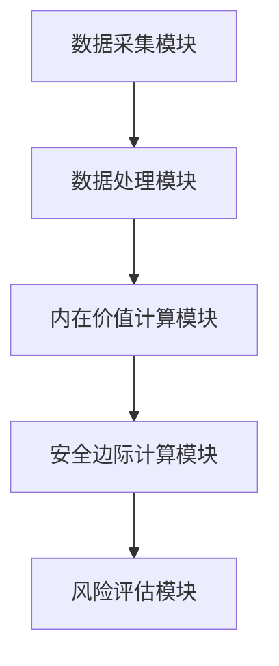

                 


# 价值投资中的安全边际如何确定

> 关键词：价值投资、安全边际、资产估值、内在价值、投资风险管理

> 摘要：  
本文深入探讨了价值投资中安全边际的确定方法，从理论基础到实际应用进行了系统性分析。通过数学模型、统计分析和系统架构设计，详细讲解了安全边际的计算公式、影响因素以及实际投资中的应用策略。结合具体案例分析，本文为投资者提供了一套科学的安全边际确定方法，帮助投资者在复杂多变的市场环境中做出更明智的投资决策。

---

## 第1章: 安全边际的定义与核心概念

### 1.1 安全边际的定义与背景

#### 1.1.1 价值投资的基本概念
价值投资是一种以基本面分析为基础的投资策略，强调以低于资产内在价值的价格购买优质资产。其核心在于寻找市场先生的短期情绪波动带来的定价偏差，从而在长期中获得超额收益。  
- **市场先生**：格雷厄姆提出的一个概念，比喻市场情绪的波动性。当市场情绪乐观时，资产价格可能被高估；当市场情绪悲观时，资产价格可能被低估。  
- **内在价值**：资产在理性市场中基于其基本面因素（如现金流、盈利能力等）所决定的公允价值。

#### 1.1.2 安全边际的起源与发展
安全边际的概念最早由本杰明·格雷厄姆提出，是价值投资理论的核心要素之一。安全边际是指资产的市场价格低于其内在价值的差额部分，反映了市场价格与内在价值之间的差异。  
- **安全边际的起源**：格雷厄姆通过研究市场波动性和资产估值，发现市场价格往往偏离内在价值，这种偏离为投资者提供了套利机会。  
- **安全边际的发展**：后续投资者（如巴菲特）将安全边际的概念进一步深化，强调在安全边际的基础上构建投资组合，以降低投资风险并提高收益。

#### 1.1.3 安全边际在投资中的重要性
安全边际是价值投资者在评估资产时的重要参考指标，其重要性体现在以下方面：  
- **降低投资风险**：通过安全边际，投资者可以避免在高估的市场中购买资产，从而降低投资损失的可能性。  
- **提高投资收益**：安全边际高的资产意味着其市场价格低于内在价值，长期来看，这类资产的回报潜力更大。  
- **应对市场波动**：安全边际为投资者提供了在市场波动中保持投资纪律的工具，避免被短期市场情绪左右。

---

### 1.2 安全边际的核心概念

#### 1.2.1 安全边际的数学定义
安全边际可以量化为市场价格与内在价值之间的差额，即：  
$$\text{安全边际} = \text{内在价值} - \text{市场价格}$$  
其中，内在价值是基于基本面分析得出的资产公允价值，市场价格是资产在当前市场中的交易价格。  

#### 1.2.2 安全边际与投资风险的关系
安全边际与投资风险呈负相关关系：  
- **高安全边际**：资产的市场价格远低于其内在价值，投资风险较低，潜在收益较高。  
- **低安全边际**：资产的市场价格接近或高于其内在价值，投资风险较高，潜在收益较低。  

#### 1.2.3 安全边际的属性特征
| 属性 | 描述 |
|------|------|
| 计量方式 | 数值化差异（如价格与价值的差额） |
| 时间维度 | 动态变化（随市场波动和基本面变化而变化） |
| 风险对冲 | 降低投资损失的可能性 |
| 收益潜力 | 提高潜在收益的可能性 |

---

### 1.3 安全边际的理论基础

#### 1.3.1 格雷厄姆的价值投资理论
格雷厄姆的价值投资理论强调以低于内在价值的价格购买资产，安全边际是其核心思想之一。他认为，市场价格的波动性为投资者提供了以折扣价购买优质资产的机会。  

#### 1.3.2 安全边际与市场波动的关系
市场波动是安全边际存在的前提条件：  
- 在市场恐慌时，资产价格可能大幅低于内在价值，安全边际较高。  
- 在市场狂热时，资产价格可能大幅高于内在价值，安全边际较低甚至为负。  

#### 1.3.3 安全边际与资产估值的联系
安全边际是资产估值的重要补充：  
- 内在价值是安全边际的基准，市场价格是安全边际的变量。  
- 通过安全边际，投资者可以动态评估资产的估值状态（低估、合理、高估）。

---

## 第2章: 安全边际的计算方法

### 2.1 安全边际的计算公式

#### 2.1.1 内在价值的计算公式
内在价值的计算是安全边际的基础，通常可以通过以下公式进行估算：  
$$\text{内在价值} = \frac{\text{现金流}}{\text{折现率}}$$  
其中，现金流是资产未来产生的现金流量，折现率是基于风险偏好和市场利率确定的贴现率。  

#### 2.1.2 安全边际的计算公式
基于内在价值和市场价格的差异，安全边际的计算公式为：  
$$\text{安全边际} = \text{内在价值} - \text{市场价格}$$  
如果安全边际为正，说明资产价格被低估；如果安全边际为负，说明资产价格被高估。  

---

### 2.2 安全边际的计算步骤

#### 2.2.1 确定企业的内在价值
1. **分析企业的财务报表**：计算企业的净利润、现金流等关键指标。  
2. **评估企业的竞争优势**：确定企业的护城河和未来盈利能力。  
3. **计算内在价值**：使用DCF模型（现金流贴现法）或其他估值方法估算内在价值。  

#### 2.2.2 确定市场价格
1. **观察市场交易价格**：获取资产的当前市场价格。  
2. **比较市场价格与内在价值**：判断资产是否被低估或高估。  

#### 2.2.3 计算安全边际
1. **计算差额**：用内在价值减去市场价格，得到安全边际。  
2. **分析安全边际的大小**：判断安全边际是否足够大以支撑投资决策。  

---

### 2.3 安全边际的计算案例

#### 2.3.1 案例一：某上市公司的内在价值与安全边际计算
假设某上市公司未来5年的现金流分别为100万元、120万元、140万元、160万元、180万元，假设折现率为8%。  
计算内在价值：  
$$\text{内在价值} = \frac{100}{(1+0.08)^1} + \frac{120}{(1+0.08)^2} + \frac{140}{(1+0.08)^3} + \frac{160}{(1+0.08)^4} + \frac{180}{(1+0.08)^5} \approx 475 \text{万元}$$  
假设当前市场价格为400万元，则安全边际为：  
$$\text{安全边际} = 475 - 400 = 75 \text{万元}$$  

---

## 第3章: 安全边际的理论模型与数学分析

### 3.1 安全边际的数学模型

#### 3.1.1 内在价值模型
$$\text{内在价值} = \sum_{t=1}^n \frac{\text{现金流}_t}{(1 + r)^t}$$  
其中，$r$是折现率，$n$是预测的现金流期限。

#### 3.1.2 市场价格模型
$$\text{市场价格} = \text{内在价值} \times (1 + \text{市场情绪波动})$$  
市场情绪波动是影响市场价格偏离内在价值的主要因素。

#### 3.1.3 安全边际模型
$$\text{安全边际} = \text{内在价值} - \text{市场价格} = \text{内在价值} \times (1 - \text{市场情绪波动})$$  

---

### 3.2 安全边际的统计分析

#### 3.2.1 市场价格的分布
市场价格的分布可以通过统计方法进行分析，常见的分布模型包括：  
- 正态分布：假设市场价格围绕内在价值上下波动。  
- 波莱诺茨分布：适用于极端市场波动的情况。  

#### 3.2.2 内在价值的分布
内在价值的分布可以通过历史数据分析得出，通常假设内在价值服从对数正态分布。  

#### 3.2.3 安全边际的分布
安全边际的分布可以通过市场价格与内在价值的差异分析得出，通常假设安全边际服从均值为零的分布。

---

### 3.3 安全边际的敏感性分析

#### 3.3.1 折现率对安全边际的影响
折现率的变化会影响内在价值的计算，从而影响安全边际。  
- 折现率上升：内在价值下降，安全边际可能缩小或变为负值。  
- 折现率下降：内在价值上升，安全边际可能扩大。  

#### 3.3.2 现金流对安全边际的影响
现金流的变化直接影响内在价值，从而影响安全边际。  
- 现金流上升：内在价值上升，安全边际可能扩大。  
- 现金流下降：内在价值下降，安全边际可能缩小。  

#### 3.3.3 市场价格对安全边际的影响
市场价格的变化直接影响安全边际：  
- 市场价格下降：安全边际可能扩大。  
- 市场价格上涨：安全边际可能缩小或变为负值。  

---

## 第4章: 安全边际的系统架构设计

### 4.1 投资决策支持系统概述

#### 4.1.1 系统目标
设计一个基于安全边际的自动化投资决策支持系统，帮助投资者快速计算和分析资产的安全边际。  

#### 4.1.2 系统功能
1. **数据采集**：获取资产的财务数据和市场价格数据。  
2. **内在价值计算**：基于现金流模型计算资产的内在价值。  
3. **安全边际计算**：根据市场价格和内在价值计算安全边际。  
4. **风险评估**：分析安全边际与投资风险的关系。  

---

### 4.2 系统架构设计

#### 4.2.1 系统架构


#### 4.2.2 模块功能
1. **数据采集模块**：通过API接口获取资产的财务数据和市场价格数据。  
2. **数据处理模块**：清洗和预处理数据，确保数据的准确性和完整性。  
3. **内在价值计算模块**：基于现金流模型计算资产的内在价值。  
4. **安全边际计算模块**：根据市场价格和内在价值计算安全边际。  
5. **风险评估模块**：分析安全边际与投资风险的关系，生成投资建议。  

---

## 第5章: 项目实战与案例分析

### 5.1 环境安装与系统核心实现

#### 5.1.1 环境安装
1. 安装Python编程环境。  
2. 安装必要的库（如numpy、pandas、scipy）。  

#### 5.1.2 核心代码实现
```python
import numpy as np
import pandas as pd

def calculate_intrinsic_value(cash_flows, discount_rate):
    return np.npv(discount_rate, cash_flows)

def calculate_market_price(asset_name):
    # 假设通过API获取市场价格
    pass

def calculate_margin_of_safety(intrinsic_value, market_price):
    return intrinsic_value - market_price
```

---

### 5.2 案例分析与详细解读

#### 5.2.1 案例分析
以某上市公司为例，假设其未来5年的现金流分别为100万元、120万元、140万元、160万元、180万元，折现率为8%，市场价格为400万元。  
1. 计算内在价值：  
   $$\text{内在价值} = \frac{100}{1.08} + \frac{120}{(1.08)^2} + \frac{140}{(1.08)^3} + \frac{160}{(1.08)^4} + \frac{180}{(1.08)^5} \approx 475 \text{万元}$$  
2. 计算安全边际：  
   $$\text{安全边际} = 475 - 400 = 75 \text{万元}$$  

#### 5.2.2 详细解读
1. **内在价值的计算**：基于现金流模型，计算得出的内在价值为475万元，表明资产的公允价值为475万元。  
2. **市场价格的分析**：当前市场价格为400万元，低于内在价值，表明资产被市场低估。  
3. **安全边际的结论**：安全边际为75万元，表明投资该资产的风险较低，潜在收益较高。  

---

## 第6章: 最佳实践与投资策略

### 6.1 最佳实践 Tips

#### 6.1.1 定期复盘与调整
- 定期检查资产的安全边际，根据市场变化调整投资组合。  
- 当市场价格显著偏离内在价值时，及时调整投资策略。  

#### 6.1.2 选择优质资产
- 优先选择具有强大竞争优势和稳定现金流的资产。  
- 确保资产的内在价值具有较高的增长潜力。  

#### 6.1.3 降低投资风险
- 通过分散投资降低单一资产的风险。  
- 结合安全边际和风险承受能力制定投资策略。  

---

### 6.2 投资策略总结

#### 6.2.1 安全边际的重要性
- 安全边际是价值投资的核心工具，帮助投资者在市场波动中保持理性。  
- 高安全边际的资产是投资组合的重要组成部分，能够降低投资风险并提高收益潜力。  

#### 6.2.2 投资者的风险管理
- 通过安全边际分析，投资者可以更好地识别风险和机会。  
- 在市场狂热时保持冷静，在市场恐慌时保持理性。  

---

## 第7章: 结语与展望

### 7.1 结语
安全边际是价值投资中不可或缺的工具，它帮助投资者在复杂多变的市场中做出更明智的投资决策。通过科学的安全边际计算和系统化的投资策略，投资者可以有效降低风险并提高收益潜力。

### 7.2 未来展望
随着人工智能和大数据技术的发展，安全边际的计算和分析将更加智能化和自动化。投资者可以利用先进的技术工具，进一步提升投资决策的效率和准确性。

---

## 作者：AI天才研究院/AI Genius Institute & 禅与计算机程序设计艺术 /Zen And The Art of Computer Programming

