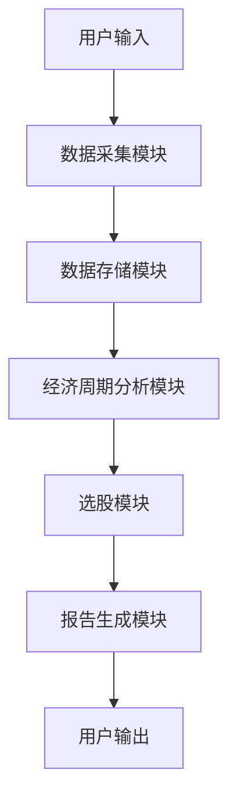

                 


# 《价值投资中的宏观经济考量：全局视野》

---

## 关键词：  
价值投资、宏观经济、经济周期、投资策略、量化分析、风险管理  

---

## 摘要：  
价值投资是一种以基本面分析为基础的投资策略，而宏观经济因素在价值投资中起着至关重要的作用。本文从全局视角出发，系统地分析了宏观经济指标对投资决策的影响，揭示了宏观经济周期如何驱动投资策略的变化，并通过量化方法和实际案例展示了如何将宏观经济分析融入投资组合管理。本文还结合了技术手段，详细阐述了宏观经济驱动的选股模型的构建过程，并提出了风险管理的最佳实践。

---

## 第1章 引言

### 1.1 价值投资与宏观经济的结合  
价值投资强调以低于内在价值的价格买入优质资产，而宏观经济因素则是影响资产内在价值的重要变量。本文将探讨如何通过宏观经济分析来优化价值投资策略，帮助投资者在复杂多变的市场环境中做出更明智的决策。

---

## 第2章 宏观经济基础

### 2.1 宏观经济的核心指标  
1. **国内生产总值（GDP）**：衡量一个国家或地区的经济规模和增长情况。  
2. **通货膨胀率（CPI）**：影响企业盈利能力和货币政策走向。  
3. **失业率**：反映经济健康状况，影响消费者信心和劳动力成本。  
4. **利率**：影响企业的融资成本和投资行为。  

### 2.2 宏观经济周期的分析框架  
1. **经济周期的四个阶段**：衰退、复苏、过热、滞胀。  
2. **周期性股票 vs 防御性股票**：不同经济周期下股票的表现差异。  

---

## 第3章 宏观经济对价值投资的影响

### 3.1 经济周期与投资策略  
在经济衰退期，低估值的防御性股票更具吸引力；在经济过热期，周期性股票可能表现更优。  

### 3.2 宏观经济指标的量化分析  
1. **市盈率（PE）**：$$PE = \frac{\text{股价}}{\text{每股收益}}$$  
2. **市净率（PB）**：$$PB = \frac{\text{股价}}{\text{每股净资产}}$$  
3. **股息率**：$$\text{股息率} = \frac{\text{每股股息}}{\text{股价}} \times 100\%$$  

---

## 第4章 宏观经济驱动的选股模型

### 4.1 模型的核心逻辑  
1. 通过宏观经济指标预测经济周期。  
2. 根据经济周期选择合适的行业和个股。  

### 4.2 算法原理  
1. 数据预处理：清洗和标准化宏观经济指标。  
2. 经济周期分类：使用聚类算法或回归分析。  
3. 个股筛选：基于宏观经济指标和行业特性，筛选符合价值投资标准的股票。  

### 4.3 数学模型  
1. 经济周期预测模型：  
   $$\text{经济周期} = f(GDP, CPI, 失业率)$$  
2. 个股估值模型：  
   $$\text{内在价值} = \text{净利润} \times \text{市盈率目标}$$  

---

## 第5章 系统架构设计

### 5.1 系统功能设计  
1. 数据采集模块：收集宏观经济指标和个股数据。  
2. 经济周期分析模块：预测经济周期。  
3. 选股模块：筛选符合价值投资标准的股票。  
4. 报告生成模块：输出投资建议和风险提示。  

### 5.2 系统架构图  


---

## 第6章 项目实战

### 6.1 实战环境配置  
1. 数据源：使用公开的宏观经济数据和股票数据。  
2. 工具：Python、Pandas、NumPy、Scikit-learn。  

### 6.2 核心代码实现  
1. 数据预处理：  
```python
import pandas as pd
import numpy as np

# 假设data是一个包含宏观经济指标和股票数据的DataFrame
data['GDP增长率'] = (data['GDP'].pct_change() * 100).round(2)
data['CPI'] = data['CPI'].round(2)
data['失业率'] = (data['失业率'] * 100).round(2)
```

2. 经济周期分类：  
```python
from sklearn.cluster import KMeans

X = data[['GDP增长率', 'CPI', '失业率']].values
kmeans = KMeans(n_clusters=4, random_state=42)
data['经济周期'] = kmeans.fit_predict(X)
```

3. 个股筛选：  
```python
# 假设data是经过分类后的数据
value_stocks = data[(data['PE'] < data['PE'].quantile(0.25)) & 
                     (data['PB'] < data['PB'].quantile(0.25))]
```

### 6.3 实战结果分析  
通过代码实现，我们筛选出了一批在当前经济周期下具有较高投资价值的股票，并生成了相应的投资报告。

---

## 第7章 最佳实践与小结

### 7.1 关键点总结  
1. 宏观经济分析是价值投资的重要组成部分。  
2. 不同经济周期下，投资策略应相应调整。  
3. 量化分析和系统架构是实现宏观经济驱动投资的关键技术。  

### 7.2 实践中的注意事项  
1. 数据的准确性和及时性至关重要。  
2. 模型需要定期更新和优化。  
3. 风险管理是投资成功的核心要素。  

### 7.3 拓展阅读  
建议深入学习《投资学》、《宏观经济学》等经典书籍，以及相关的量化投资技术。

---

## 作者：  
**AI天才研究院/AI Genius Institute & 禅与计算机程序设计艺术 /Zen And The Art of Computer Programming**  

--- 

**注**：本文基于技术分析与实践，旨在提供价值投资中的宏观经济分析方法。

