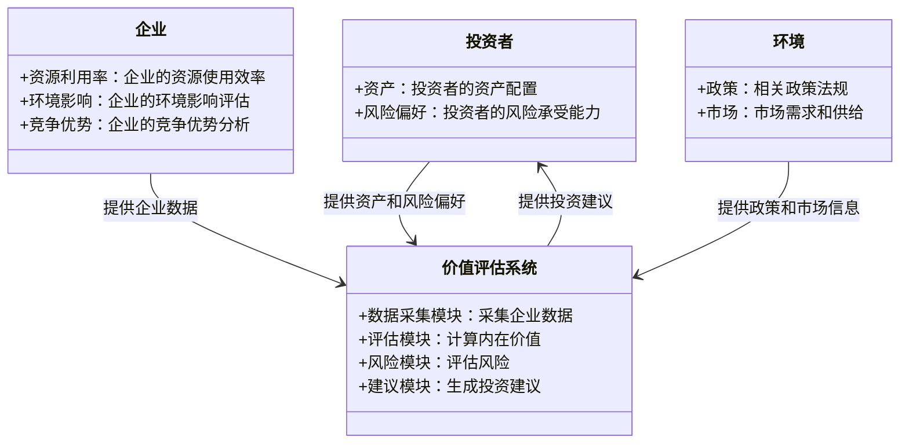

                 


# 价值投资中的循环经济模式分析

## 关键词：
价值投资、循环经济、可持续发展、经济模式、资源优化

## 摘要：
本文分析了在循环经济模式下，价值投资的策略与应用。通过探讨循环经济的核心概念、价值评估模型、投资机会以及系统架构，展示了如何在循环经济中识别高价值投资标的，并提供实际案例和数学模型支持。

---

## 第一部分：价值投资与循环经济的背景介绍

### 第1章：价值投资概述

#### 1.1 价值投资的核心概念
- **价值投资的定义与起源**  
  价值投资是一种以低于内在价值的价格购买优质股票的投资策略，起源于20世纪初，由本杰明·格雷厄姆和戴维·多德提出。其核心在于识别市场低估的公司，长期持有以获得超额收益。

- **价值投资的基本原理**  
  价值投资强调安全边际、内在价值和市场有效性的不足。投资者通过分析公司的基本面（如盈利能力、财务状况和竞争优势）来判断其内在价值，并在市场价格低于内在价值时进行投资。

- **价值投资与循环经济的关系**  
  循环经济强调资源的高效利用和循环流动，这为价值投资者提供了新的投资视角。循环经济模式下的企业通常具有较强的资源优化能力和可持续发展优势，这可能使其内在价值被市场低估，从而为价值投资创造机会。

#### 1.2 循环经济模式概述
- **循环经济的定义与特点**  
  循环经济是一种以资源高效利用和循环流动为基础的经济模式，强调减少资源消耗和环境污染，延长产品生命周期。

- **循环经济的三种主要模式**  
  - **生产者责任延伸（EPR）**：企业对其产品全生命周期负责，包括回收和再利用。
  - **共享经济**：通过共享资源提高利用率，减少浪费。
  - **闭环生产**：企业内部实现资源的闭环管理，减少对外部资源的依赖。

- **循环经济与可持续发展的关联**  
  循环经济是实现可持续发展的重要途径，通过减少资源消耗和环境污染，促进经济与环境的协调发展。

---

### 第2章：价值投资与循环经济的结合

#### 2.1 循环经济中的价值评估
- **循环经济模式中的价值构成**  
  循环经济模式下的企业价值不仅包括传统的财务指标，还应考虑资源利用率、环境影响和社会效益。

- **循环经济与企业价值的关系**  
  循环经济模式可能降低企业的生产成本，提高资源利用效率，从而增强企业的竞争优势和盈利能力。

- **循环经济中的价值波动因素**  
  循环经济模式下的企业可能面临政策风险、技术风险和市场认知风险，这些因素会影响企业的价值波动。

#### 2.2 循环经济中的投资机会
- **循环经济产业链中的投资点**  
  - 资源回收与再利用企业
  - 共享经济平台
  - 环保技术与服务提供商

- **循环经济模式下的企业竞争优势**  
  循环经济模式下的企业可能具有更低的生产成本、更强的环境适应能力和更高的社会责任感，这些因素可能被市场低估，从而为价值投资创造机会。

- **循环经济中的风险与机遇**  
  - 风险：政策不确定性、技术障碍、市场认知不足。
  - 机遇：政策支持、技术进步、市场对可持续发展的日益重视。

---

## 第二部分：循环经济模式的价值分析与建模

### 第3章：循环经济的核心概念与联系

#### 3.1 核心概念原理
- **循环经济中的资源流动**  
  循环经济强调资源的闭环流动，从原材料提取、生产、消费到废弃物回收，形成一个循环的资源流动体系。

- **循环经济中的价值传递**  
  在循环经济中，资源的价值在多次循环利用中得以保留和提升，企业通过优化资源利用降低成本，创造价值。

- **循环经济中的利益相关者分析**  
  包括企业、消费者、政府、非政府组织等，各方在循环经济中的角色和利益需要平衡。

#### 3.2 核心概念的属性对比
- **循环经济与线性经济的对比**  
  | 属性         | 线性经济         | 循环经济         |
  |--------------|-----------------|-----------------|
  | 资源消耗     | 高              | 低              |
  | 环境影响     | 高              | 低              |
  | 成本结构     | 依赖新资源      | 依赖回收资源    |

- **循环经济中的资源效率与传统经济的对比**  
  循环经济通过优化资源利用，提高资源效率，降低单位产出的资源消耗。

- **循环经济中的成本与收益对比**  
  长期来看，循环经济可能降低企业的生产成本，但初期投资可能较高，需要平衡短期成本与长期收益。

#### 3.3 ER实体关系图
```mermaid
er
    actor 投资者
    actor 企业
    actor 政府
    actor 消费者
    actor 环境
    actor 金融机构
    actor 行业协会
    actor 数据分析机构
    actor 咨询机构
    actor 媒体
    actor 其他利益相关者
    actor 中介机构
    actor 监管机构
    actor 供应链
    actor 产品生命周期
    actor 循环经济平台
    actor 知识产权
    actor 技术创新
    actor 市场需求
    actor 市场供给
    actor 市场价格

    投资者 --> 企业: 投资
    企业 --> 政府: 缴税/补贴
    政府 --> 企业: 政策支持
    企业 --> 消费者: 提供产品/服务
    消费者 --> 企业: 反馈/需求
    企业 --> 环境: 资源利用/废弃物排放
    金融机构 --> 企业: 金融服务
    行业协会 --> 企业: 行业规范
    数据分析机构 --> 企业: 数据支持
    咨询机构 --> 企业: 咨询服务
    媒体 --> 投资者: 信息传播
    中介机构 --> 投资者: 中介服务
    监管机构 --> 企业: 监管
    供应链 --> 企业: 供应
    产品生命周期 --> 企业: 产品管理
    循环经济平台 --> 企业: 平台服务
    知识产权 --> 企业: 知识产权保护
    技术创新 --> 企业: 技术应用
    市场需求 --> 企业: 市场响应
    市场供给 --> 市场需求: 供需平衡
    市场价格 --> 投资者: 价格信号
```

---

### 第4章：循环经济模式下的价值投资策略

#### 4.1 价值评估模型
- **模型概述**  
  本文提出一个基于循环经济的内在价值评估模型，考虑企业的资源利用率、环境影响和社会效益。

- **模型数学表达式**  
  内在价值（V）= 资产基础（A）× 资源效率（R）× 环境影响因子（E）

  其中：
  - 资产基础（A）：企业的现有资产和资源。
  - 资源效率（R）：单位资源的产出效率。
  - 环境影响因子（E）：环境政策和市场对环境影响的评估。

  $$ V = A \times R \times E $$

- **模型应用**  
  通过量化企业的资源效率和环境影响，投资者可以更准确地评估企业在循环经济中的内在价值。

#### 4.2 投资策略
- **筛选标的**  
  优先选择具有高资源效率、低环境影响和可持续竞争优势的企业。

- **风险管理**  
  重视政策风险和市场认知风险，通过分散投资降低风险。

- **长期持有**  
  循环经济模式下的企业价值可能在长期逐步被市场发现，投资者需要具备耐心。

---

## 第三部分：系统分析与架构设计

### 第5章：循环经济价值评估系统设计

#### 5.1 系统功能设计
- **领域模型**  
  通过mermaid类图展示系统的功能模块，包括数据采集、价值评估、风险分析和投资建议。



- **系统架构设计**  
  使用分层架构，包括数据层、业务逻辑层和用户界面层。


- **系统接口设计**  
  定义RESTful API接口，用于数据采集、评估结果返回和投资建议生成。

---

## 第四部分：项目实战

### 第6章：循环经济价值评估系统实现

#### 6.1 环境安装
- **技术选型**  
  使用Python作为编程语言，Django作为框架，PostgreSQL作为数据库，Redis作为缓存。

- **安装步骤**  
  ```bash
  pip install django djangorestframework postgresql redis
  ```

#### 6.2 核心代码实现
- **价值评估模型的实现**  
  ```python
  class ValueEvaluator:
      def __init__(self, assets, efficiency, impact):
          self.assets = assets
          self.efficiency = efficiency
          self.impact = impact

      def calculate_intrinsic_value(self):
          return self.assets * self.efficiency * self.impact
  ```

- **REST API实现**  
  ```python
  from rest_framework.views import APIView
  from rest_framework.response import Response

  class EvaluateAPIView(APIView):
      def post(self, request):
          data = request.data
          evaluator = ValueEvaluator(data['assets'], data['efficiency'], data['impact'])
          value = evaluator.calculate_intrinsic_value()
          return Response({'intrinsic_value': value})
  ```

#### 6.3 案例分析
- **案例：假设一家企业的资产为1000万元，资源效率为1.2，环境影响因子为0.8。  
  计算其内在价值：$$ 1000 \times 1.2 \times 0.8 = 960 $$

- **投资建议**  
  由于计算出的内在价值为960万元，低于当前市场价格1000万元，建议投资者关注该企业，等待价格回归内在价值。

---

## 第五部分：最佳实践与总结

### 第7章：总结与展望

#### 7.1 最佳实践
- **关注政策与技术动态**  
  循环经济的发展依赖于政策支持和技术进步，投资者应密切关注相关动态。

- **长期持有，耐心投资**  
  循环经济模式下的企业价值可能在长期逐步被市场发现，投资者需要具备耐心。

- **分散投资，降低风险**  
  通过分散投资降低政策和市场认知风险。

#### 7.2 未来展望
- **技术驱动**  
  人工智能和大数据技术将进一步提升价值评估的精度和效率。

- **政策支持**  
  预期未来会有更多政策支持循环经济的发展，为企业和投资者创造更多机会。

---

## 作者

作者：AI天才研究院/AI Genius Institute & 禅与计算机程序设计艺术 /Zen And The Art of Computer Programming

---

通过以上结构，文章详细分析了价值投资与循环经济的结合，提供了理论支持、数学模型和系统实现，为投资者提供了实用的指导和参考。

