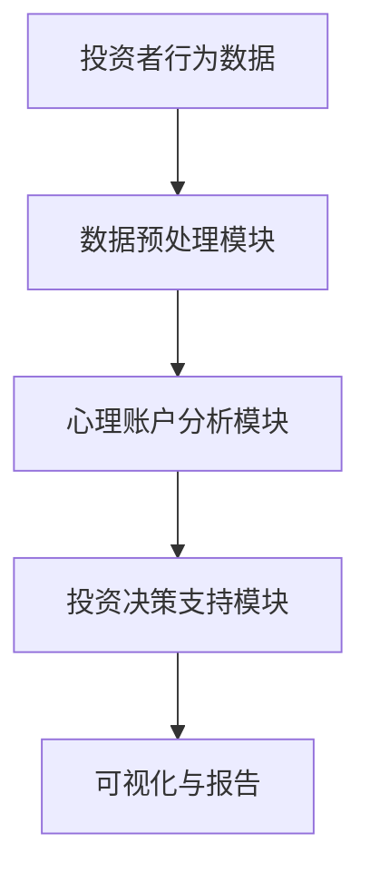
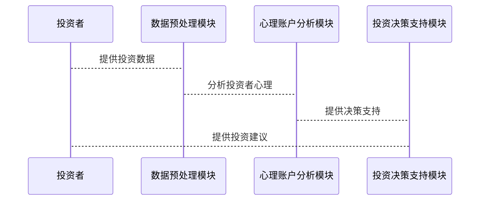

                 


# 价值投资中的心理因素：克服市场噪音

> 关键词：价值投资、心理因素、市场噪音、认知偏差、情绪管理、长期视角、投资纪律

> 摘要：价值投资不仅仅是对数字的分析，更是对心理因素的深刻理解与管理。本文将探讨认知偏差、情绪波动以及市场噪音如何影响投资决策，并提供克服这些挑战的方法与策略。通过建立长期视角、情绪管理和逆向思维，投资者可以更好地应对市场波动，实现稳健的投资收益。

---

## 目录

### 第一部分：价值投资中的心理因素概述

1. 价值投资与心理因素的背景
2. 认知偏差对投资决策的影响
3. 情绪与投资行为
4. 克服市场噪音的策略
5. 心理因素与投资行为的数学模型

---

### 第二部分：项目实战与系统架构

1. 项目实战：市场噪音下的投资决策
2. 系统架构：投资者心理分析框架

---

### 第三部分：总结与最佳实践

1. 总结：心理因素对投资的长期影响
2. 最佳实践：建立心理防御机制，克服市场噪音

---

### 附录

1. 心理账户理论的数学模型
2. 投资者心理分析框架的Mermaid图

---

## 正文

### 第一部分：价值投资中的心理因素概述

#### 第1章：价值投资与心理因素的背景

##### 1.1 价值投资的基本概念
价值投资是一种以基本面分析为基础的投资策略，强调以低于内在价值的价格购买优质资产。其核心理念是寻找市场先生的情绪化定价中的错误，并从中获利。

##### 1.2 心理因素在投资中的重要性
市场参与者的情绪波动、认知偏差以及外部噪音都会影响其决策过程。心理因素不仅是投资决策的重要组成部分，也是价值投资成功与否的关键因素。

---

#### 第2章：认知偏差对投资决策的影响

##### 2.1 确认偏差（Confirmation Bias）
确认偏差是指投资者倾向于寻找与自己观点一致的信息，而忽视相反的证据。这种偏差可能导致投资者坚持错误的投资决策。

##### 2.2 过度自信偏差（Overconfidence Bias）
过度自信偏差使投资者高估自己的分析能力，从而做出冒险性决策，忽视潜在风险。

##### 2.3 损失厌恶（Loss Aversion）
损失厌恶是指投资者更倾向于避免损失，而非追求收益。这种心理可能导致投资者在亏损时急于止损，错失长期收益机会。

---

#### 第3章：情绪与投资行为

##### 3.1 贪婪与恐惧
贪婪与恐惧是市场情绪的双刃剑。在市场上涨时，贪婪驱使投资者追高；在市场下跌时，恐惧促使投资者恐慌性抛售。

##### 3.2 市场情绪周期
市场情绪通常呈现周期性波动，从乐观到悲观，再到乐观。投资者需识别不同阶段的情绪特征，避免被市场情绪左右。

##### 3.3 情绪管理与投资纪律
制定明确的投资计划和纪律，可以帮助投资者在情绪波动中保持理性，避免冲动决策。

---

#### 第4章：克服市场噪音的策略

##### 4.1 识别与应对市场噪音
市场噪音包括媒体炒作、市场传言等。投资者需通过基本面分析筛选有效信息，避免被噪音干扰。

##### 4.2 逆向思维与独立思考
逆向思维是指在市场恐慌时寻找机会，在市场狂热时保持冷静。独立思考则要求投资者不盲目跟风，坚持自己的分析和判断。

##### 4.3 长期视角与短期波动的平衡
价值投资强调长期视角，关注企业的内在价值，而非短期价格波动。通过长期视角，投资者可以更好地应对短期市场噪音。

---

### 第二部分：项目实战与系统架构

#### 第5章：项目实战：市场噪音下的投资决策

##### 5.1 项目背景
假设某投资者在市场剧烈波动期间，面临是否卖出股票的决策。

##### 5.2 项目核心实现
1. **环境安装**：基于Python的量化分析工具，包括数据获取、分析和可视化模块。
2. **系统核心实现**：通过心理账户理论模型，分析投资者在不同市场阶段的心理变化。

##### 5.3 代码实现
```python
def calculate心理账户(收益, 损失):
    账户价值 = 收益 - 损失
    return 账户价值

# 示例
收益 = 10000
损失 = 2000
账户价值 = calculate心理账户(收益, 损失)
print("账户价值:", 账户价值)
```

##### 5.4 实际案例分析
以某次市场崩盘为例，分析投资者在恐慌情绪下的决策，并提出应对策略。

---

#### 第6章：系统架构：投资者心理分析框架

##### 6.1 系统功能设计
- 数据获取模块：收集市场数据和投资者情绪指标。
- 分析模块：基于心理账户理论，分析投资者的心理变化。
- 决策支持模块：提供投资建议和风险提示。

##### 6.2 系统架构设计


##### 6.3 系统交互设计


---

### 第三部分：总结与最佳实践

#### 第7章：总结

##### 7.1 心理因素对投资的长期影响
心理因素是价值投资成功的关键。通过克服认知偏差和情绪波动，投资者可以更理性地做出决策，抓住长期投资机会。

##### 7.2 最佳实践
- 建立长期视角，关注企业的内在价值。
- 制定投资纪律，避免被市场情绪左右。
- 通过逆向思维和独立思考，识别有效信息，避免市场噪音的干扰。

---

#### 7.3 作者信息

作者：AI天才研究院/AI Genius Institute & 禅与计算机程序设计艺术 /Zen And The Art of Computer Programming

---

通过以上结构，文章详细探讨了价值投资中的心理因素，结合理论分析、项目实战和系统架构设计，为投资者提供了克服市场噪音的有效策略和实践指导。

