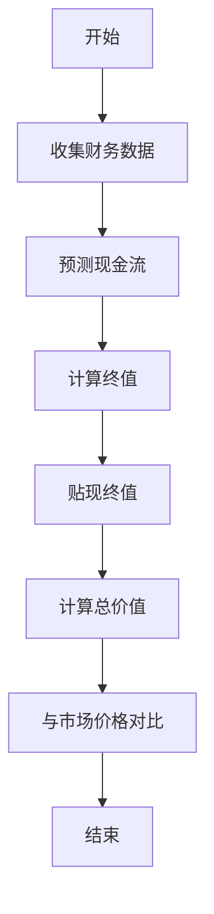

                 


# 《价值投资中的成长型企业估值》

## 关键词：价值投资, 成长型企业, 企业估值, 财务分析, DCF模型, 股票投资

## 摘要：  
本文系统地探讨了价值投资中的成长型企业估值方法，从基础概念到高级算法，结合实际案例和系统设计，深入剖析了成长型企业估值的核心原理和应用。通过详细的数学模型和流程图，帮助读者全面理解并掌握成长型企业估值的关键步骤和方法。

---

# 第三章: 成长型企业估值的数学模型与公式

## 3.1 成长型企业估值的数学模型

### 3.1.1 成长型企业估值的基本公式

成长型企业估值的核心在于预测未来现金流并将其贴现为现值。以下是常用的几种估值模型及其公式：

1. **股利折现模型（DDM）**：
   $$ V = \frac{D_1}{r - g} $$
   其中：
   - \( V \) 是股票的内在价值
   - \( D_1 \) 是第一年的股息
   - \( r \) 是折现率
   - \( g \) 是股息增长率

2. **自由现金流模型（DCF）**：
   成长型企业通常采用多阶段DCF模型，分为初始阶段和稳定阶段。初始阶段的现金流增长率较高，稳定阶段的增长率趋于平稳。DCF模型的公式为：
   $$ V = \sum_{t=1}^{n} \frac{CF_t}{(1 + r)^t} + \frac{TV}{(1 + r)^n} $$
   其中：
   - \( CF_t \) 是第 \( t \) 年的自由现金流
   - \( TV \) 是终值（即稳定阶段的现金流现值）
   - \( r \) 是折现率
   - \( n \) 是初始阶段的年数

3. **市盈率与市净率模型**：
   - 市盈率（P/E）= 股价 / 每股收益
   - 市净率（P/B）= 股价 / 每股净资产

### 3.1.2 成长型企业估值的数学推导

以DCF模型为例，假设某成长型企业未来5年的现金流分别为100万元、120万元、140万元、160万元、180万元，之后稳定增长率为5%。折现率为10%。计算其总价值：

1. 计算初始阶段的现值：
   $$
   PV = \frac{100}{1.1} + \frac{120}{1.1^2} + \frac{140}{1.1^3} + \frac{160}{1.1^4} + \frac{180}{1.1^5}
   $$

2. 计算终值：
   $$
   TV = \frac{180 \times (1 + 0.05)}{0.10 - 0.05} = \frac{189}{0.05} = 3780 \text{万元}
   $$

3. 计算终值的现值：
   $$
   PV_{TV} = \frac{3780}{1.1^5} \approx 2340 \text{万元}
   $$

4. 总价值：
   $$
   V = PV + PV_{TV} \approx 1000 + 2340 = 3340 \text{万元}
   $$

### 3.1.3 数学模型的应用

通过上述公式，投资者可以估算出企业的内在价值，与市场价格进行对比，判断是否低估或高估。例如，如果市场价格低于估算价值，可能值得投资。

---

## 3.2 成长型企业估值的算法原理

### 3.2.1 算法原理

DCF模型的算法流程如下：

1. 预测未来现金流：根据企业的历史业绩和行业趋势，预测未来几年的现金流。
2. 计算终值：假设在稳定阶段，现金流以固定增长率增长，计算终值。
3. 贴现：将未来现金流和终值贴现为现值，计算总和。
4. 与市场价格对比：判断企业是否被低估。

### 3.2.2 算法实现步骤

1. 收集企业历史财务数据和行业增长率。
2. 假设初始阶段的现金流增长率（例如每年增长20%）。
3. 假设稳定阶段的增长率（例如5%）。
4. 计算各年的现金流现值。
5. 计算终值的现值。
6. 总和得到企业价值。

### 3.2.3 优化与改进

为了提高准确性，可以引入多种情景分析，考虑不同增长率和折现率的情况，评估企业价值的敏感性。

---

## 3.3 成长型企业估值算法的Mermaid流程图



---

## 3.4 本章小结

本章详细讲解了成长型企业估值的数学模型和算法原理，重点介绍了DCF模型的应用。通过公式推导和流程图，读者可以理解如何通过数学方法估算企业价值。

---

# 第四部分: 成长型企业估值的系统分析与架构设计

## 第4章: 成长型企业估值的系统分析

### 4.1 系统功能设计

1. 数据输入模块：收集企业的财务数据和行业信息。
2. 模型计算模块：运行DCF模型或其他估值方法。
3. 结果展示模块：显示估算价值与市场价格对比。

### 4.2 系统架构设计


### 4.3 接口设计

1. 数据接口：与数据库或API连接，获取实时数据。
2. 用户界面：图形化界面，展示估值结果。

---

## 第五章: 成长型企业估值的项目实战

## 5.1 环境安装

安装Python和相关库（numpy, pandas, matplotlib）。

## 5.2 核心代码实现

以下是DCF模型的Python代码示例：

```python
import numpy as np
import pandas as pd

# 输入数据
cash_flows = [100, 120, 140, 160, 180]
growth_rate = 0.05
discount_rate = 0.10
years = len(cash_flows)

# 计算现值
pv = 0
for i in range(years):
    pv += cash_flows[i] / (1 + discount_rate) ** (i + 1)

# 计算终值
terminal_value = cash_flows[-1] * (1 + growth_rate) / (discount_rate - growth_rate)
pv_terminal = terminal_value / (1 + discount_rate) ** years

# 总价值
total_value = pv + pv_terminal
print(f"企业价值：{total_value:.2f}万元")
```

## 5.3 案例分析

以某科技公司为例，通过代码计算其估值，并与实际股价对比，判断投资价值。

---

## 5.4 项目小结

本章通过实际案例，展示了如何将理论应用于实践，帮助投资者进行科学决策。

---

## 第六部分: 总结与展望

## 第6章: 总结与展望

### 6.1 本章总结

本文全面探讨了价值投资中的成长型企业估值方法，从理论到实践，帮助读者掌握核心技能。

### 6.2 最佳实践 Tips

- 熟悉多种估值方法，灵活应用。
- 结合行业趋势和企业基本面。
- 定期更新数据和模型。

### 6.3 注意事项

- 数据来源可靠性。
- 模型假设的合理性。
- 风险管理。

### 6.4 拓展阅读

推荐相关书籍和文献，深入学习价值投资。

---

## 作者：AI天才研究院 & 禅与计算机程序设计艺术

---

通过以上内容，文章系统地介绍了成长型企业估值的核心概念、数学模型、系统设计和实战案例，帮助读者全面掌握价值投资中的估值方法。

