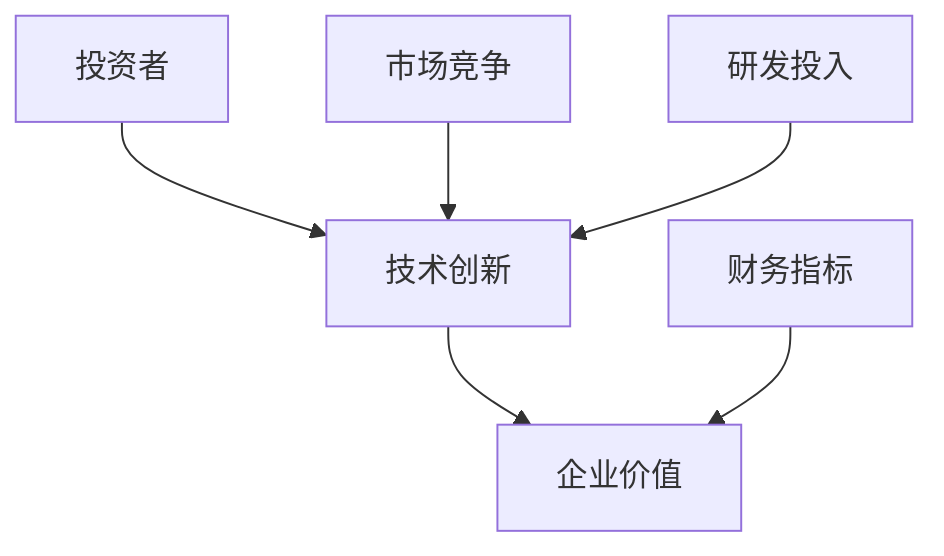

                 

# 价值投资中的技术创新评估

> 关键词：价值投资, 技术创新, 评估模型, 企业价值, 竞争优势

> 摘要：本文系统性地探讨了价值投资中的技术创新评估方法，从理论基础、核心概念、算法原理、系统架构到实际案例，全面解析了技术创新对企业价值的影响及其在投资决策中的应用。通过构建技术创新评估框架、设计数学模型、实现算法系统，本文为投资者提供了科学的评估工具和方法。

---

# 第1章: 价值投资中的技术创新评估背景

## 1.1 价值投资的核心概念
### 1.1.1 价值投资的定义与特点
价值投资是一种以长期视角为基础的投资策略，强调通过分析企业的基本面（如财务状况、盈利能力、市场地位等）来评估其内在价值。其核心在于识别被市场低估的企业，长期持有以实现资本增值。价值投资的关键特点包括：
- 长期视角：关注企业的长期价值，而非短期市场波动。
- 深度分析：通过详细分析企业财务、管理、市场等因素，评估其内在价值。
- 安全边际：强调以低于内在价值的价格买入，降低投资风险。

### 1.1.2 技术创新在价值投资中的地位
技术创新是企业竞争优势的重要来源。在现代商业环境中，技术创新不仅能够提升企业的生产效率、降低成本，还能拓展新的市场机会，增强企业的市场地位。因此，技术创新评估已成为价值投资的重要组成部分。技术创新对价值投资的影响体现在以下几个方面：
- **提升企业竞争力**：技术创新能够增强企业的市场地位，提高利润率。
- **降低投资风险**：通过技术创新评估，投资者可以更好地识别企业的核心竞争力。
- **创造长期价值**：技术创新是企业可持续发展的关键，能够为企业创造长期价值。

### 1.1.3 技术创新评估的必要性与意义
技术创新评估是价值投资中的关键环节。通过评估企业的技术创新能力，投资者可以更好地判断企业的未来发展前景。技术创新评估的意义包括：
- **识别高潜力企业**：通过评估企业的技术创新能力，投资者可以识别出那些具有持续创新能力的企业。
- **降低投资风险**：技术创新评估能够帮助投资者更好地识别企业的潜在风险。
- **提升投资回报**：通过技术创新评估，投资者可以更好地选择具有长期增长潜力的企业。

## 1.2 技术创新评估的背景与现状
### 1.2.1 价值投资中的技术驱动因素
随着科技的快速发展，技术创新已成为企业竞争力的核心。在价值投资中，技术创新是评估企业价值的重要因素之一。技术创新驱动企业发展的主要方式包括：
- **技术创新提升效率**：通过技术创新，企业可以提高生产效率，降低成本。
- **技术创新拓展市场**：技术创新能够帮助企业开发新产品，拓展新的市场。
- **技术创新增强竞争力**：技术创新是企业与竞争对手区别的重要因素。

### 1.2.2 技术创新对企业价值的影响
技术创新直接影响企业的盈利能力、市场地位和成长潜力。具体表现如下：
- **提高利润率**：通过技术创新，企业可以降低生产成本，提高产品附加值。
- **增强市场地位**：技术创新能够帮助企业获得竞争优势，提高市场份额。
- **增加企业估值**：技术创新是企业价值的重要组成部分，能够提高企业的整体估值。

### 1.2.3 当前技术创新评估的挑战与趋势
技术创新评估在实践中面临诸多挑战，包括：
- **数据获取难度**：技术创新评估需要大量的技术数据，但在实际操作中，这些数据往往难以获取。
- **评估方法的局限性**：传统的财务指标难以全面反映技术创新的价值。
- **动态变化的环境**：技术创新是一个动态的过程，企业需要不断适应新的技术环境。

当前，技术创新评估的趋势包括：
- **数据驱动的评估方法**：利用大数据和人工智能技术，提高技术创新评估的准确性。
- **多维度评估模型**：构建综合考虑技术、市场、财务等多个维度的评估模型。
- **动态评估方法**：采用动态评估方法，适应技术创新的快速变化。

## 1.3 技术创新评估的核心框架
### 1.3.1 技术创新评估的维度与指标
技术创新评估可以从多个维度进行，包括：
- **技术可行性**：评估技术创新的实现难度。
- **市场潜力**：评估技术创新的市场应用前景。
- **经济价值**：评估技术创新对企业的经济贡献。
- **竞争优势**：评估技术创新对企业竞争优势的影响。

### 1.3.2 技术创新与企业竞争力的关系
技术创新是企业竞争力的核心驱动力。技术创新能够提高企业的生产效率、降低成本、开发新产品、拓展市场，从而增强企业的竞争力。

### 1.3.3 技术创新评估的边界与外延
技术创新评估的边界包括：
- **技术范围**：明确技术创新的范围，避免评估范围过大或过小。
- **时间范围**：明确技术创新评估的时间范围，通常包括过去、现在和未来。
- **行业特点**：不同行业的技术创新评估侧重点不同，需要根据行业特点进行调整。

### 1.3.4 技术创新评估的核心要素对比
通过对比分析技术创新与企业竞争力的核心要素，可以更好地理解技术创新评估的重要性。以下是技术创新与企业竞争力的核心要素对比：

| **核心要素** | **技术创新** | **企业竞争力**
|---------------|---------------|----------------|
| 技术能力     | 技术研发能力 | 技术创新能力     |
| 市场表现     | 市场接受度     | 市场地位         |
| 成本控制     | 技术成本优势 | 成本优势         |
| 创新速度     | 技术研发速度 | 创新节奏         |

### 1.3.5 技术创新评估的ER实体关系图
以下是技术创新评估的ER实体关系图：

## 1.4 本章小结
本章从价值投资的核心概念出发，详细探讨了技术创新在价值投资中的地位和意义。通过分析技术创新对企业价值的影响，提出了技术创新评估的核心框架，并通过对比分析和技术创新评估的ER实体关系图，进一步明确了技术创新评估的重要性和复杂性。

---

接下来，我们将进入第2章，深入探讨技术创新评估的核心概念与联系。

