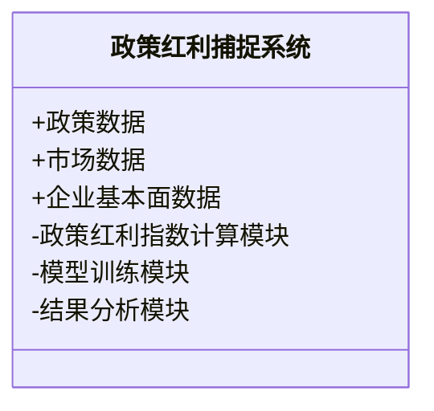
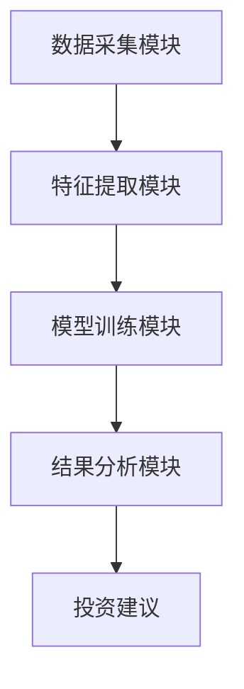
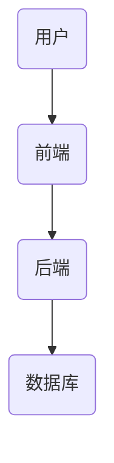
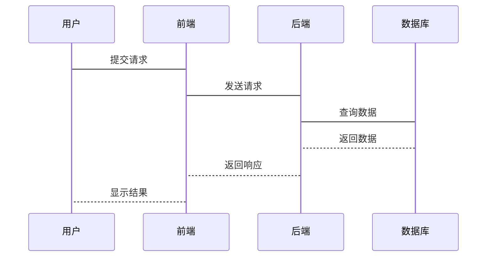

                 


# 价值投资中的政策红利捕捉

> 关键词：价值投资、政策红利、经济周期、投资策略、投资分析、投资风险管理

> 摘要：政策红利是价值投资中的重要影响因素，本文系统地探讨了如何捕捉政策红利，分析了政策红利的来源、类型及其对经济周期和行业选择的影响，详细介绍了政策红利捕捉的算法原理、系统架构设计以及项目实战案例。通过本篇文章，读者将能够掌握如何在价值投资中有效捕捉政策红利，制定科学的投资策略。

---

## 第一章: 价值投资与政策红利的背景介绍

### 1.1 价值投资的核心概念

#### 1.1.1 价值投资的定义与特点
价值投资是一种以基本面分析为基础的投资策略，旨在通过分析企业的内在价值，寻找市场价格低于其内在价值的投资机会。其核心思想是“买便宜货”，即买入被市场低估的资产。

#### 1.1.2 价值投资的基本原理
价值投资的基本原理包括：
- **安全边际**：买入价格低于内在价值，以确保足够的安全边际。
- **长期视角**：关注企业的长期价值，而非短期市场波动。
- **企业分析**：通过财务报表等手段，深入分析企业的盈利能力、成长性和风险。

#### 1.1.3 价值投资与政策红利的关系
政策红利是影响企业内在价值的重要外部因素。政策红利的出现往往会导致某些行业的市场需求增加、成本降低或竞争优势增强，从而提升企业的内在价值。

---

### 1.2 政策红利的定义与特点

#### 1.2.1 政策红利的定义
政策红利是指由于政策变化（如税收减免、行业补贴、放松管制等）带来的市场机会或企业价值提升。

#### 1.2.2 政策红利的类型与来源
政策红利的类型包括：
- **财政政策红利**：如税收减免、政府补贴。
- **货币政策红利**：如降低贷款利率、增加货币供应。
- **产业政策红利**：如行业扶持政策、技术创新补贴。

#### 1.2.3 政策红利的周期性分析
政策红利具有周期性，通常与经济周期密切相关。例如，在经济衰退期，政府往往会通过扩张性政策释放红利，以刺激经济增长。

---

### 1.3 价值投资如何捕捉政策红利

#### 1.3.1 政策红利在价值投资中的作用
政策红利可以通过以下方式影响价值投资：
- **提升企业价值**：政策红利可能降低企业成本或增加市场需求，从而提升企业的盈利能力。
- **影响市场情绪**：政策红利的出台可能提振市场信心，推动股价上涨。

#### 1.3.2 价值投资中的政策红利捕捉策略
- **行业选择**：优先选择受政策支持的行业。
- **企业筛选**：在政策支持的行业中，寻找具有竞争优势和估值低估的企业。
- **时间选择**：在政策红利释放的初期阶段介入，避免政策红利的透支。

---

## 第二章: 政策红利捕捉的核心概念与联系

### 2.1 政策红利的核心要素

#### 2.1.1 政策红利的来源分析
政策红利的来源包括：
- **政府政策**：如税收减免、补贴、行业准入放宽等。
- **经济周期**：经济衰退期或复苏期，政府往往通过政策红利刺激经济增长。

#### 2.1.2 政策红利的影响因素
政策红利的影响因素包括：
- **政策力度**：政策的强度直接影响红利的大小。
- **行业敏感性**：某些行业对政策变化更为敏感，政策红利的影响也更大。
- **市场反应**：市场对政策红利的反应速度和程度影响投资机会的窗口期。

#### 2.1.3 政策红利的传导机制
政策红利的传导机制可以分为以下几步：
1. 政策出台 → 2. 影响企业成本或收入 → 3. 提升企业盈利能力 → 4. 提高企业内在价值 → 5. 推动股价上涨。

---

### 2.2 政策红利与经济周期的关系

#### 2.2.1 经济周期的定义与阶段
经济周期包括衰退、复苏、繁荣和衰退四个阶段。

#### 2.2.2 政策红利在不同经济周期的表现
- **衰退期**：政府通常会出台扩张性政策，释放政策红利。
- **复苏期**：政策红利逐渐显现，市场信心恢复。
- **繁荣期**：政策红利可能逐渐减少，市场趋于饱和。

#### 2.2.3 政策红利对经济周期的影响
政策红利可以通过刺激需求、降低企业成本等方式，推动经济从衰退期向复苏期过渡。

---

### 2.3 政策红利与行业选择的关系

#### 2.3.1 行业选择的基本原则
价值投资者在选择行业时，应关注行业的政策敏感性和政策红利的可持续性。

#### 2.3.2 政策红利对行业选择的影响
- **政策支持行业**：如新能源、科技创新等领域，往往具有较大的政策红利。
- **政策限制行业**：如传统制造业、高污染行业，政策红利较小，甚至可能面临政策限制。

#### 2.3.3 行业选择的策略优化
- **行业筛选**：优先选择政策支持的行业。
- **行业分析**：分析行业的政策敏感性和政策红利的持续性。

---

## 第三章: 政策红利捕捉的算法原理

### 3.1 政策红利捕捉的算法概述

#### 3.1.1 算法的目标与核心思想
政策红利捕捉算法的目标是通过分析政策变化和市场反应，找出具有政策红利的行业和企业。

#### 3.1.2 算法的输入与输出
- **输入**：政策变化数据、市场数据、企业基本面数据。
- **输出**：具有政策红利的行业和企业列表。

#### 3.1.3 算法的适用场景
适用于经济周期波动较大、政策变化频繁的市场环境。

---

### 3.2 政策红利捕捉的算法流程

#### 3.2.1 数据收集与预处理
- **数据收集**：收集政策变化、市场数据和企业基本面数据。
- **数据预处理**：清洗数据、处理缺失值、标准化数据。

#### 3.2.2 数据特征提取
- **政策特征**：政策变化的强度、频率、行业覆盖范围。
- **市场特征**：股价波动、成交量、市场情绪。
- **企业特征**：盈利能力、成长性、估值水平。

#### 3.2.3 模型训练与优化
- **模型选择**：使用回归模型、时间序列模型等。
- **模型优化**：通过交叉验证、参数调优等方法优化模型。

#### 3.2.4 结果分析与验证
- **结果分析**：分析模型预测的准确性。
- **结果验证**：验证模型在实际市场中的表现。

---

### 3.3 算法的数学模型与公式

#### 3.3.1 数据特征提取的数学公式
政策红利指数可以表示为：
$$
\text{政策红利指数} = \sum_{i=1}^{n} w_i \cdot x_i
$$
其中，$w_i$ 是第$i$个特征的权重，$x_i$ 是第$i$个特征的值。

#### 3.3.2 模型训练的数学公式
线性回归模型可以表示为：
$$
y = \beta_0 + \beta_1 x_1 + \beta_2 x_2 + \ldots + \beta_k x_k + \epsilon
$$
其中，$y$ 是目标变量，$x_i$ 是自变量，$\beta_i$ 是回归系数，$\epsilon$ 是误差项。

#### 3.3.3 结果分析的数学公式
假设我们预测某行业的政策红利指数为：
$$
\text{预测值} = \text{实际值} + \text{误差}
$$
误差越小，模型的预测能力越强。

---

## 第四章: 政策红利捕捉的系统分析与架构设计

### 4.1 系统分析

#### 4.1.1 问题场景介绍
系统需要解决的问题是：如何通过政策变化和市场数据，捕捉具有政策红利的行业和企业。

#### 4.1.2 项目目标与范围
- **目标**：构建一个能够自动捕捉政策红利的系统。
- **范围**：包括数据采集、模型训练、结果分析等功能。

#### 4.1.3 项目需求分析
- **功能需求**：数据采集、特征提取、模型训练、结果分析。
- **性能需求**：系统需要高效处理大量数据。

---

### 4.2 系统功能设计

#### 4.2.1 领域模型设计


#### 4.2.2 功能模块划分
- **数据采集模块**：负责采集政策、市场和企业数据。
- **特征提取模块**：提取数据特征，为模型训练提供输入。
- **模型训练模块**：训练模型，预测政策红利指数。
- **结果分析模块**：分析模型预测结果，生成投资建议。

#### 4.2.3 功能流程设计


---

### 4.3 系统架构设计

#### 4.3.1 系统架构图


#### 4.3.2 模块间接口设计
- **前端与后端接口**：用户输入请求，后端返回结果。
- **后端与数据库接口**：后端读取数据，数据库存储数据。

#### 4.3.3 系统交互设计


---

## 第五章: 政策红利捕捉的项目实战

### 5.1 项目环境安装

#### 5.1.1 系统环境要求
- 操作系统：Windows、Linux 或 macOS。
- 开发工具：Python、Jupyter Notebook。
- 数据库：MySQL、PostgreSQL。

#### 5.1.2 软件工具安装
- 安装 Python 和相关库（如 pandas、numpy、scikit-learn）。

#### 5.1.3 数据源获取
- 数据来源：政府政策公告、股票数据、企业财务报表。

---

### 5.2 系统核心实现

#### 5.2.1 数据预处理代码
```python
import pandas as pd

# 加载数据
policy_data = pd.read_csv('policy.csv')
market_data = pd.read_csv('market.csv')
financial_data = pd.read_csv('financial.csv')

# 数据清洗
policy_data.dropna(inplace=True)
market_data.dropna(inplace=True)
financial_data.dropna(inplace=True)

# 数据合并
merged_data = pd.merge(policy_data, market_data, on='date')
merged_data = pd.merge(merged_data, financial_data, on='date')
```

#### 5.2.2 特征提取代码
```python
# 提取政策特征
policy_features = merged_data[['policy_index', 'policy_strength']]
# 提取市场特征
market_features = merged_data[['market_value', 'volume']]
# 提取企业特征
financial_features = merged_data[['profit_margin', 'growth_rate']]
```

#### 5.2.3 模型训练代码
```python
from sklearn.linear_model import LinearRegression

# 训练模型
model = LinearRegression()
model.fit(policy_features, market_features)

# 预测结果
predictions = model.predict(policy_features)
```

---

### 5.3 项目小结

#### 5.3.1 项目总结
通过本项目，我们成功构建了一个能够捕捉政策红利的系统，为价值投资者提供了有力的工具。

#### 5.3.2 投资建议
- **行业选择**：优先选择政策支持的行业。
- **企业筛选**：在政策支持的行业中，选择具有竞争优势和估值低估的企业。
- **时间选择**：在政策红利释放的初期阶段介入。

#### 5.3.3 注意事项
- 政策红利具有周期性，需密切关注政策变化。
- 模型预测结果仅供参考，需结合实际情况进行调整。

#### 5.3.4 拓展阅读
- 《价值投资：从格雷厄姆到巴菲特》
- 《政策经济学：理论与实践》

---

## 总结与最佳实践

### 总结
政策红利是价值投资中的重要影响因素，通过系统地捕捉政策红利，投资者可以更好地制定投资策略，提升投资收益。

### 最佳实践
- **持续学习**：密切关注政策变化和市场动态。
- **模型优化**：根据市场变化不断优化模型。
- **风险管理**：合理控制投资风险，避免过度集中投资。

---

## 作者

作者：AI天才研究院/AI Genius Institute & 禅与计算机程序设计艺术 /Zen And The Art of Computer Programming

