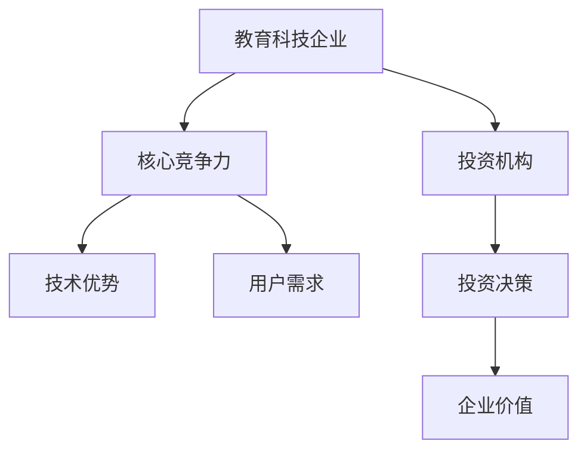

                 


# 价值投资中的教育科技趋势分析

> 关键词：价值投资，教育科技，趋势分析，技术驱动，投资策略，教育模式变革

> 摘要：本文从教育科技的发展历程、核心概念、算法原理、系统架构、项目实战及最佳实践等多个维度，详细分析了教育科技领域的投资趋势。通过技术驱动的教育模式变革，结合价值投资的基本原理，探讨了教育科技企业的核心竞争力、投资策略及未来发展趋势，为投资者提供了深入的分析和实践指导。

---

# 第一部分：教育科技与价值投资的背景与概念

## 第1章：教育科技的发展历程

### 1.1 教育科技的演变

#### 1.1.1 从传统教育到在线教育的演变
- **传统教育模式**：以线下课堂为主，教师主导知识传递，学生被动接受。
- **在线教育的兴起**：互联网技术的发展推动了在线教育的普及，MOOC（大规模开放式在线课程）平台的兴起。
- **智能教育时代的特征**：人工智能、大数据、区块链等技术的深度融合，实现个性化学习、智能化教学管理和数据驱动的教育决策。

#### 1.1.2 在线教育的兴起与技术驱动
- 技术驱动的在线教育模式：视频直播、录播课程、在线互动课堂。
- 技术对教育的深远影响：个性化学习路径、智能化评估系统、数据驱动的教育决策。

#### 1.1.3 智能教育时代的特征
- **个性化学习**：通过AI算法分析学生的学习行为，提供定制化学习方案。
- **智能化教学管理**：利用大数据和人工智能优化教学资源分配，提高教学效率。
- **数据驱动的教育决策**：通过数据挖掘和分析，帮助教育机构优化运营策略。

### 1.2 教育科技的核心概念

#### 1.2.1 教育科技的定义与内涵
- 教育科技（EdTech）：通过技术手段优化教育过程、提升教育效果和效率的创新解决方案。
- 核心内涵：技术与教育的深度融合，推动教育模式的创新和教育效率的提升。

#### 1.2.2 教育科技与传统教育的对比
- **教学方式**：从单向传授到双向互动。
- **学习体验**：从被动接受到主动参与。
- **资源利用**：从有限资源到无限扩展。

#### 1.2.3 教育科技的未来发展趋势
- 技术与教育的深度融合：人工智能、区块链、虚拟现实等技术在教育领域的广泛应用。
- 个性化学习的普及：通过AI算法实现精准教学和个性化学习方案。
- 教育资源的共享与优化：技术驱动教育资源的高效分配和利用。

### 1.3 价值投资的基本概念

#### 1.3.1 价值投资的定义与原则
- 价值投资：基于对公司基本面的深入分析，寻找被市场低估的投资标的。
- 核心原则：长期主义、安全边际、内在价值。

#### 1.3.2 价值投资的核心理念
- 投资的本质：寻找具有持续竞争优势和良好发展前景的企业。
- 投资的关键：分析企业的财务状况、行业地位、盈利能力和发展潜力。

#### 1.3.3 教育科技领域的投资机会
- 技术驱动的教育模式变革带来的投资机会。
- 教育科技企业的核心竞争力分析。

### 1.4 教育科技与价值投资的结合

#### 1.4.1 教育科技领域的投资逻辑
- **行业趋势**：技术驱动的教育模式变革，推动教育行业的升级和转型。
- **企业分析**：分析教育科技企业的核心竞争力、技术优势、市场地位和盈利能力。
- **投资策略**：基于价值投资理念，寻找具有长期竞争优势的教育科技企业。

#### 1.4.2 教育科技企业的核心竞争力分析
- **技术优势**：人工智能、大数据等技术的应用能力。
- **用户需求**：满足个性化学习需求的能力。
- **市场定位**：在教育科技市场中的定位和竞争优势。

#### 1.4.3 价值投资在教育科技中的应用前景
- **技术驱动的教育模式变革**：技术进步带来的投资机会。
- **教育科技企业的长期价值**：基于技术优势和市场地位的长期价值评估。

## 第2章：教育科技的核心概念与联系

### 2.1 教育科技的核心概念原理

#### 2.1.1 教育科技的三要素模型
- **技术要素**：人工智能、大数据、区块链等技术。
- **教育要素**：教学内容、教学方法、教学目标。
- **用户要素**：学生、教师、家长的需求和行为。

#### 2.1.2 技术驱动的教育模式变革
- **教学方式的转变**：从传统课堂到在线教育的演变。
- **学习体验的提升**：个性化学习、智能化评估。
- **教育资源的优化**：技术驱动的资源分配和共享。

#### 2.1.3 教育科技的生态系统构建
- **生态系统构成**：教育科技企业、技术供应商、用户、投资机构。
- **生态系统的协同效应**：技术与教育的深度融合，推动教育行业的整体升级。

### 2.2 核心概念属性特征对比表格

| **核心概念**       | **传统教育**         | **在线教育**         | **智能教育**         |
|--------------------|----------------------|----------------------|----------------------|
| **教学方式**       | 线下课堂为主         | 在线课程为主         | 个性化学习为主       |
| **技术应用**       | 有限技术应用         | 视频直播、录播课程     | 人工智能、大数据     |
| **用户需求**       | 被动接受             | 主动学习             | 自主学习、精准需求   |
| **资源利用**       | 有限资源             | 资源共享             | 资源优化、无限扩展   |

### 2.3 ER实体关系图架构



---

# 第二部分：教育科技领域的算法原理讲解

## 第3章：教育科技企业的价值预测算法

### 3.1 教育科技企业的价值预测算法

#### 3.1.1 价值预测的数学模型
- **线性回归模型**：用于预测企业的销售收入和利润。
  $$ y = \beta_0 + \beta_1 x + \epsilon $$
  其中，$y$ 是目标变量（企业价值），$x$ 是自变量（企业收入、利润等），$\beta_0$ 和 $\beta_1$ 是回归系数，$\epsilon$ 是误差项。

#### 3.1.2 时间序列分析
- **ARIMA模型**：用于分析教育科技企业的历史数据，预测未来价值。
  $$ ARIMA(p, d, q) $$
  其中，$p$ 是自回归阶数，$d$ 是差分阶数，$q$ 是移动平均阶数。

#### 3.1.3 机器学习算法
- **随机森林回归**：用于处理高维数据，预测企业的价值。
  ```python
  from sklearn.ensemble import RandomForestRegressor
  model = RandomForestRegressor(n_estimators=100, random_state=42)
  model.fit(X_train, y_train)
  ```

#### 3.1.4 代码实现与结果分析
- 数据预处理：清洗数据、特征选择。
- 模型训练：使用训练数据训练模型。
- 模型预测：预测企业的未来价值。
- 结果分析：对比实际值和预测值，评估模型的准确性。

---

## 第4章：教育科技领域的投资策略与系统设计

### 4.1 教育科技领域的投资策略

#### 4.1.1 基于技术优势的投资策略
- 选择具有技术优势的企业，关注企业的研发投入和技术团队。
- 分析企业的技术专利和技术创新能力。

#### 4.1.2 基于用户需求的投资策略
- 关注用户需求的变化，选择能够满足个性化学习需求的企业。
- 分析企业的用户增长率和用户留存率。

#### 4.1.3 基于市场定位的投资策略
- 选择在教育科技市场中有明确市场定位和竞争优势的企业。
- 分析企业的市场占有率和竞争对手情况。

### 4.2 教育科技领域的系统架构设计

#### 4.2.1 系统功能设计
- **数据采集模块**：收集教育科技企业的财务数据、市场数据和用户数据。
- **数据分析模块**：对数据进行清洗、特征提取和建模分析。
- **数据可视化模块**：将分析结果以图表形式展示，便于投资者理解和决策。

#### 4.2.2 系统架构设计
- **前端架构**：用户界面设计，包括数据可视化界面和交互界面。
- **后端架构**：数据处理逻辑，包括数据采集、分析和预测。
- **数据存储**：数据库设计，包括结构化数据和非结构化数据的存储。

---

## 第5章：教育科技领域的项目实战

### 5.1 教育科技领域的项目实战

#### 5.1.1 项目背景
- 选择一家教育科技企业作为分析对象，基于价值投资的理念，分析其投资价值。

#### 5.1.2 项目环境
- 数据来源：企业财务数据、行业数据和市场数据。
- 工具安装：Python、Pandas、Scikit-learn、Matplotlib。

#### 5.1.3 项目实现
- 数据采集：收集企业的历史财务数据和市场数据。
- 数据分析：使用回归分析和时间序列分析模型预测企业的未来价值。
- 数据可视化：将分析结果以图表形式展示，包括收入预测、利润预测和价值评估。

#### 5.1.4 项目结果
- 分析结果：企业的未来价值预测。
- 投资建议：基于分析结果，提出投资建议。

---

## 第6章：教育科技领域的最佳实践与小结

### 6.1 教育科技领域的最佳实践

#### 6.1.1 投资策略
- 长期价值投资：关注企业的长期竞争优势和市场地位。
- 风险管理：分散投资、设置止损点。

#### 6.1.2 系统设计
- 数据驱动的决策：基于数据的分析结果进行投资决策。
- 技术与教育的深度融合：关注技术驱动的教育模式变革。

### 6.2 小结

教育科技领域的投资机会和技术驱动的教育模式变革为投资者提供了新的思路。基于价值投资的理念，通过技术分析和数据驱动的决策，投资者可以找到具有长期竞争优势的教育科技企业。同时，教育科技的未来发展趋势也为投资者提供了丰富的投资机会。

---

作者：AI天才研究院/AI Genius Institute & 禅与计算机程序设计艺术 /Zen And The Art of Computer Programming

---

通过以上思考过程，我们得出了一个详细且逻辑清晰的文章结构，涵盖了教育科技与价值投资的核心概念、算法原理、系统设计和项目实战等多个方面。接下来，我将根据以上结构撰写完整的文章内容，确保每部分都详细展开，内容丰富且有深度。

