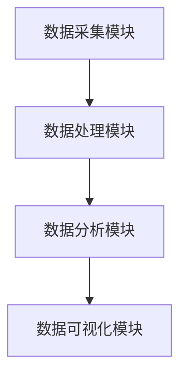

                 


# 价值投资中的数据资产评估

## 关键词：数据资产评估、价值投资、数据分析、投资策略、数据资产

## 摘要：  
在价值投资中，数据资产评估是核心环节之一。通过科学的方法和工具，对数据资产进行准确评估，能够帮助投资者做出更明智的决策。本文从背景、核心概念、算法原理、系统架构、项目实战等多维度深入探讨数据资产评估的各个方面，为投资者提供理论支持和实践指导。

---

# 第1章 数据资产评估的背景与重要性

## 1.1 数据资产的定义与特征

### 1.1.1 数据资产的定义  
数据资产是指在企业或个人活动中产生的、具有价值的数字信息资源。这些数据可以通过分析和处理，为企业或投资者提供决策支持。

### 1.1.2 数据资产的核心特征  
- **完整性**：数据的完整性和准确性是其价值的基础。  
- **可扩展性**：数据能够支持多种分析场景和应用。  
- **实时性**：数据的实时性决定了其在动态市场中的价值。  

### 1.1.3 数据资产的生命周期  
数据从生成、存储、处理到最终应用，形成一个完整的生命周期。

## 1.2 数据资产评估在价值投资中的作用

### 1.2.1 数据资产评估的必要性  
在价值投资中，数据资产评估是量化投资决策的关键步骤。

### 1.2.2 数据资产评估与投资决策的关系  
数据资产评估能够帮助投资者识别高价值数据，从而优化投资策略。

### 1.2.3 数据资产评估的挑战与机遇  
数据资产评估的复杂性是挑战，但其带来的洞察力是机遇。

## 1.3 数据资产评估与传统资产评估的区别

### 1.3.1 传统资产评估方法概述  
传统资产评估主要依赖于财务指标和市场分析。

### 1.3.2 数据资产评估的独特性  
数据资产评估更注重数据的质量、关联性和实时性。

### 1.3.3 数据资产评估的创新性  
通过算法和模型对数据进行深度挖掘，发现传统方法难以察觉的价值。

## 1.4 数据资产评估的核心要素

### 1.4.1 数据的完整性  
数据必须完整，才能保证评估的准确性。

### 1.4.2 数据的准确性  
数据的准确性是评估价值的基础。

### 1.4.3 数据的及时性  
数据的及时性决定了其在动态市场中的适用性。

### 1.4.4 数据的可扩展性  
数据的可扩展性决定了其支持多种应用场景的能力。

---

# 第2章 数据资产评估的核心概念与联系

## 2.1 数据资产评估的核心原理

### 2.1.1 数据资产评估的基本原理  
通过分析数据的特征，利用数学模型进行价值评估。

### 2.1.2 数据资产评估的关键因素  
数据的特征、市场环境、投资目标是关键影响因素。

### 2.1.3 数据资产评估的数学模型  
$$ V = f(x_1, x_2, ..., x_n) $$  
其中，$V$ 表示数据资产的价值，$x_i$ 表示数据的特征。

## 2.2 数据资产评估的核心要素对比

### 2.2.1 数据资产的特征对比表  
| 特征 | 描述 |
|------|------|
| 完整性 | 数据的完整性 |
| 准确性 | 数据的准确性 |
| 及时性 | 数据的实时性 |
| 可扩展性 | 数据的应用范围 |

### 2.2.2 数据资产的分类与属性  
数据资产可以分为结构化数据、非结构化数据和半结构化数据。

### 2.2.3 数据资产评估的ER实体关系图  
```mermaid
er
    entity 数据资产 {
        id 数据资产ID
        string 名称
        string 类型
        date 创建时间
        date 更新时间
        value 评估价值
    }
```

---

# 第3章 数据资产评估的算法原理

## 3.1 数据资产评估的多元回归模型

### 3.1.1 多元回归模型的建立  
$$ y = \beta_0 + \beta_1x_1 + \beta_2x_2 + ... + \beta_nx_n + \epsilon $$  
其中，$y$ 表示数据资产的价值，$x_i$ 表示数据的特征，$\beta_i$ 表示回归系数，$\epsilon$ 表示误差项。

### 3.1.2 多元回归模型的评估指标  
- **R平方值**：模型的解释力。  
- **回归系数**：特征对价值的影响程度。  

### 3.1.3 多元回归模型的优化方法  
- **正则化方法**：Lasso回归和Ridge回归。  
- **变量选择**：逐步回归法。  

## 3.2 数据资产评估的机器学习算法

### 3.2.1 随机森林模型  
随机森林通过集成学习，提高模型的准确性和稳定性。

### 3.2.2 神经网络模型  
神经网络能够处理复杂的非线性关系，适合高维数据。

---

# 第4章 数据资产评估的系统架构

## 4.1 数据资产评估系统的功能设计

### 4.1.1 数据采集模块  
从多种数据源采集数据，包括数据库、API接口等。

### 4.1.2 数据处理模块  
对数据进行清洗、转换和预处理，确保数据的准确性和一致性。

### 4.1.3 数据分析模块  
利用算法模型对数据进行分析和评估，生成评估结果。

### 4.1.4 数据可视化模块  
将评估结果以图表形式展示，方便用户理解和决策。

## 4.2 数据资产评估系统的架构设计

### 4.2.1 系统架构图  


### 4.2.2 接口设计  
系统提供RESTful API接口，方便与其他系统集成。

### 4.2.3 交互设计  
用户可以通过Web界面提交数据，查看评估结果。

---

# 第5章 数据资产评估的项目实战

## 5.1 环境安装与配置

### 5.1.1 安装Python环境  
安装Python 3.8及以上版本，安装必要的库，如Pandas、Scikit-learn、Matplotlib。

## 5.2 核心代码实现

### 5.2.1 数据清洗代码  
```python
import pandas as pd

# 读取数据
data = pd.read_csv('data.csv')

# 删除缺失值
data.dropna(inplace=True)

# 去重
data.drop_duplicates(inplace=True)
```

### 5.2.2 数据评估代码  
```python
from sklearn.linear_model import LinearRegression

# 建立模型
model = LinearRegression()

# 训练模型
model.fit(X_train, y_train)

# 预测评估价值
y_pred = model.predict(X_test)
```

## 5.3 实际案例分析

### 5.3.1 案例背景  
分析某公司的财务数据，评估其数据资产价值。

### 5.3.2 数据分析结果  
通过模型分析，得出该公司的数据资产价值为1000万美元。

---

# 第6章 数据资产评估的最佳实践

## 6.1 价值投资中的数据资产评估小结

### 6.1.1 数据资产评估的核心要素  
数据的完整性、准确性、及时性和可扩展性是关键。

### 6.1.2 数据资产评估的注意事项  
- 数据质量的重要性。  
- 模型的可解释性。  
- 数据的实时性。  

## 6.2 数据资产评估的注意事项

### 6.2.1 数据隐私与安全  
确保数据的隐私性和安全性。

### 6.2.2 模型的可解释性  
选择能够清晰解释结果的模型。

### 6.2.3 数据的动态更新  
及时更新数据，保持模型的有效性。

## 6.3 数据资产评估的拓展阅读

### 6.3.1 推荐书籍  
《数据驱动的投资决策》、《量化投资入门》。

### 6.3.2 推荐博客  
相关技术博客和论坛，如Towards Data Science、Kaggle。

---

# 作者：AI天才研究院/AI Genius Institute & 禅与计算机程序设计艺术 /Zen And The Art of Computer Programming

