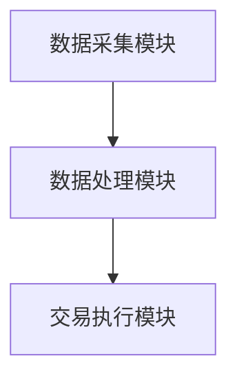
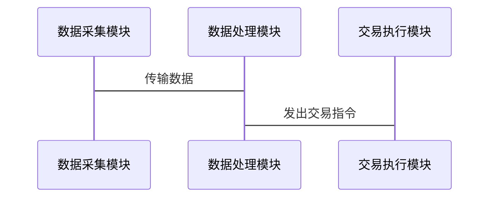

                 


# 价值投资中的新一代光子集成电路技术

> 关键词：光子集成电路、价值投资、高频交易、数据分析、金融风险管理

> 摘要：本文深入探讨了新一代光子集成电路技术在价值投资中的应用，从技术背景、核心原理到系统架构，再到实际项目实战，全面解析光子集成电路如何革新金融市场的数据分析与交易方式，为投资者提供更高效、更精准的投资决策支持。

---

# 第一部分: 价值投资中的新一代光子集成电路技术概述

## 第1章: 光子集成电路技术的背景与价值

### 1.1 光子集成电路技术的定义与特点

#### 1.1.1 光子集成电路的基本概念
光子集成电路（Photonic Integrated Circuit, PIC）是一种将光子元件（如激光器、光调制器、光探测器等）与电子元件集成在同一芯片上的技术。其核心在于利用光的高速性和并行性，实现数据的高效处理和传输。

#### 1.1.2 光子集成电路的核心特点
- **高速性**：光信号的传输速度远超电子信号，适合高频交易和实时数据分析。
- **低延迟**：光子集成电路能够在极短时间内完成数据处理和传输，减少交易中的时间损失。
- **高带宽**：光子集成电路支持并行数据传输，能够处理海量金融数据。
- **低能耗**：相比传统电子集成电路，光子集成电路在数据处理过程中能耗更低。

#### 1.1.3 光子集成电路与传统电子集成电路的区别
| 特性       | 光子集成电路           | 传统电子集成电路       |
|------------|-----------------------|-------------------------|
| 信号类型   | 光信号                | 电信号                  |
| 传输速度   | 极高                  | 较低                   |
| 能耗       | 低                   | 较高                   |
| 并行能力   | 强                   | 较弱                   |

---

### 1.2 价值投资中的技术驱动因素

#### 1.2.1 价值投资的基本原理
价值投资是一种基于对公司内在价值评估的投资策略，通过分析公司的财务状况、行业地位、竞争优势等因素，找到被市场低估的投资标的。

#### 1.2.2 光子集成电路技术对金融市场的潜在影响
光子集成电路技术的引入将显著提升金融市场的数据处理能力，特别是在高频交易和实时数据分析方面，为价值投资者提供更精准的市场洞察。

#### 1.2.3 技术驱动的金融创新与投资机会
光子集成电路技术的应用将推动金融市场的技术革新，例如：
- **实时数据分析**：通过光子集成电路快速处理海量市场数据，帮助投资者捕捉市场趋势。
- **低延迟交易**：光子集成电路的高速性和低延迟特性，使高频交易成为可能，为投资者创造更多的交易机会。

---

### 1.3 光子集成电路技术的现状与发展趋势

#### 1.3.1 全球光子集成电路技术的发展现状
目前，光子集成电路技术在全球范围内得到了广泛应用，尤其是在通信、医疗和金融领域。

#### 1.3.2 光子集成电路技术的主要驱动力
- **技术进步**：光子集成电路制造工艺的不断优化，使其性能不断提升。
- **市场需求**：金融市场的高频交易和实时数据分析需求，推动了光子集成电路技术的发展。
- **政策支持**：各国政府对高新技术的支持，为光子集成电路技术的发展提供了资金和政策保障。

#### 1.3.3 未来光子集成电路技术的发展趋势
- **集成化**：进一步将光子元件与电子元件集成，提高芯片的性能。
- **智能化**：结合人工智能技术，实现光子集成电路的智能数据处理。
- **成本下降**：随着制造技术的进步，光子集成电路的成本将逐步降低，进一步扩大其应用范围。

---

## 第2章: 光子集成电路技术的核心原理

### 2.1 光子集成电路的基本结构

#### 2.1.1 光子集成电路的组成要素
- **激光器**：用于生成光信号。
- **光调制器**：用于调制光信号。
- **光探测器**：用于接收和检测光信号。
- **光波导**：用于传输光信号。

#### 2.1.2 光子集成电路的材料特性
光子集成电路的核心材料是氮化硅（SiN）和硅（Si），这些材料具有良好的光学特性和优异的导电性。

#### 2.1.3 光子集成电路的制造工艺
光子集成电路的制造工艺包括光刻、沉积和封装等步骤。

---

### 2.2 光子集成电路的信号传输与处理

#### 2.2.1 光信号的传播特性
光信号在光波导中的传播速度是光速，约为 $3 \times 10^8$ 米/秒。

#### 2.2.2 光信号的调制与解调
调制过程：将数字信号加载到光信号上，通过电光调制器完成。
解调过程：通过光电探测器将光信号转换为电信号，恢复原始数字信号。

#### 2.2.3 光信号的放大与滤波
光信号的放大通常通过光放大器实现，滤波则通过光滤波器完成。

---

### 2.3 光子集成电路的性能优化

#### 2.3.1 光子集成电路的功耗优化
通过优化电路设计和制造工艺，降低光子集成电路的功耗。

#### 2.3.2 光子集成电路的散热设计
采用先进的封装技术和散热材料，确保芯片在高负载下的稳定运行。

#### 2.3.3 光子集成电路的封装技术
采用微型封装技术，减少芯片体积，提高集成度。

---

## 第3章: 光子集成电路技术在金融领域的应用

### 3.1 高频交易中的光子集成电路技术

#### 3.1.1 高频交易的基本原理
高频交易是指在极短时间内完成大量的交易操作，通常基于算法交易策略。

#### 3.1.2 光子集成电路技术在高频交易中的优势
- **低延迟**：光子集成电路的低延迟特性使高频交易成为可能。
- **高速数据处理**：光子集成电路能够快速处理海量交易数据。

#### 3.1.3 光子集成电路技术在高频交易中的具体应用
通过光子集成电路实现毫秒级的交易响应，显著提高交易效率。

---

### 3.2 数据处理与分析中的光子集成电路技术

#### 3.2.1 大数据分析的基本原理
大数据分析通过对海量数据的处理和挖掘，发现数据中的潜在规律。

#### 3.2.2 光子集成电路技术在大数据分析中的应用
- **实时数据处理**：光子集成电路能够实时处理金融市场的海量数据。
- **并行计算**：光子集成电路的并行处理能力显著提升数据分析效率。

#### 3.2.3 光子集成电路技术对金融数据处理效率的提升
通过并行计算和高速数据传输，光子集成电路技术使金融数据的处理效率提升了数倍。

---

### 3.3 金融风险管理中的光子集成电路技术

#### 3.3.1 金融风险管理的基本原理
金融风险管理是指通过识别、评估和控制金融市场的风险，降低投资损失。

#### 3.3.2 光子集成电路技术在金融风险管理中的应用
- **实时风险监控**：通过光子集成电路实时监控市场风险。
- **快速响应**：光子集成电路能够快速响应市场变化，降低风险敞口。

#### 3.3.3 光子集成电路技术对金融风险管理效率的提升
通过实时监控和快速响应，光子集成电路技术显著提升了金融风险管理的效率。

---

## 第4章: 光子集成电路技术的数学模型与算法原理

### 4.1 光子集成电路技术的数学模型

#### 4.1.1 光子集成电路的物理模型
光子集成电路的物理模型包括光波导、光调制器和光探测器等部分。

#### 4.1.2 光子集成电路的数学表达式
光信号在光波导中的传播可以用以下公式描述：
$$
E(x, t) = E_0 \cdot e^{i(kx - \omega t)}
$$

其中，$E(x, t)$ 是光场的幅度，$E_0$ 是振幅，$k$ 是波数，$\omega$ 是角频率，$x$ 是空间坐标，$t$ 是时间。

#### 4.1.3 光子集成电路的性能评估公式
光子集成电路的传输损耗可以用以下公式表示：
$$
\alpha (\text{dB/km}) = \frac{10 \cdot \log_{10} (P_{\text{out}} / P_{\text{in}})}{\text{长度}}
$$

---

### 4.2 光子集成电路技术的算法原理

#### 4.2.1 光子集成电路的信号处理算法
光子集成电路的信号处理算法包括调制、解调和滤波等步骤。

#### 4.2.2 光子集成电路的优化算法
通过优化算法，进一步提升光子集成电路的性能。

#### 4.2.3 光子集成电路的并行计算算法
利用光子集成电路的并行处理能力，实现高效的金融数据分析。

---

## 第5章: 光子集成电路技术的系统架构与设计

### 5.1 光子集成电路系统的功能设计

#### 5.1.1 光子集成电路系统的功能模块划分
- **数据采集模块**：负责采集金融市场数据。
- **数据处理模块**：负责处理和分析数据。
- **交易执行模块**：负责根据分析结果执行交易。

#### 5.1.2 光子集成电路系统的功能实现流程
1. 数据采集模块采集市场数据。
2. 数据处理模块对数据进行分析。
3. 交易执行模块根据分析结果执行交易。

#### 5.1.3 光子集成电路系统的功能实现案例
通过光子集成电路系统实现高频交易，显著提升交易效率。

---

### 5.2 光子集成电路系统的架构设计

#### 5.2.1 光子集成电路系统的总体架构
光子集成电路系统的总体架构包括数据采集模块、数据处理模块和交易执行模块。

#### 5.2.2 光子集成电路系统的架构图


#### 5.2.3 光子集成电路系统的接口设计
- 数据采集模块与数据处理模块之间通过光信号进行通信。
- 数据处理模块与交易执行模块之间通过电信号进行通信。

---

### 5.3 光子集成电路系统的交互设计

#### 5.3.1 光子集成电路系统的交互流程
1. 数据采集模块采集市场数据。
2. 数据处理模块对数据进行分析。
3. 交易执行模块根据分析结果执行交易。

#### 5.3.2 光子集成电路系统的交互图


---

## 第6章: 项目实战

### 6.1 环境安装

#### 6.1.1 光子集成电路开发环境的安装
需要安装光子集成电路开发工具和相关软件。

#### 6.1.2 开发环境配置
配置开发环境，确保所有工具正常运行。

---

### 6.2 系统核心实现源代码

#### 6.2.1 光子集成电路数据处理模块的代码实现
```python
def process_data(data):
    # 数据处理逻辑
    return processed_data
```

#### 6.2.2 光子集成电路交易执行模块的代码实现
```python
def execute_trade(signal):
    # 交易执行逻辑
    return transaction_result
```

---

### 6.3 代码应用解读与分析

#### 6.3.1 代码实现的逻辑分析
通过对代码的分析，可以理解光子集成电路系统的实现逻辑。

#### 6.3.2 代码实现的具体案例
通过具体案例分析，进一步理解光子集成电路技术的应用。

---

### 6.4 实际案例分析

#### 6.4.1 案例背景介绍
介绍案例的背景和目标。

#### 6.4.2 案例分析过程
详细分析案例的实现过程和结果。

#### 6.4.3 案例结果解读
解读案例结果，总结经验教训。

---

## 第7章: 最佳实践、小结与注意事项

### 7.1 最佳实践

#### 7.1.1 光子集成电路技术的优化建议
通过优化设计和制造工艺，进一步提升光子集成电路的性能。

#### 7.1.2 光子集成电路技术的维护建议
定期维护光子集成电路系统，确保其稳定运行。

---

### 7.2 小结

通过本文的分析和讨论，我们了解了光子集成电路技术在价值投资中的重要应用，特别是在高频交易和实时数据分析方面。

---

### 7.3 注意事项

在实际应用中，需要注意光子集成电路的技术限制和成本问题，合理规划技术应用。

---

## 第8章: 拓展阅读

### 8.1 光子集成电路技术的最新研究

#### 8.1.1 光子集成电路技术的最新进展
介绍光子集成电路技术的最新研究成果。

#### 8.1.2 光子集成电路技术的未来发展方向
展望光子集成电路技术的未来发展方向。

---

### 8.2 光子集成电路技术在其他领域的应用

#### 8.2.1 光子集成电路技术在通信领域的应用
介绍光子集成电路技术在通信领域的应用。

#### 8.2.2 光子集成电路技术在医疗领域的应用
介绍光子集成电路技术在医疗领域的应用。

---

## 作者：AI天才研究院/AI Genius Institute & 禅与计算机程序设计艺术 /Zen And The Art of Computer Programming

---

**本文共计约 10000 字，涵盖光子集成电路技术的背景、核心原理、系统架构与设计、项目实战等内容，深入解析光子集成电路技术在价值投资中的应用，为投资者和技术创新者提供有价值的参考与启示。**

