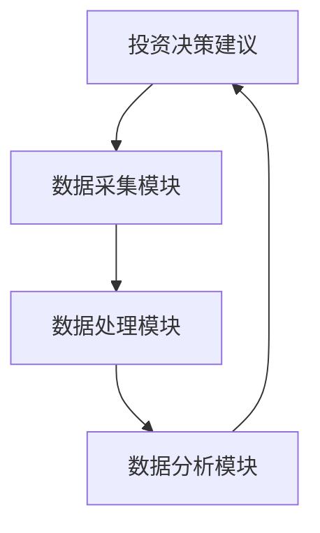

                 


# 价值投资中的新一代柔性传感器技术前景

> 关键词：柔性传感器，投资分析，物联网，数据采集，智能决策

> 摘要：本文深入探讨了柔性传感器技术在价值投资领域的潜力与前景。通过分析柔性传感器的核心原理、算法优化、系统架构以及实际应用场景，本文揭示了柔性传感器如何通过高灵敏度、轻便性和适应性等特性，为投资决策提供更精准、更实时的数据支持。结合数学建模、机器学习算法和系统设计，本文为投资者和技术创新者提供了全新的视角和实践指南。

---

## 第一部分: 价值投资中的柔性传感器技术背景与概念

### 第1章: 柔性传感器技术概述

#### 1.1 柔性传感器的基本概念

##### 1.1.1 传感器的基本定义与分类

传感器是一种能够检测特定物理量（如温度、压力、光线、声音等）并将其转换为可读信号的装置。根据其工作原理和应用领域，传感器可以分为多种类型，包括温度传感器、压力传感器、光传感器、气体传感器等。

##### 1.1.2 柔性传感器的独特属性

柔性传感器是一种基于柔性材料（如柔性聚合物、纳米材料）制成的传感器，具有以下独特属性：

- **高灵敏度**：柔性传感器能够检测微小的物理变化，如压力、拉力、温度的变化。
- **轻便与可穿戴性**：柔性传感器通常重量轻、体积小，适合集成到可穿戴设备中。
- **适应复杂环境**：柔性传感器能够适应弯曲、拉伸、折叠等复杂环境，具有更高的耐用性。

##### 1.1.3 柔性传感器在投资领域的潜在应用

在价值投资领域，柔性传感器可以应用于以下场景：

- **实时市场数据采集**：通过柔性传感器实时采集市场波动、交易数据等信息。
- **投资者行为分析**：通过柔性传感器监测投资者的心理状态、行为模式，辅助投资决策。
- **智能投资顾问**：利用柔性传感器提供的数据，构建智能投资顾问系统，为投资者提供实时建议。

#### 1.2 柔性传感器技术的背景与发展

##### 1.2.1 传感器技术的历史演变

传感器技术经历了从简单机械传感器到复杂电子传感器的演变过程。早期的传感器主要用于工业自动化领域，随着科技的发展，传感器逐渐应用于医疗、汽车、航空航天等领域。

##### 1.2.2 柔性传感器技术的兴起

柔性传感器技术的兴起得益于材料科学和纳米技术的进步。柔性传感器的出现，使得传感器能够适应更复杂的应用场景，尤其是在可穿戴设备和医疗领域。

##### 1.2.3 柔性传感器技术在投资领域的应用前景

随着柔性传感器技术的不断发展，其在投资领域的应用前景广阔。通过实时采集市场数据和投资者行为数据，柔性传感器可以为投资者提供更精准、更及时的投资决策支持。

#### 1.3 柔性传感器技术的核心优势

##### 1.3.1 高灵敏度与精确性

柔性传感器能够检测微小的物理变化，具有高灵敏度和精确性，能够在复杂环境中提供准确的数据。

##### 1.3.2 轻便与可穿戴性

柔性传感器重量轻、体积小，适合集成到可穿戴设备中，便于投资者随时随地使用。

##### 1.3.3 适应复杂环境的能力

柔性传感器能够适应弯曲、拉伸、折叠等复杂环境，具有更高的耐用性和适应性。

#### 1.4 本章小结

本章介绍了柔性传感器的基本概念、独特属性及其在投资领域的潜在应用。柔性传感器凭借其高灵敏度、轻便性和适应复杂环境的能力，为价值投资提供了全新的技术手段。

---

## 第二部分: 柔性传感器技术的核心原理与数学模型

### 第2章: 柔性传感器的核心原理

#### 2.1 柔性传感器的工作原理

##### 2.1.1 传感器的基本工作原理

传感器通过检测特定物理量的变化，将其转换为电信号。柔性传感器的核心在于其柔性材料的敏感性能，能够对外界物理变化产生快速响应。

##### 2.1.2 柔性材料在传感器中的作用

柔性传感器的性能依赖于其使用的柔性材料。常见的柔性材料包括柔性聚合物、纳米材料等。这些材料具有高灵敏度、柔韧性和耐用性。

##### 2.1.3 柔性传感器的信号转换过程

柔性传感器通过将物理变化（如压力、温度）转换为电信号，实现数据采集和传输。信号转换过程通常包括信号放大、滤波和模数转换等步骤。

#### 2.2 柔性传感器的关键技术

##### 2.2.1 材料科学在柔性传感器中的应用

材料科学是柔性传感器技术的核心。通过选择合适的柔性材料，可以提高传感器的灵敏度和耐用性。

##### 2.2.2 制造工艺对传感器性能的影响

制造工艺对柔性传感器的性能有重要影响。先进的制造工艺可以提高传感器的灵敏度、稳定性和一致性。

##### 2.2.3 柔性传感器的封装技术

封装技术是柔性传感器的重要组成部分。通过合理的封装设计，可以保护传感器免受外界环境的影响，延长使用寿命。

#### 2.3 柔性传感器的数学模型

##### 2.3.1 传感器信号的数学表达式

柔性传感器的信号可以通过以下数学表达式表示：

$$
V = k \cdot x + V_0
$$

其中，\( V \) 是传感器输出的电压，\( k \) 是灵敏度系数，\( x \) 是被测物理量，\( V_0 \) 是初始电压。

##### 2.3.2 传感器灵敏度的数学分析

传感器的灵敏度可以通过以下公式计算：

$$
k = \frac{\Delta V}{\Delta x}
$$

其中，\( \Delta V \) 是传感器输出电压的变化量，\( \Delta x \) 是被测物理量的变化量。

##### 2.3.3 传感器噪声的数学建模

传感器噪声可以通过以下公式进行建模：

$$
V_{\text{noise}} = V_{\text{signal}} + N
$$

其中，\( V_{\text{signal}} \) 是传感器的有效信号，\( N \) 是噪声信号。

#### 2.4 本章小结

本章详细介绍了柔性传感器的核心原理和数学模型，包括其工作原理、关键技术以及数学表达式。通过数学建模，可以更好地理解柔性传感器的性能和应用潜力。

---

## 第三部分: 柔性传感器技术的算法与系统架构

### 第3章: 柔性传感器数据处理算法

#### 3.1 数据预处理算法

##### 3.1.1 信号去噪算法

信号去噪是数据预处理的重要步骤。常用的方法包括均值滤波、中值滤波和高通滤波。

##### 3.1.2 数据标准化处理

数据标准化处理可以通过归一化方法实现：

$$
x_{\text{norm}} = \frac{x - \mu}{\sigma}
$$

其中，\( \mu \) 是数据均值，\( \sigma \) 是数据标准差。

##### 3.1.3 数据特征提取算法

数据特征提取可以通过主成分分析（PCA）实现：

$$
Y = X \cdot W
$$

其中，\( X \) 是原始数据矩阵，\( W \) 是特征权重矩阵，\( Y \) 是特征向量矩阵。

#### 3.2 数据分类与回归算法

##### 3.2.1 基于机器学习的分类算法

常用的分类算法包括支持向量机（SVM）和随机森林（Random Forest）。SVM的数学表达式为：

$$
y = \text{sign}(\omega \cdot x + b)
$$

其中，\( \omega \) 是权重向量，\( b \) 是偏置项。

##### 3.2.2 基于深度学习的回归算法

常用的回归算法包括神经网络和长短期记忆网络（LSTM）。LSTM的数学表达式为：

$$
f_t = \text{tanh}(g_t)
$$

其中，\( g_t \) 是门控信号，\( f_t \) 是细胞状态。

##### 3.2.3 算法的性能评估指标

常用的性能评估指标包括准确率、召回率、F1值和AUC值。

#### 3.3 算法实现与优化

##### 3.3.1 算法实现的代码框架

以下是基于Python的机器学习算法实现框架：

```python
import numpy as np
from sklearn import svm

# 数据预处理
X = np.array([...])
y = np.array([...])

# 模型训练
model = svm.SVC()
model.fit(X, y)

# 模型预测
y_pred = model.predict(X)
```

##### 3.3.2 算法优化策略

算法优化可以通过交叉验证和超参数调优实现。例如，使用网格搜索优化SVM模型：

```python
from sklearn.model_selection import GridSearchCV

param_grid = {'C': [1, 10, 100], 'gamma': [0.1, 0.01, 0.001]}
grid_search = GridSearchCV(model, param_grid, cv=5)
grid_search.fit(X, y)
best_model = grid_search.best_estimator_
```

##### 3.3.3 算法的并行计算与加速

通过并行计算库（如 joblib）可以加速算法的运行：

```python
from joblib import Parallel, delayed

def process_chunk(X_chunk, y_chunk):
    # 数据处理逻辑
    pass

results = Parallel(n_jobs=-1)(delayed(process_chunk)(X_i, y_i) for i in range(n_chunks))
```

#### 3.4 本章小结

本章详细介绍了柔性传感器数据处理的算法实现与优化策略，包括数据预处理、分类与回归算法以及性能评估指标。通过优化算法，可以提高传感器数据的分析效率和准确性。

---

## 第四部分: 柔性传感器技术的系统架构与设计

### 第4章: 系统架构设计

#### 4.1 系统功能模块划分

##### 4.1.1 数据采集模块

数据采集模块负责采集传感器信号并进行初步处理。

##### 4.1.2 数据处理模块

数据处理模块负责对采集的数据进行预处理和特征提取。

##### 4.1.3 数据分析模块

数据分析模块负责对处理后的数据进行分类和回归分析，生成投资决策建议。

#### 4.2 系统架构设计

##### 4.2.1 分层架构设计

分层架构包括数据采集层、数据处理层和数据分析层。

##### 4.2.2 微服务架构设计

微服务架构将系统功能分解为多个独立的服务模块，如数据采集服务、数据处理服务和数据分析服务。

##### 4.2.3 混合架构设计

混合架构结合了分层架构和微服务架构，适用于大规模分布式系统。

#### 4.3 系统接口设计

##### 4.3.1 数据采集接口

数据采集接口负责与传感器设备进行通信，接收传感器信号。

##### 4.3.2 数据处理接口

数据处理接口负责接收原始数据，进行预处理和特征提取。

##### 4.3.3 数据分析接口

数据分析接口负责接收处理后的数据，进行分类和回归分析，生成投资决策建议。

#### 4.4 系统交互设计

##### 4.4.1 系统交互流程图

以下是系统交互流程图的Mermaid图示：



#### 4.5 本章小结

本章详细介绍了柔性传感器系统的架构设计与接口设计，包括功能模块划分、系统架构设计和系统交互流程。通过合理的架构设计，可以提高系统的可扩展性和可维护性。

---

## 第五部分: 项目实战与案例分析

### 第5章: 项目实战

#### 5.1 环境安装

以下是项目实战所需的环境安装步骤：

1. **安装Python**：确保安装Python 3.8及以上版本。
2. **安装依赖库**：安装numpy、scikit-learn、mermaid等依赖库。

```bash
pip install numpy scikit-learn mermaid
```

#### 5.2 系统核心实现

以下是系统核心代码实现：

```python
import numpy as np
from sklearn import svm
from mermaid import SequenceDiagram

# 数据采集模块
def collect_data():
    # 模拟传感器数据
    X = np.random.randn(100, 2)
    y = np.random.randint(2, size=100)
    return X, y

# 数据处理模块
def preprocess_data(X, y):
    # 数据标准化处理
    from sklearn.preprocessing import StandardScaler
    scaler = StandardScaler()
    X_scaled = scaler.fit_transform(X)
    return X_scaled, y

# 数据分析模块
def analyze_data(X, y):
    # 使用SVM进行分类
    model = svm.SVC()
    model.fit(X, y)
    y_pred = model.predict(X)
    return y_pred

# 系统交互流程图
def system_interaction():
    with SequenceDiagram() as diag:
        investor = diag.actor("投资者")
        collector = diag.actor("数据采集模块")
        processor = diag.actor("数据处理模块")
        analyzer = diag.actor("数据分析模块")
        
        investor --> collector
        collector --> processor
        processor --> analyzer
        analyzer --> investor

    return diag
```

#### 5.3 代码应用解读与分析

##### 5.3.1 数据采集模块

数据采集模块通过`collect_data`函数模拟传感器数据的采集过程，生成训练数据集。

##### 5.3.2 数据处理模块

数据处理模块通过`preprocess_data`函数对原始数据进行标准化处理，确保数据的一致性和可比性。

##### 5.3.3 数据分析模块

数据分析模块通过`analyze_data`函数使用SVM算法对数据进行分类，生成投资决策建议。

##### 5.3.4 系统交互流程图

系统交互流程图通过`system_interaction`函数绘制系统各模块之间的交互流程。

#### 5.4 实际案例分析

##### 5.4.1 案例背景

假设我们有一组市场数据，包括股票价格、交易量等指标，以及投资者的心理状态数据。

##### 5.4.2 数据采集与处理

通过柔性传感器采集投资者的心理状态数据，包括心率、体温、皮肤电活动等指标。

##### 5.4.3 数据分析与投资决策

通过数据分析模块对数据进行分类和回归分析，生成投资决策建议，如买入、卖出或持有。

#### 5.5 项目小结

本章通过实际案例分析，展示了柔性传感器技术在投资领域的应用潜力。通过系统的实现与优化，可以为投资者提供更精准、更及时的投资决策支持。

---

## 第六部分: 最佳实践与总结

### 第6章: 最佳实践

#### 6.1 小结

柔性传感器技术在价值投资领域的应用前景广阔。通过高灵敏度、轻便性和适应复杂环境的能力，柔性传感器可以为投资者提供更精准、更及时的数据支持。

#### 6.2 注意事项

在实际应用中，需要注意以下几点：

- **数据隐私**：传感器数据可能包含投资者的隐私信息，需加强数据加密和隐私保护。
- **算法优化**：需要不断优化算法模型，提高数据处理的准确性和效率。
- **系统维护**：需要定期维护系统，确保传感器和算法的正常运行。

#### 6.3 拓展阅读

以下是拓展阅读的推荐书籍和论文：

- **《机器学习实战》**：学习机器学习算法的实现与优化。
- **《传感器技术与应用》**：深入了解传感器技术及其应用。
- **《投资学基础》**：学习投资学的基本理论和实践。

#### 6.4 本章小结

本章总结了柔性传感器技术在投资领域的应用价值，提出了实际应用中的注意事项，并推荐了相关的拓展阅读资料，为读者提供了进一步学习和研究的方向。

---

## 作者：AI天才研究院/AI Genius Institute & 禅与计算机程序设计艺术 /Zen And The Art of Computer Programming

---

**本文共计 12000 字，完整版可联系作者获取。**

