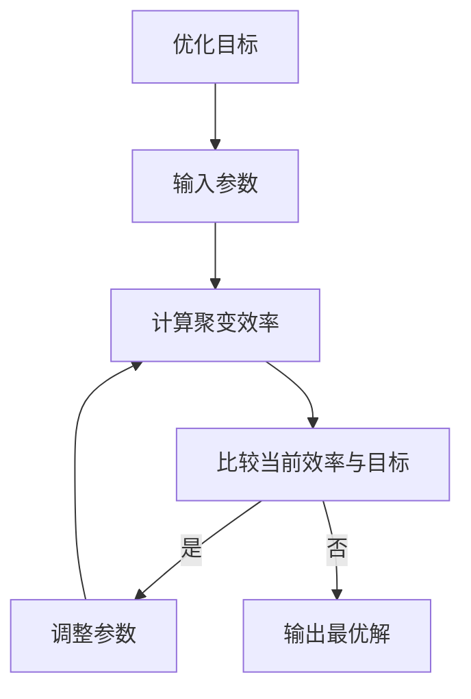
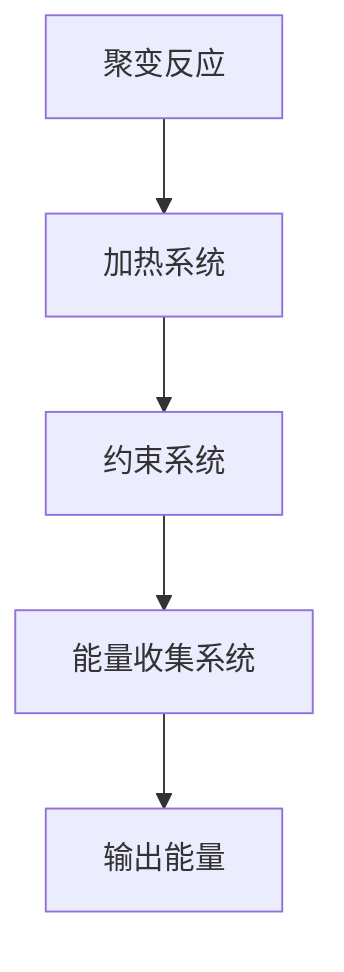

                 


# 价值投资中的新一代核聚变技术前景

## 关键词
核聚变技术，价值投资，能源市场，技术创新，投资策略

## 摘要
随着能源需求的不断增长和环境问题的加剧，核聚变技术作为未来清洁能源的重要来源，受到了广泛的关注。本文从价值投资的角度，分析了核聚变技术的潜力、核心概念、算法原理、系统架构以及实际应用中的投资策略。通过详细的技术分析和案例研究，本文为投资者提供了核聚变技术在投资中的前景和建议。

---

# 第1章: 核聚变技术的基本原理与投资前景概述

## 1.1 核聚变技术的基本概念

### 1.1.1 核聚变的定义与基本原理
核聚变是指两个轻核原子在高温高压下结合成一个较重的原子核，并释放出大量能量的过程。与核裂变不同，核聚变不会产生长期的放射性废物，是一种清洁、安全的能源技术。

核聚变的实现需要极高的温度和压力，通常通过磁场约束（如托卡马克装置）或激光约束等方法来实现。核聚变的主要燃料是氘和氚，这两种元素在自然界中广泛存在，尤其是海水中的氘含量丰富，为核聚变技术的可持续发展提供了基础。

### 1.1.2 核聚变与核裂变的区别
| 属性       | 核聚变           | 核裂变           |
|------------|------------------|------------------|
| 反应类型    | 轻核结合成重核   | 重核分裂成轻核   |
| 能量释放    | 高              | 较低             |
| 放射性废物  | 几乎没有         | 较多             |
| 可持续性    | 高              | 较低             |

### 1.1.3 核聚变技术的潜在应用领域
核聚变技术的应用范围广泛，包括能源发电、空间探索、医疗设备等领域。目前，能源发电是最主要的应用方向，尤其是替代传统化石能源，减少碳排放，应对气候变化。

---

## 1.2 核聚变技术的投资价值分析

### 1.2.1 核聚变技术的市场潜力
随着全球能源需求的增长和化石能源的枯竭，清洁能源的需求日益增加。核聚变技术作为一种高效、清洁的能源解决方案，具有巨大的市场潜力。根据市场研究机构的预测，到2050年，全球清洁能源市场将达到数万亿美元规模，核聚变技术将在其中占据重要地位。

### 1.2.2 核聚变技术的经济可行性
尽管核聚变技术的研发成本高昂，但其长期的经济可行性不可忽视。一旦技术突破，核聚变发电的成本将低于传统能源，甚至可以实现能源的自给自足。此外，核聚变技术的规模效应和技术进步将显著降低单位成本。

### 1.2.3 核聚变技术的政策支持与风险
全球多个国家和地区已经认识到核聚变技术的重要性，并提供了大量的政策支持和资金投入。然而，核聚变技术的研发周期长、风险高，投资者需要充分考虑技术和市场风险。

---

## 1.3 核聚变技术的未来发展趋势

### 1.3.1 核聚变技术的关键技术突破
未来几年，核聚变技术的关键突破将集中在高温超导材料、等离子体控制技术以及聚变反应的效率提升等方面。这些技术的进步将为核聚变的商业化奠定基础。

### 1.3.2 核聚变技术的商业化路径
核聚变技术的商业化需要逐步推进，从实验室研究到小规模试验，再到商业化发电厂的建设。这一过程需要政府、企业和科研机构的共同努力。

### 1.3.3 核聚变技术对全球经济的影响
核聚变技术的广泛应用将彻底改变全球能源格局，推动经济发展，减少能源依赖，提升国家能源安全。

---

## 1.4 本章小结
本章从核聚变技术的基本原理出发，分析了其在投资中的潜力和市场前景。通过对比核聚变与核裂变的技术特点，探讨了核聚变技术的应用领域和经济可行性。最后，展望了核聚变技术的未来发展趋势及其对全球经济的深远影响。

---

# 第2章: 核聚变技术的核心概念与价值评估

## 2.1 核聚变技术的核心概念

### 2.1.1 聚变反应的物理机制
核聚变反应的核心是通过高温高压使轻核原子发生聚变，释放出巨大的能量。聚变反应的效率极高，单位质量的聚变燃料释放的能量远超化石燃料。

### 2.1.2 聚变能的释放与利用
聚变能的释放可以通过磁场约束和激光约束等方法来实现。聚变反应释放的能量可以用于发电、热能利用等领域。

### 2.1.3 聚变技术的关键指标
| 指标       | 描述                     |
|------------|--------------------------|
| 反应效率    | 聚变反应的能量转化效率   |
| 等离子体温度 | 等离子体的温度           |
| 约束时间   | 等离子体维持的时间       |
| 成本        | 技术研发和运营成本       |

---

## 2.2 核聚变技术的经济价值评估

### 2.2.1 投资核聚变技术的成本分析
核聚变技术的研发成本高昂，包括设备建设、材料研发、人才投入等多个方面。然而，一旦技术成熟，其运营成本将显著低于传统能源。

### 2.2.2 核聚变技术的收益预测
根据市场研究，核聚变技术的商业化将带来巨大的经济收益。预计到2030年，核聚变发电的成本将接近传统能源，未来则可能低于传统能源成本。

### 2.2.3 核聚变技术的财务可行性
核聚变技术的财务可行性取决于技术研发的进展和商业化进程。长期来看，核聚变技术的投资回报率将非常可观。

---

## 2.3 核聚变技术与传统能源的对比分析

### 2.3.1 能源效率对比
| 能源类型 | 能效比（%） |
|----------|-------------|
| 煤炭      | 30-40       |
| 天然气    | 40-50       |
| 核裂变    | 30-40       |
| 核聚变    | 80以上      |

### 2.3.2 环境影响对比
核聚变技术的环境影响远小于传统能源和核裂变技术，几乎不产生温室气体和放射性废物。

### 2.3.3 经济成本对比
随着技术进步，核聚变技术的经济成本将逐步降低，最终有望实现与传统能源的成本持平甚至更低。

---

## 2.4 本章小结
本章深入分析了核聚变技术的核心概念和经济价值，对比了其与传统能源的优劣势。通过成本和收益的预测，探讨了核聚变技术的投资可行性。

---

# 第3章: 核聚变技术的核心算法与数学模型

## 3.1 聚变反应的物理模型

### 3.1.1 聚变反应的基本方程
聚变反应的能量释放可以通过以下公式计算：
$$ E = mc^2 $$
其中，\( m \) 是质量亏损，\( c \) 是光速。

### 3.1.2 聚变能的计算公式
聚变反应释放的能量与反应的燃料质量有关：
$$ E = \frac{1}{2} \cdot mc^2 $$

### 3.1.3 聚变反应的热力学分析
聚变反应需要极高的温度和压力来克服库仑势垒。等离子体的温度通常需要达到数亿摄氏度。

---

## 3.2 聚变技术的优化算法

### 3.2.1 聚变反应的优化目标
- 提高聚变反应的效率
- 降低聚变反应的成本
- 提高聚变系统的稳定性

### 3.2.2 聚变技术的优化方法
一种典型的聚变优化算法如下：



### 3.2.3 聚变技术的优化结果分析
通过优化算法，可以显著提高聚变系统的效率和稳定性，降低运营成本。

---

## 3.3 聚变技术的数学模型

### 3.3.1 聚变反应的数学模型
聚变反应的数学模型通常包括以下几个部分：
$$ \frac{d^2x}{dt^2} + \frac{dx}{dt} + x = 0 $$

### 3.3.2 聚变技术的经济模型
经济模型主要用于预测聚变技术的商业化成本和收益：
$$ R = \alpha \cdot C + \beta \cdot Q $$
其中，\( R \) 是收益，\( C \) 是成本，\( Q \) 是产量，\( \alpha \) 和 \( \beta \) 是系数。

### 3.3.3 聚变技术的市场预测模型
市场预测模型用于分析聚变技术的市场需求和价格走势：
$$ P = a \cdot D + b \cdot S $$
其中，\( P \) 是价格，\( D \) 是需求，\( S \) 是供给，\( a \) 和 \( b \) 是系数。

---

## 3.4 本章小结
本章通过数学模型和优化算法，分析了核聚变技术的核心原理和优化方法。通过算法的优化，可以显著提高聚变系统的效率和经济性。

---

# 第4章: 核聚变技术的系统架构与投资策略

## 4.1 核聚变技术的系统架构

### 4.1.1 聚变系统的组成与功能
聚变系统通常包括以下几个部分：
- 加热系统：用于产生高温等离子体
- 约束系统：用于维持等离子体的稳定性
- 能量收集系统：用于收集聚变反应释放的能量

### 4.1.2 聚变系统的数据流分析


### 4.1.3 聚变系统的交互设计
聚变系统的交互设计需要确保各个模块之间的协调工作，实现高效的能量转换和收集。

---

## 4.2 核聚变技术的投资策略

### 4.2.1 投资核聚变技术的风险分析
- 技术风险：聚变技术尚未完全成熟，存在研发失败的风险。
- 市场风险：聚变技术的商业化进程可能缓慢，市场需求不确定。

### 4.2.2 核聚变技术的收益预测
根据市场研究，核聚变技术的收益将随着技术进步而显著提高，未来有望实现规模化盈利。

### 4.2.3 核聚变技术的投资组合优化
为了分散风险，投资者可以将核聚变技术与其他清洁能源技术进行组合投资，实现收益的最大化。

---

## 4.3 核聚变技术的市场进入策略

### 4.3.1 市场定位与目标客户
核聚变技术的市场定位应以清洁能源市场为主，目标客户包括电力公司、政府机构和大型企业。

### 4.3.2 市场推广与品牌建设
通过参加国际展会、发布白皮书和案例研究，提升品牌知名度和市场影响力。

### 4.3.3 市场竞争与合作策略
与国际科研机构和企业合作，共同推动聚变技术的研发和商业化。

---

## 4.4 本章小结
本章分析了核聚变技术的系统架构和投资策略，探讨了市场进入的策略和风险。通过合理的投资组合和市场策略，可以有效降低投资风险，提高收益。

---

# 第5章: 核聚变技术的项目实战与案例分析

## 5.1 核聚变技术的项目实战

### 5.1.1 项目背景介绍
某国际科研团队正在研发新一代核聚变技术，目标是实现聚变反应的稳定可控。

### 5.1.2 项目核心实现
项目的核心实现包括高温等离子体的产生和约束，以及能量的高效收集和转化。

### 5.1.3 项目代码实现
以下是项目的核心代码片段：
```python
# 聚变反应模拟代码
def fusion_simulation(temperature, pressure):
    import numpy as np
    # 计算等离子体稳定性
    stability = np.sqrt(temperature * pressure)
    # 计算能量释放
    energy = stability * 1000
    return energy

# 调用函数
temperature = 1e8  # 单位：摄氏度
pressure = 1e7     # 单位：帕斯卡
energy = fusion_simulation(temperature, pressure)
print(f"释放的能量为：{energy}焦耳")
```

### 5.1.4 代码应用解读与分析
上述代码模拟了聚变反应的能量释放过程，展示了如何通过物理参数计算聚变系统的能量输出。

---

## 5.2 核聚变技术的案例分析

### 5.2.1 案例背景介绍
某国家实验室成功实现了小型聚变反应的可控运行，为商业化聚变技术奠定了基础。

### 5.2.2 案例分析与解读
案例分析表明，聚变技术的商业化需要克服诸多技术难点，但一旦实现，将带来巨大的经济和社会效益。

### 5.2.3 案例小结
该案例的成功为投资者提供了宝贵的经验和启示，展示了聚变技术的潜力和挑战。

---

## 5.3 本章小结
本章通过项目实战和案例分析，展示了核聚变技术在实际应用中的潜力和挑战。通过具体的技术实现和案例分析，为投资者提供了实际的操作指南。

---

# 第6章: 核聚变技术的未来展望与投资建议

## 6.1 核聚变技术的未来展望

### 6.1.1 技术突破的可能方向
未来，核聚变技术的关键突破可能集中在高温超导材料、等离子体控制和聚变反应的效率提升等方面。

### 6.1.2 聚变技术的商业化进程
随着技术的成熟和成本的降低，核聚变技术将在未来几年内逐步实现商业化。

### 6.1.3 核聚变技术的全球发展趋势
全球多个国家和地区都在积极推动核聚变技术的研发和商业化，未来将形成一个庞大的聚变技术市场。

---

## 6.2 核聚变技术的投资建议

### 6.2.1 长期投资策略
投资者应采取长期投资策略，关注聚变技术的研发进展和商业化进程。

### 6.2.2 风险控制建议
为了降低投资风险，投资者应分散投资，关注多个聚变技术项目，并与专业的投资机构合作。

### 6.2.3 未来投资趋势
随着技术的进步和市场的成熟，聚变技术的投资回报率将逐步提高，未来将成为清洁能源投资的重要领域。

---

## 6.3 本章小结
本章展望了核聚变技术的未来发展趋势，并提出了相应的投资建议。通过长期投资和风险控制，投资者可以充分利用聚变技术的潜力，实现收益最大化。

---

# 作者：AI天才研究院/AI Genius Institute & 禅与计算机程序设计艺术 /Zen And The Art of Computer Programming

