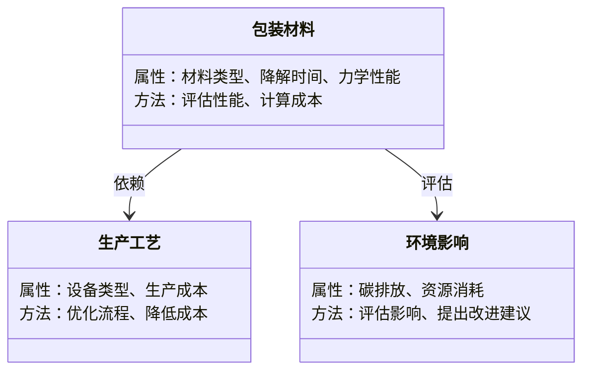
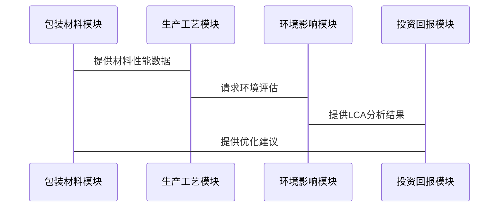

                 


# 价值投资中的新一代生物可降解包装技术

> 关键词：价值投资，生物可降解，包装技术，环境影响，投资策略

> 摘要：本文探讨了生物可降解包装技术在价值投资中的应用，分析了其技术原理、市场潜力和投资策略，旨在为投资者提供科学的决策依据。

---

# 第一部分: 价值投资中的生物可降解包装技术基础

## 第1章: 生物可降解包装技术的背景与价值

### 1.1 生物可降解包装的定义与特点

#### 1.1.1 生物可降解包装的定义
生物可降解包装是一种由生物基材料制成的包装材料，能够在自然环境下分解为二氧化碳和水，不会对环境造成长期污染。

#### 1.1.2 生物可降解材料的特性
生物可降解材料通常来源于可再生资源，如淀粉、纤维素、聚乳酸（PLA）等，具有可降解、低毒性和可再生的特点。

#### 1.1.3 生物可降解包装的优势与局限性
- **优势**：减少塑料污染，符合环保趋势，可应用于食品包装等领域。
- **局限性**：成本较高，性能不如传统塑料，降解条件要求严格。

### 1.2 价值投资的基本概念
价值投资是一种长期投资策略，注重分析企业的基本面，寻找市场价格低于内在价值的投资标的。

### 1.3 生物可降解包装技术与价值投资的结合
- **市场现状**：全球对环保包装的需求日益增长，生物可降解包装市场潜力巨大。
- **投资机会**：生物可降解包装技术企业具有较高的成长潜力，符合可持续投资趋势。

---

## 第2章: 生物可降解包装技术的核心概念

### 2.1 生物可降解材料的分类

#### 2.1.1 淀粉基材料
- **来源**：植物淀粉，如玉米淀粉。
- **特点**：成本低，但物理性能有限，适合一次性包装。

#### 2.1.2 聚乳酸（PLA）
- **来源**：可再生资源，如玉米糖发酵。
- **特点**：性能接近传统塑料，降解速度快。

#### 2.1.3 聚乙醇酸（PGA）
- **来源**：可再生资源。
- **特点**：降解时间短，适合可快速降解的应用场景。

### 2.2 生物可降解包装的生产工艺

#### 2.2.1 原材料的选择与处理
- 原材料筛选：选择高纯度、可降解的生物基材料。
- 前处理：清洗、粉碎等步骤。

#### 2.2.2 成型与加工技术
- 成型方法：挤出成型、注塑成型。
- 加工技术：吹塑、热成型等。

#### 2.2.3 后处理与质量控制
- 后处理：表面处理、灭菌等。
- 质量控制：检测材料的降解性能、力学性能。

### 2.3 生物可降解包装的环境影响评估

#### 2.3.1 生命周期评估（LCA）方法
- 定义：从原材料获取到产品废弃的全生命周期进行环境影响分析。
- 核心指标：温室气体排放、能源消耗、水资源消耗。

#### 2.3.2 环境影响的量化指标
- 温室气体排放：生产过程中的碳排放。
- 资源消耗：水、电、原材料的使用量。

#### 2.3.3 环境效益与经济效益的平衡
- 环境效益：减少塑料污染，符合环保政策。
- 经济效益：初期成本高，但长期来看，符合可持续发展趋势。

---

## 第3章: 价值投资中的技术分析与评估

### 3.1 技术评估的核心指标

#### 3.1.1 材料性能指标
- 降解时间：材料在自然环境中的降解速度。
- 力学性能：材料的强度、韧性等。

#### 3.1.2 生产成本分析
- 原材料成本：生物基材料的价格波动。
- 生产工艺成本：设备投资和运营成本。

#### 3.1.3 市场需求预测
- 全球包装市场：增长趋势和区域分布。
- 竞争格局：主要企业市场份额和技术优势。

### 3.2 投资决策模型构建

#### 3.2.1 模型假设
- 假设1：市场需求稳步增长。
- 假设2：技术成熟度逐步提高。

#### 3.2.2 投资回报率计算
- 公式：投资回报率 = (净利润 / 投资额) × 100%
- 示例：某企业投资1000万元，年净利润200万元，投资回报率为20%。

#### 3.2.3 风险评估
- 市场风险：原材料价格波动。
- 技术风险：技术升级换代快。

---

## 第4章: 生物可降解包装技术的系统架构设计

### 4.1 问题场景介绍
- 场景1：传统包装材料的环境污染问题。
- 场景2：企业如何通过技术创新实现可持续发展。

### 4.2 项目介绍
- 项目目标：开发新一代生物可降解包装材料。
- 项目范围：从材料研发到产品应用。

### 4.3 系统功能设计

#### 4.3.1 领域模型（Mermaid类图）


### 4.4 系统架构设计（Mermaid架构图）


### 4.5 系统交互设计（Mermaid序列图）


---

## 第5章: 项目实战与案例分析

### 5.1 环境安装
- 操作系统：Linux 18.04
- 开发工具：Python 3.8，Mermaid工具链，Jupyter Notebook

### 5.2 核心代码实现

#### 5.2.1 生物降解性能评估
```python
def degrade_performance(material):
    if material == 'PLA':
        return 6 months
    elif material == 'Starch':
        return 3 months
    else:
        return None
```

#### 5.2.2 投资回报计算
```python
def calculate_roi(investment, profit):
    return (profit / investment) * 100
```

### 5.3 案例分析
- 案例：某企业投资500万元开发PLA包装材料，预计年利润200万元，投资回报率为40%。

### 5.4 项目总结
- 成功经验：技术创新与市场洞察结合。
- 改进方向：优化生产工艺，降低生产成本。

---

## 第6章: 最佳实践与小结

### 6.1 最佳实践
- **技术评估**：关注材料性能和生产成本。
- **投资策略**：长期视角，选择具有技术优势和市场潜力的企业。

### 6.2 小结
生物可降解包装技术是价值投资中的重要方向，其技术创新和市场应用将推动包装行业向可持续方向发展。

### 6.3 注意事项
- 风险提示：技术升级和政策变化可能影响投资回报。
- 投资建议：分散投资，避免过度集中。

### 6.4 拓展阅读
- 推荐书籍：《可持续投资：绿色金融的实践与创新》。
- 推荐网站：联合国环境规划署（UNEP）官网。

---

# 结语

生物可降解包装技术不仅是环保的需求，更是价值投资的新机遇。通过技术创新和市场洞察，投资者可以在环保事业中实现经济效益和环境效益的双重丰收。

---

# 作者：AI天才研究院 & 禅与计算机程序设计艺术

---

> **[TOC]**

# {{此处是文章标题}}

> 关键词：{{此处列出文章的5-7个核心关键词}}

> 摘要：{{此处给出文章的核心内容和主题思想}}

                 

# 第1章: {{章节标题}}

## 1.1 {{小节标题}}

### 1.1.1 {{三级标题}}

### 1.1.2 {{三级标题}}

## 1.2 {{小节标题}}

### 1.2.1 {{三级标题}}

### 1.2.2 {{三级标题}}

## 1.3 {{小节标题}}

### 1.3.1 {{三级标题}}

### 1.3.2 {{三级标题}}

## 1.4 {{小节标题}}

### 1.4.1 {{三级标题}}

### 1.4.2 {{三级标题}}

# 第2章: {{章节标题}}

## 2.1 {{小节标题}}

### 2.1.1 {{三级标题}}

### 2.1.2 {{三级标题}}

## 2.2 {{小节标题}}

### 2.2.1 {{三级标题}}

### 2.2.2 {{三级标题}}

## 2.3 {{小节标题}}

### 2.3.1 {{三级标题}}

### 2.3.2 {{三级标题}}

## 2.4 {{小节标题}}

### 2.4.1 {{三级标题}}

### 2.4.2 {{三级标题}}

# 第3章: {{章节标题}}

## 3.1 {{小节标题}}

### 3.1.1 {{三级标题}}

### 3.1.2 {{三级标题}}

## 3.2 {{小节标题}}

### 3.2.1 {{三级标题}}

### 3.2.2 {{三级标题}}

## 3.3 {{小节标题}}

### 3.3.1 {{三级标题}}

### 3.3.2 {{三级标题}}

## 3.4 {{小节标题}}

### 3.4.1 {{三级标题}}

### 3.4.2 {{三级标题}}

# 第4章: {{章节标题}}

## 4.1 {{小节标题}}

### 4.1.1 {{三级标题}}

### 4.1.2 {{三级标题}}

## 4.2 {{小节标题}}

### 4.2.1 {{三级标题}}

### 4.2.2 {{三级标题}}

## 4.3 {{小节标题}}

### 4.3.1 {{三级标题}}

### 4.3.2 {{三级标题}}

## 4.4 {{小节标题}}

### 4.4.1 {{三级标题}}

### 4.4.2 {{三级标题}}

# 第5章: {{章节标题}}

## 5.1 {{小节标题}}

### 5.1.1 {{三级标题}}

### 5.1.2 {{三级标题}}

## 5.2 {{小节标题}}

### 5.2.1 {{三级标题}}

### 5.2.2 {{三级标题}}

## 5.3 {{小节标题}}

### 5.3.1 {{三级标题}}

### 5.3.2 {{三级标题}}

## 5.4 {{小节标题}}

### 5.4.1 {{三级标题}}

### 5.4.2 {{三级标题}}

# 第6章: {{章节标题}}

## 6.1 {{小节标题}}

### 6.1.1 {{三级标题}}

### 6.1.2 {{三级标题}}

## 6.2 {{小节标题}}

### 6.2.1 {{三级标题}}

### 6.2.2 {{三级标题}}

## 6.3 {{小节标题}}

### 6.3.1 {{三级标题}}

### 6.3.2 {{三级标题}}

## 6.4 {{小节标题}}

### 6.4.1 {{三级标题}}

### 6.4.2 {{三级标题}}

# 作者：{{作者信息}}

