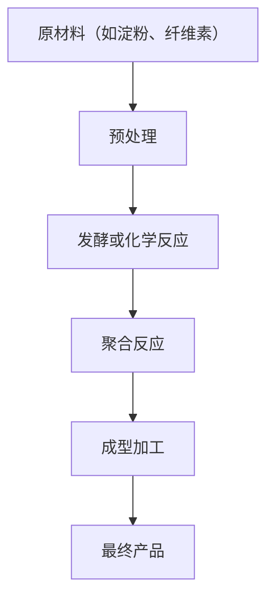

                 

# 价值投资中的新一代生物基塑料技术前景

> **关键词**：生物基塑料，可持续发展，投资分析，技术趋势，市场前景，风险管理

> **摘要**：随着全球对可持续发展的关注增加，生物基塑料作为传统塑料的替代品，因其环保优势和技术创新而备受关注。本文从技术原理、市场分析、投资价值评估、投资策略及风险控制等多个方面，系统探讨生物基塑料的投资前景，为投资者提供科学决策的参考。

---

## 第1章：生物基塑料的基本概念

### 1.1 什么是生物基塑料？

生物基塑料是以可再生资源（如植物纤维、淀粉等）为原料，通过生物或化学方法合成的塑料。与传统石油基塑料不同，生物基塑料在生产、使用和废弃过程中对环境的影响较小。

**核心概念对比表**：

| 属性          | 生物基塑料                     | 石油基塑料                     |
|---------------|-------------------------------|-------------------------------|
| 原材料        | 可再生资源（如玉米、甘蔗）     | 石油、天然气                   |
| 生产过程      | 环保工艺，低能耗               | 高能耗，可能产生污染物           |
| 可降解性      | 可生物降解                   | 难降解，易污染环境               |
| 环境影响      | 减少碳足迹，促进可持续发展     | 加剧温室效应，造成白色污染       |

### 1.2 生物基塑料的分类

生物基塑料主要分为可生物降解塑料和非生物降解塑料。前者如聚乳酸（PLA），后者如聚乙醇酸（PGA）。每种类型适用于不同的场景，例如包装、纺织、电子产品等。

---

## 第2章：生物基塑料的技术原理

### 2.1 生物基塑料的生产技术

#### 2.1.1 原材料的选择

生物基塑料的关键在于原材料的选择。例如，聚乳酸（PLA）通常来源于玉米淀粉，而聚羟基乙酸（PHA）则通过微生物发酵生产。不同原料直接影响成本和性能。

**流程图：生物基塑料的生产流程**

#### 2.1.2 生产工艺的比较

不同工艺的优缺点：

| 工艺           | 优点                           | 缺点                           |
|----------------|--------------------------------|--------------------------------|
| 发酵法         | 成本低，环保                   | 生产效率低                     |
| 化学合成法     | 生产效率高                   | 成本较高                       |
| 微生物工程法   | 高效，资源利用好             | 技术复杂                       |

### 2.2 技术创新与发展趋势

#### 2.2.1 创新驱动

近年来，科学家们通过基因编辑和代谢工程优化微生物，提高生物基塑料的产量和质量。例如，使用工程菌株提高PHA的产量。

**数学模型：微生物发酵的代谢路径**

生物基塑料的生产涉及复杂的代谢路径。以聚羟基乙酸（PHA）为例，其生产过程可以用以下公式表示：

$$
\text{微生物代谢路径} = \sum_{i=1}^{n} \text{代谢反应}_i
$$

每个代谢反应涉及碳源、氮源等的利用，最终合成PHA颗粒。

---

## 第3章：全球生物基塑料市场分析

### 3.1 市场规模与增长趋势

#### 3.1.1 全球市场规模

根据市场研究，2023年全球生物基塑料市场规模约为XX亿美元，预计年复合增长率XX%。主要驱动力包括政策支持、环保需求和企业社会责任。

#### 3.1.2 区域市场分布

欧洲是最大的市场，其次是亚洲和北美。中国在政策推动下，生物基塑料产量增长迅速。

### 3.2 主要应用领域分析

#### 3.2.1 包装行业

生物基塑料在可降解包装材料中的应用广泛，如生物降解塑料袋、餐盒等。

#### 3.2.2 消费品行业

越来越多的企业使用生物基塑料制作餐具、瓶子等，减少环境负担。

### 3.3 重点企业分析

#### 3.3.1 国际领先企业

如NatureWorks（美国）、 BASF（德国）等，这些企业在技术研发和市场推广方面具有领先地位。

#### 3.3.2 国内主要企业

中国有金发科技、中粮生物等，积极推动生物基塑料的本土化生产。

---

## 第4章：价值投资的核心要素

### 4.1 投资价值的定义

生物基塑料的投资价值主要体现在其环保优势、市场增长潜力和技术创新能力。投资者应关注企业的技术壁垒、成本控制和市场开拓能力。

#### 4.1.1 财务指标分析

- **盈利能力**：如ROE、净利润率
- **成长能力**：收入增长率、研发投入占比
- **估值水平**：PE、EV/EBITDA

### 4.2 价值评估模型

#### 4.2.1 现金流折现模型（DCF）

通过预测未来现金流，计算内在价值。公式：

$$
\text{企业价值} = \sum_{t=1}^{n} \frac{\text{现金流}_t}{(1 + r)^t} + \text{终值}
$$

#### 4.2.2 情景分析法

基于不同假设（如政策变化、技术突破）评估企业价值的变化。

---

## 第5章：投资策略与风险管理

### 5.1 投资策略

#### 5.1.1 短期 vs 长期投资

- 短期：关注市场波动和政策红利
- 长期：投资具有技术优势和市场潜力的企业

#### 5.1.2 多元化投资

分散投资于不同领域的生物基塑料企业，降低风险。

### 5.2 风险管理

#### 5.2.1 市场风险

- 宏观经济波动、市场竞争加剧
- 应对策略：多元化布局、动态调整

#### 5.2.2 技术风险

- 技术创新不确定、专利风险
- 应对策略：关注技术研发投入、选择技术领先企业

#### 5.2.3 政策风险

- 政策变化影响行业需求
- 应对策略：关注政策动向、选择符合政策导向的企业

---

## 第6章：总结与展望

### 6.1 全文总结

生物基塑料作为可持续发展的代表，具有广阔市场前景和技术潜力。投资者应关注企业的技术优势、市场地位和财务表现，制定合理的投资策略。

### 6.2 未来展望

随着技术进步和政策支持，生物基塑料将在更多领域替代传统塑料，成为未来材料科学的重要方向。

---

## 作者：AI天才研究院 & 禅与计算机程序设计艺术

---

通过以上分析，投资者可以更好地理解生物基塑料的技术和市场动态，做出明智的投资决策。

