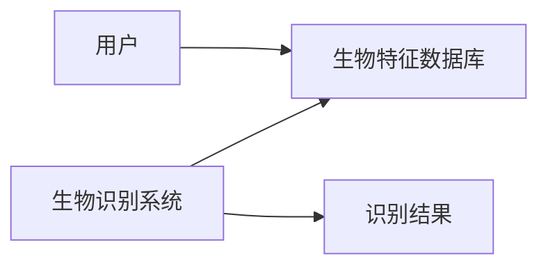
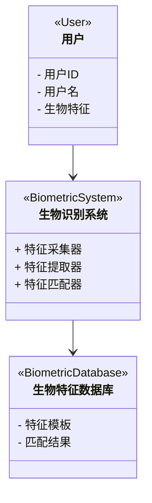
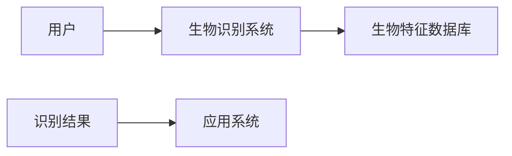
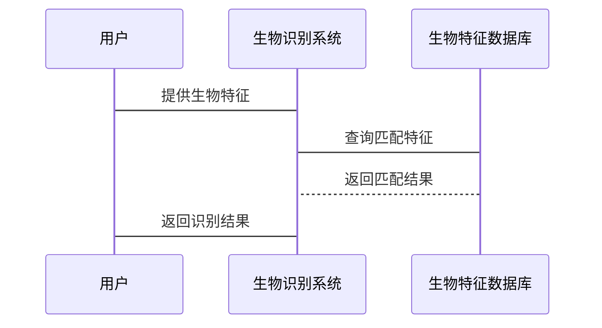

                 


# 价值投资中的新一代生物识别安全技术前景

## 关键词：生物识别技术，价值投资，金融安全，人工智能，深度学习

## 摘要：随着信息技术的飞速发展，生物识别技术在金融安全中的应用日益广泛。本文将探讨生物识别技术在价值投资中的前景，分析其在身份验证、风险控制和数据安全等方面的作用，结合实际案例，展望其未来发展趋势。

---

# 第一部分：生物识别技术的背景与概述

## 第1章：生物识别技术的背景与概述

### 1.1 生物识别技术的定义与发展

#### 1.1.1 生物识别技术的定义
生物识别技术是一种通过人体的生物特征（如指纹、面部、虹膜、声音等）进行身份验证的技术。它利用独特的生理特征或行为特征来识别个体身份，具有高安全性和便捷性。

#### 1.1.2 生物识别技术的发展历程
生物识别技术的发展可以追溯到20世纪60年代。早期的技术主要用于军事和政府领域，随着计算机技术和传感器的进步，生物识别技术逐渐应用于民用领域，如金融、医疗和教育等。

#### 1.1.3 生物识别技术的核心特征
- **唯一性**：每个人的生物特征都是独特的，几乎不可能被仿冒。
- **安全性**：生物识别技术比传统的密码验证更加安全，降低了身份盗窃的风险。
- **便捷性**：无需记忆复杂的密码，用户可以通过指纹、面部等特征轻松完成身份验证。

### 1.2 生物识别技术在金融领域的应用

#### 1.2.1 金融领域的安全需求
金融领域对安全性要求极高，传统的密码验证方式容易被盗用或破解，而生物识别技术提供了更高的安全性。

#### 1.2.2 生物识别技术在金融领域的应用场景
- **身份验证**：在银行开户、支付授权等场景中，通过指纹或面部识别验证用户身份。
- **交易授权**：在在线支付、证券交易等场景中，生物识别技术可以快速确认交易发起人身份。
- **风险管理**：通过分析用户的生物特征和行为模式，识别潜在的欺诈行为。

#### 1.2.3 生物识别技术的优势与挑战
优势：
- 高安全性：生物特征难以被篡改或伪造。
- 用户友好：无需记忆复杂的密码，操作便捷。

挑战：
- 成本问题：生物识别设备的采购和维护成本较高。
- 技术限制：部分生物识别技术在极端环境下的识别率较低。
- 隐私问题：生物特征数据的采集和存储需要严格保护，防止数据泄露。

### 1.3 价值投资中的安全需求

#### 1.3.1 价值投资的基本概念
价值投资是一种投资策略，旨在通过分析企业的基本面（如财务状况、行业地位、盈利能力等）来选择具有长期增长潜力的股票。

#### 1.3.2 价值投资中的安全风险
在价值投资中，投资者需要保护自己的账户和交易安全，防止未经授权的访问或欺诈行为。

#### 1.3.3 生物识别技术在价值投资中的潜在价值
生物识别技术可以帮助投资者提高账户安全，保护投资信息不被泄露或篡改，从而增强投资者对投资平台的信任。

### 1.4 本章小结
本章介绍了生物识别技术的定义、发展历程及其在金融领域的应用，特别是其在价值投资中的潜在价值。通过分析生物识别技术的优势与挑战，为后续章节的探讨奠定了基础。

---

## 第2章：生物识别技术的核心概念与原理

### 2.1 生物识别技术的核心概念

#### 2.1.1 生物特征的定义与分类
生物特征可以分为生理特征和行为特征两大类：
- **生理特征**：指纹、面部、虹膜等。
- **行为特征**：声音、步态、写字习惯等。

#### 2.1.2 生物识别系统的组成部分
- **特征采集器**：用于采集用户的生物特征数据（如指纹扫描仪）。
- **特征提取器**：将采集的生物特征转化为数字特征。
- **特征匹配器**：将提取的特征与数据库中的特征进行匹配，确认用户身份。

#### 2.1.3 生物识别技术的分类与对比
| 技术类型   | 优点                     | 缺点                       |
|------------|--------------------------|---------------------------|
| 指纹识别    | 识别率高，成本低         | 易受皮肤磨损影响           |
| 面部识别    | 非接触式，适用性广       | 易受光照、角度影响         |
| 虹膜识别    | 精度高，抗干扰能力强     | 设备成本高                 |

### 2.2 生物识别技术的数学模型与算法

#### 2.2.1 基于特征提取的生物识别算法
- **特征提取**：将生物特征转化为数字特征，如指纹的 ridge 和 valley。
- **特征匹配**：将提取的特征与数据库中的特征进行比对，确认身份。

#### 2.2.2 基于模式匹配的生物识别算法
- **模式匹配**：通过计算两个特征向量之间的相似度，判断是否为同一人。

#### 2.2.3 基于深度学习的生物识别算法
- **深度学习模型**：如卷积神经网络（CNN）用于图像识别，能够自动提取特征，识别精度更高。

### 2.3 生物识别技术的实体关系图


### 2.4 本章小结
本章详细介绍了生物识别技术的核心概念，包括生物特征的分类、识别系统的组成部分以及不同算法的优缺点。通过对比不同技术，帮助读者理解如何选择适合的生物识别技术。

---

## 第3章：生物识别技术的算法原理与实现

### 3.1 生物识别算法的流程图


### 3.2 基于指纹识别的算法实现

#### 3.2.1 指纹识别的原理
- **特征提取**：提取指纹的 ridge、valley、endings 等特征。
- **特征匹配**：将提取的特征与数据库中的特征进行比对。

#### 3.2.2 指纹识别的Python实现代码
```python
def fingerprint_recognition(fingerprint_template):
    # 特征提取
    features = extract_features(fingerprint_template)
    # 特征匹配
    matched = match_features(features)
    return matched
```

### 3.3 基于面部识别的算法实现

#### 3.3.1 面部识别的原理
- **预处理**：对图像进行灰度化、归一化等处理。
- **特征提取**：提取面部的关键特征点，如眼睛、鼻子、嘴巴的位置和形状。
- **特征匹配**：将提取的特征与数据库中的特征进行比对。

#### 3.3.2 面部识别的Python实现代码
```python
def face_recognition(face_image):
    # 预处理
    preprocessed_image = preprocess_image(face_image)
    # 特征提取
    features = extract_features(preprocessed_image)
    # 特征匹配
    matched = match_features(features)
    return matched
```

### 3.4 本章小结
本章通过流程图和代码示例，详细讲解了指纹识别和面部识别的算法原理，帮助读者理解生物识别技术的核心实现过程。

---

## 第4章：生物识别技术的系统分析与架构设计

### 4.1 问题场景介绍
- **场景描述**：在价值投资中，投资者需要对自己的账户和交易进行安全验证。
- **目标**：通过生物识别技术，实现高安全性的身份验证。

### 4.2 系统功能设计

#### 4.2.1 领域模型


#### 4.2.2 系统架构设计


#### 4.2.3 系统交互设计


### 4.3 本章小结
本章通过领域模型和系统架构图，详细介绍了生物识别技术在金融系统中的应用设计，为后续的项目实施提供了理论基础。

---

## 第5章：生物识别技术的项目实战

### 5.1 环境安装与配置

#### 5.1.1 安装Python环境
```bash
# 安装Python
python --version
pip install --upgrade pip
```

#### 5.1.2 安装生物识别库
```bash
pip install numpy
pip install scikit-learn
pip install cv2
```

### 5.2 系统核心实现

#### 5.2.1 指纹识别实现
```python
import cv2

def fingerprint_recognition(fingerprint_template):
    # 特征提取
    features = extract_features(fingerprint_template)
    # 特征匹配
    matched = match_features(features)
    return matched
```

#### 5.2.2 面部识别实现
```python
import cv2

def face_recognition(face_image):
    # 预处理
    preprocessed_image = preprocess_image(face_image)
    # 特征提取
    features = extract_features(preprocessed_image)
    # 特征匹配
    matched = match_features(features)
    return matched
```

### 5.3 实际案例分析

#### 5.3.1 案例背景
- **案例名称**：银行系统身份验证
- **案例描述**：通过生物识别技术实现用户身份验证，确保交易安全。

#### 5.3.2 案例实现
```python
# 示例代码
import cv2

def main():
    # 初始化生物识别系统
    biometric_system = BiometricSystem()
    # 用户提供生物特征
    user_feature = input_feature()
    # 身份验证
    result = biometric_system.authenticate(user_feature)
    print("身份验证结果:", result)

if __name__ == "__main__":
    main()
```

### 5.4 本章小结
本章通过实际案例分析和代码实现，展示了生物识别技术在金融系统中的应用，帮助读者理解其实际价值。

---

## 第6章：最佳实践与展望

### 6.1 最佳实践 tips
- **数据加密**：生物特征数据必须加密存储，防止数据泄露。
- **多因素认证**：结合多种生物识别技术，提高安全性。
- **系统维护**：定期更新系统和算法，应对新兴的安全威胁。

### 6.2 总结与展望
- **总结**：生物识别技术在价值投资中的应用前景广阔，能够有效提升账户和交易的安全性。
- **展望**：随着人工智能和深度学习技术的进步，生物识别技术将更加智能化和便捷化，为价值投资提供更高的安全保障。

### 6.3 注意事项
- **数据隐私**：生物特征数据是用户的敏感信息，必须严格保护。
- **系统稳定性**：生物识别系统的稳定性直接影响用户体验和安全性。
- **法律法规**：在应用生物识别技术时，需遵守相关法律法规，确保合规性。

---

## 作者：AI天才研究院/AI Genius Institute & 禅与计算机程序设计艺术 /Zen And The Art of Computer Programming

---

以上是《价值投资中的新一代生物识别安全技术前景》的技术博客文章的完整内容。

