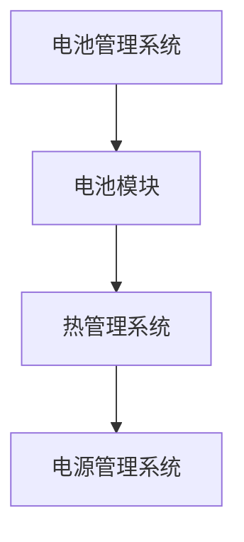
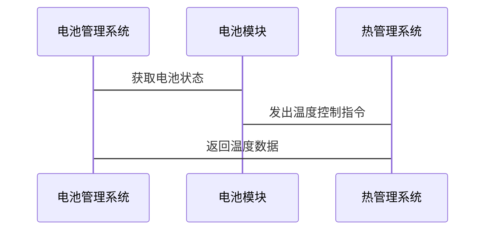

                 


# 价值投资中的新一代高能密度电池技术前景

## 关键词
高能密度电池，价值投资，新能源，电池技术，投资分析

## 摘要
高能密度电池技术作为新能源领域的重要组成部分，正在推动电动汽车、储能系统和消费电子等行业的快速发展。本文从技术背景、核心原理、市场分析、投资策略等多方面详细探讨高能密度电池技术的前景，结合实际案例分析，为投资者提供有价值的参考。

---

# 第1章: 高能密度电池技术的背景与概念

## 1.1 高能密度电池技术的定义与特点
### 1.1.1 高能密度电池的定义
高能密度电池是指能量密度较高的电池，通常指单位体积或单位质量的能量。高能密度电池技术通过优化材料和结构设计，显著提升了电池的储能能力和输出功率。

### 1.1.2 高能密度电池的核心技术特点
- **高能量密度**：相比传统电池，高能密度电池的能量密度提升显著。
- **快速充放电能力**：支持高功率输出，适合电动汽车和消费电子设备。
- **长循环寿命**：经过多次充放电后，性能衰减较小。
- **安全性高**：采用先进的材料和管理系统，降低安全隐患。

### 1.1.3 高能密度电池的分类与应用领域
高能密度电池主要分为锂离子电池、钠离子电池和其他新型电池。应用领域包括电动汽车、储能系统、消费电子和工业设备。

## 1.2 价值投资与高能密度电池技术的结合
### 1.2.1 价值投资的基本概念
价值投资是一种长期投资策略，通过分析企业的基本面，寻找被市场低估的投资标的。

### 1.2.2 高能密度电池技术在投资中的重要性
高能密度电池技术的进步推动了新能源行业的快速发展，具备较大的市场潜力和投资价值。

### 1.2.3 高能密度电池技术的未来发展趋势
随着技术的进步和市场需求的增加，高能密度电池技术将继续优化，推动行业向更高能密度和更低的成本方向发展。

## 1.3 高能密度电池技术的市场现状与前景
### 1.3.1 全球高能密度电池市场的现状分析
全球高能密度电池市场快速增长，主要驱动力来自电动汽车和储能系统的市场需求。

### 1.3.2 高能密度电池技术的未来市场潜力
预计未来几年，高能密度电池市场将继续保持增长态势，尤其是在电动汽车领域。

### 1.3.3 技术进步对市场的影响
技术进步将降低生产成本，提高电池性能，进一步扩大市场应用。

---

# 第2章: 高能密度电池技术的核心原理

## 2.1 高能密度电池的材料科学基础
### 2.1.1 正极材料的选择与优化
正极材料是影响电池能量密度的关键因素，常用的材料包括钴酸锂、锰酸锂和磷酸铁锂等。

### 2.1.2 负极材料的选择与优化
负极材料通常采用石墨或金属硅，影响电池的充放电性能。

### 2.1.3 电解液的作用与优化
电解液是电池的关键组成部分，影响电池的电化学性能和安全性。

## 2.2 高能密度电池的制造工艺
### 2.2.1 电池制造的主要工艺流程
包括原材料制备、极片制备、电池组装、化成和测试等环节。

### 2.2.2 制造工艺对电池性能的影响
制造工艺的优化可以显著提升电池的能量密度和循环寿命。

### 2.2.3 先进制造技术的应用
采用自动化生产线和精密制造技术，提高生产效率和产品一致性。

## 2.3 高能密度电池的系统集成与优化
### 2.3.1 电池管理系统（BMS）的作用
BMS负责监控电池状态，确保电池安全运行。

### 2.3.2 热管理系统的优化
有效的热管理可以提升电池的充放电效率和循环寿命。

### 2.3.3 电池模块与Pack设计
通过优化电池模块和Pack设计，提高电池系统的能量密度和安全性。

---

# 第3章: 高能密度电池技术的市场分析与投资机会

## 3.1 高能密度电池技术的市场需求分析
### 3.1.1 新能源汽车市场的增长驱动
新能源汽车的快速发展是高能密度电池市场需求的主要驱动力。

### 3.1.2 储能系统的需求增长
随着可再生能源的广泛应用，储能系统的需求将持续增长。

### 3.1.3 消费电子领域的潜在机会
高能密度电池在消费电子领域的应用前景广阔。

## 3.2 高能密度电池技术的市场竞争格局
### 3.2.1 主要厂商的技术与市场份额
全球主要厂商包括宁德时代、比亚迪、松下和三星等。

### 3.2.2 新进入者的挑战与机遇
新进入者需要克服技术壁垒和成本优势。

### 3.2.3 技术研发的投入与成果
技术研发是高能密度电池技术进步的核心驱动力。

## 3.3 高能密度电池技术的投资价值评估
### 3.3.1 技术壁垒与竞争优势分析
高技术壁垒和成本优势是高能密度电池企业的核心竞争力。

### 3.3.2 市场容量与增长潜力评估
预计未来几年，高能密度电池市场将继续保持快速增长。

### 3.3.3 投资风险与回报预期
高能密度电池技术投资风险较低，回报预期较高。

---

# 第4章: 高能密度电池技术与价值投资的结合

## 4.1 高能密度电池技术的财务分析
### 4.1.1 企业的财务指标分析
关注企业的收入增长、利润率和研发投入等财务指标。

### 4.1.2 技术研发的投入产出分析
评估企业的研发投入与技术成果的匹配程度。

### 4.1.3 市场地位与盈利能力评估
分析企业的市场地位和盈利能力，判断其投资价值。

## 4.2 高能密度电池技术的估值模型
### 4.2.1 市盈率与市净率的比较
通过市盈率和市净率的比较，评估企业的估值水平。

### 4.2.2 现金流折现模型的应用
使用现金流折现模型评估企业的未来现金流价值。

### 4.2.3 增长型企业的估值方法
针对高增长型企业，采用PEG（市盈率相对盈利增长比率）等估值方法。

## 4.3 高能密度电池技术的长期投资策略
### 4.3.1 长期技术趋势的判断
关注高能密度电池技术的长期发展趋势，选择具备技术优势的企业。

### 4.3.2 行业周期的分析与把握
分析行业周期，把握投资的最佳时机。

### 4.3.3 风险控制与投资组合优化
通过多元化投资和风险控制，优化投资组合，降低投资风险。

---

# 第5章: 高能密度电池技术的系统架构与投资分析

## 5.1 高能密度电池技术的系统架构
### 5.1.1 问题场景介绍
高能密度电池技术的系统架构设计需要考虑能量密度、安全性、成本和寿命等多个因素。

### 5.1.2 项目介绍
以某高能密度电池项目为例，分析其系统架构设计。

### 5.1.3 系统功能设计
采用领域模型设计方法，明确系统的功能模块和交互关系。

## 5.2 系统架构设计
### 5.2.1 系统架构设计mermaid图


### 5.2.2 系统架构优化
通过优化系统架构设计，提升电池系统的整体性能。

## 5.3 系统接口设计
### 5.3.1 系统接口设计
明确电池管理系统、热管理系统和其他子系统的接口设计。

### 5.3.2 系统交互设计
通过序列图展示系统的交互过程。

## 5.4 系统交互设计
### 5.4.1 系统交互mermaid序列图


---

# 第6章: 高能密度电池技术的项目实战

## 6.1 环境安装
### 6.1.1 环境需求
安装必要的软件环境，包括Python、Jupyter Notebook和相关库。

## 6.2 系统核心实现源代码
### 6.2.1 数据分析代码
```python
import pandas as pd
import numpy as np

# 读取数据
data = pd.read_csv('battery_data.csv')

# 数据预处理
data['energy_density'] = data['energy_density'].apply(lambda x: x * 0.85)

# 可视化
import matplotlib.pyplot as plt
plt.plot(data['year'], data['energy_density'])
plt.xlabel('Year')
plt.ylabel('Energy Density')
plt.show()
```

## 6.3 代码应用解读与分析
### 6.3.1 数据分析结果
通过数据分析，展示高能密度电池技术的市场趋势和潜在投资机会。

## 6.4 实际案例分析
### 6.4.1 投资案例分析
以某高能密度电池企业为例，分析其财务状况、市场地位和投资价值。

## 6.5 项目小结
### 6.5.1 项目总结
通过项目实战，验证高能密度电池技术的投资价值。

---

# 第7章: 总结与展望

## 7.1 总结
高能密度电池技术是新能源领域的重要组成部分，具备广阔的应用前景和投资价值。

## 7.2 未来展望
随着技术的不断进步和市场需求的增加，高能密度电池技术将继续推动新能源行业的发展。

---

作者：AI天才研究院

