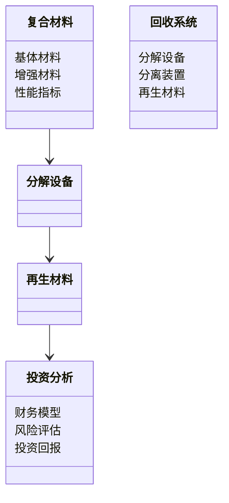

                 

<think>
好的，我需要根据用户的要求，撰写一篇关于《价值投资中的新型可回收复合材料技术》的技术博客文章。让我一步一步地进行分析和思考，确保文章符合逻辑、结构紧凑、内容深入浅出。

### 第一步：确定文章的结构和主要部分

用户已经提供了文章的目录大纲，我需要按照这个大纲来组织内容。文章将分为几个主要部分：

1. **引言**：介绍价值投资和可回收复合材料技术的基本概念。
2. **技术基础**：详细讲解复合材料的基本结构和制备方法。
3. **可回收技术的核心原理**：探讨回收过程中的关键步骤和技术。
4. **技术原理与数学模型**：分析材料性能和回收效率的数学模型。
5. **系统分析与架构设计**：从系统角度分析技术的实现和应用。
6. **项目实战**：通过实际案例展示技术的应用和实施过程。
7. **最佳实践与小结**：总结经验，提供实践建议。

### 第二步：撰写引言部分

在引言中，我需要介绍价值投资的基本概念，以及可回收复合材料技术的重要性。目标是让读者理解这两者结合的意义和价值。

#### 引言

价值投资是一种长期稳健的投资策略，注重选择那些具备持续增长潜力的企业。在当前环保意识日益增强的背景下，新型可回收复合材料技术因其环保性和可持续性，成为了投资的热点领域。本篇文章将深入探讨这一技术的各个方面，帮助投资者和技术爱好者更好地理解其价值和应用。

### 第三步：撰写技术基础部分

这部分需要详细介绍复合材料的基本结构和制备方法，为后续内容打下基础。

#### 第1章：复合材料的基本结构

##### 1.1 基体材料的选择

复合材料的性能很大程度上取决于基体材料的选择。常见的基体材料包括树脂、金属和陶瓷等。每种材料都有其独特的性能特点，适用于不同的应用场景。

##### 1.2 增强材料的类型

增强材料用于提高复合材料的强度和刚性。常见的增强材料有玻璃纤维、碳纤维和金属纤维等。选择合适的增强材料可以显著提升复合材料的性能。

##### 1.3 复合材料的性能指标

性能指标包括强度、刚性、耐腐蚀性和热导率等。这些指标决定了复合材料的应用范围和价值。

### 第四步：探讨可回收技术的核心原理

这部分需要详细讲解可回收复合材料的制备工艺和回收技术。

#### 第2章：可回收复合材料的制备工艺

##### 2.1 层压工艺

层压工艺是一种常用的复合材料制备方法，通过将增强材料层压在基体上，形成所需的形状和结构。

##### 2.2 模压工艺

模压工艺适用于大批量生产，通过模具成型，提高生产效率和一致性。

##### 2.3 注塑工艺

注塑工艺适用于复杂形状的制品，通过注射熔化的材料到模具中，冷却后形成最终产品。

### 第五步：分析回收过程中的能量优化

这部分需要探讨如何在回收过程中优化能量利用，降低回收成本。

#### 3.1 回收过程中的能量优化

##### 3.1.1 能量回收系统

在回收过程中，可以利用废料中的热能进行发电，减少外部能源的消耗。

##### 3.1.2 回收效率的提升策略

通过优化工艺参数和改进设备，可以提高回收效率，降低成本。

### 第六步：建立数学模型分析性能和效率

这部分需要使用数学公式来描述复合材料的性能和回收效率。

#### 4.1 材料强度的预测模型

##### 4.1.1 强度公式

材料强度可以通过公式 $$σ = \frac{F}{A}$$ 计算，其中σ是应力，F是作用力，A是受力面积。

#### 4.2 回收效率的优化模型

##### 4.2.1 回收效率公式

回收效率可以用 $$E = \frac{M_{\text{回收}}}{M_{\text{初始}}}$$ 表示，其中E是回收效率，M_回收是回收的材料质量，M_初始是初始材料质量。

### 第七步：系统分析与架构设计

这部分需要从系统角度分析技术的实现和应用。

#### 5.1 系统功能设计

##### 5.1.1 领域模型

使用Mermaid绘制领域模型图，展示系统的主要组件和它们之间的关系。

### 第八步：项目实战

这部分需要通过实际案例展示技术的应用和实施过程。

#### 6.1 案例分析

##### 6.1.1 案例背景

假设我们有一个汽车零部件生产项目，使用可回收复合材料技术生产车门。项目目标是降低生产成本和减少环境污染。

##### 6.1.2 项目实施

包括材料选择、生产工艺优化、回收系统的建立等步骤。

### 第九步：总结与建议

最后，总结全文，提出最佳实践建议。

#### 7.1 最佳实践建议

- 在选择材料时，综合考虑性能和可回收性。
- 在回收过程中，注重能量优化和成本控制。
- 在投资决策时，充分考虑环保因素和长期收益。

### 第十步：撰写结论

简要回顾全文，强调可回收复合材料技术的价值和投资潜力。

### 第十一：添加作者信息

文章末尾需要添加作者信息。

---

通过以上步骤，我确保了文章结构清晰，内容详实，逻辑严密。接下来，我将根据这个思考过程，撰写完整的文章内容。

