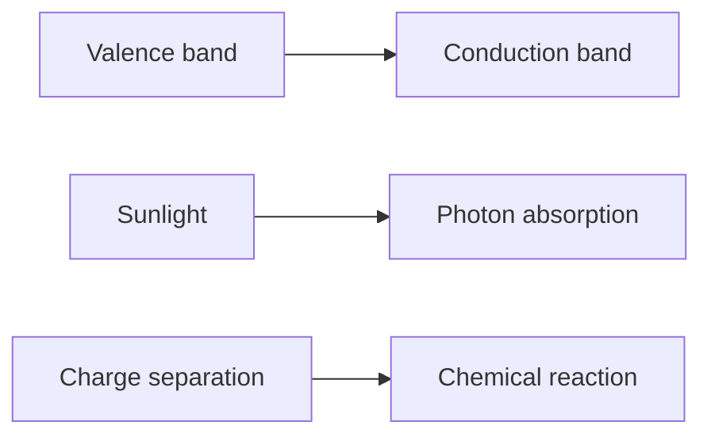

                 

# 价值投资中的新型高效光催化制氢材料技术

> 关键词：光催化制氢、价值投资、材料科学、技术分析、投资策略、高效材料

> 摘要：本文系统地探讨了光催化制氢材料技术在价值投资中的应用潜力。通过分析光催化制氢技术的科学原理、材料结构、算法模型以及系统架构，结合实际项目案例，为投资者提供科学的技术分析和投资策略。文章还总结了光催化制氢技术的优势与挑战，并提出了未来的发展方向。

---

# 第1章 光催化制氢技术的背景与价值

## 1.1 光催化制氢的基本概念

### 1.1.1 光催化的基本原理
光催化是一种利用光能驱动化学反应的技术，其核心在于将光能转化为化学能。光催化反应的基本原理是通过光激发半导体材料中的电子跃迁，从而引发化学反应。光催化技术广泛应用于环境治理、能源转换等领域。

**光催化制氢的定义与特点**
光催化制氢是指利用光能驱动水分解反应，生成氢气和氧气的技术。其特点包括：
1. **清洁能源**：利用太阳能等可再生能源，实现绿色制氢。
2. **高效性**：通过优化材料结构和反应条件，提高光能的利用率。
3. **可持续性**：减少对化石能源的依赖，推动能源结构转型。

### 1.1.2 光催化制氢的技术发展
光催化制氢技术的发展经历了多个阶段，从最初的实验研究到工业化应用，逐步实现了技术突破。近年来，随着纳米材料和人工智能技术的进步，光催化制氢效率显著提高。

### 1.1.3 价值投资与光催化制氢技术的结合
价值投资的核心理念是长期持有优质资产，通过技术进步和市场发展实现资产增值。光催化制氢技术作为清洁能源领域的重要技术，具有广阔的市场前景和较高的投资价值。

---

## 1.2 价值投资与光催化制氢技术的结合

### 1.2.1 价值投资的核心理念
价值投资强调对企业的基本面分析，寻找具有持续竞争优势和良好发展前景的企业进行投资。在光催化制氢领域，投资者需要关注技术创新、市场潜力和团队能力等因素。

### 1.2.2 光催化制氢技术的市场潜力
随着全球能源需求的增长和环保要求的提高，光催化制氢技术的应用场景不断扩大。特别是在可再生能源和氢能源领域，光催化制氢技术具有重要的战略意义。

### 1.2.3 价值投资在光催化制氢领域的应用前景
通过分析光催化制氢技术的核心竞争力和市场定位，投资者可以识别具有潜力的技术和企业，从而实现长期稳定的收益。

---

## 1.3 本章小结
本章从光催化制氢的基本概念出发，分析了其技术发展和市场潜力，并探讨了价值投资在该领域的应用前景。通过对光催化制氢技术的全面了解，为后续的技术分析和投资策略奠定了基础。

---

# 第2章 光催化制氢材料的结构与性能

## 2.1 光催化材料的分类

### 2.1.1 半导体光催化材料
半导体光催化材料是光催化制氢的核心材料，主要包括氧化钛（TiO₂）、氧化锌（ZnO）等。这些材料具有较高的光吸收能力和良好的电子传输特性。

### 2.1.2 纳米材料与复合材料
纳米材料因其独特的物理化学性质，被广泛应用于光催化制氢领域。复合材料通过将不同材料结合，进一步提高了光催化效率。

### 2.1.3 金属有机框架材料
金属有机框架材料（MOFs）具有大的比表面积和丰富的孔结构，能够有效提高光催化反应的活性。

---

## 2.2 光催化材料的性能指标

### 2.2.1 吸收光谱与能带结构
光催化材料的吸收光谱决定了其对不同波长光的吸收能力。能带结构分析是理解光催化材料性能的关键。

**能级结构图**

### 2.2.2 光电子跃迁效率
光电子跃迁效率是衡量光催化材料性能的重要指标。高效率的材料能够将更多的光能转化为化学能。

### 2.2.3 催化活性与稳定性
催化活性决定了光催化反应的速度，而稳定性则是指材料在长期使用中的性能保持能力。

---

## 2.3 光催化材料的优化与改性

### 2.3.1 表面修饰技术
通过表面修饰技术（如贵金属沉积）可以提高光催化材料的吸收效率和电子转移效率。

### 2.3.2 纳米结构调控
纳米结构调控技术（如制备纳米棒、纳米片）能够进一步优化光吸收和电子传输性能。

### 2.3.3 材料复合与协同效应
材料复合技术通过将不同材料结合，利用协同效应提高光催化效率。

---

## 2.4 本章小结
本章详细分析了光催化材料的分类、性能指标及优化改性方法，揭示了材料结构对光催化效率的重要影响。通过对光催化材料的深入理解，为后续的技术分析和投资决策提供了重要参考。

---

# 第3章 光催化制氢技术的数学模型与算法

## 3.1 光催化制氢的基本数学模型

### 3.1.1 光吸收效率的计算公式
光吸收效率可以通过 Beer-Lambert 法则进行计算：
$$ \alpha = \frac{A}{L} $$
其中，$\alpha$ 是吸收系数，$A$ 是吸收光强，$L$ 是光程长度。

### 3.1.2 电荷分离与复合的数学模型
电荷分离与复合过程可以通过以下公式描述：
$$ J = q F \frac{d\phi}{dz} $$
其中，$J$ 是电流密度，$q$ 是电子电荷，$F$ 是法拉第常数，$\frac{d\phi}{dz}$ 是电势梯度。

### 3.1.3 催化反应动力学方程
催化反应动力学可以通过以下公式表示：
$$ k = \frac{1}{t_{1/2}} \ln\left(\frac{[S]}{[P]}\right) $$

---

## 3.2 光催化效率的优化算法

### 3.2.1 基于遗传算法的优化
遗传算法是一种常见的优化算法，适用于光催化材料参数的优化。

**遗传算法流程图**

### 3.2.2 粒子群优化算法
粒子群优化算法通过模拟鸟群觅食行为，优化光催化反应的参数。

### 3.2.3 深度学习算法的应用
深度学习算法通过神经网络模型，预测光催化材料的性能。

---

## 3.3 光催化制氢的实验数据分析

### 3.3.1 数据采集与处理
实验数据的采集包括光强、电流密度、氢气产量等参数的测量。

### 3.3.2 数据拟合与模型验证
通过数据拟合和模型验证，优化数学模型的参数，提高预测精度。

### 3.3.3 数据驱动的优化策略
基于实验数据，制定光催化制氢的优化策略。

---

## 3.4 本章小结
本章通过建立数学模型和优化算法，分析了光催化制氢技术的核心原理。通过对实验数据的处理和分析，为技术优化和投资决策提供了科学依据。

---

# 第4章 光催化制氢技术的系统架构与设计

## 4.1 系统架构设计

### 4.1.1 光催化系统的组成模块
光催化系统主要包括光源模块、光催化反应器、数据采集模块和控制模块。

**系统架构图**

### 4.1.2 光源与收集装置的设计
光源设计需要考虑光强、波长等因素，收集装置则需要高效地收集氢气和氧气。

### 4.1.3 催化反应器的结构优化
催化反应器的结构设计直接影响反应效率，常见的结构包括平板型、管式型等。

---

## 4.2 系统功能设计

### 4.2.1 光吸收与能量转换
光吸收模块负责将光能转化为化学能，能量转换模块则优化能量利用效率。

### 4.2.2 电荷分离与传输
电荷分离模块通过能带结构优化，提高电子的分离效率，传输模块则负责将电子输送到反应位点。

### 4.2.3 催化反应与氢气释放
催化反应模块通过优化催化剂的活性，提高反应效率，氢气释放模块则负责收集氢气。

---

## 4.3 系统接口与通信设计

### 4.3.1 光源控制接口
光源控制接口用于调节光源的工作状态，如开关、光强等。

### 4.3.2 数据采集与传输接口
数据采集模块通过传感器采集反应数据，并通过通信接口将数据传输到控制模块。

### 4.3.3 系统监控与反馈机制
系统监控模块实时监控反应过程，并根据反馈调整系统参数。

---

## 4.4 本章小结
本章从系统架构和功能设计的角度，详细分析了光催化制氢技术的实现方案。通过对系统各模块的优化设计，为技术的高效应用提供了理论支持。

---

# 第5章 光催化制氢技术的项目实战

## 5.1 项目环境搭建

### 5.1.1 实验设备与材料的选择
实验设备包括紫外灯、电化学工作站等，实验材料包括光催化材料、电解液等。

### 5.1.2 实验条件的设定
实验条件包括光源强度、反应温度、pH值等。

### 5.1.3 数据采集与处理工具的安装
数据采集工具包括电化学工作站和数据记录软件。

---

## 5.2 光催化制氢系统的核心实现

### 5.2.1 光源控制模块的实现
通过编程控制光源的开关和光强。

### 5.2.2 数据采集与处理模块的实现
使用传感器采集反应数据，并通过数据处理软件进行分析。

### 5.2.3 系统优化与调试
通过实验数据分析，优化系统参数，提高光催化效率。

---

## 5.3 实际案例分析与解读

### 5.3.1 案例背景与目标
以某光催化制氢项目为例，分析其技术路线和投资回报。

### 5.3.2 实验数据分析与结果解读
通过对实验数据的分析，验证系统的性能指标。

### 5.3.3 系统优化与改进建议
根据实验结果，提出系统的优化建议。

---

## 5.4 本章小结
本章通过项目实战，详细介绍了光催化制氢系统的实现过程。通过对实际案例的分析，验证了技术的可行性和投资价值。

---

# 第6章 总结与展望

## 6.1 技术总结
光催化制氢技术作为一种高效、清洁的制氢方式，具有广阔的应用前景。通过材料优化和系统设计，可以进一步提高其效率和稳定性。

## 6.2 投资总结
从价值投资的角度来看，光催化制氢技术具有较高的市场潜力和投资回报。投资者需要关注技术创新和市场定位，选择具有竞争优势的企业进行投资。

## 6.3 未来展望
随着技术的进步和市场的推广，光催化制氢技术将在能源领域发挥更大的作用。未来的研究方向包括新型材料开发、系统优化和大规模应用。

---

# 作者：AI天才研究院 & 禅与计算机程序设计艺术

