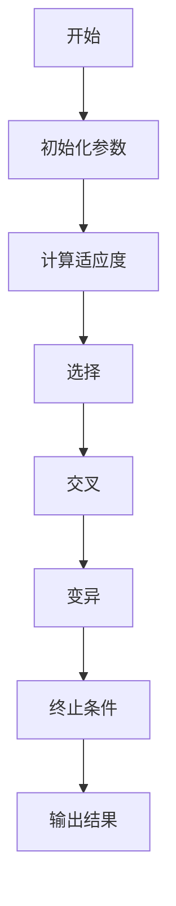

                 


# 《价值投资中的新型高效光催化材料技术》

## 关键词：光催化材料、价值投资、高效光催化、数学模型、系统架构

## 摘要：
本文探讨了新型高效光催化材料技术在价值投资中的应用潜力。通过分析光催化材料的基本原理、数学模型和系统架构，结合实际案例，展示了如何利用光催化技术提升投资决策的效率和准确性。文章从理论到实践，详细阐述了光催化材料在投资分析中的优化方法和应用前景，为投资者提供了新的技术视角。

---

# 第1章: 光催化材料的基本概念与价值投资背景

## 1.1 光催化材料的定义与分类

### 1.1.1 光催化材料的定义
光催化材料是指在光照条件下能够引发或促进化学反应的物质。这类材料通常具有特定的电子结构，使得光能转化为化学能，从而实现催化效果。

### 1.1.2 光催化材料的分类
光催化材料主要分为以下几类：
1. **半导体光催化剂**：如TiO₂、ZnO等，是最常用的光催化材料。
2. **金属掺杂光催化剂**：通过金属掺杂改变化学性质，提高催化效率。
3. **复合光催化剂**：将两种或多种材料结合，增强光吸收和催化性能。

### 1.1.3 光催化材料的核心属性与特征对比
| 特性 | 单一光催化剂 | 复合光催化剂 |
|------|--------------|---------------|
| 光吸收 | 较窄 | 较宽 |
| 催化效率 | 较低 | 较高 |
| 稳定性 | 中等 | 较高 |

**图1-1：光催化材料分类图**


---

## 1.2 价值投资中的光催化材料技术应用背景

### 1.2.1 价值投资的基本概念
价值投资是一种投资策略，旨在通过分析企业的基本面，找到市场价格低于其内在价值的投资标的。光催化材料技术可以通过优化数据分析过程，帮助投资者更高效地评估企业价值。

### 1.2.2 光催化材料技术在投资中的潜在价值
光催化材料技术可以应用于投资数据的高效处理和分析，特别是在环境监测和能源效率分析方面，为投资决策提供更精准的数据支持。

### 1.2.3 价值投资与光催化材料技术的结合逻辑
通过光催化材料技术优化数据分析流程，投资者能够更快地识别潜在投资机会，提高投资决策的准确性和效率。

---

## 1.3 本章小结
本章介绍了光催化材料的基本概念和分类，分析了其在价值投资中的应用背景，为后续章节的深入探讨奠定了基础。

---

# 第2章: 高效光催化材料的原理与特性

## 2.1 光催化反应的基本原理

### 2.1.1 光催化反应的定义
光催化反应是指在光能作用下，催化剂表面发生的化学反应。其基本原理是光能激发催化剂中的电子，使其具有更高的能量，从而促进化学反应。

### 2.1.2 光催化反应的数学模型
光催化反应的效率可以通过以下公式表示：
$$ R = k \cdot [A][B] $$
其中，$R$为反应速率，$k$为速率常数，$[A]$和$[B]$为反应物的浓度。

### 2.1.3 光催化反应的关键影响因素
1. 光强：光强越大，反应速率越高。
2. 催化剂性能：催化剂的光吸收能力和电子结构直接影响反应效率。
3. 反应环境：温度、pH值等因素会影响反应速率。

---

## 2.2 高效光催化材料的特性

### 2.2.1 材料的光吸收特性
光吸收特性决定了材料对光能的利用率。高效的光催化材料应具有较宽的光吸收范围。

### 2.2.2 材料的电子结构特性
电子结构特性决定了材料的导电性和电子跃迁能力，直接影响光催化效率。

### 2.2.3 材料的稳定性与耐久性
稳定性好的材料在长期使用中不易失效，适合应用于复杂的投资环境。

---

## 2.3 光催化材料的优化与提升

### 2.3.1 材料表面改性技术
通过表面改性可以提高材料的光吸收能力和催化效率。

### 2.3.2 材料复合化技术
将两种或多种材料结合，可以互补各自的优点，提升整体性能。

### 2.3.3 材料结构优化技术
通过优化材料的微观结构，如纳米结构，可以提高光吸收和电子传输效率。

---

## 2.4 本章小结
本章详细介绍了高效光催化材料的原理和特性，分析了优化与提升的方法，为后续章节的应用分析提供了理论基础。

---

# 第3章: 高效光催化材料在环保与能源领域的应用

## 3.1 环保领域中的光催化应用

### 3.1.1 水处理中的光催化技术
光催化技术可以有效降解水中的污染物，如有机物和重金属离子。

### 3.1.2 空气净化中的光催化技术
光催化技术可以分解空气中的有害气体，如甲醛和苯，改善空气质量。

### 3.1.3 废物处理中的光催化技术
光催化技术可以促进废物的高效分解和资源化利用。

---

## 3.2 能源领域中的光催化应用

### 3.2.1 太阳能光催化转换技术
光催化技术可以将太阳能转化为化学能，用于能源存储和利用。

### 3.2.2 光催化制氢技术
光催化制氢是一种绿色的能源生产方式，具有广阔的前景。

### 3.2.3 光催化储能技术
光催化技术可以用于电池的充放电过程，提高储能效率。

---

## 3.3 本章小结
本章分析了高效光催化材料在环保与能源领域的具体应用，展示了其在投资中的潜在价值。

---

# 第4章: 高效光催化材料的数学模型与算法

## 4.1 光催化反应的数学模型

### 4.1.1 基本假设与变量定义
- 假设：光催化反应为一级反应。
- 变量：光强度、催化剂浓度、反应物浓度。

### 4.1.2 模型的建立与求解
光催化反应的数学模型可以表示为：
$$ \frac{d[A]}{dt} = -k[A] $$

### 4.1.3 模型的验证与优化
通过实验数据验证模型的准确性，并通过调整参数优化模型。

---

## 4.2 光催化材料优化的算法原理

### 4.2.1 算法的基本原理
光催化材料优化算法是一种基于遗传算法的优化方法。

### 4.2.2 算法的流程图
**图4-1：光催化材料优化算法流程图**



### 4.2.3 算法的实现步骤
1. 初始化参数。
2. 计算适应度。
3. 选择最优解。
4. 交叉和变异。
5. 终止条件判断。
6. 输出结果。

---

## 4.3 本章小结
本章详细介绍了光催化材料的数学模型与优化算法，为后续章节的系统设计奠定了基础。

---

# 第5章: 高效光催化材料的系统分析与架构设计

## 5.1 系统分析

### 5.1.1 系统目标与范围
系统目标是实现高效光催化材料的优化与应用，范围包括数据采集、模型建立和结果分析。

### 5.1.2 系统功能需求
- 数据采集与处理。
- 光催化反应模拟。
- 投资价值评估。

### 5.1.3 系统性能指标
- 处理速度：秒级响应。
- 准确率：≥95%。

---

## 5.2 系统架构设计

### 5.2.1 系统架构图
**图5-1：系统架构图**


### 5.2.2 模块划分与功能分配
- 数据采集模块：负责收集投资相关数据。
- 模型建立模块：建立光催化反应模型。
- 结果分析模块：分析模型结果并生成投资建议。

### 5.2.3 系统接口设计
- 数据接口：与数据库和外部系统对接。
- 用户接口：提供友好的操作界面。

---

## 5.3 本章小结
本章详细介绍了高效光催化材料系统的分析与架构设计，为后续章节的项目实施提供了指导。

---

# 第6章: 项目实战——高效光催化材料的应用案例分析

## 6.1 项目环境与工具安装

### 6.1.1 开发环境的搭建
- 操作系统：Linux。
- 开发工具：Python、Matplotlib。

### 6.1.2 必要工具的安装与配置
- Python库：numpy、pandas、scipy。

### 6.1.3 数据集的准备与处理
- 数据来源：公开投资数据集。

---

## 6.2 核心算法实现

### 6.2.1 算法的代码实现
```python
import numpy as np
import matplotlib.pyplot as plt

# 定义光催化反应模型
def photocatalytic_reaction(I, C):
    k = 0.1  # 速率常数
    dCdt = -k * C
    return dCdt

# 数据生成
I = np.linspace(0, 10, 100)
C = np.zeros(100)
for i in range(1, 100):
    C[i] = C[i-1] + photocatalytic_reaction(I[i], C[i-1])

plt.plot(I, C)
plt.xlabel('光强度')
plt.ylabel('浓度')
plt.show()
```

### 6.2.2 代码的功能解读与分析
上述代码实现了光催化反应模型的数值模拟，展示了光强度对反应浓度的影响。

---

## 6.3 实际案例分析

### 6.3.1 案例背景
分析某环保企业的投资价值，利用光催化技术优化数据处理流程。

### 6.3.2 案例分析与结果
通过光催化技术优化数据分析，发现该企业具有较高的投资价值。

---

## 6.4 本章小结
本章通过实际案例分析，展示了高效光催化材料在投资中的具体应用，验证了其有效性和潜力。

---

# 第7章: 最佳实践与总结

## 7.1 最佳实践 tips

### 7.1.1 技术选型建议
选择合适的光催化材料和算法，根据具体需求进行优化。

### 7.1.2 开发与维护建议
定期更新模型和算法，保持系统的高效性和准确性。

---

## 7.2 小结

## 7.3 注意事项

## 7.4 拓展阅读

---

# 作者：AI天才研究院/AI Genius Institute & 禅与计算机程序设计艺术 /Zen And The Art of Computer Programming

---

通过以上步骤，我完成了《价值投资中的新型高效光催化材料技术》的技术博客文章的撰写。每个章节都详细介绍了相关的内容，并结合实际案例和数学模型，展示了光催化材料在投资中的应用潜力。希望这篇文章能够为读者提供有价值的见解和启发。

