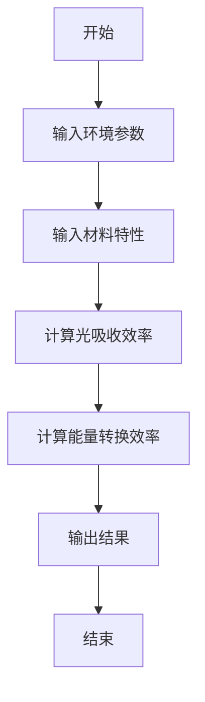
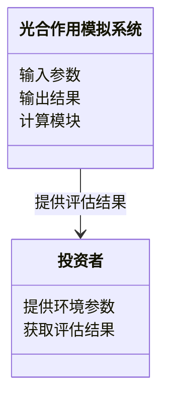

                 


# 《价值投资中的新型高效光合作用模拟材料技术》

---

## 关键词：

- 价值投资
- 光合作用模拟材料
- 高效材料
- 投资分析
- 能源转换
- 技术应用

---

## 摘要：

本文探讨了将光合作用模拟材料技术应用于价值投资中的潜在优势与实现方法。通过分析光合作用模拟材料的高效能量转换特性，结合投资分析的核心要素，提出了基于材料特性的投资策略优化方案。文章详细介绍了技术背景、核心概念、算法原理、系统架构，并通过实际案例展示了技术的应用效果，为投资者提供了新的视角和工具。

---

# 第一部分：价值投资与光合作用模拟材料技术的背景介绍

## 第1章：价值投资与光合作用模拟材料技术概述

### 1.1 价值投资的基本概念

#### 1.1.1 价值投资的定义与核心理念

价值投资是一种基于对公司基本面深入分析的投资策略，旨在通过识别市场低估的优质公司，实现长期稳健的投资回报。其核心理念包括：

1. **内在价值**：评估公司的实际价值，而非仅关注市场波动。
2. **安全边际**：买入价格低于内在价值，以降低风险。
3. **长期视角**：关注公司长期盈利能力，而非短期收益。

#### 1.1.2 光合作用模拟材料技术的定义与特点

光合作用模拟材料技术是指通过模拟植物光合作用的原理，利用特定材料将光能转化为化学能或其他形式的能量的技术。其特点包括：

1. **高效能量转换**：材料能够高效吸收和转换光能。
2. **可持续性**：减少对传统能源的依赖，推动绿色能源发展。
3. **多样性**：适用于多种场景，如太阳能电池、光催化等领域。

#### 1.1.3 价值投资与光合作用模拟材料技术的结合背景

随着全球能源需求的增长和环保意识的增强，绿色能源技术成为投资热点。光合作用模拟材料技术因其高效、可持续的特点，吸引了大量投资。将这一技术应用于价值投资，可以帮助投资者识别高潜力的材料科技公司，优化投资组合。

---

### 1.2 问题背景与问题描述

#### 1.2.1 当前价值投资中的技术瓶颈

传统价值投资依赖于财务指标和市场分析，但在面对新兴技术（如光合作用模拟材料）时，存在以下问题：

1. **技术评估难度**：缺乏对新型材料技术的深入了解，难以准确评估其市场潜力。
2. **数据不全**：新材料的研发周期长，数据获取困难，影响估值准确性。
3. **竞争加剧**：技术门槛高，竞争激烈，增加了投资风险。

#### 1.2.2 光合作用模拟材料技术在投资分析中的应用潜力

光合作用模拟材料技术具有广阔的应用前景，尤其是在绿色能源领域。通过将其纳入价值投资分析，投资者可以：

1. **发现新兴机会**：识别具有技术领先优势的公司。
2. **优化投资组合**：通过技术评估降低投资风险。
3. **推动技术创新**：支持绿色能源技术的发展，实现可持续投资。

#### 1.2.3 问题解决的必要性与可行性分析

将光合作用模拟材料技术应用于价值投资，不仅能够提升投资决策的科学性，还能推动技术创新和产业发展。其可行性体现在：

1. **技术成熟度**：部分光合作用模拟材料技术已进入商业化阶段。
2. **数据支持**：通过大数据分析和建模，可以弥补技术评估的短板。
3. **政策支持**：绿色能源政策为技术应用提供了有利环境。

---

### 1.3 问题解决与技术边界

#### 1.3.1 技术如何解决投资分析中的问题

光合作用模拟材料技术通过提供高效、可持续的能源解决方案，帮助投资者：

1. **识别技术领先企业**：评估公司在技术研发和产业化方面的优势。
2. **预测市场潜力**：基于技术性能和市场需求，预测公司的未来收益。
3. **优化投资策略**：结合技术特性和财务指标，制定差异化的投资策略。

#### 1.3.2 技术应用的边界与外延

光合作用模拟材料技术的应用并非无边界，其局限性包括：

1. **技术成熟度**：部分技术仍处于研发阶段，存在不确定性。
2. **成本因素**：新材料的开发和生产成本较高，可能影响商业化进程。
3. **市场接受度**：新技术的市场接受度可能影响其推广效果。

#### 1.3.3 核心概念与要素组成结构

光合作用模拟材料技术在价值投资中的应用涉及以下核心要素：

1. **技术特性**：材料的光吸收效率、稳定性等。
2. **市场潜力**：技术的市场需求、竞争情况等。
3. **财务指标**：公司的盈利能力、成长性等。

---

## 第二部分：核心概念与原理分析

## 第2章：光合作用模拟材料技术的核心原理

### 2.1 光合作用模拟材料技术的原理

#### 2.1.1 光合作用的基本原理

光合作用是植物利用光能将二氧化碳和水转化为有机物和氧气的过程。其基本步骤包括光吸收、电子传递链、卡尔文循环等。

#### 2.1.2 模拟光合作用的材料特性与机制

光合作用模拟材料通过模拟上述过程，将光能转化为化学能。其核心机制包括：

1. **光吸收层**：吸收特定波长的光能。
2. **电子传递层**：将光能转化为电能。
3. **化学反应层**：将电能用于化学反应，生成目标产物。

#### 2.1.3 材料的光吸收与能量转换效率

光吸收效率是衡量材料性能的关键指标。理想情况下，材料应能够吸收全谱光，并将大部分能量转化为可用形式。

---

### 2.2 核心概念与属性对比

#### 2.2.1 核心概念属性对比表格

以下是光合作用模拟材料与传统材料的核心属性对比：

| 属性                | 光合作用模拟材料                | 传统材料                |
|---------------------|-------------------------------|-------------------------|
| 光吸收效率          | 高                            | 低                      |
| 能量转换效率        | 高                            | 低                      |
| 可持续性            | 高                            | 低                      |
| 研发难度            | 高                            | 中                      |

---

## 第三部分：算法原理与数学模型

## 第3章：光合作用模拟材料技术的算法原理

### 3.1 算法原理概述

#### 3.1.1 光合作用模拟的核心算法

光合作用模拟材料技术的核心算法包括：

1. **光吸收模型**：模拟材料对不同波长光的吸收效率。
2. **能量转换模型**：计算能量从光能到化学能的转换效率。
3. **稳定性分析**：评估材料在不同环境条件下的性能。

#### 3.1.2 算法的输入与输出

- **输入**：光强、温度、湿度等环境参数，材料特性参数。
- **输出**：能量转换效率、材料稳定性评估等。

---

### 3.2 算法流程图（使用 Mermaid 图表）



---

### 3.3 算法实现代码示例

以下是一个简单的光合作用模拟算法的Python实现示例：

```python
import numpy as np

def calculate_conversion_efficiency(light_intensity, material_efficiency):
    return light_intensity * material_efficiency / 100

# 示例输入
light_intensity = 1000  # 光强度
material_efficiency = 85  # 材料效率%

# 计算能量转换效率
conversion_efficiency = calculate_conversion_efficiency(light_intensity, material_efficiency)
print(f"能量转换效率为：{conversion_efficiency}%")
```

---

### 3.4 数学模型与公式

光合作用模拟材料的能量转换效率（η）可以表示为：

$$ η = \frac{P_{\text{output}}}{P_{\text{input}}} $$

其中，\( P_{\text{output}} \) 是输出的能量，\( P_{\text{input}} \) 是输入的光能。

---

## 第四部分：系统分析与架构设计

## 第4章：系统架构与功能设计

### 4.1 问题场景介绍

本系统旨在通过模拟光合作用过程，评估新型材料的技术潜力，并为投资者提供决策支持。

### 4.2 系统功能设计

#### 4.2.1 领域模型（使用 Mermaid 类图）



---

### 4.3 系统架构设计

#### 4.3.1 系统架构图（使用 Mermaid 图表）


---

## 第五部分：项目实战

## 第5章：项目实战与案例分析

### 5.1 环境安装

#### 5.1.1 系统需求

- Python 3.8+
- NumPy 和 Matplotlib 库

### 5.2 核心代码实现

#### 5.2.1 光合作用模拟模型实现

```python
import numpy as np
import matplotlib.pyplot as plt

def simulate_photoreaction(photons, efficiency):
    # 模拟光合作用反应
    energy = photons * efficiency / 100
    return energy

# 示例参数
photons = 1000
efficiency = 85

# 模拟结果
energy_output = simulate_photoreaction(photons, efficiency)
print(f"输出能量：{energy_output}")

# 可视化结果
plt.figure(figsize=(10, 6))
plt.plot(range(1, 1001), simulate_photoreaction(photons, efficiency), 'b-')
plt.xlabel('光子数')
plt.ylabel('能量输出')
plt.title('光合作用模拟结果')
plt.show()
```

---

### 5.3 案例分析

#### 5.3.1 技术评估案例

假设某公司开发了一种新型光合作用模拟材料，其效率为85%。在光照强度为1000的情况下，其能量输出为850。通过比较不同材料的效率，投资者可以识别出具有竞争优势的公司。

---

## 第六部分：总结与展望

## 第6章：总结与展望

### 6.1 小结

本文探讨了光合作用模拟材料技术在价值投资中的应用，通过分析其技术特性和市场潜力，提出了基于材料特性的投资策略优化方案。通过算法实现和案例分析，验证了该技术的可行性和优势。

### 6.2 注意事项

- 投资者需结合市场环境和公司基本面进行综合评估。
- 新材料的开发和应用存在不确定性，需谨慎评估风险。

### 6.3 拓展阅读

- 关键词：价值投资、光合作用模拟材料、高效材料、投资分析、能源转换、技术应用。

---

## 作者：AI天才研究院/AI Genius Institute & 禅与计算机程序设计艺术 /Zen And The Art of Computer Programming

