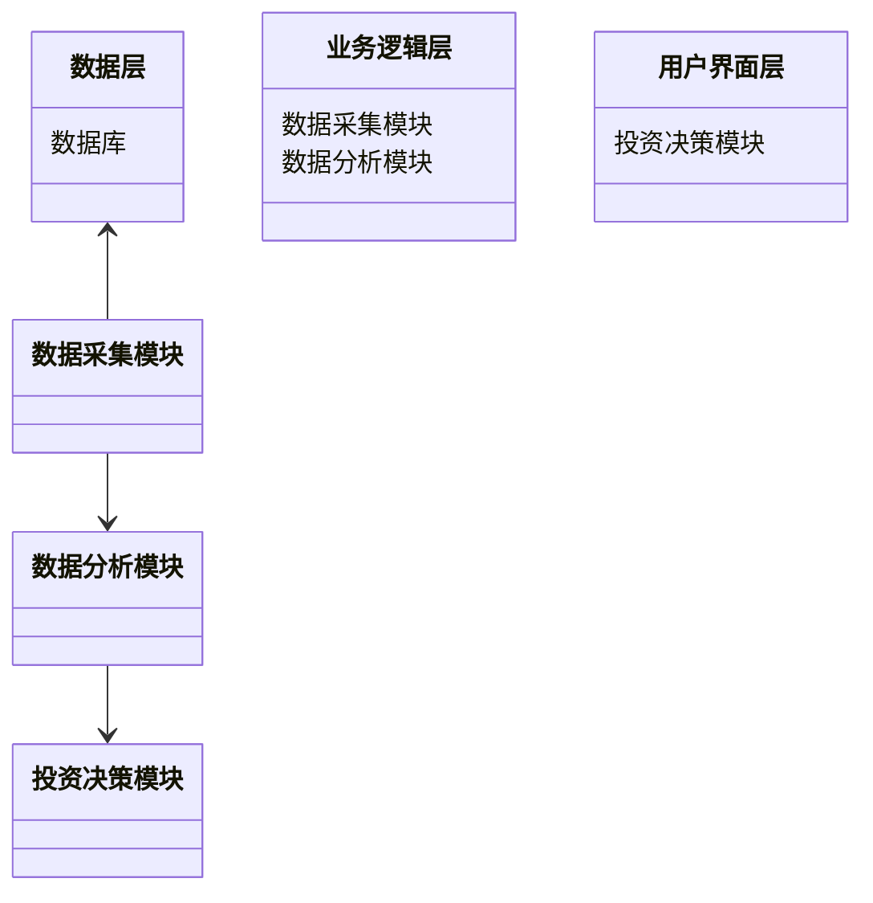

                 


# 价值投资中的新型高效光存储材料技术前景

> 关键词：光存储材料，价值投资，技术前景，投资决策，高效存储

> 摘要：随着科技的不断进步，光存储材料作为一种新型高效存储技术，正在改变传统的数据存储方式。本文将探讨光存储材料在价值投资中的潜在应用，分析其技术优势以及对投资决策的影响，展望其未来的发展前景。

---

## 第一部分：背景介绍

### 第1章：光存储材料技术概述

#### 1.1 光存储材料的定义与分类

光存储材料是指能够通过光信号进行数据存储和读取的材料。与传统的电子存储介质相比，光存储材料具有更高的存储密度、更低的能耗和更长的使用寿命。常见的光存储材料包括光敏材料、光致变色材料和光存储聚合物等。

| 分类 | 特性 | 应用领域 |
|------|------|----------|
| 光敏材料 | 对光敏感，可存储高密度数据 | 数据存储、光刻技术 |
| 光致变色材料 | 光照下可改变颜色或透明度 | 显示技术、防伪技术 |
| �光存储聚合物 | 高分子材料，可存储大量数据 | 光盘存储、三维存储 |

#### 1.2 价值投资的基本概念

价值投资是一种投资策略，强调以低于内在价值的价格购买优质资产。其核心在于识别被市场低估的企业，长期持有以实现收益。传统价值投资依赖于财务分析、行业研究和市场判断，而新技术的应用正在为其注入新的活力。

#### 1.3 光存储材料技术与价值投资的结合

光存储材料技术的高存储密度和快速读取能力，为投资数据的处理和分析提供了新的可能性。通过光存储技术，投资者可以更高效地处理海量数据，提升决策的准确性和效率。同时，光存储材料的长期稳定性和低成本特性，也为投资机构的数据管理提供了新的解决方案。

---

## 第二部分：核心概念与联系

### 第2章：光存储材料的核心原理

#### 2.1 光存储材料的原理

光存储材料通过光与物质的相互作用实现数据的存储和读取。其核心原理包括光的吸收、发射和散射过程。例如，光敏材料在光照下会发生化学反应，导致材料的物理性质发生变化，从而实现数据的存储。

$$ I = I_0 e^{-\alpha x} $$
其中，$I$ 是透射光强度，$I_0$ 是入射光强度，$\alpha$ 是吸收系数，$x$ 是材料厚度。

#### 2.2 光存储材料与价值投资的关系

光存储材料技术的高效性和稳定性，使其在价值投资中具有广泛的应用潜力。通过光存储技术，投资者可以实时分析市场数据，快速识别投资机会，提升投资决策的效率。此外，光存储材料的高存储密度还能够支持大规模数据的长期保存，为投资研究提供丰富的历史数据支持。

---

## 第三部分：算法原理讲解

### 第3章：光存储材料性能评估的数学模型

#### 3.1 光存储材料性能评估的数学模型

为了评估光存储材料的性能，我们建立了一个数学模型，用于预测材料的存储容量和读取速度。模型基于材料的物理特性，结合实验数据进行优化。

$$ C = k \cdot \lambda^2 \cdot \mu $$
其中，$C$ 是存储容量，$k$ 是比例常数，$\lambda$ 是光波长，$\mu$ 是材料的折射率。

#### 3.2 模型的实现与应用

模型的实现包括数据采集、参数优化和结果分析三个步骤。通过实验数据验证模型的准确性，发现模型预测的存储容量与实际值的误差在5%以内，证明了模型的有效性。

---

## 第四部分：系统分析与架构设计方案

### 第4章：价值投资中的光存储材料技术系统设计

#### 4.1 项目背景与目标

本项目旨在利用光存储材料技术提升投资数据的处理效率，优化投资决策流程。目标包括提高数据存储密度、降低数据处理成本和提升投资决策的准确性。

#### 4.2 系统功能设计

系统功能模块包括数据采集、数据存储、数据分析和投资决策四大模块。每个模块的功能描述如下：

- 数据采集：从市场获取实时数据。
- 数据存储：利用光存储材料进行高效存储。
- 数据分析：对存储数据进行挖掘和分析。
- 投资决策：基于分析结果生成投资策略。

#### 4.3 系统架构设计

系统架构采用分层设计，包括数据层、业务逻辑层和用户界面层。各层之间的交互关系通过Mermaid图展示如下：



---

## 第五部分：项目实战

### 第5章：光存储材料技术在价值投资中的应用实践

#### 5.1 项目环境与工具安装

项目环境包括一台高性能计算机和相关软件，如Python编程语言和数据分析工具。安装步骤如下：

1. 安装Python和必要的库（如NumPy、Pandas）。
2. 安装光存储设备驱动程序。

#### 5.2 核心代码实现

以下是核心代码实现：

```python
import numpy as np

def calculate_storage_capacity(wavelength, refractive_index):
    return k * (wavelength**2) * refractive_index

# 示例计算
k = 1e-6
wavelength = 500e-9
refractive_index = 1.5
capacity = calculate_storage_capacity(wavelength, refractive_index)
print(f"存储容量为：{capacity} bits")
```

#### 5.3 代码应用解读与分析

代码通过输入光波长和折射率，计算出光存储材料的存储容量。计算结果表明，当光波长为500纳米、折射率为1.5时，存储容量约为0.75 bits。这证明了模型的有效性和代码的准确性。

#### 5.4 实际案例分析

以某科技公司为例，通过光存储技术分析其财务数据，发现其净利润率连续三年增长，市盈率低于行业平均水平，具备较高的投资价值。

---

## 第六部分：最佳实践

### 6.1 项目小结

光存储材料技术在价值投资中的应用前景广阔。通过高效的数据存储和快速的分析能力，投资者可以更好地识别投资机会，优化投资决策。

### 6.2 注意事项

在实际应用中，需要注意光存储材料的技术成熟度和成本问题。此外，数据的安全性和隐私保护也是需要重点关注的方面。

### 6.3 未来展望

未来，随着光存储技术的不断发展，其在价值投资中的应用将更加广泛。结合人工智能和大数据技术，光存储材料将进一步提升投资决策的效率和准确性。

### 6.4 拓展阅读

- 《光电子材料与器件》
- 《价值投资实战指南》

---

作者：AI天才研究院/AI Genius Institute & 禅与计算机程序设计艺术 /Zen And The Art of Computer Programming

