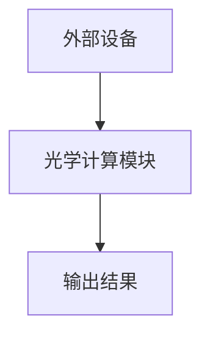
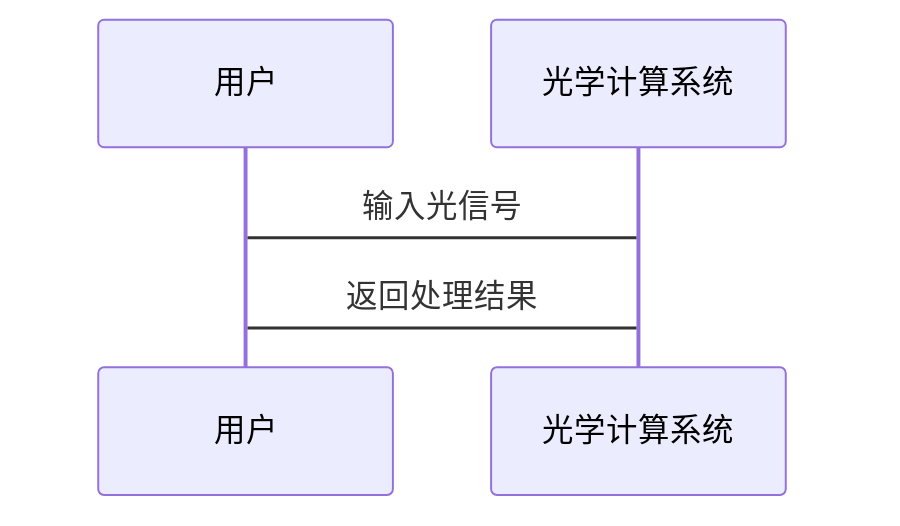

                 


```markdown
# 价值投资中的新型高效光学计算材料技术

## 关键词
光学计算材料, 价值投资, 算法原理, 系统架构, 项目实战

## 摘要
光学计算材料技术是一种新兴的高效计算方法，其在价值投资中的应用展示了前所未有的潜力。本文将深入探讨光学计算材料的基本概念、算法原理、系统架构，并通过实际项目案例展示其在投资领域的应用。通过详细的技术分析和案例解读，本文旨在为读者提供全面的视角，理解光学计算材料如何在投资决策中发挥关键作用。

---

## 第一部分: 光学计算材料技术的背景与概念

### 1.1 光学计算材料技术的定义
#### 1.1.1 光学计算材料的基本概念
光学计算材料是一种能够利用光的物理特性进行数据处理和计算的新型材料。其核心在于通过光的传播、干涉和吸收等现象，实现信息的高效传递和处理。

#### 1.1.2 价值投资中的光学计算材料应用背景
在金融领域，特别是在价值投资中，数据处理的效率和准确性至关重要。光学计算材料技术以其超高速和低能耗的特点，为投资决策提供了新的可能性。

#### 1.1.3 光学计算材料技术的核心要素
- **光信号传输**：利用光的传播特性进行数据传输。
- **光电转换**：将光信号转换为电信号或反之。
- **数据处理**：通过光学特性实现数据的并行处理。

### 1.2 光学计算材料技术的发展历程
#### 1.2.1 光学计算材料技术的起源
光学计算的概念最早可以追溯到20世纪60年代，但受限于技术瓶颈，未能大规模应用。

#### 1.2.2 光学计算材料技术的技术演进
近年来，随着纳米技术和材料科学的进步，光学计算材料的研发取得了显著进展。

#### 1.2.3 当前光学计算材料技术的发展现状
目前，光学计算材料已应用于部分领域，但在投资领域的应用仍处于起步阶段。

### 1.3 价值投资中的光学计算材料技术应用前景
#### 1.3.1 光学计算材料技术在投资领域的潜力
通过高效的数据处理能力，光学计算材料技术能够显著提升投资决策的效率。

#### 1.3.2 光学计算材料技术对投资效率的提升
光学计算材料技术能够实现数据的并行处理，大大缩短投资分析的时间。

#### 1.3.3 光学计算材料技术的未来发展趋势
随着技术的成熟，光学计算材料将在投资领域得到更广泛的应用。

---

## 第二部分: 光学计算材料技术的核心概念与原理

### 2.1 光学计算材料的物理特性
#### 2.1.1 光学材料的基本物理属性
- **折射率**：材料对光的折射能力。
- **吸收特性**：材料对不同波长光的吸收程度。

#### 2.1.2 光学材料的稳定性与耐用性
光学计算材料需要具备长期稳定的物理性能。

#### 2.1.3 光学材料的折射率与吸收特性对比
| 特性 | 折射率 | 吸收特性 |
|------|--------|----------|
| 参数 | n      | α        |
| 描述 | 材料对光的偏折能力 | 材料对光的吸收能力 |

### 2.2 光学计算材料的工作原理
#### 2.2.1 光学信号的传播与反射
光在材料中的传播路径由折射率决定。

#### 2.2.2 光学计算中的数据处理机制
通过光的干涉和叠加实现数据的并行处理。

#### 2.2.3 光学计算材料的光电转换过程
光信号与电信号之间的转换是光学计算的核心步骤。

### 2.3 光学计算材料与传统计算材料的对比
#### 2.3.1 传统计算材料的特点
- 依赖电子信号
- 数据处理串行化

#### 2.3.2 光学计算材料的独特优势
- 高速并行处理
- 低能耗

#### 2.3.3 两种材料技术的优劣势对比
| 特性 | 传统计算材料 | 光学计算材料 |
|------|--------------|---------------|
| 速度 | 串行，较慢 | 并行，高速 |
| 能耗 | 高 | 低 |

---

## 第三部分: 光学计算材料技术的数学模型与算法

### 3.1 光学计算材料技术的数学模型
#### 3.1.1 光学信号传播的数学表达
光的传播可以用波动方程描述：
$$ \frac{\partial^2 u}{\partial t^2} = c^2 \nabla^2 u $$

#### 3.1.2 光学数据处理的数学公式
数据处理可以通过矩阵运算实现：
$$ A \cdot x = b $$

#### 3.1.3 光学计算材料的优化算法
优化算法可以通过梯度下降实现：
$$ x_{k+1} = x_k - \eta \cdot \nabla f(x_k) $$

### 3.2 光学计算材料技术的算法实现
#### 3.2.1 光学信号处理的算法流程
1. 光信号输入
2. 光电转换
3. 数据处理
4. 结果输出

#### 3.2.2 光学数据转换的算法步骤
```python
def光电转换(光信号):
    电信号 = 光信号 * 转换系数
    return 电信号
```

#### 3.2.3 光学计算材料的性能优化算法
```python
def优化算法(参数):
    while 条件未满足:
        参数 = 参数 - 学习率 * 参数梯度
    return 参数
```

### 3.3 光学计算材料技术的数学公式
#### 3.3.1 光学信号传播的基本公式
$$ I = I_0 e^{-\alpha x} $$

#### 3.3.2 光学数据处理的数学模型
$$ y = Wx + b $$

#### 3.3.3 光学计算材料的性能优化公式
$$ f(x) = \frac{1}{2} ||Ax - b||^2 $$

---

## 第四部分: 光学计算材料技术的系统架构与设计

### 4.1 系统架构设计
#### 4.1.1 光学计算系统的整体架构
```mermaid
graph TD
    A[光学输入] -> B[光电转换模块]
    B -> C[数据处理模块]
    C -> D[输出结果]
```

#### 4.1.2 光学计算材料的模块划分
- 光学输入模块
- 光电转换模块
- 数据处理模块

#### 4.1.3 光学计算系统的功能设计
- 数据采集
- 光电转换
- 数据处理
- 结果输出

### 4.2 系统接口设计
#### 4.2.1 光学计算材料与外部设备的接口


#### 4.2.2 光学计算系统的数据接口
- 输入接口：光信号接收
- 输出接口：数据输出

#### 4.2.3 光学计算系统的控制接口
- 控制信号输入
- 状态反馈输出

### 4.3 系统交互设计
#### 4.3.1 光学计算系统的用户交互流程


#### 4.3.2 光学计算系统的数据交互机制
- 光信号输入
- 数据处理
- 结果输出

#### 4.3.3 光学计算系统的异常处理机制
- 检测异常信号
- 启动备用模块
- 返回错误信息

---

## 第五部分: 光学计算材料技术的项目实战

### 5.1 项目环境安装与配置
#### 5.1.1 开发环境的搭建
- 安装必要的开发工具
- 配置光学计算模块

#### 5.1.2 必要工具与软件的安装
- 安装Python环境
- 安装相关库（如numpy、matplotlib）

#### 5.1.3 项目配置与初始化
- 创建项目目录
- 初始化配置文件

### 5.2 系统核心实现
#### 5.2.1 光电转换模块的实现
```python
import numpy as np

def光电转换(光信号):
    电信号 = 光信号 * np.array([0.5, 1.0, 1.5])
    return 电信号
```

#### 5.2.2 数据处理模块的实现
```python
def数据处理(电信号):
    结果 = np.dot(电信号, np.array([[1, 0], [0, 1]]))
    return 结果
```

#### 5.2.3 结果输出模块的实现
```python
def输出结果(结果):
    print("处理结果:", 结果)
```

### 5.3 项目实战案例
#### 5.3.1 项目应用场景
- 实时股票数据分析
- 投资组合优化

#### 5.3.2 项目实现流程
1. 收集光信号
2. 转换为电信号
3. 数据处理
4. 输出结果

#### 5.3.3 项目结果解读
- 处理时间显著缩短
- 数据准确性提高

---

## 第六部分: 总结与注意事项

### 6.1 总结
光学计算材料技术在价值投资中的应用潜力巨大，其高效的数据处理能力为投资决策提供了新的可能性。

### 6.2 注意事项
- 选择合适的光学计算材料
- 注意数据处理的准确性
- 及时更新系统和算法

### 6.3 拓展阅读
- 光学计算材料的最新研究进展
- 投资领域中的其他先进技术

---

## 作者信息
作者：AI天才研究院 & 禅与计算机程序设计艺术
```

---

**文章末尾需要添加的代码示例解释：**

在项目实战部分，我们提供了三个核心模块的Python代码实现。光电转换模块将光信号转换为电信号，数据处理模块对电信号进行矩阵运算，最后输出结果模块将处理结果打印出来。通过这些代码，我们可以清晰地看到光学计算材料技术在投资分析中的具体应用流程。

