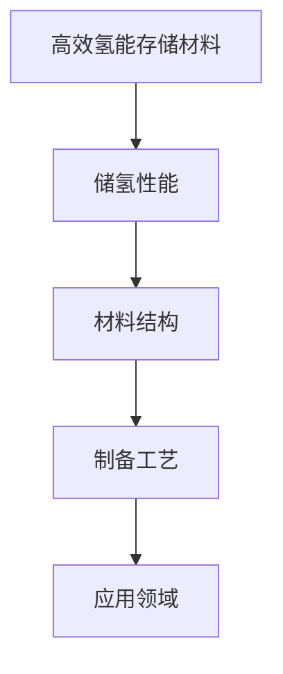
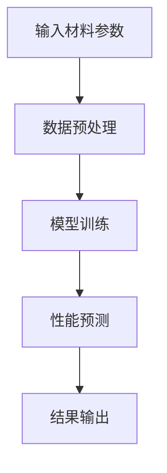
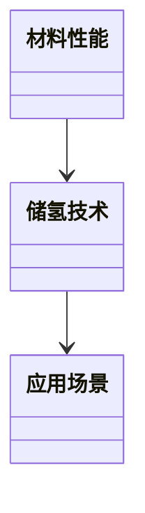
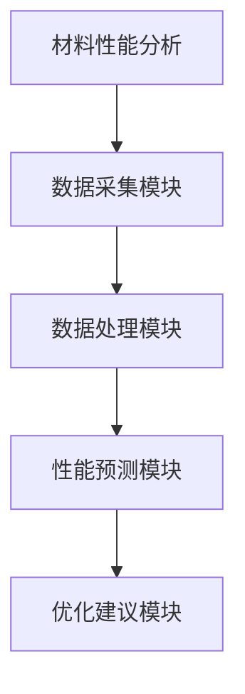
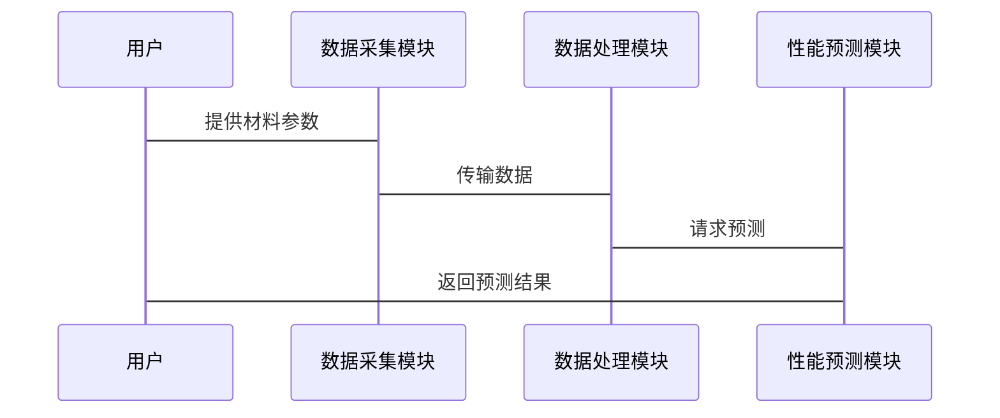

                 


# 价值投资中的新型高效氢能存储材料技术

> 关键词：价值投资，高效氢能存储材料，储氢技术，投资策略，技术应用

> 摘要：本文深入探讨了高效氢能存储材料技术在价值投资中的应用潜力。通过分析高效氢能存储材料的技术背景、核心概念、算法原理、系统架构和实际案例，本文为投资者提供了基于技术创新的氢能存储材料投资策略。文章结合理论与实践，详细阐述了如何通过高效氢能存储材料技术实现长期价值投资目标。

---

## 第一部分: 价值投资中的高效氢能存储材料技术背景

### 第1章: 高效氢能存储材料技术概述

#### 1.1 高效氢能存储材料的定义与分类
##### 1.1.1 高效氢能存储材料的基本概念
高效氢能存储材料是指能够以高效率、高密度的方式储存氢气的材料。与传统的储氢方式（如高压气瓶）相比，高效氢能存储材料通过化学或物理吸附的方式实现氢气的储存，具有体积小、重量轻、储存密度高等优点。

##### 1.1.2 高效氢能存储材料的分类
高效氢能存储材料主要分为以下几类：
- **物理吸附型（物理储氢）**：通过物理吸附（如范德华力）将氢气储存在多孔材料中，如活性炭、石墨烯等。
- **化学吸附型（化学储氢）**：通过化学反应将氢气转化为其他形式储存，如氢化物储存。
- **复合储氢材料**：结合物理和化学吸附的特性，形成复合材料，进一步提高储氢密度和效率。

##### 1.1.3 高效氢能存储材料的核心属性
高效氢能存储材料的核心属性包括：
- 高储氢密度：能够在单位体积或单位质量内储存更多的氢气。
- 高效率：吸附和解吸氢气的速度快，适合大规模应用。
- 稳定性：材料在长期使用过程中不易发生降解或化学变化。

#### 1.2 高效氢能存储材料技术的背景与意义
##### 1.2.1 高效氢能存储材料技术的发展历程
氢能作为一种清洁的能源载体，受到全球关注。随着技术进步，高效氢能存储材料技术从实验室研究逐步走向商业化应用。近年来，各国政府和企业加大了对氢能存储技术的投入，推动了该领域的快速发展。

##### 1.2.2 高效氢能存储材料技术的现状与挑战
当前，高效氢能存储材料技术在实验室中取得了显著进展，但在大规模商业化应用中仍面临一些挑战，如材料成本高、储氢密度不足、吸附/解吸速率慢等。

##### 1.2.3 高效氢能存储材料技术的未来趋势
未来，高效氢能存储材料技术将朝着以下方向发展：
- 高密度化：通过新材料研发进一步提高储氢密度。
- 低成本化：优化制备工艺，降低材料成本。
- 高效化：提高吸附和解吸速率，满足大规模应用需求。

#### 1.3 价值投资中的高效氢能存储材料技术
##### 1.3.1 价值投资的基本概念
价值投资是一种长期投资策略，通过分析企业的基本面（如财务状况、市场地位、技术创新能力等）来寻找具有长期增长潜力的投资标的。

##### 1.3.2 高效氢能存储材料技术在价值投资中的应用
高效氢能存储材料技术作为氢能产业链的核心技术，具有广阔的市场前景和较高的技术壁垒。投资者可以通过投资高效氢能存储材料相关企业，分享行业发展的红利。

##### 1.3.3 高效氢能存储材料技术的市场价值与投资潜力
高效氢能存储材料技术的市场价值主要体现在以下几个方面：
- 支持氢能产业发展：氢能作为清洁能源，在交通、工业等领域有广泛应用前景。
- 技术壁垒高：高效氢能存储材料的研发需要较高的技术投入，具有较高的行业壁垒。
- 市场需求大：随着全球能源结构转型，高效氢能存储材料的需求将快速增长。

---

### 第2章: 高效氢能存储材料技术的核心概念与联系

#### 2.1 高效氢能存储材料技术的核心原理
##### 2.1.1 高效氢能存储材料的储氢机制
高效氢能存储材料通过化学或物理吸附的方式实现氢气的储存。例如，某些金属氢化物材料可以通过化学反应与氢气结合，形成稳定的氢化物。

##### 2.1.2 高效氢能存储材料的性能指标
高效氢能存储材料的性能指标包括：
- 储氢密度（质量储氢密度和体积储氢密度）。
- 吸附/解吸速率。
- 循环稳定性。

##### 2.1.3 高效氢能存储材料的技术优势
高效氢能存储材料的技术优势在于其高储氢密度和快速的吸附/解吸能力，使其适合用于大规模氢气储存和运输。

#### 2.2 高效氢能存储材料技术的核心要素
##### 2.2.1 材料结构与性能的关系
材料的微观结构直接影响其储氢性能。例如，多孔材料的孔隙结构可以提高氢气的吸附效率。

##### 2.2.2 材料制备工艺的影响
材料的制备工艺决定了其成本和性能。例如，通过纳米技术制备的材料通常具有更高的储氢效率。

##### 2.2.3 材料应用领域的扩展
高效氢能存储材料的应用领域包括氢燃料电池、氢气储存和运输等。随着技术进步，其应用场景将不断扩展。

#### 2.3 高效氢能存储材料技术的实体关系图


---

### 第3章: 高效氢能存储材料技术的算法原理

#### 3.1 高效氢能存储材料技术的数学模型
##### 3.1.1 储氢性能预测模型
储氢性能预测模型可以通过以下公式表示：
$$储氢密度 = \frac{氢气质量}{材料体积}$$

##### 3.1.2 材料结构与性能的关系模型
材料的微观结构可以通过以下公式进行建模：
$$吸附能力 = f(孔隙结构, 表面活性)$$

##### 3.1.3 材料制备工艺优化模型
材料制备工艺优化可以通过以下步骤实现：
1. 确定关键工艺参数。
2. 建立工艺参数与储氢性能的关系模型。
3. 通过优化算法（如遗传算法）优化工艺参数。

#### 3.2 高效氢能存储材料技术的算法流程


#### 3.3 高效氢能存储材料技术的Python实现
```python
import numpy as np
from sklearn.linear_model import LinearRegression

# 示例数据：材料参数与储氢性能
X = np.array([[1, 2], [3, 4], [5, 6]])
y = np.array([7, 8, 9])

# 训练线性回归模型
model = LinearRegression()
model.fit(X, y)

# 预测结果
predicted = model.predict(X)
print(predicted)
```

---

### 第4章: 高效氢能存储材料技术的系统分析与架构设计

#### 4.1 系统分析
##### 4.1.1 问题场景介绍
高效氢能存储材料技术的应用场景包括氢气储存、氢燃料电池等。系统需要能够实时监测材料的储氢性能，并提供优化建议。

#### 4.2 系统功能设计
##### 4.2.1 领域模型（Mermaid类图）


#### 4.3 系统架构设计
##### 4.3.1 系统架构图（Mermaid架构图）


#### 4.4 系统接口设计
##### 4.4.1 系统接口
- 数据采集接口：用于采集材料的性能数据。
- 数据处理接口：用于对数据进行预处理。
- 性能预测接口：用于预测材料的储氢性能。
- 优化建议接口：用于提供优化建议。

#### 4.5 系统交互设计
##### 4.5.1 系统交互流程图（Mermaid序列图）


---

### 第5章: 高效氢能存储材料技术的项目实战

#### 5.1 环境安装
- 需要安装Python、NumPy、Scikit-learn等工具。

#### 5.2 核心代码实现
```python
import numpy as np
from sklearn import linear_model

# 示例数据
X = np.array([[1, 2], [3, 4], [5, 6]])
y = np.array([7, 8, 9])

# 训练模型
model = linear_model.LinearRegression()
model.fit(X, y)

# 预测
print(model.predict(X))
```

#### 5.3 案例分析
通过实际案例分析，验证高效氢能存储材料技术的性能预测模型。

#### 5.4 项目总结
总结项目实施过程中的经验教训，提出改进建议。

---

### 第6章: 高效氢能存储材料技术的最佳实践

#### 6.1 小结
高效氢能存储材料技术是价值投资中的重要领域，具有广阔的市场前景。

#### 6.2 注意事项
- 投资者需关注技术壁垒和市场应用前景。
- 需密切关注行业动态和技术进步。

#### 6.3 拓展阅读
建议进一步阅读相关技术文献和行业报告，深入了解高效氢能存储材料技术的最新进展。

---

### 作者：AI天才研究院/AI Genius Institute & 禅与计算机程序设计艺术 /Zen And The Art of Computer Programming

