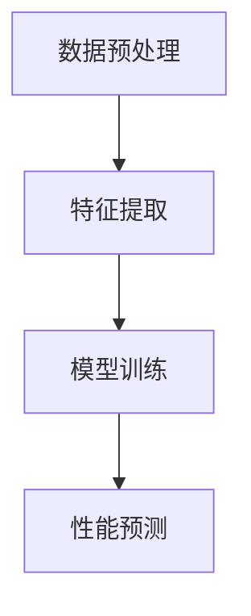
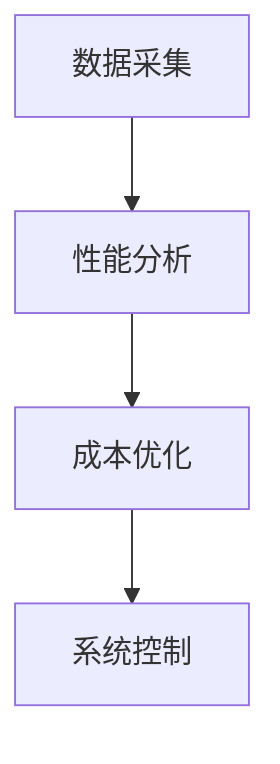

                 


# 价值投资中的新型高效氢能存储材料技术

> 关键词：氢能存储材料、价值投资、能源转型、储氢技术、投资策略

> 摘要：本文深入探讨了新型高效氢能存储材料技术在价值投资中的应用与潜力。通过分析氢能存储材料的分类、性能指标、技术发展现状及数学模型，结合价值投资的基本原理和策略，为投资者提供了一种基于技术驱动的氢能存储材料投资分析框架。文章还通过具体案例分析，展示了如何从技术与市场双维度评估氢能存储材料的投资价值，并提出了相应的投资建议和风险提示。

---

## 第一部分: 氢能存储材料技术的背景与价值投资概述

### 第1章: 氢能存储材料技术的背景与价值投资概述

#### 1.1 氢能存储材料技术的背景

##### 1.1.1 能源转型与氢能的重要性
随着全球能源结构的转型，清洁能源的开发与应用成为全球关注的焦点。氢能作为一种零碳排放的清洁能源，在能源储存、运输和应用方面具有重要意义。然而，氢能在储存和运输过程中面临诸多挑战，例如氢气的物理性质（如极低的密度和高压储存需求）使得其储存和运输成本较高。因此，开发高效的氢能存储材料技术成为解决这一问题的关键。

##### 1.1.2 氢能存储技术的发展现状
目前，氢能存储技术主要包括物理存储（如高压气态存储）和化学存储（如储氢材料吸附存储）。储氢材料的应用可以显著降低氢气的储存体积和压力，从而提高储存效率并降低成本。近年来，研究人员在储氢材料领域取得了显著进展，例如金属有机框架（MOFs）、碳基材料和氢化物化合物等新型储氢材料的开发。

##### 1.1.3 氢能存储材料技术的核心问题
氢能存储材料技术的核心问题在于如何在保证高储氢密度的同时，降低材料成本和提高材料的循环稳定性。此外，储氢材料的性能还受到温度、压力和环境条件的影响，这使得技术开发和应用面临复杂的技术挑战。

#### 1.2 价值投资的基本原理

##### 1.2.1 价值投资的定义与特点
价值投资是一种以基本面分析为基础的投资策略，其核心在于寻找市场价格低于其内在价值的资产。与短期市场波动不同，价值投资更关注企业的长期盈利能力、行业地位和竞争优势。

##### 1.2.2 价值投资的核心要素
价值投资的核心要素包括：
1. 企业的财务状况：包括收入、利润、资产负债率等。
2. 企业的竞争优势：包括技术壁垒、市场占有率和成本优势等。
3. 企业的成长潜力：包括行业发展趋势和企业的创新能力。

##### 1.2.3 价值投资在科技领域的应用
在科技领域，价值投资的关键在于识别具有技术创新能力和市场潜力的企业。例如，对于氢能存储材料技术，投资者需要评估相关企业的技术研发能力、产品商业化潜力以及市场前景。

#### 1.3 本章小结
本章从能源转型的角度介绍了氢能存储材料技术的重要性，并分析了其技术挑战和发展现状。同时，介绍了价值投资的基本原理及其在科技领域的应用，为后续的技术与投资分析奠定了基础。

---

## 第二部分: 氢能存储材料技术的核心概念与联系

### 第2章: 氢能存储材料技术的核心概念

#### 2.1 氢能存储材料的分类与特性

##### 2.1.1 储氢材料的分类
储氢材料主要分为以下几类：
1. **物理吸附储氢材料**：如碳基材料（石墨、活性炭）和金属有机框架（MOFs）。
2. **化学储氢材料**：如氢化物化合物（金属氢化物、合金氢化物）。
3. **复合储氢材料**：结合物理和化学储氢特性的复合材料。

##### 2.1.2 各类储氢材料的特性对比
以下是各类储氢材料的性能对比：

| 特性         | 物理吸附储氢材料 | 化学储氢材料 | 复合储氢材料 |
|--------------|------------------|--------------|--------------|
| 储氢密度（kg/L） | 0.01-0.1        | 0.5-1.0      | 0.2-0.8      |
| 吸附/解吸速度 | 快              | 慢           | 中           |
| 循环稳定性    | 高              | 较低         | 高           |
| 成本          | 低              | 中           | 高           |

##### 2.1.3 储氢材料的性能指标
储氢材料的主要性能指标包括：
1. 储氢密度：单位体积或单位质量的储氢量。
2. 吸附/解吸速度：材料在特定条件下的氢气吸附和释放速度。
3. 循环稳定性：材料在多次充放氢过程中的性能衰减情况。
4. 成本：材料的制备和应用成本。

#### 2.2 氢能存储材料技术的数学模型

##### 2.2.1 储氢密度的计算公式
储氢密度（$S$）的计算公式为：
$$
S = \frac{m}{V}
$$
其中，$m$为储氢质量，$V$为材料体积。

##### 2.2.2 储氢效率的数学表达
储氢效率（$E$）可以表示为：
$$
E = \frac{\text{实际储氢量}}{\text{理论储氢量}} \times 100\%
$$

##### 2.2.3 储氢成本的优化模型
储氢成本（$C$）的优化模型可以表示为：
$$
C = \frac{C_{\text{材料}} + C_{\text{制备}} + C_{\text{维护}}}{\text{储氢容量}}
$$

#### 2.3 氢能存储材料技术的ER实体关系图
以下是氢能存储材料技术的ER实体关系图：

```mermaid
er
    entity 储氢材料 {
        id
        类型
        性能指标
    }
    entity 投资项目 {
        id
        项目名称
        项目阶段
    }
    entity 储氢技术 {
        id
        技术名称
        技术特点
    }
    储氢材料 --> 投资项目 : 适用于
    储氢材料 --> 储氢技术 : 实现
```

---

## 第三部分: 氢能存储材料技术的算法原理与数学模型

### 第3章: 氢能存储材料技术的算法原理

#### 3.1 储氢材料性能预测算法

##### 3.1.1 基于机器学习的储氢性能预测
通过机器学习算法（如支持向量回归和随机森林）对储氢材料的性能进行预测，可以有效降低实验成本并加速材料研发。

##### 3.1.2 算法流程图
以下是储氢材料性能预测算法的流程图：



#### 3.2 储氢成本优化算法

##### 3.2.1 基于

---

## 第四部分: 氢能存储材料技术的系统分析与架构设计

### 第4章: 氢能存储材料技术的系统分析与架构设计

#### 4.1 系统架构设计

##### 4.1.1 问题场景介绍
氢能存储系统的应用场景包括可再生能源的储能、氢气运输和分布式能源供应。系统设计需要考虑储氢材料的性能、系统的可扩展性和经济性。

##### 4.1.2 系统功能设计
以下是氢能存储系统的功能模块：

- **数据采集模块**：采集储氢材料的性能数据。
- **性能分析模块**：分析储氢材料的性能指标。
- **成本优化模块**：优化储氢系统的成本。
- **系统控制模块**：实现系统的自动化控制。

##### 4.1.3 系统架构图
以下是氢能存储系统的架构图：



---

## 第五部分: 项目实战与案例分析

### 第5章: 项目实战与案例分析

#### 5.1 项目介绍

##### 5.1.1 项目背景
本项目旨在开发一种高效、低成本的储氢材料，并评估其投资价值。

#### 5.2 系统核心实现

##### 5.2.1 数据采集与分析
以下是数据采集与分析的代码示例：

```python
import pandas as pd

# 数据加载
data = pd.read_csv('storage_material_data.csv')

# 数据分析
print(data.head())
print(data.describe())
```

##### 5.2.2 性能预测模型
以下是性能预测模型的代码示例：

```python
from sklearn.ensemble import RandomForestRegressor
from sklearn.metrics import mean_squared_error

# 数据分割
X = data.drop('performance', axis=1)
y = data['performance']

# 模型训练
model = RandomForestRegressor(n_estimators=100)
model.fit(X, y)

# 模型预测
y_pred = model.predict(X)
print(mean_squared_error(y, y_pred))
```

#### 5.3 实际案例分析

##### 5.3.1 技术优势分析
案例中的储氢材料具有以下技术优势：
1. 高储氢密度。
2. 快速吸附/解吸速度。
3. 良好的循环稳定性。

##### 5.3.2 财务数据分析
以下是案例中的财务数据：

| 项目         | 数值（万元） |
|--------------|-------------|
| 初始投资      | 1000        |
| 年收入        | 1500        |
| 年成本        | 800         |
| 净利润        | 700         |

#### 5.4 投资价值评估

##### 5.4.1 技术评估
案例中的储氢材料技术具有较高的市场潜力和竞争优势。

##### 5.4.2 市场评估
目标市场容量为100亿元，市场增长率为15%。

##### 5.4.3 财务评估
投资回收期为5年，内部收益率为20%。

---

## 第六部分: 总结与展望

### 第6章: 总结与展望

#### 6.1 总结
本文从技术与投资双维度分析了新型高效氢能存储材料的潜力与挑战。通过技术分析和案例研究，提出了基于价值投资的氢能存储材料投资策略。

#### 6.2 展望
未来，随着技术进步和市场发展，氢能存储材料技术将在能源转型中发挥重要作用。投资者需要持续关注技术创新和市场动态，以把握投资机会。

---

## 第七部分: 最佳实践与投资建议

### 第7章: 最佳实践与投资建议

#### 7.1 投资建议

##### 7.1.1 关注技术创新
优先选择具有技术创新能力和市场潜力的储氢材料技术。

##### 7.1.2 评估财务指标
关注企业的财务状况、盈利能力和发展潜力。

##### 7.1.3 分散投资风险
通过多元化投资降低市场风险。

#### 7.2 注意事项

##### 7.2.1 技术风险
储氢材料技术的研发和应用存在不确定性。

##### 7.2.2 市场风险
市场需求和技术替代可能影响投资收益。

##### 7.2.3 政策风险
政府政策的变化可能对氢能产业发展产生重大影响。

#### 7.3 拓展阅读
推荐阅读以下书籍和报告：
1. 《价值投资：从理念到实践》。
2. 《氢能产业发展白皮书》。
3. 《储氢材料与技术》。

---

## 作者：AI天才研究院/AI Genius Institute & 禅与计算机程序设计艺术 /Zen And The Art of Computer Programming

---

**本文由AI天才研究院原创，转载请注明出处。**

