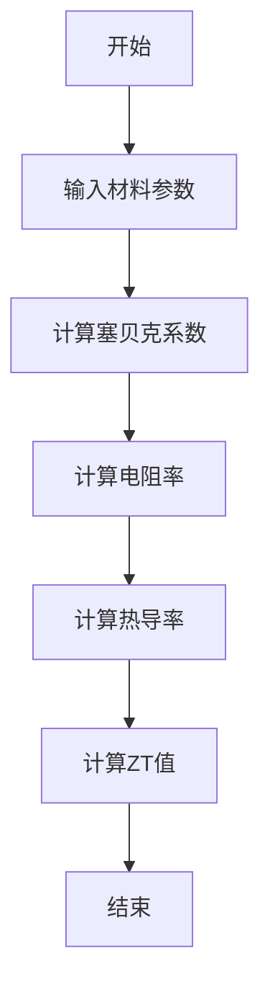

                 


# 价值投资中的新型高效热电材料技术前景

## 关键词：热电材料，价值投资，能源转换，技术前景，高效材料，投资策略

## 摘要：本文探讨了新型高效热电材料在能源转换中的潜力及其投资价值。通过分析热电材料的技术原理、市场应用和投资策略，本文为投资者提供了深入的技术见解和投资建议，帮助他们在热电材料领域做出明智的投资决策。

---

## 第一部分：背景介绍

### 第1章：热电材料的基本概念与价值投资概述

#### 1.1 热电材料的基本概念

热电材料是一种能够直接将热能转化为电能的半导体材料。其工作原理基于热电效应，即当不同温度的两种半导体材料连接成闭合回路时，会产生电流。这种材料在废热回收、可穿戴设备和新能源发电等领域具有重要应用。

#### 1.2 价值投资的基本原理

价值投资是一种长期投资策略，强调购买被市场低估的资产，注重基本面分析和长期增长潜力。在热电材料领域，投资者需要关注技术进步、市场需求和行业趋势，寻找具有持续增长潜力的企业。

---

## 第二部分：核心概念与技术分析

### 第2章：热电材料的热电效应与性能优化

#### 2.1 热电效应的原理

热电效应由塞贝克效应和汤姆逊效应组成。塞贝克效应描述了温差产生的电压，而汤姆逊效应涉及电流通过材料时的热交换。热电材料的性能通常用热电品质因子$ZT$来衡量，公式为：
$$ZT = \frac{S^2 \cdot \rho \cdot \lambda}{k}$$

#### 2.2 热电材料的选择与优化

材料选择的关键在于平衡热导率和电导率。低热导率和高电导率的材料更优。优化措施包括纳米结构设计和掺杂改性。

#### 2.3 影响热电材料效率的关键因素

温差、材料纯度和制备工艺是主要影响因素。较大的温差和高纯度材料有助于提高效率。

---

## 第三部分：算法与数学模型

### 第3章：热电材料性能预测的数学模型

#### 3.1 热电材料性能预测的算法原理

基于热电系数和材料参数，建立性能预测模型。使用公式：
$$ZT = \frac{S^2 \cdot \rho \cdot \lambda}{k}$$

#### 3.2 热电材料性能预测的mermaid流程图



---

## 第四部分：系统分析与架构设计方案

### 第4章：热电材料在工业废热回收中的应用

#### 4.1 项目背景与目标

设计一个热电模块，将工业废热转化为电能，降低能源浪费。

#### 4.2 系统功能设计

系统包括热源、热电模块、负载和控制电路。

#### 4.3 系统架构设计

使用mermaid类图展示系统结构：
```mermaid
classDiagram
class 热电模块 {
    输入端：高温侧
    输出端：低温侧
    电源输出
}
class 控制电路 {
    温度传感器
    负载
    电源管理
}
热电模块 --> 控制电路：提供电能
控制电路 --> 热电模块：监控温度
```

---

## 第五部分：项目实战

### 第5章：热电材料生产流程设计

#### 5.1 生产环境要求

高纯度环境，温度和湿度控制。

#### 5.2 关键设备选择

CVD设备、溅射设备和封装设备。

#### 5.3 流程优化

优化掺杂工艺和封装技术，提高效率和可靠性。

---

## 第六部分：最佳实践与小结

### 第6章：投资建议与未来展望

#### 6.1 投资建议

关注技术领先企业，分散投资风险，长期持有优质资产。

#### 6.2 未来展望

新材料和新工艺将推动热电材料发展，市场潜力巨大。

---

## 作者：AI天才研究院/AI Genius Institute & 禅与计算机程序设计艺术 /Zen And The Art of Computer Programming

