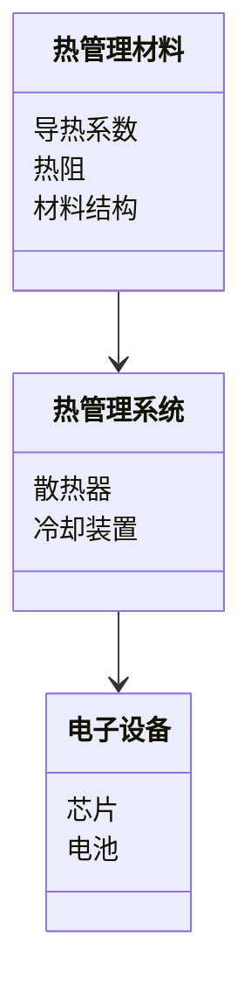
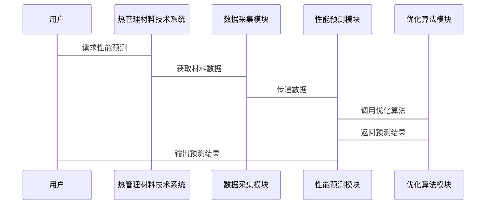

                 


# 价值投资中的新型高效热管理材料技术前景

---

## 关键词  
热管理材料，价值投资，电子散热，新能源汽车，纳米材料，导热系数，热阻  

---

## 摘要  
随着电子设备和新能源技术的快速发展，热管理材料技术在价值投资中的重要性日益凸显。本文从热管理材料的基本原理、分类与应用、性能预测模型、优化算法、系统设计、项目实战以及最佳实践等多角度进行深入分析，探讨新型高效热管理材料技术的市场前景及其在投资中的潜力。通过结合技术与投资的双重视角，本文为读者提供了一个全面了解热管理材料技术发展的框架。

---

# 正文

---

## 第一章：热管理材料技术的背景与意义

### 1.1 热管理材料技术的背景介绍

#### 1.1.1 电子设备散热问题的提出  
随着电子设备的高性能化和小型化，芯片功耗的增加导致散热需求急剧上升。传统散热材料（如金属铝、铜）虽然性能较好，但面临密度高、重量大、加工复杂等问题。  

#### 1.1.2 新型高效热管理材料的发展历程  
从20世纪末开始，科学家们逐渐发现纳米材料、复合材料等新型材料在热管理领域的潜力。近年来，石墨烯、氮化铝等材料的出现为热管理技术带来了革命性突破。  

#### 1.1.3 热管理材料技术在价值投资中的重要性  
热管理材料技术的突破将直接影响电子设备、新能源汽车等领域的性能和成本。投资者可以通过对该技术的深入分析，抓住市场机遇，实现高回报投资。  

---

### 1.2 价值投资与热管理材料技术的结合

#### 1.2.1 价值投资的基本概念  
价值投资是一种以基本面分析为基础的投资策略，强调以低于内在价值的价格买入优质资产。  

#### 1.2.2 热管理材料技术的市场前景  
热管理材料技术在电子设备、新能源汽车、工业设备等领域具有广泛的应用前景。市场规模预计在未来几年内呈现指数级增长。  

#### 1.2.3 价值投资视角下的技术评估与选择  
投资者需要从技术性能、市场竞争力、商业模式等多个维度对热管理材料技术进行评估，选择具有长期竞争优势的公司进行投资。  

---

## 第二章：热管理材料技术的核心概念与原理

### 2.1 热管理材料的基本原理

#### 2.1.1 热传导与热辐射的基本原理  
热传导是热量通过固体材料传递的过程，而热辐射则是通过电磁波形式传递热量的方式。  

#### 2.1.2 热管理材料的导热机制  
新型热管理材料通过微观结构设计和纳米技术优化，显著提高了导热性能。例如，石墨烯的高导热系数（$500 \, \text{W/mK}$）远超传统金属材料。  

#### 2.1.3 材料结构对热性能的影响  
材料的微观结构（如孔隙率、晶格排列）直接影响其热传导性能。通过优化材料结构，可以进一步提升导热效率。  

---

### 2.2 热管理材料的关键属性与指标

#### 2.2.1 导热系数的定义与测量方法  
导热系数是衡量材料导热性能的重要指标，通常通过热传导实验测量。  

#### 2.2.2 热膨胀系数的影响  
热膨胀系数反映了材料在温度变化时的体积变化率，对热管理系统的稳定性有重要影响。  

#### 2.2.3 材料的热稳定性和耐久性  
热稳定性是指材料在高温环境下保持性能不变的能力，耐久性则涉及材料的长期使用稳定性。  

---

## 第三章：热管理材料技术的分类与应用

### 3.1 主要热管理材料类型

#### 3.1.1 金属材料  
- **优点**：导热性能优异，加工性能好。  
- **缺点**：密度高，重量大。  

#### 3.1.2 陶瓷材料  
- **优点**：高温稳定性好，耐腐蚀性强。  
- **缺点**：导热性能相对较低。  

#### 3.1.3 复合材料  
- **优点**：可以根据需求定制性能，具有较高的性价比。  
- **缺点**：制备工艺复杂。  

#### 3.1.4 纳米材料  
- **优点**：导热性能显著提升，重量轻。  
- **缺点**：制备成本较高。  

---

### 3.2 热管理材料在不同领域的应用

#### 3.2.1 电子设备中的应用  
新型热管理材料广泛应用于芯片散热、电池散热等领域，显著提升了设备的性能和寿命。  

#### 3.2.2 新能源汽车中的应用  
在电动汽车中，热管理材料用于电池热管理，确保电池在安全温度范围内运行。  

#### 3.2.3 工业设备中的应用  
工业设备中的高温环境对热管理材料提出了更高要求，新型材料的应用可以显著提高设备的运行效率。  

---

## 第四章：热管理材料性能预测的数学模型

### 4.1 热传导方程的建立

#### 4.1.1 一维热传导方程  
$$ \frac{\partial T}{\partial t} = \alpha \frac{\partial^2 T}{\partial x^2} $$  
其中，$\alpha$ 是热扩散系数，$T$ 是温度，$t$ 是时间，$x$ 是空间坐标。  

#### 4.1.2 多维热传导方程  
$$ \frac{\partial T}{\partial t} = \alpha \nabla^2 T $$  
该方程适用于复杂结构的热传导问题。  

#### 4.1.3 非稳态热传导方程  
$$ \frac{\partial T}{\partial t} = \alpha \frac{\partial^2 T}{\partial x^2} + Q $$  
其中，$Q$ 是热源强度。  

---

### 4.2 导热系数的数学表达

#### 4.2.1 导热系数的定义与公式  
导热系数 $k$ 的定义为：  
$$ k = \lambda \cdot \rho \cdot c_p $$  
其中，$\lambda$ 是导热率，$\rho$ 是密度，$c_p$ 是比热容。  

---

## 第五章：热管理材料性能优化的算法设计

### 5.1 热管理材料性能优化的目标

#### 5.1.1 提高导热性能  
通过优化材料结构和成分，进一步提升导热系数。  

#### 5.1.2 降低热阻  
通过减少界面热阻和材料内部热阻，提高热传导效率。  

#### 5.1.3 提高材料稳定性  
通过改进材料的热稳定性和耐久性，延长使用寿命。  

---

### 5.2 基于数学模型的优化算法

#### 5.2.1 线性规划方法  
目标函数：最大化导热系数。  
约束条件：材料成分比例限制。  

#### 5.2.2 非线性优化方法  
目标函数：最小化热阻。  
约束条件：材料性能指标。  

#### 5.2.3 基于机器学习的优化算法  
通过神经网络模型预测材料性能，优化材料配方。  

---

## 第六章：热管理材料性能预测的算法实现

### 6.1 算法实现的基本步骤

#### 6.1.1 数据采集与预处理  
收集材料性能数据，进行数据清洗和归一化处理。  

#### 6.1.2 模型建立与参数选择  
选择合适的数学模型，确定关键参数。  

#### 6.1.3 算法训练与优化  
通过实验数据训练模型，优化算法参数。  

#### 6.1.4 结果验证与分析  
验证模型预测精度，分析误差来源。  

---

### 6.2 热管理材料性能预测的Python实现

#### 6.2.1 环境配置与安装  
安装必要的Python库（如NumPy、Matplotlib、Scikit-learn）。  

#### 6.2.2 核心算法代码示例  

```python
import numpy as np
from sklearn.model_selection import train_test_split
from sklearn.linear_model import LinearRegression

# 数据准备
X = np.array([[1, 2], [3, 4], [5, 6], [7, 8]])
y = np.array([2, 3, 4, 5])

# 数据分割
X_train, X_test, y_train, y_test = train_test_split(X, y, test_size=0.25)

# 模型训练
model = LinearRegression()
model.fit(X_train, y_train)

# 模型预测
y_pred = model.predict(X_test)
print(y_pred)
```

#### 6.2.3 代码运行与结果分析  
通过代码实现热管理材料性能预测，分析模型的准确性和适用性。  

---

## 第七章：热管理材料技术的系统分析与架构设计

### 7.1 系统功能设计

#### 7.1.1 领域模型的Mermaid类图  



#### 7.1.2 系统架构设计的Mermaid架构图  

```mermaid
container 热管理材料技术 {
    组件1: 数据采集模块
    组件2: 性能预测模块
    组件3: 优化算法模块
}
```

#### 7.1.3 系统接口设计和交互的Mermaid序列图  



---

## 第八章：热管理材料技术的项目实战

### 8.1 环境安装与配置

#### 8.1.1 安装必要的工具与库  
安装Python、NumPy、Matplotlib、Scikit-learn等工具。  

#### 8.1.2 下载实验数据集  
从公开数据集获取热管理材料性能数据。  

---

### 8.2 核心实现与代码示例

#### 8.2.1 数据预处理与建模  

```python
import pandas as pd
from sklearn.preprocessing import StandardScaler
from sklearn.svm import SVR

# 数据加载
data = pd.read_csv('thermal_materials.csv')

# 数据分割
X = data[['property1', 'property2']]
y = data['target']

# 数据标准化
scaler = StandardScaler()
X_scaled = scaler.fit_transform(X)

# 模型训练
model = SVR(kernel='rbf')
model.fit(X_scaled, y)

# 模型预测
y_pred = model.predict(X_scaled)
```

---

### 8.3 实际案例分析与结果解读

#### 8.3.1 案例背景  
以新能源汽车电池热管理为例，分析热管理材料技术的应用效果。  

#### 8.3.2 实验结果与解读  
通过实验数据验证模型的准确性，评估新型热管理材料的实际性能。  

---

## 第九章：热管理材料技术的最佳实践与小结

### 9.1 最佳实践

#### 9.1.1 投资策略  
选择具有技术创新和市场潜力的热管理材料公司进行投资。  

#### 9.1.2 技术选择  
优先考虑具有高导热系数、低热阻、高热稳定性的新型材料。  

#### 9.1.3 未来趋势  
关注纳米材料、复合材料等领域的技术突破，布局前沿技术。  

---

### 9.2 小结

本文从技术与投资的双重视角，系统分析了新型高效热管理材料技术的前景。通过数学模型、算法设计和系统架构的详细阐述，为投资者和技术人员提供了宝贵的参考。  

---

### 9.3 注意事项

- 投资者需关注技术的商业化进程和市场需求。  
- 技术人员需注重材料的稳定性和长期性能。  

---

### 9.4 拓展阅读

- 推荐书籍：《材料科学与工程》《投资学原理》  
- 推荐论文：《新型热管理材料的研究进展》  

---

## 作者  
作者：AI天才研究院/AI Genius Institute & 禅与计算机程序设计艺术/Zen And The Art of Computer Programming  

---

以上是完整的文章目录和内容框架，您可以根据需要进一步扩展每一部分的具体内容。

