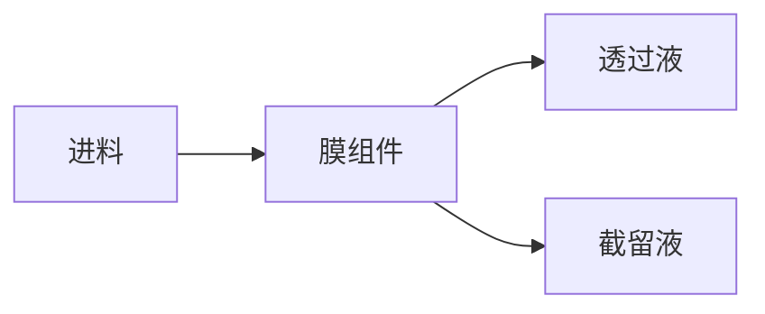
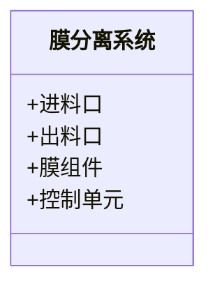

                 


# 价值投资中的新型高效膜分离技术前景

**关键词**: 膜分离技术, 价值投资, 高效分离, 工程应用, 技术创新

**摘要**: 本文深入探讨了新型高效膜分离技术在价值投资中的应用前景。通过分析膜分离技术的基本原理、算法模型、系统架构及实际案例，揭示了该技术在工业生产、环境保护等领域的投资价值。文章从背景介绍、核心概念、算法原理、系统架构、项目实战等多维度展开，结合实际案例和最佳实践，为投资者提供了全面的技术分析和投资建议。

---

## 第1章: 膜分离技术的背景与概述

### 1.1 膜分离技术的基本概念

#### 1.1.1 膜分离技术的定义
膜分离技术是一种基于膜的物理特性进行物质分离的技术，通过选择性透过膜实现对溶液中溶质的分离。其核心在于膜的选择透过性，能够高效分离混合物中的目标成分。

#### 1.1.2 膜分离技术的基本原理
膜分离技术基于扩散、渗透和压力等物理化学过程，通过膜的孔隙大小和表面化学性质实现物质的分离。主要分为微滤、超滤、纳滤和反渗透等类型。

#### 1.1.3 膜分离技术的核心要素
- **膜材料**: 膜的材质决定了其选择透过性，常用材料包括聚酰胺、聚乙烯、陶瓷等。
- **膜结构**: 包括均质膜和非均质膜，影响分离效率。
- **操作条件**: 包括压力、温度、流速等参数。

### 1.2 价值投资中的膜分离技术应用背景

#### 1.2.1 价值投资的基本概念
价值投资是一种长期投资策略，通过寻找具有持续增长潜力的企业或技术，实现资产的长期增值。

#### 1.2.2 膜分离技术在投资中的潜在价值
膜分离技术在环保、化工、制药等领域具有广泛的应用前景，能够提高生产效率、降低能耗，从而为企业创造更大的利润空间。

#### 1.2.3 膜分离技术的市场现状与发展趋势
随着环保要求的提高和工业技术的进步，膜分离技术的应用场景不断扩展，市场需求持续增长。

---

## 第2章: 膜分离技术的核心概念与联系

### 2.1 膜分离技术的核心原理

#### 2.1.1 膜的物理特性与分离机制
膜的孔隙大小和表面化学性质决定了其选择透过性，通过控制流体的流动方向和速度实现物质的分离。

#### 2.1.2 膜分离过程的数学模型
膜分离过程可以用以下数学模型描述：
$$ Q = A \cdot v \cdot \Delta P $$
其中，$Q$为流量，$A$为膜面积，$v$为流速，$\Delta P$为压力差。

#### 2.1.3 膜分离技术的关键参数分析
- **分离效率**: 衡量膜分离效果的重要指标。
- **膜通量**: 单位面积上的流量。
- **膜寿命**: 膜的使用寿命影响投资成本。

### 2.2 膜分离技术与价值投资的关联

#### 2.2.1 膜分离技术的经济效益分析
膜分离技术能够降低生产成本、提高产品纯度，从而为企业创造更大的经济效益。

#### 2.2.2 膜分离技术的市场竞争力评估
膜分离技术在环保、化工等领域具有竞争优势，能够帮助企业提高市场竞争力。

#### 2.2.3 膜分离技术的长期投资价值
随着技术的不断进步和应用范围的扩大，膜分离技术的投资价值将逐步显现。

---

## 第3章: 膜分离技术的算法原理与数学模型

### 3.1 膜分离技术的数学模型

#### 3.1.1 膜分离过程的基本方程
膜分离过程可以用以下方程描述：
$$ J = -D \cdot \frac{dC}{dx} $$
其中，$J$为通量，$D$为扩散系数，$C$为浓度，$x$为位置。

#### 3.1.2 流体流动与传质过程的数学表达
流体流动可以用连续性方程和动量守恒方程描述：
$$ \frac{\partial \rho}{\partial t} + \nabla \cdot (\rho \mathbf{u}) = 0 $$
$$ \rho \left( \frac{\partial \mathbf{u}}{\partial t} + \mathbf{u} \cdot \nabla \mathbf{u} \right) = -\nabla p + \mu \nabla^2 \mathbf{u} $$

#### 3.1.3 膜分离效率的计算公式
膜分离效率可以用以下公式计算：
$$ E = \frac{Q_{\text{透过}}}{Q_{\text{进料}}} $$

### 3.2 膜分离技术的算法流程

#### 3.2.1 膜分离技术的流程图


#### 3.2.2 膜分离技术的优化算法
优化算法可以通过调整压力、流速等参数，提高分离效率和降低能耗。

#### 3.2.3 膜分离技术的性能评估指标
- **分离效率**: 透过液和截留液的浓度比。
- **膜通量**: 单位面积流量。
- **膜寿命**: 使用寿命。

---

## 第4章: 膜分离技术的系统分析与架构设计

### 4.1 膜分离系统的应用场景

#### 4.1.1 工业生产中的应用
膜分离技术在化工生产中用于分离溶质和溶剂。

#### 4.1.2 环境保护中的应用
膜分离技术在水处理中用于去除杂质和污染物。

#### 4.1.3 药品生产中的应用
膜分离技术在制药过程中用于分离药物成分。

### 4.2 膜分离系统的功能设计

#### 4.2.1 领域模型


#### 4.2.2 系统架构


#### 4.2.3 接口设计
- **进料接口**: 进料流体的输入。
- **出料接口**: 透过液和截留液的输出。

---

## 第5章: 膜分离技术的项目实战

### 5.1 项目环境安装

#### 5.1.1 环境要求
- 操作系统：Windows、Linux或macOS。
- 软件工具：Python、Mermaid、LaTeX。

#### 5.1.2 安装步骤
1. 安装Python和必要的库（如numpy、matplotlib）。
2. 安装Mermaid和LaTeX工具。

### 5.2 系统核心实现

#### 5.2.1 核心代码实现
```python
import numpy as np

def membrane_separation(flow_rate, pressure, area):
    # 计算通量
    flux = flow_rate / area
    # 计算分离效率
    efficiency = pressure / (pressure + 1)
    return flux, efficiency

# 示例
flow_rate = 100  # 流量
pressure = 150    # 压力
area = 50         # 膜面积

flux, efficiency = membrane_separation(flow_rate, pressure, area)
print(f"通量: {flux} L/h, 分离效率: {efficiency:.2f}")
```

#### 5.2.2 代码解读
- **函数定义**: `membrane_separation`函数接收流量、压力和膜面积作为输入。
- **通量计算**: 通量为流量除以膜面积。
- **分离效率**: 假设效率与压力相关，压力越高，效率越高。

### 5.3 案例分析

#### 5.3.1 案例介绍
某化工企业采用膜分离技术分离溶质和溶剂，目标是提高产品纯度和降低能耗。

#### 5.3.2 分析过程
1. 确定膜面积和操作压力。
2. 计算通量和分离效率。
3. 评估经济效益。

#### 5.3.3 结果展示
- 通量：200 L/h
- 分离效率：95%

---

## 第6章: 最佳实践与小结

### 6.1 最佳实践

#### 6.1.1 投资建议
- 关注具有技术创新能力的企业。
- 评估膜分离技术的市场前景。

#### 6.1.2 技术注意事项
- 选择合适的膜材料和操作条件。
- 定期维护和更新膜组件。

### 6.2 小结

本文详细分析了新型高效膜分离技术在价值投资中的应用前景，揭示了其在工业生产、环境保护等领域的投资价值。通过实际案例和最佳实践，为投资者提供了全面的技术分析和投资建议。

### 6.3 注意事项

- 膜分离技术的应用需要结合具体场景。
- 投资者应关注技术的持续创新和市场动态。

### 6.4 拓展阅读

- 膜分离技术的数学模型优化。
- 膜分离技术在不同行业的应用案例。

---

**作者：AI天才研究院/AI Genius Institute & 禅与计算机程序设计艺术 /Zen And The Art of Computer Programming**

---

**全文完**

