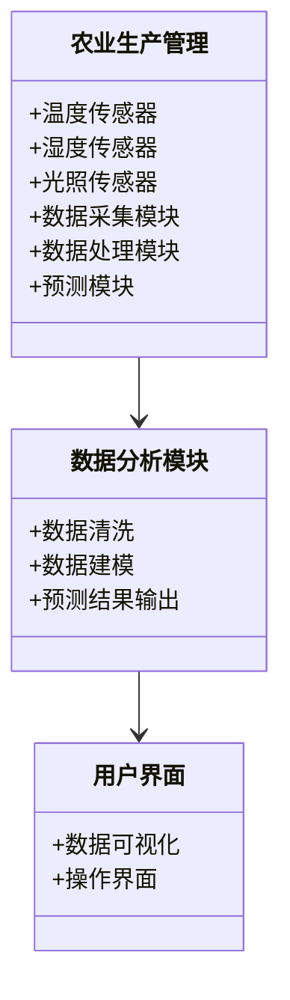
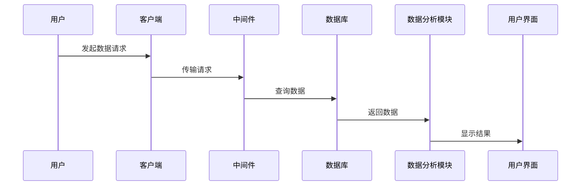

                 


# 价值投资中的智慧农业发展趋势

## 关键词：
- 价值投资
- 智慧农业
- 数据分析
- 人工智能
- 可持续发展

## 摘要：
随着科技的不断进步和全球农业面临的挑战，智慧农业正在成为推动农业现代化的重要力量。价值投资作为一种长期稳健的投资策略，正在与智慧农业深度融合，为企业和投资者提供了新的机遇和挑战。本文将从智慧农业的核心技术、价值投资的关键策略、数据分析与机器学习的应用、智慧农业系统的架构设计以及实际案例分析等多个方面，详细探讨智慧农业中的价值投资趋势和实践策略。

---

## 第1章: 背景介绍

### 1.1 智慧农业的发展现状
#### 1.1.1 智慧农业的核心概念
智慧农业是利用现代信息技术（如物联网、大数据、人工智能等）改造传统农业，实现农业生产、管理、销售等环节的智能化和高效化。其核心目标是提高农业生产力、降低成本、减少资源浪费并增强可持续性。

#### 1.1.2 智慧农业的技术基础
- **物联网（IoT）**：通过传感器和设备实时采集农业数据（如温湿度、光照、土壤酸碱度等）。
- **大数据分析**：对海量农业数据进行处理和分析，提取有价值的信息。
- **人工智能（AI）**：用于预测天气、优化种植方案、识别病虫害等。

#### 1.1.3 智慧农业的市场现状与发展趋势
全球智慧农业市场正在快速增长，尤其是在发达国家和地区。然而，发展中国家的智慧农业潜力巨大，尤其是在解决粮食安全和资源浪费方面。

---

### 1.2 价值投资的基本概念
#### 1.2.1 价值投资的定义与特点
价值投资是一种长期投资策略，强调以低于内在价值的价格买入优质资产。其核心理念是寻找被市场低估的企业，长期持有，分享其成长收益。

#### 1.2.2 价值投资的关键策略
- **基本面分析**：关注企业的财务状况、盈利能力、市场地位等。
- **长期视角**：注重企业的可持续发展能力，而非短期市场波动。
- **安全边际**：买入价格低于内在价值，以降低风险。

#### 1.2.3 价值投资在农业领域的应用潜力
农业领域的价值投资机会主要集中在农业科技企业、现代农业服务、农业供应链优化等领域。

---

### 1.3 智慧农业与价值投资的结合
#### 1.3.1 智慧农业对农业价值的影响
智慧农业通过提高生产效率、降低成本和增强可持续性，显著提升了农业企业的内在价值。

#### 1.3.2 价值投资在智慧农业中的机会
- **农业科技企业**：如智能农业设备制造商、农业数据服务提供商等。
- **现代农业服务**：如农业供应链优化、精准农业解决方案等。
- **农业可持续发展项目**：如绿色农业、有机农业等。

#### 1.3.3 智慧农业与价值投资的协同发展
通过智慧农业技术的应用，农业企业能够更好地实现降本增效，增强盈利能力，从而吸引更多价值投资者的关注。

---

## 第2章: 智慧农业的核心技术与价值分析

### 2.1 智慧农业的核心技术
#### 2.1.1 农业物联网技术
- **数据采集**：通过传感器实时采集农业环境数据。
- **数据传输**：利用无线通信技术将数据传输到云端。
- **数据存储与分析**：通过大数据技术处理和分析农业数据。

#### 2.1.2 农业大数据分析
- **数据挖掘**：从海量农业数据中提取有价值的信息。
- **预测模型**：利用机器学习算法预测作物产量、病虫害风险等。

#### 2.1.3 人工智能在农业中的应用
- **图像识别**：用于作物病虫害识别。
- **自然语言处理**：用于农业知识的自动化处理。

---

### 2.2 价值投资中的关键指标
#### 2.2.1 农业企业的财务指标分析
- **盈利能力**：如净利润率、ROE（净资产收益率）等。
- **成长能力**：如收入增长率、市场份额等。
- **财务健康性**：如资产负债率、现金流等。

#### 2.2.2 农业企业的市场竞争力评估
- **市场地位**：如行业龙头企业的竞争优势。
- **创新能力**：如企业在技术研发和产品创新方面的投入。

#### 2.2.3 农业企业的可持续发展能力
- **环境影响**：如企业是否采用绿色农业技术。
- **社会责任**：如企业在扶贫、就业等方面的表现。

---

## 第3章: 智慧农业中的数据挖掘与机器学习

### 3.1 数据挖掘在智慧农业中的应用
#### 3.1.1 农业数据的采集与处理
- **数据采集**：通过传感器、卫星图像等获取农业数据。
- **数据清洗**：去除噪声数据，确保数据质量。
- **数据建模**：利用统计方法建立农业模型。

#### 3.1.2 数据挖掘在作物生长监测中的应用
- **作物生长预测**：基于历史数据预测作物产量。
- **病虫害监测**：通过图像识别技术识别病虫害。

#### 3.1.3 数据挖掘在农业市场预测中的应用
- **价格预测**：基于市场数据预测农产品价格走势。
- **需求预测**：预测不同地区的农产品需求量。

---

### 3.2 机器学习算法在智慧农业中的实现
#### 3.2.1 常见机器学习算法介绍
- **监督学习**：如线性回归、支持向量机（SVM）。
- **无监督学习**：如聚类分析、主成分分析（PCA）。
- **深度学习**：如卷积神经网络（CNN）、循环神经网络（RNN）。

#### 3.2.2 农业预测模型的构建与优化
- **模型构建**：基于历史数据训练机器学习模型。
- **模型优化**：通过交叉验证优化模型参数。
- **模型部署**：将模型部署到生产环境，实时预测。

#### 3.2.3 机器学习在农业投资决策中的应用
- **风险评估**：通过机器学习模型评估农业企业的风险。
- **投资建议**：基于模型预测提供投资建议。

---

## 第4章: 智慧农业的投资机会与风险分析

### 4.1 智慧农业的投资机会
#### 4.1.1 农业科技企业的投资潜力
- **农业科技企业**：如智能农业设备制造商、农业数据服务提供商。
- **现代农业服务**：如农业供应链优化、精准农业解决方案。

#### 4.1.2 农业可持续发展项目
- **绿色农业**：如有机农业、生态农业。
- **农业环保技术**：如节水技术、减少化肥使用的技术。

### 4.2 智慧农业的投资风险
#### 4.2.1 技术风险
- **技术成熟度**：部分智慧农业技术尚未成熟，存在技术失败的风险。
- **技术替代**：新技术的出现可能导致原有技术快速被淘汰。

#### 4.2.2 市场风险
- **市场需求**：智慧农业技术的市场需求可能低于预期。
- **市场竞争**：行业内竞争激烈，可能导致企业盈利能力下降。

#### 4.2.3 政策风险
- **政策支持**：智慧农业的发展依赖于政府政策的支持，政策变化可能影响投资收益。

---

## 第5章: 智慧农业系统的架构设计与实现

### 5.1 系统功能设计
#### 5.1.1 领域模型


#### 5.1.2 系统架构设计


#### 5.1.3 系统接口设计
- **数据采集接口**：与传感器设备进行数据交互。
- **数据分析接口**：与第三方数据处理服务进行数据交互。
- **用户界面接口**：提供用户与系统交互的界面。

#### 5.1.4 系统交互设计


---

## 第6章: 智慧农业的项目实战与案例分析

### 6.1 项目实战
#### 6.1.1 环境安装
- **硬件环境**：安装传感器、数据采集设备。
- **软件环境**：安装Python、机器学习库（如Scikit-learn、TensorFlow）。

#### 6.1.2 核心代码实现
```python
import numpy as np
from sklearn import linear_model

# 数据准备
X = np.array([[1, 2], [3, 4], [5, 6]])
y = np.array([7, 8, 9])

# 模型训练
model = linear_model.LinearRegression()
model.fit(X, y)

# 预测
new_X = np.array([[7, 8]])
prediction = model.predict(new_X)
print(prediction)
```

#### 6.1.3 代码解读与分析
- **数据准备**：加载农业数据，进行预处理。
- **模型训练**：使用线性回归模型进行训练。
- **预测与分析**：基于训练好的模型进行预测，并分析结果。

---

### 6.2 案例分析
#### 6.2.1 案例背景
某农业科技公司利用智慧农业技术优化作物种植，显著提高了产量和降低了成本。

#### 6.2.2 案例分析
- **问题识别**：作物产量不稳定，病虫害频发。
- **解决方案**：部署物联网设备，利用机器学习模型预测病虫害并优化种植方案。
- **结果分析**：产量提高20%，成本降低15%。

#### 6.2.3 经验总结
- **技术选型**：选择适合的物联网和机器学习技术。
- **数据质量**：确保数据的准确性和完整性。
- **持续优化**：定期更新模型，优化系统性能。

---

## 第7章: 总结与展望

### 7.1 总结
智慧农业与价值投资的结合为农业企业和投资者提供了新的机遇。通过智慧农业技术的应用，农业企业的内在价值得到了显著提升，而价值投资则为智慧农业的发展提供了长期的资金支持。

### 7.2 展望
未来，智慧农业将更加智能化和数据化，价值投资将更加注重企业的可持续发展能力。同时，随着人工智能和大数据技术的不断进步，智慧农业的价值投资机会将更加丰富多样。

---

## 作者：AI天才研究院/AI Genius Institute & 禅与计算机程序设计艺术 /Zen And The Art of Computer Programming

