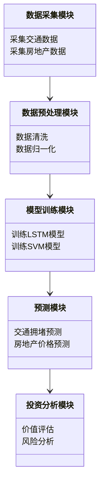
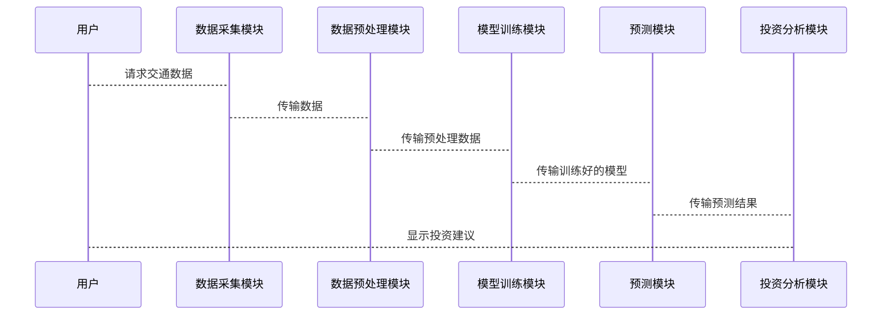

                 


# 《价值投资中的智能交通拥堵预测系统分析》

---

## 关键词：
价值投资，智能交通，拥堵预测，机器学习，深度学习，交通数据

---

## 摘要：
本文旨在探讨智能交通拥堵预测系统在价值投资中的应用与分析。通过分析交通数据的特征、智能预测算法的原理、系统架构的设计，结合实际项目案例，本文揭示了如何利用智能交通拥堵预测系统为价值投资提供科学依据。文章从理论到实践，详细阐述了系统的核心概念、算法实现、系统架构以及项目实战，为读者提供了一个全面了解智能交通拥堵预测系统与价值投资结合的框架。

---

# 第一部分: 价值投资中的智能交通拥堵预测系统背景介绍

---

# 第1章: 价值投资与智能交通拥堵预测系统概述

## 1.1 价值投资的核心概念

### 1.1.1 价值投资的定义
价值投资是一种投资策略，旨在通过分析企业的内在价值，寻找市场价格低于内在价值的投资标的。其核心在于识别被市场低估的资产，长期持有以实现超额收益。

### 1.1.2 价值投资的关键要素
- **内在价值**：企业未来现金流的现值。
- **安全边际**：市场价格与内在价值的差距。
- **长期视角**：关注企业的长期盈利能力。

## 1.2 智能交通拥堵预测系统

### 1.2.1 智能交通拥堵预测系统的定义
智能交通拥堵预测系统是一种基于人工智能和大数据分析的系统，用于预测城市交通网络中的拥堵情况，帮助相关部门和用户提供实时的交通信息。

### 1.2.2 智能交通拥堵预测系统的应用
- **交通管理**：优化交通信号灯控制，减少拥堵。
- **出行规划**：为用户提供最优出行路线。
- **城市规划**：支持城市道路建设和交通政策制定。

### 1.2.3 智能交通拥堵预测系统的价值
- 提高交通效率，减少交通延误。
- 降低能源消耗和环境污染。
- 提升城市居民的生活质量。

## 1.3 价值投资与智能交通拥堵预测系统的结合

### 1.3.1 交通数据的金融属性
交通数据（如拥堵指数、车流量、平均速度等）可以反映城市的经济活动和居民生活质量，从而影响房地产、汽车等相关行业的价值。

### 1.3.2 拥堵预测对投资决策的影响
通过智能交通拥堵预测系统，投资者可以更准确地评估城市交通状况，进而判断相关行业的投资价值。

### 1.3.3 价值投资中的风险与收益平衡
智能交通拥堵预测系统可以帮助投资者识别市场低估的交通基础设施项目，平衡投资风险与收益。

---

# 第2章: 智能交通拥堵预测系统的背景与问题

## 2.1 交通拥堵问题的现状

### 2.1.1 城市化进程加快带来的交通压力
随着城市人口的增加和私家车保有量的上升，城市交通拥堵问题日益严重。

### 2.1.2 传统交通管理的局限性
传统的交通管理手段（如交通信号灯）难以应对复杂的交通状况，导致交通效率低下。

## 2.2 智能交通拥堵预测系统的必要性

### 2.2.1 数据驱动的交通管理
通过大数据分析和人工智能技术，智能交通拥堵预测系统可以实时监测和预测交通状况。

### 2.2.2 提高交通管理效率
智能交通拥堵预测系统可以帮助交通管理部门快速响应交通拥堵，优化交通流量。

## 2.3 智能交通拥堵预测系统的应用前景

### 2.3.1 智能城市的发展需求
智能交通拥堵预测系统是智能城市建设的重要组成部分，可以提升城市的智能化管理水平。

### 2.3.2 技术进步的推动
人工智能和大数据技术的快速发展为智能交通拥堵预测系统的实现提供了技术支持。

---

# 第二部分: 智能交通拥堵预测系统的核心概念与联系

---

# 第3章: 智能交通拥堵预测系统的核心概念

## 3.1 交通数据的特征分析

### 3.1.1 时间序列数据的特性
交通数据（如车流量、拥堵指数）通常具有时间序列特性，可以通过时间序列分析模型进行预测。

### 3.1.2 空间分布特征
不同区域的交通拥堵情况可能有所不同，需要考虑空间分布特征。

### 3.1.3 数据的关联性与依赖性
交通数据之间可能存在相关性，例如车流量与拥堵指数高度相关。

## 3.2 交通拥堵预测的数学模型

### 3.2.1 时间序列分析模型
- **ARIMA模型**：适用于具有趋势和周期性的数据。
- **LSTM模型**：适用于长序列数据，能够捕捉时间依赖性。

### 3.2.2 机器学习模型
- **随机森林**：适用于分类和回归任务，能够处理高维数据。
- **支持向量机（SVM）**：适用于分类任务，能够处理非线性关系。

### 3.2.3 深度学习模型
- **卷积神经网络（CNN）**：适用于图像处理和特征提取。
- **图神经网络（GNN）**：适用于交通网络的复杂关系。

## 3.3 价值投资中的交通数据特征提取

### 3.3.1 数据清洗与预处理
- 数据清洗：去除噪声数据，处理缺失值。
- 数据预处理：标准化、归一化，提取特征。

### 3.3.2 数据特征的选择
- 时间特征：小时、星期、节假日。
- 空间特征：地理位置、道路网络结构。
- 行为特征：交通流量、平均速度、拥堵指数。

### 3.3.3 数据特征的金融属性分析
- 通过交通数据预测房地产价格走势。
- 通过拥堵指数判断商业区的经济活力。

---

# 第三部分: 智能交通拥堵预测系统的算法原理

---

# 第4章: 交通拥堵预测的算法原理

## 4.1 时间序列预测模型

### 4.1.1 ARIMA模型原理

#### 4.1.1.1 ARIMA模型的组成部分
- 自回归（AR）：利用过去的数据预测未来。
- 移动平均（MA）：利用过去预测误差预测未来。

#### 4.1.1.2 ARIMA模型的公式
$$ ARIMA(p, d, q) $$
其中，$p$ 为自回归阶数，$d$ 为差分阶数，$q$ 为移动平均阶数。

#### 4.1.1.3 ARIMA模型的实现步骤
1. 数据预处理：差分、平稳化。
2. 参数估计：使用最大似然估计法确定 $p$ 和 $q$。
3. 模型验证：残差检验、模型拟合优度检验。
4. 预测：基于训练好的模型进行未来交通流量预测。

### 4.1.2 LSTM模型原理

#### 4.1.2.1 LSTM模型的结构
- 输入门（Input Gate）：控制输入信息的流动。
- 遗忘门（Forget Gate）：决定哪些信息需要保留。
- 输出门（Output Gate）：决定输出的信息。

#### 4.1.2.2 LSTM模型的公式
$$ f_t = \sigma(W_f \cdot [h_{t-1}, x_t] + b_f) $$
$$ i_t = \sigma(W_i \cdot [h_{t-1}, x_t] + b_i) $$
$$ o_t = \sigma(W_o \cdot [h_{t-1}, x_t] + b_o) $$
$$ c_t = f_t \cdot c_{t-1} + i_t \cdot tanh(W_c \cdot [h_{t-1}, x_t] + b_c) $$
$$ h_t = o_t \cdot tanh(c_t) $$

#### 4.1.2.3 LSTM模型的实现步骤
1. 数据预处理：归一化、序列分割。
2. 模型构建：定义 LSTM 层、全连接层、损失函数（均方误差）。
3. 模型训练：使用梯度下降优化器（如 Adam）。
4. 模型预测：基于训练好的模型进行未来交通流量预测。

## 4.2 机器学习模型

### 4.2.1 随机森林算法

#### 4.2.1.1 随机森林算法的原理
随机森林是一种基于决策树的集成学习算法，通过随机采样和特征随机化提高模型的泛化能力。

#### 4.2.1.2 随机森林算法的实现步骤
1. 数据预处理：特征选择、数据标准化。
2. 模型构建：随机生成决策树，每棵决策树使用不同的特征子集。
3. 模型训练：通过袋装法（Bagging）提高模型的鲁棒性。
4. 模型预测：通过投票或加权的方式进行预测。

### 4.2.2 支持向量机（SVM）算法

#### 4.2.2.1 SVM算法的原理
SVM 是一种监督学习算法，通过构建超平面将数据点分为不同类别。

#### 4.2.2.2 SVM算法的实现步骤
1. 数据预处理：特征选择、数据标准化。
2. 模型构建：选择核函数（如 RBF 核）。
3. 模型训练：通过求解最优化问题找到最优超平面。
4. 模型预测：根据测试数据点的位置进行分类。

## 4.3 深度学习模型

### 4.3.1 卷积神经网络（CNN）的应用

#### 4.3.1.1 CNN模型的结构
- 卷积层：提取局部特征。
- 池化层：降低模型复杂度，提高泛化能力。
- 全连接层：分类或回归。

#### 4.3.1.2 CNN模型的实现步骤
1. 数据预处理：图像数据归一化、数据增强。
2. 模型构建：定义卷积层、池化层、全连接层。
3. 模型训练：使用交叉熵损失函数和梯度下降优化器。
4. 模型预测：对测试数据进行分类或回归。

### 4.3.2 图神经网络（GNN）的应用

#### 4.3.2.1 GNN模型的原理
GNN 是一种处理图结构数据的深度学习模型，适用于交通网络中节点之间的关系分析。

#### 4.3.2.2 GNN模型的实现步骤
1. 数据预处理：构建交通网络的图结构。
2. 模型构建：定义 GNN 层（如 Graph Convolutional Layer）。
3. 模型训练：使用节点特征和标签进行监督学习。
4. 模型预测：对未知节点进行预测。

---

# 第四部分: 智能交通拥堵预测系统的系统分析与架构设计

---

# 第5章: 智能交通拥堵预测系统的系统分析与架构设计

## 5.1 项目场景介绍

### 5.1.1 项目目标
开发一个基于智能交通拥堵预测系统的价值投资分析工具，帮助投资者通过交通数据预测房地产价格走势。

### 5.1.2 项目范围
- 数据来源：城市交通监控数据、房地产价格数据。
- 数据分析：交通拥堵预测、房地产价格预测。
- 投资分析：基于交通数据的房地产价值评估。

## 5.2 系统功能设计

### 5.2.1 领域模型类图


### 5.2.2 系统架构图


### 5.2.3 系统接口设计

#### 5.2.3.1 数据接口
- 数据输入接口：接收交通数据和房地产数据。
- 数据输出接口：输出预测结果和投资分析报告。

#### 5.2.3.2 用户接口
- 输入接口：用户输入查询条件。
- 输出接口：显示预测结果和投资建议。

### 5.2.4 系统交互流程图


---

# 第六部分: 智能交通拥堵预测系统的项目实战

---

# 第6章: 智能交通拥堵预测系统的项目实战

## 6.1 环境安装

### 6.1.1 Python环境安装
- 安装 Python 3.8 或更高版本。
- 安装必要的库：numpy、pandas、scikit-learn、keras、tensorflow、pymermaid。

### 6.1.2 数据集获取
- 数据来源：公开的交通数据集（如 Kaggle）。
- 数据格式：CSV 格式，包含时间戳、车流量、拥堵指数、房地产价格等。

## 6.2 系统核心实现源代码

### 6.2.1 数据预处理代码
```python
import pandas as pd
import numpy as np

# 读取数据
data = pd.read_csv('traffic_data.csv')

# 数据清洗
data = data.dropna()
data = data.replace({np.nan: 0})

# 数据归一化
from sklearn.preprocessing import MinMaxScaler
scaler = MinMaxScaler()
data_scaled = scaler.fit_transform(data)
```

### 6.2.2 LSTM模型实现代码
```python
from keras.models import Sequential
from keras.layers import LSTM, Dense

# 模型构建
model = Sequential()
model.add(LSTM(128, input_shape=(timesteps, features)))
model.add(Dense(1))
model.compile(loss='mean_squared_error', optimizer='adam')

# 模型训练
model.fit(X_train, y_train, epochs=100, batch_size=32)
```

### 6.2.3 投资分析代码
```python
import pandas as pd
import numpy as np
from sklearn.ensemble import RandomForestRegressor

# 数据加载
data = pd.read_csv('real Estate.csv')

# 特征选择
features = ['交通拥堵指数', '车流量', '房地产价格']
target = '房地产价格'

# 数据分割
from sklearn.model_selection import train_test_split
X_train, X_test, y_train, y_test = train_test_split(data[features], data[target], test_size=0.2)

# 模型训练
model = RandomForestRegressor(n_estimators=100)
model.fit(X_train, y_train)

# 预测与评估
y_pred = model.predict(X_test)
print('均方误差:', np.mean((y_pred - y_test)**2))
```

## 6.3 代码应用解读与分析

### 6.3.1 数据预处理
- 数据清洗：删除缺失值，填充 0。
- 数据归一化：将数据缩放到 0-1 范围内。

### 6.3.2 LSTM模型训练
- 输入形状：(样本数, 时间步长, 特征数)。
- 输出形状：单个值（房地产价格预测）。

### 6.3.3 投资分析
- 使用随机森林回归模型进行房地产价格预测。
- 通过均方误差评估模型性能。

## 6.4 实际案例分析与详细讲解

### 6.4.1 案例背景
某城市交通数据与房地产价格数据，目标是通过交通拥堵预测分析房地产价格走势。

### 6.4.2 数据分析
- 数据预处理：清洗和归一化。
- 模型训练：LSTM 模型预测交通拥堵指数，随机森林模型预测房地产价格。

### 6.4.3 投资决策
- 通过模型预测，发现交通拥堵指数与房地产价格高度相关。
- 在交通拥堵指数较低的区域，房地产价格具有较高的投资价值。

## 6.5 项目小结

### 6.5.1 项目成果
开发了一个基于智能交通拥堵预测系统的价值投资分析工具，能够通过交通数据预测房地产价格走势。

### 6.5.2 经验总结
- 数据预处理是模型训练的关键。
- LSTM 模型适用于时间序列数据预测。
- 随机森林模型适用于多特征的回归任务。

---

# 第七部分: 智能交通拥堵预测系统的最佳实践

---

# 第7章: 最佳实践、小结、注意事项与拓展阅读

## 7.1 最佳实践

### 7.1.1 数据预处理
- 数据清洗：删除异常值和缺失值。
- 数据归一化：确保不同特征的尺度一致。

### 7.1.2 模型选择
- 根据数据特征选择合适的模型。
- 对比不同模型的性能，选择最优模型。

### 7.1.3 系统优化
- 优化系统架构，提高系统的响应速度。
- 通过分布式计算提高系统的处理能力。

## 7.2 小结

智能交通拥堵预测系统是一种基于人工智能和大数据分析的系统，能够通过交通数据预测交通拥堵情况，帮助投资者做出科学的投资决策。本文从理论到实践，详细阐述了智能交通拥堵预测系统的核心概念、算法实现、系统架构以及项目实战，为读者提供了一个全面了解智能交通拥堵预测系统与价值投资结合的框架。

## 7.3 注意事项

### 7.3.1 数据隐私
在处理交通数据和房地产数据时，需要注意数据隐私问题，确保数据的合法性和合规性。

### 7.3.2 模型过拟合
在模型训练过程中，需要注意过拟合问题，通过交叉验证和正则化方法进行优化。

### 7.3.3 系统维护
定期更新模型和数据，确保系统的预测精度和投资分析的准确性。

## 7.4 拓展阅读

### 7.4.1 智能交通系统的前沿技术
- 基于区块链的交通数据共享。
- 基于边缘计算的实时交通预测。

### 7.4.2 价值投资的其他应用
- 基于社交媒体的市场情绪分析。
- 基于新闻情感分析的股票价格预测。

---

# 作者：AI天才研究院/AI Genius Institute & 禅与计算机程序设计艺术 /Zen And The Art of Computer Programming

---

本文通过详细的理论分析和实践案例，展示了智能交通拥堵预测系统在价值投资中的重要应用。希望读者能够通过本文，深入了解智能交通拥堵预测系统的原理和实现方法，并能够在实际投资中灵活运用这些技术。

