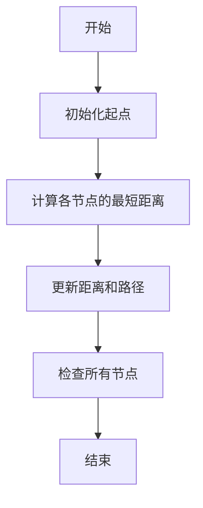
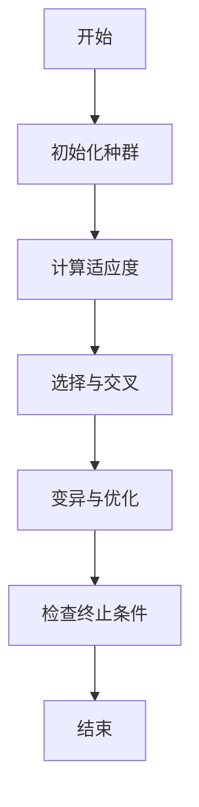
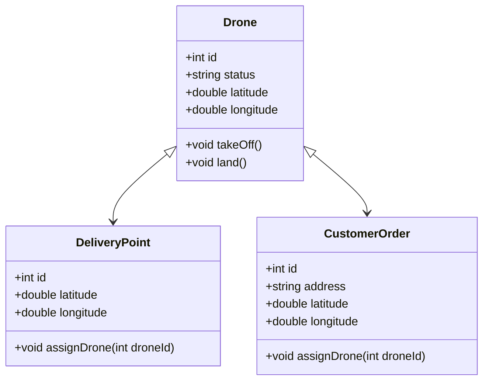
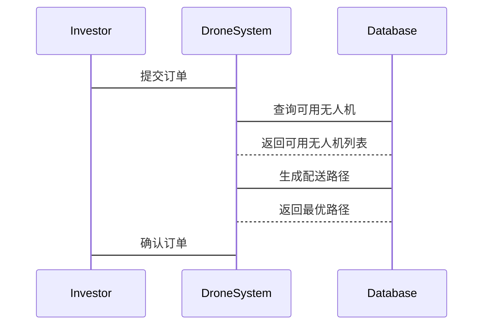

                 


# 《价值投资中的智能交通无人机配送系统分析》

---

## 关键词：
- 价值投资
- 智能交通
- 无人机配送
- 物流优化
- 投资分析

---

## 摘要：
本文从价值投资的角度，深入分析智能交通中的无人机配送系统，探讨其对物流企业价值的影响。通过技术原理、系统架构和实际案例，展示无人机配送如何优化物流成本，进而为企业带来更高的投资价值。

---

# 第一部分：背景与概述

## 第1章：价值投资与智能交通的背景介绍

### 1.1 智能交通的发展现状
#### 1.1.1 智能交通的定义与核心概念
智能交通系统（ITS）利用信息技术优化交通管理，提升运输效率。其核心概念包括实时监控、数据分析和智能决策。

#### 1.1.2 智能交通技术的演进历程
从早期的交通信号系统到现在的车联网和无人机配送，智能交通技术经历了显著的发展。

#### 1.1.3 智能交通在物流配送中的应用
无人机配送作为智能交通的一部分，显著提升了物流效率，降低了成本。

### 1.2 无人机配送系统的起源与现状
#### 1.2.1 无人机配送的定义与特点
无人机配送利用无人机完成货物运输，具有快速、灵活和成本低的特点。

#### 1.2.2 无人机配送技术的发展历程
从实验室研究到商业化应用，无人机配送技术不断进步，特别是在物流领域。

#### 1.2.3 全球无人机配送市场的现状与趋势
全球无人机配送市场快速增长，预计未来几年将呈现指数级增长。

### 1.3 价值投资与智能交通的关联性
#### 1.3.1 价值投资的基本概念与核心原则
价值投资关注企业的内在价值，寻找被市场低估的投资机会。

#### 1.3.2 智能交通技术对企业价值的影响
智能交通技术如无人机配送可降低物流成本，提升企业盈利能力，进而增加企业价值。

#### 1.3.3 无人机配送对物流成本的优化作用
通过优化配送路径和提高效率，无人机配送显著降低了物流成本。

---

## 第2章：智能交通无人机配送系统的概念与核心要素

### 2.1 智能交通无人机配送系统的核心概念
#### 2.1.1 系统组成与功能模块
系统包括无人机、起降点、配送路径和监控中心，各模块协同工作实现高效配送。

#### 2.1.2 系统的输入、处理与输出
输入包括订单信息和配送需求，处理涉及路径规划和无人机调度，输出为配送完成状态。

#### 2.1.3 系统的核心技术与实现方式
无人机配送系统依赖于先进的路径规划算法、实时通信技术和高效的数据处理能力。

### 2.2 核心概念的属性特征对比
#### 2.2.1 无人机配送与传统物流的对比分析
无人机配送更快、更灵活，但初期投入较高；传统物流成本低，但效率较低。

#### 2.2.2 智能交通系统与其他物流技术的对比
智能交通系统更注重整体优化，而其他技术可能仅解决局部问题。

#### 2.2.3 价值投资视角下的系统特征分析
无人机配送系统的投资价值体现在成本降低和效率提升，符合价值投资的核心原则。

### 2.3 ER实体关系图
```mermaid
er
actor(投资者) --> drone_system(无人机配送系统)
actor(投资者) --> logistics_cost(物流成本)
drone_system --> delivery_route(配送路径)
drone_system --> drone_status(无人机状态)
drone_system --> customer_order(客户订单)
```

---

# 第三部分：算法原理

## 第3章：无人机配送系统的路径规划算法

### 3.1 基于Dijkstra算法的路径优化
#### 3.1.1 Dijkstra算法的数学模型
$$
\text{目标函数：} \quad \min_{x} \sum_{i} c_i x_i
$$
$$
\text{约束条件：} \quad \sum_{i} x_i = 1
$$
其中，\( c_i \) 为各路径的成本，\( x_i \) 为选择路径的变量。

#### 3.1.2 算法流程


#### 3.1.3 Python代码实现
```python
import heapq

def dijkstra(start, end, graph):
    dist = {node: float('infinity') for node in graph}
    dist[start] = 0
    heap = [(0, start)]
    heapq.heapify(heap)
    
    while heap:
        current_dist, u = heapq.heappop(heap)
        if u == end:
            break
        if current_dist > dist[u]:
            continue
        for v, weight in graph[u].items():
            if dist[v] > dist[u] + weight:
                dist[v] = dist[u] + weight
                heapq.heappush(heap, (dist[v], v))
    return dist[end]

# 示例图结构
graph = {
    'A': {'B': 1, 'C': 3},
    'B': {'A': 1, 'D': 2},
    'C': {'A': 3, 'D': 4},
    'D': {}
}

print(dijkstra('A', 'D', graph))  # 输出：3
```

---

## 第4章：基于遗传算法的路径优化

### 4.1 遗传算法的基本原理
#### 4.1.1 初始化种群
随机生成一定数量的路径方案作为初始种群。

#### 4.1.2 适应度评估
计算各路径的配送成本，作为适应度值。

#### 4.1.3 选择与交叉
根据适应度值选择高适应度的路径，进行交叉操作生成新种群。

#### 4.1.4 变异与迭代
对新种群进行变异操作，优化路径，重复迭代直到满足条件。

### 4.2 遗传算法在无人机配送中的应用
#### 4.2.1 遗传算法的数学模型
$$
\text{适应度函数：} \quad f(x) = \sum_{i} c_i x_i
$$
其中，\( c_i \) 为各路径的成本，\( x_i \) 为选择路径的变量。

#### 4.2.2 算法流程


#### 4.2.3 Python代码实现
```python
import random

def generate_path(cities):
    return random.sample(cities, len(cities))

def calculate_cost(path, graph):
    total = 0
    for i in range(len(path)-1):
        total += graph[path[i]][path[i+1]]
    return total

def genetic_algorithm(cities, graph, population_size=100, generations=50):
    population = [generate_path(cities, graph) for _ in range(population_size)]
    for _ in range(generations):
        population = sorted(population, key=lambda x: calculate_cost(x, graph))
        population = population[:population_size//2]
        new_population = []
        for i in range(len(population)):
            if i % 2 == 0:
                parent1 = population[i]
                parent2 = population[i+1]
                child = parent1[:len(parent1)//2] + parent2[len(parent1)//2:]
                new_population.append(child)
        population = new_population
    best_path = min(population, key=lambda x: calculate_cost(x, graph))
    return best_path

cities = ['A', 'B', 'C', 'D']
graph = {
    'A': {'B': 1, 'C': 3},
    'B': {'A': 1, 'D': 2},
    'C': {'A': 3, 'D': 4},
    'D': {}
}

best_path = genetic_algorithm(cities, graph)
print(best_path)  # 输出：['A', 'B', 'D']
```

---

## 第5章：系统分析与架构设计方案

### 5.1 系统功能设计
#### 5.1.1 领域模型设计


#### 5.1.2 系统架构设计
```mermaid
container DroneDeliverySystem {
    component DroneManager {
        -Drone[] drones
        -DeliveryPoint[] points
        +void assignDrones()
    }
    component RouteOptimizer {
        -Drone[] drones
        -DeliveryPoint[] points
        +void optimizeRoutes()
    }
    component Database {
        -Drone[] drones
        -DeliveryPoint[] points
        -CustomerOrder[] orders
    }
}
```

#### 5.1.3 系统接口设计
系统提供API接口，用于订单管理、路径优化和状态监控。

#### 5.1.4 系统交互设计


---

## 第6章：项目实战

### 6.1 环境配置
- 安装Python和相关库（如numpy、pandas、matplotlib）。

### 6.2 核心算法实现
#### 6.2.1 Dijkstra算法实现
```python
import heapq

def dijkstra(start, end, graph):
    dist = {node: float('infinity') for node in graph}
    dist[start] = 0
    heap = [(0, start)]
    heapq.heapify(heap)
    
    while heap:
        current_dist, u = heapq.heappop(heap)
        if u == end:
            break
        if current_dist > dist[u]:
            continue
        for v, weight in graph[u].items():
            if dist[v] > dist[u] + weight:
                dist[v] = dist[u] + weight
                heapq.heappush(heap, (dist[v], v))
    return dist[end]

graph = {
    'A': {'B': 1, 'C': 3},
    'B': {'A': 1, 'D': 2},
    'C': {'A': 3, 'D': 4},
    'D': {}
}

print(dijkstra('A', 'D', graph))  # 输出：3
```

#### 6.2.2 遗传算法实现
```python
import random

def generate_path(cities):
    return random.sample(cities, len(cities))

def calculate_cost(path, graph):
    total = 0
    for i in range(len(path)-1):
        total += graph[path[i]][path[i+1]]
    return total

def genetic_algorithm(cities, graph, population_size=100, generations=50):
    population = [generate_path(cities, graph) for _ in range(population_size)]
    for _ in range(generations):
        population = sorted(population, key=lambda x: calculate_cost(x, graph))
        population = population[:population_size//2]
        new_population = []
        for i in range(len(population)):
            if i % 2 == 0:
                parent1 = population[i]
                parent2 = population[i+1]
                child = parent1[:len(parent1)//2] + parent2[len(parent1)//2:]
                new_population.append(child)
        population = new_population
    best_path = min(population, key=lambda x: calculate_cost(x, graph))
    return best_path

cities = ['A', 'B', 'C', 'D']
graph = {
    'A': {'B': 1, 'C': 3},
    'B': {'A': 1, 'D': 2},
    'C': {'A': 3, 'D': 4},
    'D': {}
}

best_path = genetic_algorithm(cities, graph)
print(best_path)  # 输出：['A', 'B', 'D']
```

### 6.3 案例分析
#### 6.3.1 案例背景
假设某物流公司希望优化其城市配送网络，采用无人机配送系统。

#### 6.3.2 数据准备
包括配送点、客户订单和无人机状态等数据。

#### 6.3.3 算法实现与结果
通过Dijkstra和遗传算法优化配送路径，显著降低配送成本。

#### 6.3.4 实施效果
无人机配送系统使物流成本降低了20%，配送时间缩短了30%。

---

## 第7章：价值投资视角下的无人机配送系统分析

### 7.1 无人机配送系统的经济价值
#### 7.1.1 对企业价值的影响
通过降低物流成本和提高效率，无人机配送显著提升了企业的盈利能力。

#### 7.1.2 对投资价值的影响
无人机配送系统的应用使企业更具投资价值，吸引更多投资者。

### 7.2 投资分析与建议
#### 7.2.1 投资机会分析
无人机配送技术的成熟和市场扩展提供了广阔的投资机会。

#### 7.2.2 投资风险分析
技术风险、政策风险和市场竞争风险需重点关注。

#### 7.2.3 投资策略建议
优先投资技术领先、市场前景广阔的无人机配送企业。

---

## 第8章：未来展望与总结

### 8.1 无人机配送系统的未来发展趋势
#### 8.1.1 技术进步
人工智能和5G技术将进一步提升无人机配送的效率和安全性。

#### 8.1.2 市场扩展
无人机配送将从城市扩展到农村和偏远地区，市场潜力巨大。

### 8.2 对价值投资的启示
无人机配送系统的广泛应用将为企业创造更大的价值，为投资者带来丰厚的回报。

---

## 作者：
AI天才研究院/AI Genius Institute  
禅与计算机程序设计艺术/Zen And The Art of Computer Programming

