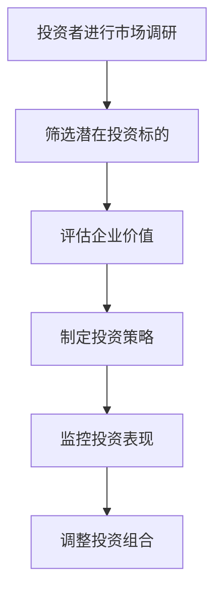
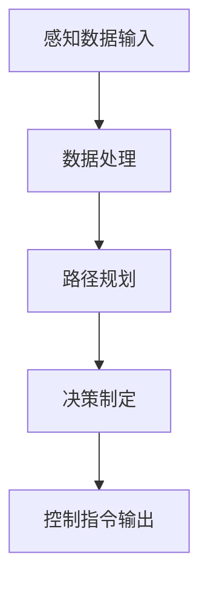
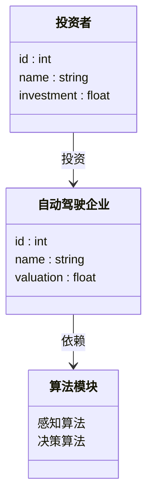
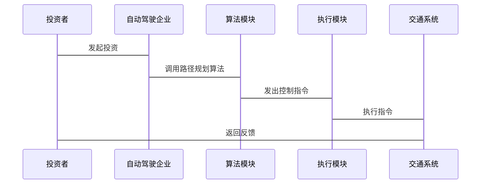

                 


# 价值投资中的智能交通自动驾驶协同系统分析

---

## 关键词

- 价值投资
- 智能交通
- 自动驾驶
- 协同系统
- 算法原理
- 系统架构

---

## 摘要

本文深入分析了价值投资在智能交通自动驾驶协同系统中的应用，探讨了自动驾驶技术的发展现状及其与价值投资的协同机制。通过详细讲解算法原理、系统架构设计以及项目实战案例，本文为投资者和技术开发者提供了在智能交通领域进行价值投资的策略和方法。文章结合理论分析和实际应用，旨在帮助读者理解如何在自动驾驶技术的商业化过程中实现价值最大化。

---

## 第一部分：背景介绍

### 第1章：价值投资与智能交通概述

#### 1.1 价值投资的基本概念

- **价值投资的定义**：价值投资是一种长期投资策略，主要关注于投资标的的内在价值，寻找市场价格低于其内在价值的投资机会。
- **价值投资的核心理念**：寻找被市场低估的企业，长期持有，等待其价值回归。
- **价值投资与现代金融的结合**：现代金融理论中的基本面分析为价值投资提供了理论基础，结合市场趋势和企业基本面进行投资决策。

#### 1.2 智能交通系统的背景

- **智能交通系统的定义**：智能交通系统（ITS）是通过先进的信息技术、数据通信技术、传感器技术和电子控制技术，对交通系统进行智能化管理的系统。
- **智能交通的发展历程**：从早期的交通信号控制到现在的车联网、自动驾驶，智能交通系统经历了多个发展阶段。
- **智能交通与自动驾驶的关系**：自动驾驶是智能交通系统的重要组成部分，通过车辆与交通系统的协同工作，提高交通效率和安全性。

#### 1.3 自动驾驶技术的现状

- **自动驾驶的定义与分类**：自动驾驶是指车辆在没有人类驾驶员干预的情况下，能够完成所有驾驶任务。根据自动化程度的不同，自动驾驶分为L0到L5六个级别。
- **当前技术发展水平**：目前，部分高级别自动驾驶技术已应用于特定场景，如特斯拉的Autopilot系统和Waymo的自动驾驶出租车服务。
- **自动驾驶面临的挑战**：技术层面的感知和决策问题，法律法规的滞后，以及公众接受度的挑战。

---

## 第二部分：核心概念与联系

### 第2章：价值投资与自动驾驶协同系统的原理

#### 2.1 价值投资在自动驾驶中的应用

- **投资标的筛选标准**：关注企业的技术实力、市场占有率、财务状况和管理团队。
- **企业价值评估方法**：使用DCF模型、EV/EBITDA等方法评估企业的内在价值。
- **风险评估与投资策略**：分析行业风险、技术风险和市场风险，制定多元化投资策略。

#### 2.2 自动驾驶系统的协同机制

- **系统模块划分**：感知模块、决策模块、执行模块。
- **模块间协作原理**：感知模块提供环境数据，决策模块进行路径规划，执行模块完成动作。
- **协同效率的提升方法**：优化数据传输速度，提高算法计算效率，加强模块间的通信与协作。

#### 2.3 价值投资与自动驾驶协同系统的对比分析

- **核心概念对比表**

| 核心概念 | 价值投资 | 自动驾驶协同系统 |
|----------|----------|------------------|
| 宗旨     | 价值最大化 | 提高交通效率       |
| 主体     | 投资者     | 车辆与交通系统     |
| 工具     | 财务分析   | 感知与决策算法     |

- **ER实体关系图**

```mermaid
erDiagram
    customer[投资者] {
        id : int
        name : string
        investment : float
    }
    company[自动驾驶企业] {
        id : int
        name : string
        valuation : float
    }
    investment[investments]
    customer --> investment : 投资
    company --> investment : 被投资
```

- **Mermaid流程图展示**



---

## 第三部分：算法原理讲解

### 第3章：自动驾驶协同系统的算法原理

#### 3.1 算法概述

- **算法的基本原理**：基于感知数据，通过决策算法生成控制指令，实现车辆的自动驾驶。
- **算法的输入输出**：输入包括传感器数据（如激光雷达、摄像头、雷达），输出包括转向指令、加速指令。
- **算法的优缺点**：优点是提高驾驶效率和安全性，缺点是技术复杂，容易受环境影响。

#### 3.2 Mermaid流程图展示



#### 3.3 Python源代码实现

```python
import numpy as np

def感知数据处理(data):
    # 数据预处理
    processed_data = data / 255.0
    return processed_data

def路径规划(processed_data):
    # 使用A*算法进行路径规划
    start = (0, 0)
    end = (目标位置)
    # 算法实现略
    return path

def决策制定(path):
    # 评估路径风险，选择最优路径
    risks = [计算风险系数 for each path]
    selected_path = risks.index(min(risks))
    return selected_path

def控制指令输出(selected_path):
    # 生成转向和加速指令
    steering = 计算转向角度(selected_path)
    acceleration = 计算加速度(selected_path)
    return steering, acceleration

# 示例代码调用
data = np.array([0, 1, 0, 0, 1])
processed_data = 感知数据处理(data)
path = 路径规划(processed_data)
selected_path = 决策制定(path)
steering, acceleration = 控制指令输出(selected_path)
print(f"转向指令：{steering}, 加速度指令：{acceleration}")
```

#### 3.4 数学模型和公式

自动驾驶的路径规划可以使用A*算法，其数学模型如下：

$$ f(n) = g(n) + h(n) $$

其中：
- \( g(n) \) 是从起点到节点n的实际成本。
- \( h(n) \) 是从节点n到目标的估计成本（启发函数）。
- \( f(n) \) 是节点n的总评估函数。

---

## 第四部分：系统分析与架构设计

### 第4章：自动驾驶协同系统的架构设计

#### 4.1 系统应用场景

- **城市交通**：自动驾驶在城市道路中的应用，如自动驾驶公交车、共享汽车。
- **高速公路**：自动驾驶在长途货运中的应用，如自动驾驶卡车编队行驶。

#### 4.2 系统功能设计

- **领域模型类图**



- **系统架构图**


#### 4.3 系统接口设计

- **接口描述**

| 接口名称 | 输入 | 输出 |
|----------|------|------|
| 感知数据接口 | 传感器数据 | 处理后的数据 |
| 决策接口 | 环境数据 | 转向和加速指令 |

#### 4.4 系统交互序列图



---

## 第五部分：项目实战

### 第5章：价值投资与自动驾驶协同系统的案例分析

#### 5.1 环境安装

- **安装Python和相关库**
  ```bash
  pip install numpy matplotlib pandas
  ```

#### 5.2 核心代码实现

```python
import numpy as np
import matplotlib.pyplot as plt

# 示例代码：计算自动驾驶企业的投资价值
def 计算企业价值(收入, 成本, 折现率):
    净利润 = 收入 - 成本
    企业价值 = 净利润 / (折现率 / (1 + 折现率))
    return 企业价值

收入 = 1000
成本 = 800
折现率 = 0.05

value = 计算企业价值(收入, 成本, 折现率)
print(f"企业价值：{value}")
```

#### 5.3 案例分析：特斯拉的自动驾驶技术

- **分析过程**
  - 技术实力：特斯拉的FSD芯片和神经网络算法。
  - 市场表现：截至2023年，特斯拉的自动驾驶技术已获得大量市场认可。
  - 投资策略：长期持有，关注技术更新和法规进展。

#### 5.4 小结

通过案例分析，投资者可以更好地理解如何在自动驾驶领域进行价值投资，同时技术开发者也能从中获得系统设计的启发。

---

## 第六部分：最佳实践

### 第6章：投资策略与系统设计的经验总结

#### 6.1 小结

- 价值投资需要结合技术发展和市场趋势，自动驾驶技术是未来的重要方向。
- 系统设计要注重模块化和可扩展性，便于未来的升级和维护。

#### 6.2 注意事项

- **技术风险**：自动驾驶技术尚未完全成熟，存在感知和决策的不确定性。
- **法规风险**：各国自动驾驶法规不一，可能影响企业的市场扩展。
- **市场风险**：市场竞争激烈，投资需谨慎。

#### 6.3 未来的研究方向

- 深入研究人工智能在自动驾驶中的应用。
- 探讨区块链技术在自动驾驶协同系统中的潜在应用。

#### 6.4 拓展阅读

- 推荐书籍：《自动驾驶：技术与投资》
- 推荐博客：TechCrunch的自动驾驶专栏

---

## 作者信息

作者：AI天才研究院/AI Genius Institute & 禅与计算机程序设计艺术 /Zen And The Art of Computer Programming

---

以上是《价值投资中的智能交通自动驾驶协同系统分析》的完整目录和内容大纲。通过系统化的分析和详细的案例解读，本文旨在为投资者和技术开发者提供在智能交通领域进行价值投资的策略和方法。

