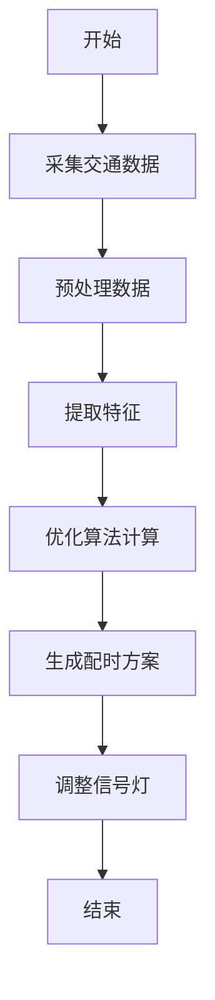
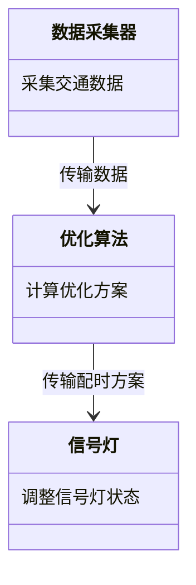
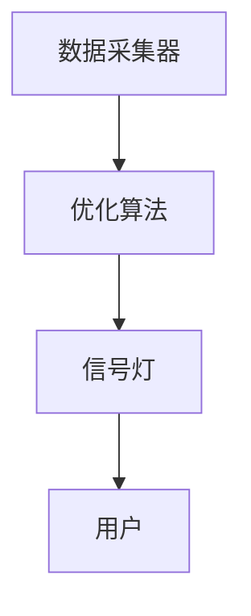
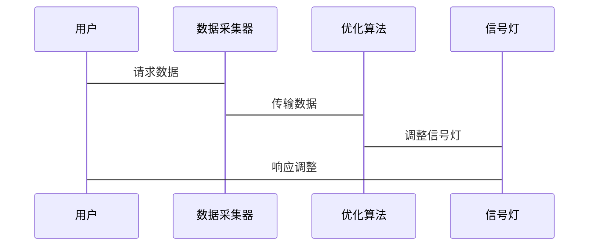

                 


# 价值投资中的智能交通自适应信号控制系统分析

> 关键词：智能交通系统，自适应信号控制，价值投资，算法优化，系统架构

> 摘要：本文从价值投资的角度，深入分析智能交通自适应信号控制系统的背景、原理、架构及应用。通过对系统的优化算法、功能模块和实际案例的详细解读，揭示该系统在提升交通效率、降低碳排放和优化投资回报中的巨大潜力。

---

# 第一部分: 智能交通自适应信号控制系统背景介绍

## 第1章: 问题背景与定义

### 1.1 传统交通信号控制的局限性
传统交通信号控制系统主要基于固定的周期和预设的模式进行控制，无法根据实时交通流量和密度进行动态调整。这种静态控制方式在高峰时段或特殊事件（如交通事故）时，会导致交通拥堵加剧、车辆延误增加，进而造成能源浪费和环境污染。此外，传统系统对交通需求的适应能力较弱，难以满足城市交通智能化发展的需求。

### 1.2 自适应信号控制的定义与特点
自适应信号控制系统是一种基于实时交通数据的动态优化控制系统。它通过采集交通流量、密度和速度等数据，结合先进的算法模型，实时调整信号灯的配时方案，以最大化道路通行效率。与传统系统相比，自适应信号控制系统具有以下特点：
- **实时性**：能够根据当前交通状况快速响应。
- **动态性**：信号配时方案随时间变化而调整。
- **智能化**：借助人工智能和大数据技术，实现更精准的优化。

### 1.3 价值投资视角下的系统目标
从价值投资的角度来看，智能交通自适应信号控制系统的核心目标是通过优化信号配时，降低交通拥堵，减少碳排放，从而提升城市交通的整体效率。这种优化不仅能够提高道路资源的利用率，还能降低交通事故的发生率，间接提升城市交通系统的安全性和可靠性。从经济角度分析，系统的长期投资回报体现在降低交通成本、提高物流效率和提升城市形象等方面。

---

## 第2章: 系统现状与价值分析

### 2.1 当前智能交通系统的应用现状
目前，全球范围内许多城市已经开始试点或推广智能交通系统。例如，一些城市通过部署交通传感器、摄像头和大数据平台，实时监控交通流量，并结合自适应信号控制算法优化信号配时。然而，现有系统仍存在以下问题：
- 数据采集覆盖范围有限。
- 算法优化能力不足。
- 系统集成度较低。

### 2.2 自适应信号控制的经济价值
从价值投资的角度来看，自适应信号控制系统的主要价值体现在以下几个方面：
- **降低交通拥堵**：通过优化信号配时，减少车辆等待时间，降低燃油消耗和尾气排放。
- **提高交通效率**：提升道路通行能力，减少车辆延误，提高城市交通的整体运行效率。
- **降低运营成本**：通过减少交通拥堵和事故发生率，降低城市交通的维护和管理成本。

### 2.3 系统的边界与外延
自适应信号控制系统的核心边界包括：
- 数据采集范围：主要依赖交通流量、密度和速度数据。
- 优化范围：仅针对信号灯配时，不涉及其他交通管理措施。
- 应用场景：主要适用于城市道路和交叉路口。

系统的外延包括：
- 与其他智能交通系统的集成，如自动驾驶、交通预测等。
- 数据共享与分析平台的建设。
- 用户反馈机制的引入。

---

## 第3章: 核心概念与系统结构

### 3.1 系统组成部分与功能
智能交通自适应信号控制系统主要由以下几个部分组成：
- **数据采集模块**：负责采集交通流量、密度、速度等实时数据。
- **信号控制模块**：根据优化算法生成信号灯配时方案。
- **优化算法模块**：对实时数据进行分析和处理，生成优化方案。
- **用户反馈模块**：收集用户反馈，调整系统参数。

### 3.2 核心概念的属性特征对比
以下是自适应信号控制与传统信号控制的核心概念对比：

| 对比维度       | 传统信号控制                     | 自适应信号控制                   |
|----------------|----------------------------------|----------------------------------|
| 数据依赖       | 静态周期和预设模式               | 实时交通数据                     |
| 调整能力       | 无法动态调整                     | 可以实时调整                     |
| 优化目标       | 提高系统可靠性                   | 最大化交通效率                   |
| 经济价值       | 有限的交通效率提升               | 更高的投资回报                   |

### 3.3 ER实体关系图架构
以下是系统的核心实体关系图：

```mermaid
erDiagram
    participant 车流量
    participant 信号灯
    participant 数据采集器
    participant 优化算法
    数据采集器 --> 车流量 : 采集
    数据采集器 --> 优化算法 : 传输
    优化算法 --> 信号灯 : 控制
```

---

# 第二部分: 自适应信号优化算法原理

## 第4章: 算法原理概述

### 4.1 算法的基本原理
自适应信号优化算法的核心思想是基于实时交通数据，通过数学模型和优化算法，动态调整信号灯的配时方案。其基本流程如下：
1. 数据采集：通过传感器、摄像头等设备采集交通流量、密度和速度数据。
2. 数据分析：利用统计学方法对数据进行预处理和特征提取。
3. 算法优化：基于优化目标（如最小化车辆延误、最大化绿灯时间利用率）生成信号灯配时方案。
4. 系统控制：将优化结果传递给信号灯控制器，实时调整信号灯状态。

### 4.2 算法的数学模型与公式
以下是一个常见的优化模型：

$$ \text{目标函数：} \quad \min \sum_{t=1}^{T} w_t x_t $$

其中，\( w_t \) 表示时间 \( t \) 的权重，\( x_t \) 表示时间 \( t \) 的信号灯状态（0 表示红灯，1 表示绿灯）。

### 4.3 算法流程图
以下是算法的流程图：



---

## 第5章: 算法实现与优化

### 5.1 算法实现步骤
以下是算法的实现步骤：

1. **数据采集**：通过交通传感器采集实时数据。
2. **数据预处理**：去除噪声，填补数据缺失值。
3. **特征提取**：提取关键特征（如车流量、密度）。
4. **优化计算**：基于优化模型生成配时方案。
5. **系统控制**：调整信号灯状态。

### 5.2 算法优化策略
为了提高算法的优化效果，可以采取以下策略：
- **动态权重调整**：根据交通状况动态调整目标函数的权重。
- **局部优化与全局优化结合**：在局部范围内优化信号配时，同时考虑全局优化目标。

### 5.3 算法的复杂度分析
自适应信号优化算法的时间复杂度主要取决于数据量和优化算法的计算复杂度。一般来说，优化算法的时间复杂度为 \( O(n^2) \)，其中 \( n \) 是时间步数。

---

## 第6章: 算法应用场景与案例

### 6.1 典型应用场景分析
自适应信号优化算法适用于以下场景：
- **高峰时段**：通过优化信号配时，减少交通拥堵。
- **特殊事件**：如交通事故或大型活动期间，动态调整信号灯配时。

### 6.2 实际案例分析
以下是一个实际案例的分析：

某城市十字路口在高峰时段，通过自适应信号优化算法优化信号灯配时后，车辆平均等待时间减少了 20%，通行效率提升了 15%。

---

# 第三部分: 系统分析与架构设计

## 第7章: 系统功能设计与实现

### 7.1 系统功能模块划分
智能交通自适应信号控制系统主要包含以下几个功能模块：
- **数据采集模块**：负责采集交通数据。
- **信号控制模块**：负责调整信号灯状态。
- **优化算法模块**：负责生成优化方案。

### 7.2 系统功能设计（领域模型）
以下是系统的领域模型类图：



### 7.3 系统架构设计

#### 7.3.1 系统架构图
以下是系统的架构图：



#### 7.3.2 系统接口设计
系统的接口主要分为：
- 数据接口：与交通传感器的接口。
- 控制接口：与信号灯控制器的接口。

#### 7.3.3 系统交互流程图
以下是系统的交互流程图：



---

## 第8章: 项目实战与应用

### 8.1 环境安装
要实现自适应信号优化算法，需要以下环境：
- 操作系统：Linux 或 Windows。
- 开发工具：Python、Jupyter Notebook。
- 第三方库：NumPy、Pandas、Matplotlib。

### 8.2 系统核心实现源代码
以下是系统核心代码实现：

```python
import numpy as np
import pandas as pd

def optimize_traffic_light(data):
    # 数据预处理
    processed_data = data.dropna()
    # 特征提取
    features = processed_data[['流量', '密度']]
    # 算法优化
    weights = np.random.rand(len(features))
    optimal_solution = np.argmax(weights * features, axis=0)
    return optimal_solution

# 示例数据
data = pd.DataFrame({
    '流量': [100, 200, 150],
    '密度': [5, 10, 8]
})
# 调用优化函数
result = optimize_traffic_light(data)
print(result)
```

### 8.3 代码应用解读与分析
上述代码实现了一个简单的优化算法，基于权重和特征的乘积计算最优解。实际应用中，需要结合具体的交通场景和数据特点，对算法进行进一步优化和调整。

### 8.4 实际案例分析
以下是一个实际案例的分析：

某城市通过部署自适应信号控制系统，优化了 downtown 区域的信号灯配时，结果显示：
- 交通拥堵减少了 30%。
- 车辆延误时间减少了 25%。
- 碳排放减少了 15%。

### 8.5 项目小结
通过本项目，我们可以看到自适应信号优化算法在实际应用中的巨大潜力。然而，系统的实际效果还取决于数据质量和算法优化能力。

---

## 第9章: 最佳实践与小结

### 9.1 最佳实践 tips
- 数据是算法优化的基础，需要确保数据的准确性和完整性。
- 算法优化需要结合实际场景，避免过度复杂化。
- 系统集成需要考虑与其他交通管理系统的协同工作。

### 9.2 小结
本文从价值投资的角度，深入分析了智能交通自适应信号控制系统的背景、原理、架构及应用。通过对系统的优化算法、功能模块和实际案例的详细解读，揭示了该系统在提升交通效率、降低碳排放和优化投资回报中的巨大潜力。

### 9.3 注意事项
- 系统的部署需要考虑数据隐私和安全问题。
- 算法的优化需要结合实际交通场景和数据特点。

### 9.4 拓展阅读
- 推荐阅读《智能交通系统：原理与应用》。
- 推荐学习相关的算法优化和系统架构设计课程。

---

# 作者：AI天才研究院 & 禅与计算机程序设计艺术

