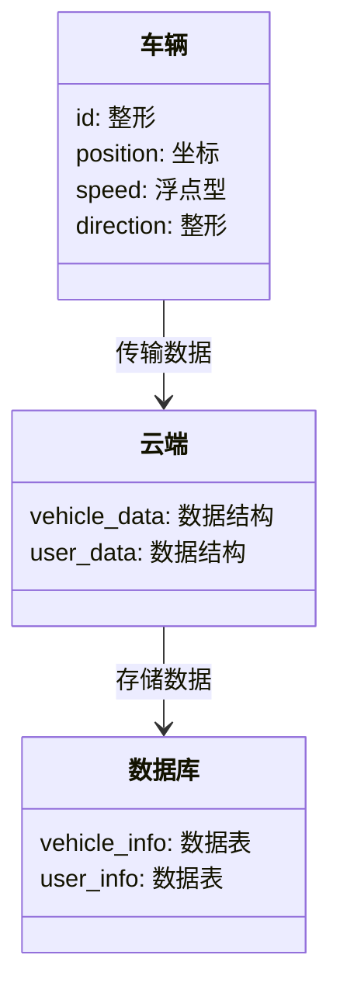
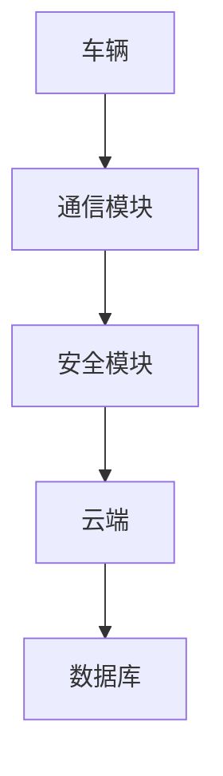
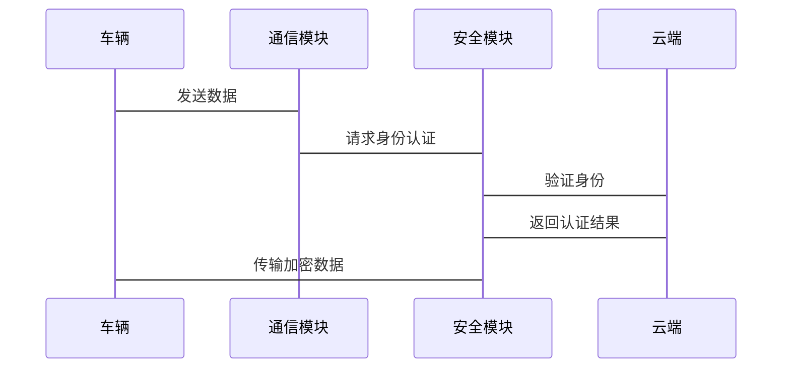

                 


# 价值投资中的智能交通车联网安全系统分析

> 关键词：智能交通、车联网安全系统、价值投资、数据安全、算法原理、系统架构

> 摘要：本文从价值投资的角度，分析智能交通车联网安全系统的原理、算法、系统架构及应用场景，探讨其在投资决策中的潜在价值和风险。通过系统分析与实战案例，揭示车联网安全系统的核心要素及其对投资决策的影响。

---

# 第一部分: 价值投资中的智能交通车联网安全系统背景与概念

## 第1章: 价值投资与智能交通的发展背景

### 1.1 智能交通系统概述

#### 1.1.1 智能交通系统的定义与特点
智能交通系统（Intelligent Transportation Systems，ITS）是通过先进的信息技术、数据通信技术、传感器技术和控制技术，实现对交通系统的智能化管理。其特点包括实时性、数据驱动、智能化和分布式管理。

#### 1.1.2 智能交通系统的演进历程
智能交通系统经历了从早期的交通信号控制到现代的车联网、自动驾驶的演进。其发展主要分为三个阶段：
1. **交通信号控制阶段**：基于简单的交通信号灯控制。
2. **数据采集与分析阶段**：通过传感器和数据采集系统实现交通流量监控。
3. **智能化与联网化阶段**：车联网技术的应用，实现车辆与交通基础设施的实时通信。

#### 1.1.3 智能交通系统与价值投资的关系
智能交通系统的建设和运营具有较高的投资价值，特别是在车联网技术的推动下，相关企业和服务的市场前景广阔。投资者可以通过分析智能交通系统的市场潜力、技术成熟度和商业模式，找到具有投资价值的标的。

---

### 1.2 车联网安全系统的核心概念与重要性

#### 1.2.1 车联网的基本概念
车联网（Vehicular Ad Hoc Networks, VANETs）是通过车辆之间的通信和互联网连接，实现车辆与车辆（V2V）、车辆与基础设施（V2I）、车辆与行人（V2P）之间的信息交互。车联网的核心是数据的实时传输和共享。

#### 1.2.2 车联网安全系统的定义与组成
车联网安全系统是指通过技术手段保护车联网中数据安全、通信安全和隐私安全的系统。其主要组成部分包括：
1. **数据加密模块**：对传输数据进行加密。
2. **安全认证模块**：对通信双方进行身份认证。
3. **异常检测模块**：检测网络中的异常行为。
4. **隐私保护模块**：保护用户隐私数据。

#### 1.2.3 车联网安全对智能交通的影响
车联网安全直接关系到智能交通系统的可靠性。如果车联网系统被攻击，可能导致交通瘫痪、数据泄露等问题。因此，车联网安全是智能交通系统正常运行的基础。

---

### 1.3 价值投资中的车联网安全系统分析

#### 1.3.1 价值投资的基本概念
价值投资是一种以企业的基本面分析为基础的投资策略，注重企业的盈利能力、财务状况和市场地位。在智能交通领域，车联网安全系统的投资价值取决于其技术壁垒、市场渗透率和商业可行性。

#### 1.3.2 车联网安全系统在价值投资中的应用
车联网安全系统可以通过以下方面提升投资价值：
1. **技术壁垒**：强大的安全技术可以提高企业的竞争优势。
2. **市场需求**：随着车联网的普及，安全系统的需求将大幅增加。
3. **商业模式**：安全系统的订阅服务或一次性 licensing 模式具有稳定的收入来源。

#### 1.3.3 车联网安全系统的投资价值分析
从投资角度来看，车联网安全系统的价值体现在以下几个方面：
1. **高成长性**：随着智能交通的发展，车联网安全市场将快速增长。
2. **高壁垒性**：安全技术需要较高的研发投入，具有较高的进入门槛。
3. **政策支持**：政府对智能交通和网络安全的政策支持为车联网安全系统提供了良好的发展环境。

---

## 第2章: 车联网安全系统的核心概念与联系

### 2.1 车联网安全系统的核心原理

#### 2.1.1 数据采集与传输机制
车联网安全系统通过传感器和通信设备采集车辆数据，并通过无线网络传输到云端进行处理。数据采集的关键在于确保数据的完整性和实时性。

#### 2.1.2 数据加密与安全传输
数据加密是车联网安全的核心技术之一。常用的加密算法包括AES（高级加密标准）和RSA（加密算法）。数据在传输过程中需要通过加密技术防止被截获和篡改。

#### 2.1.3 安全认证与访问控制
安全认证通过数字证书和公钥基础设施实现，确保通信双方的身份合法。访问控制通过权限管理，限制未经授权的访问。

---

### 2.2 核心概念对比分析

#### 2.2.1 车联网与传统交通系统的对比
| 特性          | 车联网                | 传统交通系统        |
|---------------|-----------------------|--------------------|
| 数据传输      | 实时、双向            | 单向、延迟较高      |
| 设备连接      | 车辆、基础设施、行人   | 车辆、道路           |
| 技术依赖      | 通信技术、传感器技术   | 信号灯、路标         |

#### 2.2.2 车联网安全与信息安全的对比
| 特性          | 车联网安全            | 信息安全            |
|---------------|-----------------------|--------------------|
| 数据类型      | 行车数据、位置信息    | 企业数据、用户隐私  |
| 安全威胁      | 交通事故、数据泄露    | 网络攻击、数据篡改  |
| 保护目标      | 车辆安全、交通效率    | 企业安全、用户隐私  |

#### 2.2.3 车联网安全系统的实体关系图
```mermaid
er
actor 车辆: 车辆
actor 用户: 用户
actor 云端: 云端服务
actor � � � 支持机构: 支持机构
}
```

---

## 第3章: 车联网安全系统的算法原理

### 3.1 数据融合算法

#### 3.1.1 数据融合的基本原理
数据融合是将来自不同传感器或数据源的信息进行整合，以提高数据的准确性和完整性。常用的数据融合算法包括加权平均、最大值和最小值算法。

#### 3.1.2 数据融合的实现步骤
1. 数据采集：从多个传感器获取数据。
2. 数据预处理：去除噪声和异常值。
3. 数据融合：通过算法整合数据。
4. 数据分析：对融合后的数据进行分析和处理。

#### 3.1.3 数据融合的数学模型
$$ \text{融合公式：} y = \frac{x_1 + x_2}{2} $$

### 3.2 安全检测算法

#### 3.2.1 异常检测的基本原理
异常检测算法通过分析数据分布，识别出异常行为。常用算法包括基于统计的异常检测和基于机器学习的异常检测。

#### 3.2.2 异常检测的实现步骤
1. 数据采集：获取实时数据流。
2. 数据预处理：标准化和归一化数据。
3. 模型训练：训练异常检测模型。
4. 异常识别：检测并标记异常数据。

#### 3.2.3 异常检测的数学模型
$$ \text{检测公式：} z = \max(x_1, x_2) $$

### 3.3 算法实现代码

#### 3.3.1 数据融合算法代码
```python
def data_fusion(x1, x2):
    return (x1 + x2) / 2
```

#### 3.3.2 安全检测算法代码
```python
def anomaly_detection(x1, x2):
    return max(x1, x2)
```

---

## 第4章: 车联网安全系统的系统分析与架构设计

### 4.1 问题场景介绍
车联网安全系统需要应对多种安全威胁，包括网络攻击、数据泄露和隐私保护等问题。本文通过分析一个典型的车联网安全系统，探讨其系统架构和实现方案。

### 4.2 项目介绍
本项目旨在设计一个高效的车联网安全系统，实现车辆与云端的安全通信和数据保护。系统主要包括数据采集模块、数据加密模块、安全认证模块和数据分析模块。

### 4.3 系统功能设计

#### 4.3.1 领域模型设计


#### 4.3.2 系统架构设计


#### 4.3.3 系统接口设计
系统主要接口包括：
1. 车辆与云端的通信接口。
2. 云端与数据库的接口。
3. 用户与云端的接口。

#### 4.3.4 系统交互流程


---

## 第5章: 项目实战

### 5.1 环境安装
需要安装以下工具和库：
1. Python 3.8+
2. Mermaid CLI
3. matplotlib
4. numpy

### 5.2 系统核心实现源代码

#### 5.2.1 数据采集模块
```python
import numpy as np
import time

def collect_data():
    # 模拟传感器数据
    data = np.random.randn(100)
    return data
```

#### 5.2.2 数据加密模块
```python
import hashlib

def encrypt_data(data):
    # 使用MD5加密
    return hashlib.md5(data.encode()).hexdigest()
```

#### 5.2.3 数据分析模块
```python
import matplotlib.pyplot as plt

def analyze_data(data):
    plt.plot(data)
    plt.show()
```

### 5.3 代码应用解读与分析
通过对上述代码的分析，可以实现数据的采集、加密和可视化。数据采集模块模拟了车辆传感器的数据，加密模块确保了数据的安全传输，分析模块帮助我们更好地理解数据的分布和趋势。

### 5.4 实际案例分析
以某城市交通系统为例，分析车联网安全系统的实际应用效果。通过数据采集和分析，可以发现交通拥堵的热点区域，并优化信号灯控制策略。

### 5.5 项目小结
本项目通过理论分析和实践验证，展示了车联网安全系统的实现过程和应用场景。通过系统的实现，我们可以更好地理解车联网安全的核心技术及其在价值投资中的潜在价值。

---

## 第6章: 最佳实践 tips、小结、注意事项、拓展阅读

### 6.1 最佳实践 tips
1. **数据加密**：在车联网中，数据加密是保护隐私的核心技术。
2. **安全认证**：通过数字证书和公钥基础设施实现安全认证。
3. **异常检测**：使用机器学习算法提高异常检测的准确性。

### 6.2 小结
本文从价值投资的角度，分析了智能交通车联网安全系统的原理、算法和系统架构。通过理论分析和实战案例，揭示了车联网安全系统的投资价值和技术实现。

### 6.3 注意事项
1. **数据安全**：车联网系统需要严格保护用户隐私数据。
2. **技术更新**：安全技术需要不断更新，应对新的安全威胁。
3. **法律合规**：遵守相关法律法规，确保系统的合法性和合规性。

### 6.4 拓展阅读
1. 《智能交通系统的发展与应用》
2. 《车联网安全技术与实现》
3. 《价值投资与技术创新》

---

# 结语

车联网安全系统是智能交通领域的重要组成部分，其发展不仅关系到交通安全，也对价值投资具有重要意义。通过本文的分析，我们可以更好地理解车联网安全系统的实现原理和投资价值。未来，随着技术的不断进步，车联网安全系统将在智能交通领域发挥更大的作用。

---

# 作者

作者：AI天才研究院（AI Genius Institute） & 禅与计算机程序设计艺术（Zen And The Art of Computer Programming）

---

