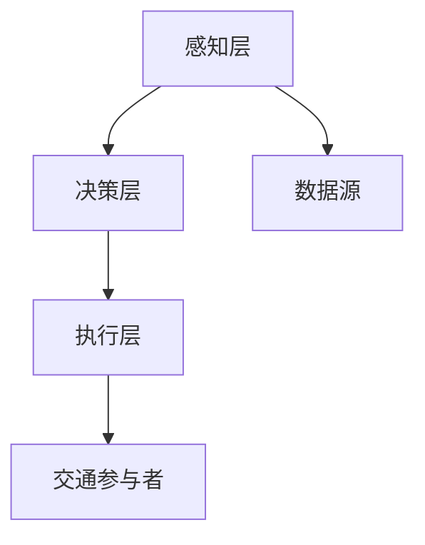
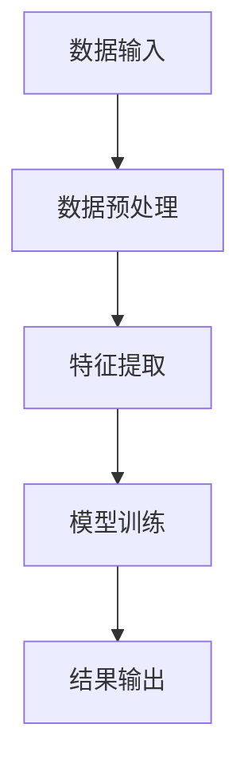
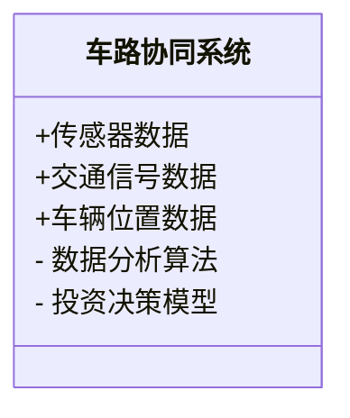
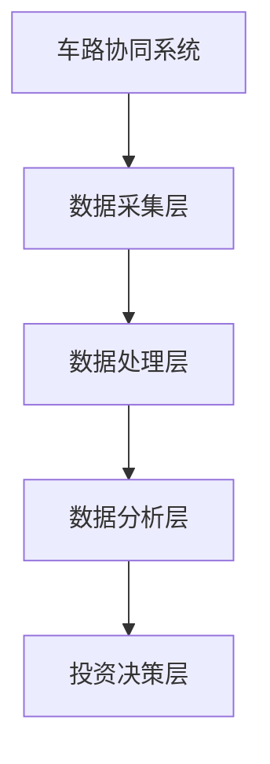
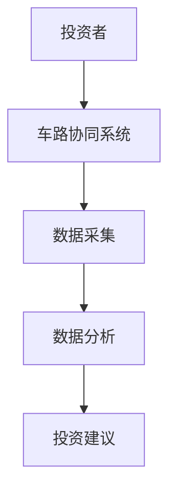

                 


# 价值投资中的智能交通车路协同系统分析

---

## 关键词：
智能交通系统、车路协同、价值投资、交通数据、算法分析、系统架构、投资回报

---

## 摘要：
本文深入分析了智能交通车路协同系统在价值投资中的应用潜力。从车路协同系统的定义、核心技术和架构出发，结合价值投资的基本原理和关键指标，探讨了如何通过智能交通数据挖掘、算法分析和系统设计来评估和优化投资决策。文章从背景介绍、核心概念、算法原理、系统架构、项目实战等多角度展开，结合实际案例和数学模型，为投资者和技术创新者提供了系统的分析框架和实践指导。

---

## 第1章: 车路协同系统概述

### 1.1 车路协同系统的基本概念
#### 1.1.1 车路协同的定义
车路协同（Vehicular Communication）是指通过车辆与道路基础设施之间的信息交互，实现交通系统的智能化管理。它利用通信技术、传感器技术和数据分析技术，优化交通流量、减少拥堵、提高安全性。

#### 1.1.2 车路协同的核心技术基础
- **通信技术**：如5G、V2X（车路协同通信）。
- **传感器技术**：如激光雷达、摄像头、毫米波雷达。
- **大数据与AI技术**：用于实时数据分析和决策支持。

#### 1.1.3 车路协同与智能交通的关系
车路协同是智能交通系统（ITS）的重要组成部分，通过车车、车路之间的信息交互，实现交通资源的最优配置。

---

### 1.2 价值投资的基本概念
#### 1.2.1 价值投资的定义
价值投资是一种投资策略，通过分析企业的内在价值，寻找被市场低估的投资标的。

#### 1.2.2 价值投资的核心原则
- **长期视角**：关注企业的长期盈利能力。
- **安全边际**：买入价格低于内在价值。
- **基本面分析**：关注企业的财务状况、行业地位、竞争优势。

#### 1.2.3 价值投资在智能交通中的应用潜力
智能交通系统的建设和运营企业可以通过价值投资的视角，评估其市场地位、盈利能力和发展潜力。

---

### 1.3 车路协同与价值投资的结合
#### 1.3.1 车路协同系统在智能交通中的价值
- 提高交通效率。
- 降低交通事故率。
- 优化资源配置。

#### 1.3.2 价值投资视角下的车路协同系统分析
- 车路协同企业的市场地位。
- 技术壁垒与竞争优势。
- 财务状况与盈利能力。

#### 1.3.3 车路协同系统与价值投资的结合场景
- 投资者通过车路协同数据，评估企业的运营效率。
- 企业通过价值投资策略，优化资源配置。

---

## 第2章: 车路协同系统的核心概念与联系

### 2.1 车路协同系统的组成与功能
#### 2.1.1 车路协同系统的组成模块
- **感知层**：传感器、摄像头等。
- **决策层**：AI算法、决策模型。
- **执行层**：车辆控制、交通信号优化。

#### 2.1.2 各模块的功能与交互关系
- 感知层采集数据，决策层进行分析，执行层输出指令。

#### 2.1.3 车路协同系统的整体架构
使用 Mermaid 绘制系统架构图：



---

### 2.2 价值投资中的关键指标
#### 2.2.1 车路协同系统的经济效益分析
- 降低交通成本。
- 提高通行效率。
- 减少能源消耗。

#### 2.2.2 价值投资中的关键财务指标
- 营业收入增长率。
- 净利润 margin。
- 股东权益回报率（ROE）。

#### 2.2.3 价值投资中的非财务指标
- 技术创新能力。
- 市场占有率。
- 管理团队能力。

---

### 2.3 车路协同系统与价值投资的关系
#### 2.3.1 车路协同系统的数据特征
- 高实时性。
- 大数据量。
- 多维度性。

#### 2.3.2 价值投资中的数据需求
- 市场需求数据。
- 企业财务数据。
- 竞争对手分析数据。

#### 2.3.3 车路协同系统数据对价值投资的影响
- 数据驱动的投资决策。
- 提高投资判断的准确性。

---

## 第3章: 车路协同系统的算法原理

### 3.1 车路协同系统的数据挖掘与分析
#### 3.1.1 数据挖掘算法
- **线性回归**：用于预测交通流量。
- **随机森林**：用于分类和回归分析。

#### 3.1.2 算法流程图
使用 Mermaid 绘制算法流程图：



#### 3.1.3 数学模型与公式
- 线性回归公式：
  $$
  y = a_1x_1 + a_2x_2 + \dots + a_nx_n + b
  $$

---

### 3.2 价值投资中的算法应用
#### 3.2.1 时间序列分析
- 用于预测企业的未来财务表现。
- 使用 ARIMA 模型：
  $$
  y_t = \alpha y_{t-1} + \beta y_{t-2} + \epsilon_t
  $$

#### 3.2.2 机器学习在价值投资中的应用
- 文本挖掘分析企业新闻。
- 图神经网络分析行业关联。

---

## 第4章: 系统分析与架构设计方案

### 4.1 问题场景介绍
车路协同系统的优化需要结合价值投资的视角，实现数据驱动的投资决策。

### 4.2 系统功能设计
- 数据采集模块。
- 数据分析模块。
- 投资决策支持模块。

使用 Mermaid 绘制领域模型图：



### 4.3 系统架构设计
使用 Mermaid 绘制系统架构图：



### 4.4 系统接口设计
- 数据接口：传感器数据接口、交通信号接口。
- 投资决策接口：财务指标接口、市场数据接口。

### 4.5 系统交互设计
使用 Mermaid 绘制交互流程图：



---

## 第5章: 项目实战

### 5.1 环境安装
- 安装 Python、Pandas、Scikit-learn 等工具。

### 5.2 核心代码实现
#### 5.2.1 数据预处理代码
```python
import pandas as pd

# 读取数据
data = pd.read_csv('traffic_data.csv')

# 数据清洗
data.dropna(inplace=True)
data = data[~data['speed'].isnull()]
```

#### 5.2.2 算法实现代码
```python
from sklearn.linear_model import LinearRegression

# 训练线性回归模型
model = LinearRegression()
model.fit(X_train, y_train)
```

### 5.3 案例分析
- 某智能交通企业的数据分析与投资评估。

### 5.4 代码解读与分析
- 数据预处理：处理缺失值、异常值。
- 模型训练：使用线性回归预测交通流量。

### 5.5 项目小结
通过实战项目，验证了车路协同系统在价值投资中的应用可行性。

---

## 第6章: 扩展与最佳实践

### 6.1 热点与未来趋势
- 边缘计算在车路协同中的应用。
- 5G 技术对智能交通的影响。
- 可持续发展与绿色交通。

### 6.2 最佳实践 tips
- 数据质量是关键。
- 模型的可解释性要优先考虑。
- 结合实际情况选择算法。

### 6.3 小结
通过本文的系统分析和实战案例，读者可以掌握价值投资中的智能交通车路协同系统的核心原理和应用方法。

---

## 作者：AI天才研究院/AI Genius Institute & 禅与计算机程序设计艺术 /Zen And The Art of Computer Programming

---

## 版权声明：
本文版权归作者所有，转载请注明出处。

