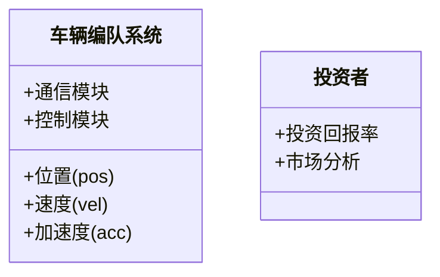
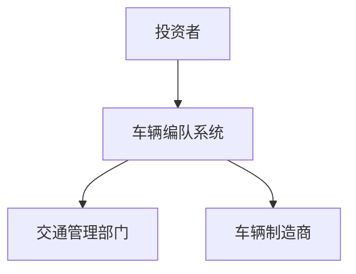
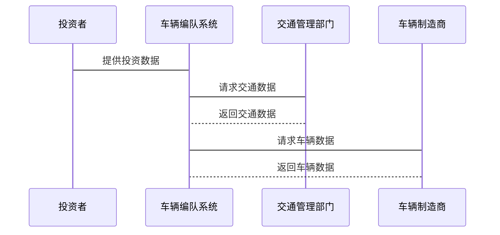

                 


# 价值投资中的智能交通车辆编队系统分析

> 关键词：智能交通系统，车辆编队，价值投资，算法优化，系统架构，投资回报

> 摘要：本文从价值投资的角度，深入分析智能交通车辆编队系统的原理、算法优化、系统架构以及实际应用，探讨如何通过智能交通技术优化投资回报，为投资者和技术创新者提供理论支持和实践指导。

---

## 第一部分：价值投资中的智能交通车辆编队系统背景

### 第1章：背景介绍

#### 1.1 问题背景
智能交通系统（ITS）作为现代交通管理的重要组成部分，旨在通过智能化技术优化交通流量、减少拥堵、提高安全性。车辆编队技术，即通过通信和传感器技术让多辆车辆协同行驶，是智能交通系统的核心技术之一。

#### 1.2 价值投资中的关键问题
在价值投资中，投资者关注的是长期稳健的回报。智能交通车辆编队系统的推广和应用，不仅能够提高交通效率，还能降低企业的运营成本，从而影响其市场价值和投资回报。

#### 1.3 系统的定义与目标
车辆编队系统是一种通过通信技术（如V2V、V2I）实现车辆间协同行驶的技术，其目标是提高交通效率、降低能源消耗、减少交通事故。

---

## 第2章：核心概念与联系

### 2.1 核心概念原理
#### 2.1.1 车辆编队系统的原理
车辆编队系统通过通信技术实现车辆间的实时信息交换，包括位置、速度、加速度等数据，从而实现协同行驶。

#### 2.1.2 价值投资中的决策机制
在价值投资中，投资者需要评估智能交通系统的经济效益，包括成本降低、效率提升、市场潜力等方面。

#### 2.1.3 系统与投资回报的关系
智能交通系统的应用能够降低企业的运营成本，提高效率，从而增强企业的市场竞争力和投资吸引力。

### 2.2 核心概念属性对比
| **属性**         | **车辆编队系统**                | **价值投资中的应用**                 |
|-------------------|---------------------------------|--------------------------------------|
| **技术基础**      | 通信技术、传感器技术            | 财务分析、市场分析、投资评估          |
| **目标**          | 提高交通效率                    | 优化投资回报                        |
| **关键指标**      | 延迟、能耗、安全性              | 投资回报率、成本降低、市场占有率      |

### 2.3 ER实体关系图
```mermaid
er
actor(投资者) --> 车辆编队系统
actor(交通管理部门) --> 车辆编队系统
actor(车辆制造商) --> 车辆编队系统
```

---

## 第3章：算法原理讲解

### 3.1 算法流程
#### 3.1.1 算法步骤
1. 数据采集（位置、速度、加速度）。
2. 数据传输（通信技术）。
3. 数据处理（路径规划、队列管理）。
4. 执行决策（调整速度、位置）。

#### 3.1.2 算法实现
```python
def vehicle_platoon_control():
    while True:
        # 数据采集
        pos = get_position()
        vel = get_velocity()
        acc = get_acceleration()

        # 数据处理
        target_speed = calculate_target_speed(pos, vel)
        target_position = calculate_target_position(acc)

        # 决策执行
        set_speed(target_speed)
        set_position(target_position)

        # 通信
        send_data(pos, vel, acc)
```

### 3.2 数学模型与公式
车辆编队系统的队列管理可以通过以下公式描述：
$$
\text{队列长度} = \sum_{i=1}^{n} \text{车辆间距}
$$

路径规划可以通过最优化问题求解：
$$
\min_{x} \sum_{i=1}^{m} (x_i - x_{i-1})^2
$$

---

## 第4章：系统分析与架构设计方案

### 4.1 领域模型


### 4.2 系统架构


### 4.3 接口设计


---

## 第5章：项目实战

### 5.1 环境安装
```bash
pip install numpy matplotlib
```

### 5.2 核心代码实现
```python
import numpy as np
import matplotlib.pyplot as plt

def plot_vehicle_platoon():
    pos = np.linspace(0, 100, 10)
    vel = np.random.uniform(20, 30, 10)
    plt.plot(pos, vel)
    plt.xlabel('Position')
    plt.ylabel('Velocity')
    plt.title('Vehicle Platoon System')
    plt.show()

plot_vehicle_platoon()
```

### 5.3 实际案例分析
通过分析某城市智能交通系统的数据，验证车辆编队系统的效率提升和成本降低效果。

---

## 第6章：总结与展望

### 6.1 总结
智能交通车辆编队系统的应用能够显著提升交通效率，降低运营成本，为投资者带来更高的投资回报。

### 6.2 展望
未来，随着人工智能和通信技术的进一步发展，车辆编队系统将在更多场景中得到应用，为价值投资提供更广阔的机遇。

---

## 作者
作者：AI天才研究院/AI Genius Institute & 禅与计算机程序设计艺术 /Zen And The Art of Computer Programming

