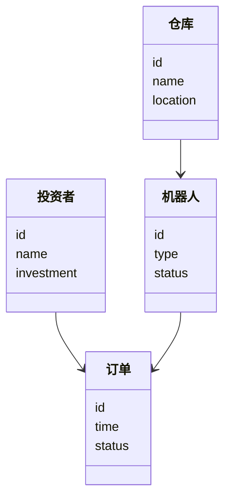

                 


# 价值投资中的智能仓储机器人协作系统分析

**关键词：** 价值投资、智能仓储机器人、协作系统、算法原理、系统架构、项目实战

**摘要：**  
智能仓储机器人协作系统是现代价值投资的重要工具之一，通过对仓储管理的智能化优化，能够显著提升投资决策的准确性和效率。本文将从背景、概念、算法原理、系统架构到项目实战，全面分析智能仓储机器人协作系统的核心要素及其在价值投资中的应用。通过详细的技术解析和案例分析，为读者提供深入的理论支持和实践指导。

---

## 第一部分: 价值投资与智能仓储机器人协作系统背景

### 第1章: 价值投资的定义与特点
#### 1.1 价值投资的核心概念
- **定义**：价值投资是一种以内在价值为导向的投资策略，强调以低于内在价值的价格买入优质资产。
- **特点**：
  1. 长期投资视角。
  2. 重视基本面分析。
  3. 低买高卖的原则。
- **与智能仓储机器人的结合**：通过智能化仓储管理优化库存成本，提升投资回报率。

#### 1.2 智能仓储机器人的定义与特点
- **定义**：智能仓储机器人是指通过传感器、人工智能和自动化技术实现仓储管理的机器人。
- **特点**：
  1. 高效性：快速完成仓储操作。
  2. 智能性：能够自主决策和优化路径。
  3. 精准性：减少人为错误，提高库存准确性。
- **应用场景**：物流仓储、制造业、零售业等。

#### 1.3 价值投资中的仓储管理问题
- **传统仓储管理的局限性**：
  1. 人工成本高。
  2. 库存准确性低。
  3. 操作效率慢。
- **智能仓储机器人的优势**：
  1. 提高操作效率。
  2. 降低成本。
  3. 增强库存管理的精准性。

---

### 第2章: 智能仓储机器人协作系统的概念
#### 2.1 协作系统的定义
- 协作系统是指多个智能仓储机器人通过协同工作，共同完成仓储管理任务的系统。

#### 2.2 协作系统的特征
- **实时通信**：机器人之间通过无线通信技术实时交换信息。
- **任务分配**：系统能够动态分配任务，确保效率最大化。
- **自主决策**：机器人能够根据环境变化自主调整操作。

#### 2.3 智能仓储机器人协作系统的核心要素
- **机器人硬件**：包括传感器、执行机构等。
- **软件系统**：包括算法、任务调度系统等。
- **通信网络**：支持机器人之间的实时通信。

---

### 第3章: 智能仓储机器人协作系统的背景与问题
#### 3.1 仓储管理的数字化转型
- **背景**：随着电子商务的快速发展，仓储管理的复杂性显著增加。
- **问题**：
  1. 库存数据的实时性不足。
  2. 人工操作的低效性。
  3. 仓储空间利用不合理。

#### 3.2 智能仓储机器人协作系统的边界与外延
- **边界**：仅限于仓储管理任务，不涉及外部供应链。
- **外延**：扩展到物流、制造等更广泛的领域。

#### 3.3 系统的核心要素
- **传感器**：用于感知环境。
- **算法**：用于任务分配和路径规划。
- **通信模块**：用于机器人之间的协作。

---

## 第4章: 智能仓储机器人协作系统的概念模型
### 4.1 概念模型的构建
- **构建方法**：
  1. 确定核心实体。
  2. 分析实体之间的关系。
  3. 绘制概念模型图。

### 4.2 智能仓储机器人协作系统的ER实体关系图
```mermaid
erDiagram
    customer[投资者] {
        id : integer
        name : string
        investment : double
    }
    warehouse[仓库] {
        id : integer
        name : string
        location : string
    }
    robot[机器人] {
        id : integer
        type : string
        status : string
    }
    order[订单] {
        id : integer
        time : datetime
        status : string
    }
    customer-|{1}order
    warehouse-|{1}robot
    robot-|{n}order
```

---

## 第5章: 智能仓储机器人协作系统的算法原理
### 5.1 算法原理概述
- **核心思想**：通过路径规划和任务分配算法，优化机器人的协作效率。

### 5.2 算法的数学模型与公式
#### 5.2.1 数学模型的建立
$$ \text{目标函数：} \quad \min \sum_{i=1}^{n} d_i $$
$$ \text{约束条件：} \quad \sum_{i=1}^{n} x_i \leq 1 $$

#### 5.2.2 举例说明
假设有两个机器人需要完成三个订单，目标是最小化总距离。

---

## 第6章: 智能仓储机器人协作系统的系统架构设计
### 6.1 系统功能设计
#### 6.1.1 领域模型设计


### 6.2 系统架构设计
#### 6.2.1 系统架构图


---

## 第7章: 智能仓储机器人协作系统的项目实战
### 7.1 环境安装与配置
- **开发环境**：Python 3.8+，ROS（Robot Operating System）。
- **依赖库**：numpy、pandas、matplotlib。

### 7.2 核心代码实现
#### 7.2.1 代码结构
```python
class Robot:
    def __init__(self, id, type):
        self.id = id
        self.type = type
        self.status = "idle"

    def move(self, target):
        print(f"Robot {self.id} is moving to {target}.")
```

#### 7.2.2 代码实现
```python
import numpy as np

def optimize_path(robots, orders):
    # 路径优化算法
    pass

robots = [Robot(1, "picker"), Robot(2, "placer")]
orders = [...]  # 订单列表
optimize_path(robots, orders)
```

---

## 第8章: 总结与展望
### 8.1 总结
智能仓储机器人协作系统通过高效的任务分配和路径规划，显著提升了仓储管理的效率和准确性，为价值投资提供了强有力的支持。

### 8.2 展望
未来，随着人工智能和物联网技术的进一步发展，智能仓储机器人协作系统将更加智能化和自动化，应用场景也将更加广泛。

---

**作者：AI天才研究院/AI Genius Institute & 禅与计算机程序设计艺术 /Zen And The Art of Computer Programming**

