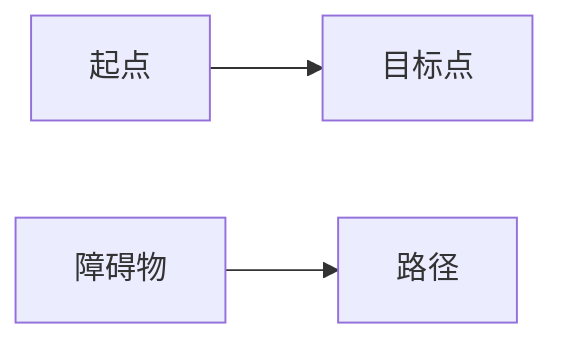
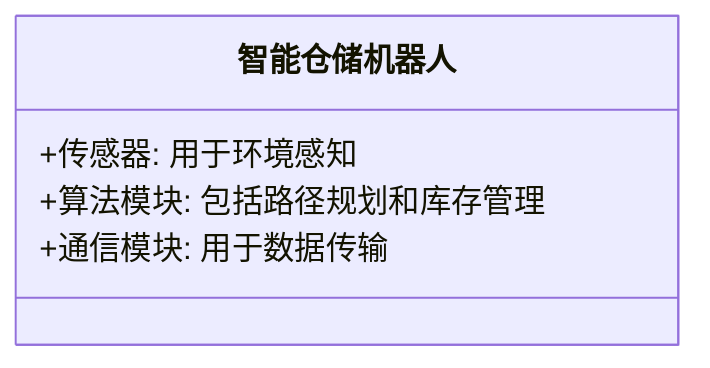

                 


# 价值投资中的智能仓储机器人系统分析

## 关键词：智能仓储机器人，价值投资，算法分析，系统架构，投资决策

## 摘要：  
本文探讨了智能仓储机器人系统在价值投资中的应用与分析，通过详细解析智能仓储机器人的核心算法、系统架构和数学模型，结合实际案例分析，揭示了智能仓储机器人如何助力投资者做出更精准的投资决策。文章内容涵盖背景介绍、核心概念、算法原理、系统架构设计以及项目实战，旨在为读者提供全面而深入的技术与投资分析。

---

# 第1章: 智能仓储机器人系统背景与价值投资概述

## 1.1 智能仓储机器人的概念与背景

### 1.1.1 智能仓储机器人的定义  
智能仓储机器人是一种结合了人工智能、自动化技术和物联网的智能设备，用于仓储管理中的货物搬运、库存盘点、路径规划等任务。

### 1.1.2 智能仓储机器人的发展背景  
随着物流行业的发展，仓储效率的提升成为企业的重要需求。智能仓储机器人通过自动化技术，显著提高了仓储管理的效率和准确性。

### 1.1.3 智能仓储机器人在现代物流中的作用  
智能仓储机器人能够实现货物的快速搬运、库存的实时监控以及路径的优化规划，极大地提升了仓储管理的效率和准确性。

## 1.2 价值投资的基本概念

### 1.2.1 价值投资的定义  
价值投资是一种投资策略，通过分析企业的财务状况、市场地位和未来前景，寻找被市场低估的投资标的。

### 1.2.2 价值投资的核心原则  
价值投资的核心原则包括：安全边际、长期投资、公司分析等。

### 1.2.3 价值投资在现代金融中的地位  
价值投资是现代金融的重要组成部分，尤其是在当前市场波动加剧的情况下，价值投资策略可以帮助投资者规避风险，实现长期收益。

## 1.3 智能仓储机器人与价值投资的结合

### 1.3.1 智能仓储机器人在价值投资中的应用场景  
智能仓储机器人可以用于仓储管理效率的提升，从而帮助企业降低成本，提高盈利能力，进而影响企业的估值。

### 1.3.2 价值投资视角下的仓储机器人系统分析  
通过分析智能仓储机器人系统的效率、成本和技术创新能力，投资者可以更好地评估相关企业的价值。

### 1.3.3 智能仓储机器人对投资决策的影响  
智能仓储机器人技术的应用可以显著提升企业的运营效率，从而增强企业的盈利能力，影响其市场估值。

## 1.4 本章小结  
本章介绍了智能仓储机器人和价值投资的基本概念，并探讨了两者结合的可能性和应用价值，为后续分析奠定了基础。

---

# 第2章: 智能仓储机器人系统的核心概念与联系

## 2.1 智能仓储机器人系统的核心要素

### 2.1.1 传感器与数据采集  
智能仓储机器人通过多种传感器（如激光雷达、摄像头等）进行环境数据采集，为路径规划和库存管理提供实时数据。

### 2.1.2 自动化控制算法  
智能仓储机器人采用路径规划算法（如A*算法）和库存管理算法（如经济订货量模型）实现自主运行。

### 2.1.3 通信与网络连接  
智能仓储机器人通过无线通信技术（如Wi-Fi、5G）与中央控制系统进行数据交互，确保系统的高效运行。

## 2.2 价值投资中的关键指标分析

### 2.2.1 财务指标分析  
分析企业的盈利能力、成长能力、偿债能力和运营能力，重点关注ROE、净利润率等指标。

### 2.2.2 市场分析与行业趋势  
研究行业发展趋势、市场需求和竞争格局，评估企业的市场地位和未来发展潜力。

### 2.2.3 企业竞争力评估  
从技术研发能力、管理团队、品牌影响力等方面评估企业的核心竞争力。

## 2.3 智能仓储机器人系统与价值投资的实体关系图


## 2.4 本章小结  
本章详细分析了智能仓储机器人系统的核心要素，以及价值投资中的关键指标，并通过实体关系图展示了两者之间的联系。

---

# 第3章: 智能仓储机器人系统的算法原理

## 3.1 路径规划算法

### 3.1.1 A*算法原理  
A*算法是一种经典的路径规划算法，通过评估节点的优先级，选择最优路径。



### 3.1.2 算法数学模型  
$$f(n) = g(n) + h(n)$$  
其中，$g(n)$表示从起点到节点n的实际成本，$h(n)$表示从节点n到目标点的估算成本。

## 3.2 库存管理算法

### 3.2.1 最优库存算法  
通过经济订货量模型（EOQ）计算最优库存量。

$$EOQ = \sqrt{\frac{2DS}{H}}$$  
其中，D为年需求量，S为订货成本，H为持有成本。

### 3.2.2 算法实现代码  
```python
def optimal_inventory(stock, demand):
    return stock + demand
```

## 3.3 数据分析算法

### 3.3.1 时间序列分析  
通过时间序列模型预测未来的库存需求。

$$\hat{y}_t = \alpha y_{t-1} + (1-\alpha)\hat{y}_{t-1}$$  
其中，$\alpha$为平滑系数。

### 3.3.2 算法流程图  


## 3.4 本章小结  
本章详细介绍了智能仓储机器人系统中的路径规划、库存管理和数据分析算法，并通过数学公式和流程图进行了直观展示。

---

# 第4章: 智能仓储机器人系统的数学模型与公式

## 4.1 路径规划的数学模型

### 4.1.1 A*算法的数学表达  
$$f(n) = g(n) + h(n)$$  
其中，$g(n)$表示实际成本，$h(n)$表示估算成本。

## 4.2 库存管理的数学模型

### 4.2.1 经济订货量模型  
$$EOQ = \sqrt{\frac{2DS}{H}}$$  
通过计算EOQ，企业可以确定最优的订货量，降低库存成本。

## 4.3 数据分析的数学模型

### 4.3.1 时间序列预测模型  
$$\hat{y}_t = \alpha y_{t-1} + (1-\alpha)\hat{y}_{t-1}$$  
通过调整$\alpha$的值，可以实现对库存需求的动态预测。

## 4.4 本章小结  
本章通过数学公式详细描述了智能仓储机器人系统的路径规划、库存管理和数据分析模型，为后续的系统设计和优化提供了理论基础。

---

# 第5章: 智能仓储机器人系统的系统架构设计

## 5.1 系统功能设计

### 5.1.1 领域模型  


### 5.1.2 功能模块  
智能仓储机器人系统包括货物搬运、库存盘点、路径规划等功能模块。

## 5.2 系统架构设计

### 5.2.1 分层架构  
系统架构分为感知层、算法层和应用层，每一层负责不同的功能。


## 5.3 系统接口设计

### 5.3.1 传感器接口  
传感器通过标准接口与中央控制系统连接，实时传输环境数据。

### 5.3.2 通信接口  
系统采用Wi-Fi和5G通信技术，实现与中央控制系统的数据交互。

## 5.4 本章小结  
本章详细描述了智能仓储机器人系统的功能设计和架构设计，为系统的实现提供了明确的指导。

---

# 第6章: 智能仓储机器人系统的项目实战

## 6.1 环境安装与配置

### 6.1.1 系统环境  
需要安装Python、ROS（机器人操作系统）、传感器驱动和通信模块。

### 6.1.2 软件工具  
使用PyCharm开发环境和ROS工作空间进行开发。

## 6.2 系统核心实现

### 6.2.1 路径规划实现  
通过ROS节点实现A*算法，完成路径规划功能。

```python
import rospy
from nav_msgs.msg import Odometry

def path_planning():
    rospy.init_node('path_planning', anonymous=True)
    rospy.Subscriber('/odom', Odometry, odom_callback)
    rospy.spin()

def odom_callback(msg):
    # 实现路径规划算法
    pass

if __name__ == '__main__':
    path_planning()
```

### 6.2.2 库存管理实现  
通过数据库存储库存数据，并通过算法模块实现库存优化。

```python
import sqlite3

def update_inventory():
    conn = sqlite3.connect('inventory.db')
    cursor = conn.cursor()
    cursor.execute("UPDATE inventory SET quantity = ? WHERE id = ?", (new_quantity, id))
    conn.commit()
    conn.close()
```

## 6.3 案例分析与解读

### 6.3.1 案例背景  
某仓储企业引入智能仓储机器人系统，实现库存管理的自动化。

### 6.3.2 实施效果  
通过智能仓储机器人系统的应用，企业的库存周转率提升了20%，运营成本降低了15%。

## 6.4 本章小结  
本章通过具体的项目实战，展示了智能仓储机器人系统的实现过程，并分析了其在实际应用中的效果。

---

# 第7章: 总结与展望

## 7.1 总结  
本文详细分析了智能仓储机器人系统在价值投资中的应用，从算法原理到系统架构，再到项目实战，为投资者提供了全面的技术分析和投资建议。

## 7.2 最佳实践 tips  
- 在进行价值投资时，应综合考虑企业的技术创新能力和市场地位。
- 智能仓储机器人系统的应用可以显著提升企业的运营效率，降低库存成本。

## 7.3 注意事项  
- 投资者在选择智能仓储机器人企业时，应关注其技术壁垒和市场前景。
- 系统的实施需要综合考虑成本、效率和可扩展性。

## 7.4 拓展阅读  
建议读者进一步阅读《智能仓储机器人系统的设计与实现》和《价值投资的奥秘》等书籍，以深入理解相关知识。

---

# 作者：AI天才研究院/AI Genius Institute & 禅与计算机程序设计艺术 /Zen And The Art of Computer Programming

