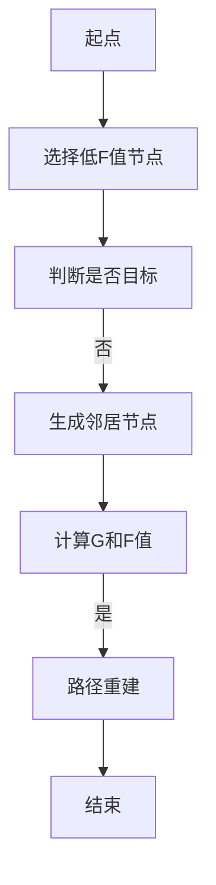
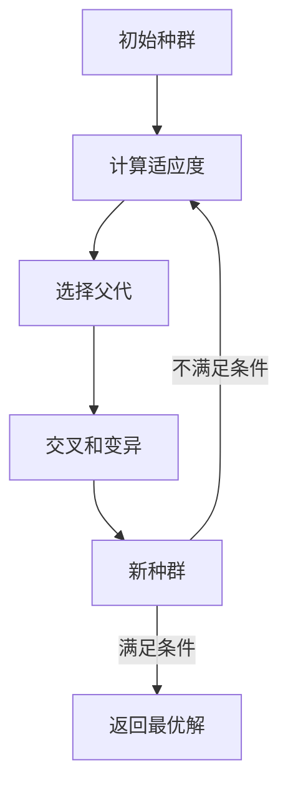
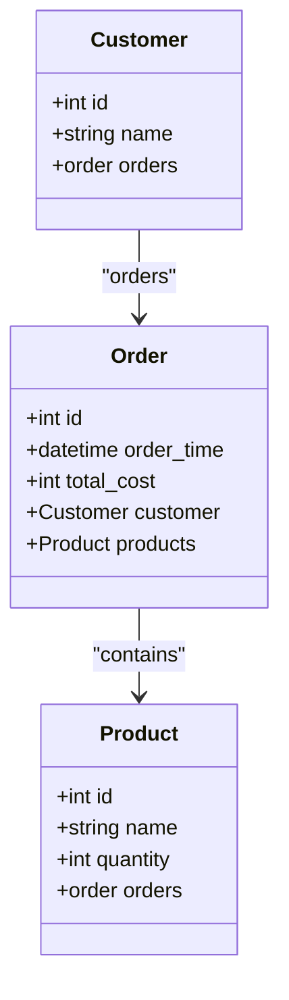

                 


# 价值投资中的智能仓储自动化系统分析

> 关键词：价值投资，智能仓储，自动化系统，算法原理，系统架构

> 摘要：本文从价值投资的角度，深入分析了智能仓储自动化系统的构成、算法原理、系统架构及其实现，通过具体案例展示了其在提升仓储效率和投资回报中的巨大潜力。文章结合理论与实践，为读者提供了全面而深入的技术视角。

---

# 第一部分: 价值投资中的智能仓储自动化系统概述

## 第1章: 价值投资与智能仓储自动化系统背景

### 1.1 价值投资的基本概念
价值投资是一种以低于公平价值的价格购买优质资产的投资策略。其核心在于识别被市场低估的资产，并长期持有以实现超额收益。在仓储领域，价值投资的理念可以通过提高效率、降低成本来提升整体资产回报。

### 1.2 智能仓储自动化系统的特点
智能仓储自动化系统通过集成物联网、人工智能和机器人技术，实现了仓储管理的智能化和自动化。其特点包括：
1. **高效性**：自动化设备减少人工干预，提升作业效率。
2. **精准性**：智能控制系统确保库存管理和物流操作的准确性。
3. **可扩展性**：系统架构灵活，适应不同规模和类型的仓储需求。

### 1.3 价值投资与智能仓储自动化系统的结合
智能仓储自动化系统通过优化库存管理、降低运营成本和提高周转率，直接提升了仓储资产的价值。这不仅降低了企业的运营成本，还提高了资本回报率，符合价值投资的核心理念。

---

# 第二部分: 智能仓储自动化系统的核心概念与联系

## 第2章: 智能仓储自动化系统的核心概念

### 2.1 智能仓储自动化系统的组成模块
智能仓储自动化系统主要由以下模块组成：
1. **自动化仓储设备**：包括机器人、传送带和自动化货架。
2. **智能控制系统**：负责协调各设备的运行，实现任务分配和状态监控。
3. **数据采集与分析系统**：通过传感器和数据库，实时采集并分析仓储数据。

### 2.2 智能仓储自动化系统的属性特征对比
下表展示了传统仓储系统与智能仓储自动化系统的对比：

| 特性               | 传统仓储系统           | 智能仓储自动化系统       |
|--------------------|------------------------|--------------------------|
| 管理模式           | 人工为主               | 自动化、智能化           |
| 效率               | 较低                   | 高                      |
| 成本               | 高                    | 低                      |
| 可扩展性           | 有限                  | 强大                    |

### 2.3 智能仓储自动化系统的ER实体关系图
以下是智能仓储系统的ER实体关系图：

```mermaid
erDiagram
    customer[CUSTOMER] {
        +int id
        +string name
    }
    product[PRODUCT] {
        +int id
        +string name
        +int quantity
    }
    order[ORDER] {
        +int id
        +datetime order_time
        +int total_cost
    }
    CUSTOMER o-- ORDER : "orders"
    ORDER o-- PRODUCT : "contains"
```

---

# 第三部分: 智能仓储自动化系统的算法原理

## 第3章: 智能仓储自动化系统的算法原理

### 3.1 智能仓储自动化系统的路径规划算法
路径规划是仓储系统中机器人导航的核心问题。常用算法包括A*和RRT。

#### 3.1.1 A*算法原理
A*算法通过评估节点的优先级进行搜索，优先选择距离目标最近且路径成本最低的节点。以下是A*算法的伪代码：

```python
def a_star(start, goal):
    open_set = {start}
    came_from = {}
    g_score = {start: 0}
    f_score = {start: heuristic(start, goal)}
    
    while open_set:
        current = pop from open_set with lowest f_score
        if current == goal:
            break
        for neighbor in neighbors(current):
            tentative_g = g_score[current] + cost(current, neighbor)
            if neighbor not in g_score or tentative_g < g_score[neighbor]:
                came_from[neighbor] = current
                g_score[neighbor] = tentative_g
                f_score[neighbor] = g_score[neighbor] + heuristic(neighbor, goal)
                add to open_set
    return reconstruct_path(start, goal, came_from)
```

以下是A*算法的流程图：



### 3.2 智能仓储自动化系统的库存管理算法
库存管理算法通过优化库存水平降低成本。基于遗传算法的库存优化是一个典型应用。

#### 3.2.1 基于遗传算法的库存优化
遗传算法通过模拟自然选择和遗传机制，找到最优解。以下是其伪代码：

```python
def genetic_algorithm(population, fitness_func, mutate_rate):
    while True:
        calculate fitness for each individual
        select parents based on fitness
        create offspring through crossover and mutation
        replace population with new generation
        if stopping condition met:
            break
    return best individual
```

以下是遗传算法的流程图：



---

# 第四部分: 智能仓储自动化系统的系统分析与架构设计

## 第4章: 智能仓储自动化系统的系统分析

### 4.1 系统应用场景介绍
智能仓储自动化系统广泛应用于电商、制造和物流行业。例如，亚马逊的无人仓储系统大幅提升了订单处理效率。

### 4.2 系统功能设计
以下是系统功能的领域模型类图：



### 4.3 系统架构设计
以下是系统架构图：


---

# 第五部分: 智能仓储自动化系统的项目实战

## 第5章: 智能仓储自动化系统的项目实战

### 5.1 环境安装与配置
以下是开发环境搭建步骤：
1. 安装Python和必要的库（如NumPy、Pillow）。
2. 安装机器人控制库（如ROS）。
3. 配置数据库（如MySQL）。

### 5.2 系统核心功能实现
以下是路径规划算法的实现代码：

```python
import math

def heuristic(a, b):
    return abs(a[0] - b[0]) + abs(a[1] - b[1])

def a_star(start, goal, grid):
    open_set = {start}
    came_from = {}
    g_score = {start: 0}
    f_score = {start: heuristic(start, goal)}
    
    while open_set:
        current = min(open_set, key=lambda x: f_score[x])
        if current == goal:
            break
        open_set.remove(current)
        for neighbor in grid.get_neighbors(current):
            tentative_g = g_score[current] + grid.move_cost(current, neighbor)
            if neighbor not in g_score or tentative_g < g_score[neighbor]:
                came_from[neighbor] = current
                g_score[neighbor] = tentative_g
                f_score[neighbor] = g_score[neighbor] + heuristic(neighbor, goal)
                open_set.add(neighbor)
    return came_from

# 示例使用
start = (0, 0)
goal = (4, 4)
grid = Grid()  # 假设Grid类已经实现
path = a_star(start, goal, grid)
```

---

# 小结

智能仓储自动化系统通过优化库存管理和路径规划，显著提升了仓储效率和投资回报。本文从价值投资的角度，深入分析了系统的构成、算法原理和架构设计，并通过项目实战展示了其应用潜力。未来，随着技术的进步，智能仓储自动化系统将在更多领域发挥重要作用。

---

作者：AI天才研究院 & 禅与计算机程序设计艺术

