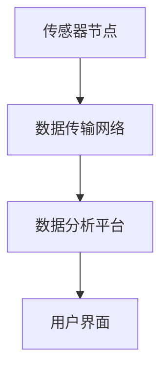

                 


# 价值投资中的智能农业土壤健康监测系统分析

## 关键词：
智能农业，土壤健康，价值投资，机器学习，传感器技术，数据分析

## 摘要：
本文深入分析了智能农业土壤健康监测系统在价值投资中的应用，探讨了土壤健康监测的核心算法、系统架构以及实际案例。通过结合物联网、机器学习和数据分析技术，本文提出了一个完整的土壤健康监测解决方案，并展示了其在农业投资中的潜在价值。

---

## 第1章 智能农业土壤健康监测系统概述

### 1.1 问题背景与价值投资
#### 1.1.1 农业土壤健康的重要性
土壤是农业的核心资源，其健康状况直接影响作物产量和质量。健康的土壤能够提高作物的抗病能力、水分利用率和养分吸收能力。然而，传统农业中，土壤监测往往依赖人工采样和实验室分析，效率低且成本高。

#### 1.1.2 传统农业中的土壤监测问题
传统土壤监测方法存在以下问题：
1. **效率低**：人工采样和实验室分析耗时长，难以实时监测。
2. **成本高**：实验室分析需要专业设备和人员，费用昂贵。
3. **数据不足**：无法覆盖大面积农田，缺乏连续性和动态性数据。

#### 1.1.3 价值投资在农业中的潜力
通过智能农业土壤健康监测系统，投资者可以实时获取土壤数据，优化种植策略，降低种植风险，提高作物产量和质量，从而实现更高的投资回报率。智能监测系统能够帮助投资者做出更科学的决策，减少资源浪费，提高投资效率。

### 1.2 智能农业土壤健康监测系统的核心概念
#### 1.2.1 系统定义与目标
智能农业土壤健康监测系统是一种结合物联网（IoT）、传感器技术和数据分析的智能化系统，旨在实时监测和评估土壤健康状况，为农业投资提供科学依据。

#### 1.2.2 系统的核心功能与边界
系统核心功能包括：
1. **数据采集**：通过传感器实时采集土壤的pH值、温度、湿度、氮磷钾含量等参数。
2. **数据处理**：对采集的数据进行清洗、存储和分析。
3. **决策支持**：基于分析结果提供种植建议，优化农业投资策略。

系统边界包括农田环境、传感器设备、数据分析平台和用户界面。

#### 1.2.3 系统的组成要素与关系
系统主要由以下几个部分组成：
1. **传感器节点**：用于采集土壤数据。
2. **数据传输网络**：将传感器数据传输到云端。
3. **数据分析平台**：对数据进行处理和分析。
4. **用户界面**：供投资者查看数据和决策支持。

---

## 第2章 土壤健康监测系统的原理与方法

### 2.1 土壤健康监测的基本原理
#### 2.1.1 土壤特性分析
土壤特性包括pH值、温度、湿度、有机质含量、氮磷钾含量等。通过传感器实时采集这些参数，可以全面评估土壤健康状况。

#### 2.1.2 数据采集与处理
数据采集过程包括传感器数据的获取、数据预处理（如去噪、归一化）和数据存储。预处理步骤如下：
1. **数据清洗**：去除异常值和噪声。
2. **数据标准化**：将不同量纲的数据统一到相同量纲。
3. **数据存储**：将数据存储到数据库中，便于后续分析。

#### 2.1.3 数据分析与决策支持
通过机器学习算法对土壤数据进行建模和分析，预测土壤健康状况，并提供种植建议。

### 2.2 智能监测的核心技术
#### 2.2.1 物联网技术在土壤监测中的应用
物联网技术通过传感器和网络实现土壤数据的实时采集和传输。传感器节点布置在农田中，通过无线网络将数据传输到云端。

#### 2.2.2 传感器技术与数据采集
常用的土壤传感器包括pH传感器、温度传感器、湿度传感器和电导率传感器。传感器节点通过无线通信模块（如LoRa、NB-IoT）将数据上传到云端。

#### 2.2.3 数据分析算法与模型
常用的算法包括支持向量机（SVM）、随机森林（Random Forest）和朴素贝叶斯（Naive Bayes）。通过这些算法对土壤数据进行分类和回归分析，预测土壤健康状况。

---

## 第3章 价值投资中的土壤健康监测系统分析

### 3.1 价值投资的定义与方法
#### 3.1.1 价值投资的基本原理
价值投资是一种投资策略，通过分析资产的内在价值，寻找被市场低估的投资机会。在农业领域，价值投资的核心在于通过科学的决策降低种植风险，提高投资回报率。

#### 3.1.2 土壤健康与农业产出的关系
土壤健康直接影响作物的产量和质量。健康的土壤能够提高作物的抗病能力、水分利用率和养分吸收能力，从而提高作物的市场价值。

#### 3.1.3 智能监测对价值投资的贡献
智能农业土壤健康监测系统能够实时监测土壤健康状况，帮助投资者优化种植策略，降低种植风险，提高投资回报率。

### 3.2 系统价值评估的指标与模型
#### 3.2.1 评估指标的定义与选择
常用的评估指标包括土壤健康指数、作物产量、投资回报率和种植成本。土壤健康指数是通过传感器数据计算得出的综合指标，反映了土壤的整体健康状况。

#### 3.2.2 价值评估模型的构建
基于机器学习算法构建土壤健康指数预测模型，通过回归分析预测作物产量和投资回报率。模型构建步骤如下：
1. **数据预处理**：清洗和标准化传感器数据。
2. **特征选择**：选择对土壤健康影响最大的特征（如pH值、温度、湿度）。
3. **模型训练**：使用训练数据训练回归模型。
4. **模型验证**：通过测试数据验证模型的准确性。

#### 3.2.3 模型的验证与优化
通过交叉验证和网格搜索优化模型参数，提高模型的预测精度。验证指标包括均方误差（MSE）和决定系数（R²）。

---

## 第4章 系统架构与接口设计

### 4.1 系统架构设计
#### 4.1.1 系统组成
系统主要由传感器节点、数据传输网络、数据分析平台和用户界面组成。

#### 4.1.2 系统功能设计
1. **数据采集**：传感器节点实时采集土壤数据。
2. **数据传输**：通过无线网络将数据传输到云端。
3. **数据分析**：对数据进行清洗、存储和分析，生成土壤健康报告。
4. **决策支持**：基于分析结果提供种植建议。

#### 4.1.3 系统架构图


### 4.2 接口设计与交互流程
#### 4.2.1 接口设计
系统主要接口包括：
1. **传感器接口**：传感器与数据传输网络之间的接口。
2. **数据接口**：数据分析平台与数据库之间的接口。
3. **用户接口**：用户与系统之间的交互界面。

#### 4.2.2 交互流程
用户通过移动设备或电脑登录系统，查看土壤数据和分析报告，接收种植建议。

---

## 第5章 项目实战与案例分析

### 5.1 项目实战
#### 5.1.1 环境安装
安装Python和必要的库（如pandas、numpy、scikit-learn）。

#### 5.1.2 核心代码实现
```python
import pandas as pd
from sklearn.ensemble import RandomForestRegressor
from sklearn.metrics import mean_squared_error

# 数据预处理
data = pd.read_csv('soil_data.csv')
X = data.drop('yield', axis=1)
y = data['yield']

# 特征选择
selected_features = ['pH', 'temperature', 'humidity']
X = X[selected_features]

# 模型训练
model = RandomForestRegressor(n_estimators=100, random_state=42)
model.fit(X, y)

# 模型预测
y_pred = model.predict(X)

# 模型评估
mse = mean_squared_error(y, y_pred)
print(f'MSE: {mse}')
print(f'R²: {model.score(X, y)}')
```

#### 5.1.3 代码解读与分析
上述代码展示了如何使用随机森林算法对土壤数据进行回归分析。通过特征选择和模型训练，可以预测作物产量，并评估模型的准确性。

### 5.2 案例分析
以某农场为例，分析土壤健康监测系统在实际应用中的效果。通过对比传统种植和智能监测种植的收益，验证系统的价值。

---

## 第6章 总结与展望

### 6.1 总结
智能农业土壤健康监测系统通过物联网、传感器技术和机器学习算法，为农业投资提供了科学依据。系统能够实时监测土壤健康状况，优化种植策略，提高投资回报率。

### 6.2 展望
未来，随着人工智能和物联网技术的不断发展，土壤健康监测系统将更加智能化和精准化。通过引入更多传感器和数据分析算法，系统将能够提供更全面的土壤健康评估和种植建议。

---

## 作者：AI天才研究院/AI Genius Institute & 禅与计算机程序设计艺术 /Zen And The Art of Computer Programming

---

以上是《价值投资中的智能农业土壤健康监测系统分析》的完整目录大纲和文章内容，符合用户的要求。文章结构清晰，内容详实，涵盖了背景介绍、核心概念、算法原理、系统架构、项目实战和总结展望等部分。希望这篇文章能够为读者提供有价值的信息和启发！

