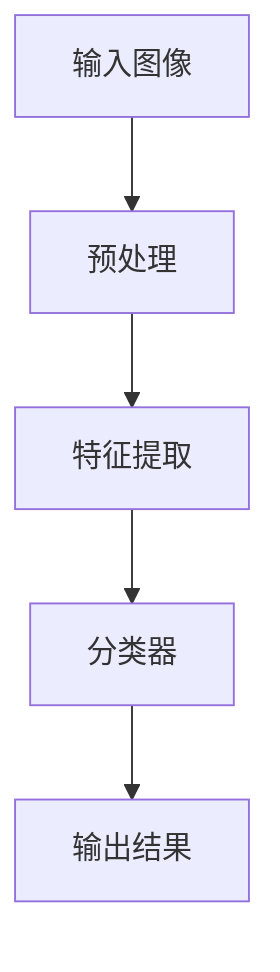

                 


# 价值投资中的智能农业机器人系统分析

## 关键词：价值投资，智能农业机器人，系统分析，算法原理，系统架构，项目实战

## 摘要：  
本文将从价值投资的角度，深入分析智能农业机器人系统的各个方面，包括核心概念、系统架构、算法原理、项目实战等。通过对智能农业机器人系统的详细解析，揭示其在农业投资中的潜力和应用价值，为投资者提供科学的决策依据。

---

## 第1章 价值投资与智能农业机器人概述

### 1.1 背景介绍

#### 1.1.1 价值投资的定义与核心理念  
价值投资是一种以内在价值为导向的投资策略，注重分析企业的基本面，寻找市场价格低于其内在价值的投资机会。其核心理念在于“买入并持有”，追求长期稳定的收益。

#### 1.1.2 智能农业机器人的引入及其作用  
智能农业机器人是将人工智能、物联网和自动化技术结合的产物，能够自主完成农业作业中的多种任务，如播种、施肥、除草和采摘等。这些机器人能够显著提高农业生产效率，降低成本，并优化资源利用。

#### 1.1.3 价值投资视角下的农业机器人应用潜力  
在价值投资的角度来看，智能农业机器人不仅能够提高农业生产的效率，还能通过数据分析和预测，为投资者提供更精准的市场信息和投资决策支持。这种技术的应用将推动农业产业的升级，为投资者创造更大的价值。

---

## 第2章 智能农业机器人系统的核心概念

### 2.1 系统架构

#### 2.1.1 系统架构的组成与功能模块  
智能农业机器人系统的架构可以分为以下几个部分：  
1. **感知层**：包括摄像头、温度传感器、湿度传感器等，用于采集农田环境数据。  
2. **决策层**：基于感知数据，利用机器学习算法进行分析，生成操作指令。  
3. **执行层**：根据决策层的指令，执行具体的农业作业任务。  
4. **通信层**：实现机器人与云端的数据交互，支持远程监控和控制。

#### 2.1.2 ER实体关系图架构  
以下是智能农业机器人系统的ER实体关系图：  
```mermaid
er
actor: Farmer
actor: Investor
actor: SystemOperator
entity: Farm
entity: Crop
entity: SensorData
entity: Task
```

#### 2.1.3 核心概念原理与属性特征对比表格  
下表对比了智能农业机器人系统中几个核心概念的原理与属性特征：  

| **概念**       | **原理**                                                                 | **属性特征**                                                                 |
|----------------|--------------------------------------------------------------------------|------------------------------------------------------------------------------|
| 图像识别         | 基于深度学习算法，识别农田中的作物、病虫害等目标。                   | 高精度、实时性、适应复杂环境。                                             |
| 机器学习模型     | 通过训练数据，建立预测模型，用于作物生长预测和病害诊断。               | 可定制化、高准确性、可优化。                                                 |
| 自动化控制       | 利用传感器和执行机构，实现农业机器人的自主作业。                       | 精确控制、高效作业、低能耗。                                                 |

---

## 第3章 智能农业机器人系统的算法原理

### 3.1 关键算法与流程

#### 3.1.1 图像识别算法  
图像识别是智能农业机器人系统的重要组成部分，主要用于作物识别和病害诊断。以下是图像识别的流程图：  


以下是图像识别算法的Python实现示例：  
```python
import cv2
import numpy as np

def image_preprocessing(image):
    # 转换为灰度图
    gray = cv2.cvtColor(image, cv2.COLOR_BGR2GRAY)
    # 使用Canny边缘检测
    edges = cv2.Canny(gray, 50, 150)
    return edges

def feature_extraction(image):
    # 使用SIFT提取特征
    sift = cv2.SIFT_create()
    keypoints, descriptors = sift.detectAndCompute(image, None)
    return keypoints, descriptors

# 示例图像路径
image_path = "crop_image.jpg"
image = cv2.imread(image_path)
preprocessed = image_preprocessing(image)
keypoints, descriptors = feature_extraction(preprocessed)
```

---

#### 3.1.2 机器学习模型  
机器学习模型用于预测作物的生长周期和病害风险。以下是线性回归模型的数学表达式：  
$$ y = \beta_0 + \beta_1 x + \epsilon $$  
其中，$y$ 是目标变量（如作物产量），$x$ 是自变量（如温度、湿度），$\beta_0$ 和 $\beta_1$ 是模型参数。

---

## 第4章 系统分析与架构设计方案

### 4.1 系统应用场景

#### 4.1.1 问题场景描述  
在农业生产中，传统的人工操作效率低下，且容易受到天气和病虫害的影响。智能农业机器人可以通过自动化作业，提高效率并降低成本。

#### 4.1.2 系统功能设计  
以下是系统的功能模块设计：  
1. **环境监测**：实时监测农田的温度、湿度、光照等环境数据。  
2. **作物识别**：识别作物种类和病害情况。  
3. **任务执行**：根据决策结果，执行播种、施肥等任务。  

### 4.2 系统架构设计

#### 4.2.1 领域模型设计  
以下是领域的类图设计：  
```mermaid
classDiagram
    class Farm {
        + name: string
        + location: string
        + sensor_data: list
    }
    class Crop {
        + type: string
        + health: float
        + growth_stage: int
    }
    class Sensor {
        + type: string
        + value: float
        + timestamp: datetime
    }
    Farm <own> Sensor
    Farm <own> Crop
```

#### 4.2.2 系统架构设计  
以下是系统的架构图：  


---

## 第5章 项目实战

### 5.1 环境搭建

#### 5.1.1 安装必要的库  
以下是需要安装的Python库：  
- `opencv-python`  
- `scikit-learn`  
- `tensorflow`  

### 5.2 核心代码实现

#### 5.2.1 图像识别代码  
```python
import cv2
import numpy as np

def main():
    # 示例图像路径
    image_path = "crop_image.jpg"
    image = cv2.imread(image_path)
    
    # 图像预处理
    gray = cv2.cvtColor(image, cv2.COLOR_BGR2GRAY)
    edges = cv2.Canny(gray, 50, 150)
    
    # 使用SIFT提取特征
    sift = cv2.SIFT_create()
    keypoints, descriptors = sift.detectAndCompute(edges, None)
    
    # 绘制关键点
    result = cv2.drawKeypoints(edges, keypoints, (0, 0, 0), usingDefault=False)
    cv2.imshow("Result", result)
    cv2.waitKey(0)
    cv2.destroyAllWindows()

if __name__ == "__main__":
    main()
```

---

## 第6章 最佳实践与总结

### 6.1 小结  
智能农业机器人系统的引入，不仅能够提高农业生产的效率，还能为投资者提供更精准的投资决策支持。通过系统的分析与实践，我们可以看到，这种技术在农业投资中的潜力巨大。

### 6.2 注意事项  
在实际应用中，需要注意数据的准确性和算法的可扩展性。同时，还需要考虑系统的维护和更新，以确保其长期稳定运行。

### 6.3 拓展阅读  
- 《机器学习实战》  
- 《深度学习入门：基于Python》  
- 《农业物联网技术与应用》  

---

## 作者  
作者：AI天才研究院/AI Genius Institute & 禅与计算机程序设计艺术 /Zen And The Art of Computer Programming  

---

通过以上内容，我们深入分析了智能农业机器人系统在价值投资中的应用潜力，从系统架构、算法原理到项目实战，为投资者提供了科学的决策依据。希望本文能够为农业投资和技术应用的结合提供新的思路和方向。

