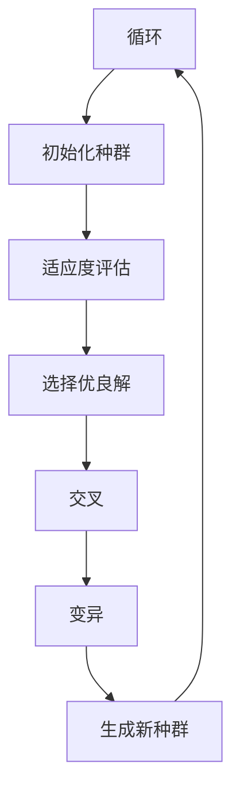
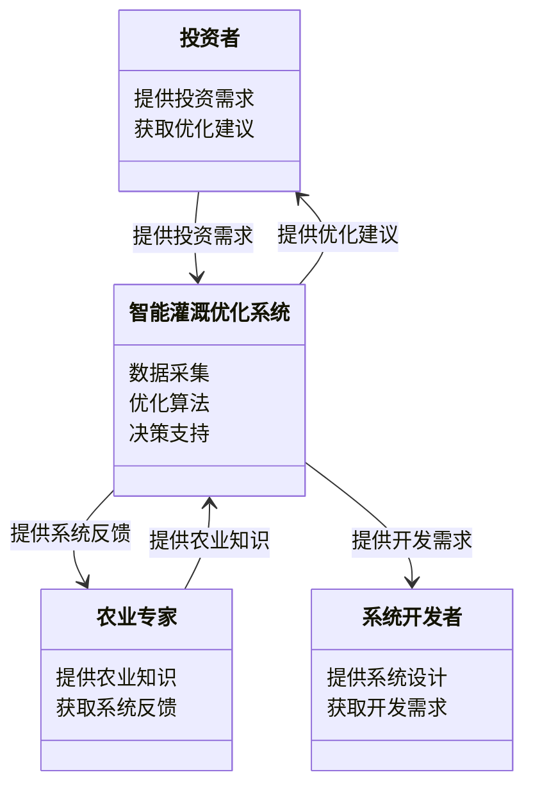

                 


# 价值投资中的智能农业灌溉优化系统分析

> 关键词：价值投资，智能农业，灌溉优化系统，算法优化，系统架构设计

> 摘要：本文深入分析了智能农业灌溉优化系统在价值投资中的应用，结合背景介绍、核心概念、算法原理、系统架构设计、项目实战等多方面，系统地探讨了如何通过智能灌溉优化系统提升农业生产的效率和价值，从而为投资者提供更精准的投资决策支持。文章内容涵盖了从理论到实践的各个方面，旨在为读者提供全面且深入的分析。

---

## 第一部分: 背景介绍与核心概念

### 第1章: 背景介绍

#### 1.1 问题背景

- **农业灌溉的现状与挑战**：传统农业灌溉方式存在水资源浪费、灌溉效率低下、难以大规模推广等问题。随着全球气候变化和水资源短缺问题的加剧，优化农业灌溉系统已成为全球关注的焦点。

- **智能灌溉系统的发展趋势**：智能灌溉系统通过传感器、物联网（IoT）、人工智能（AI）等技术，实现精准灌溉，降低水资源浪费，提高农作物产量。

- **价值投资在农业领域的潜力**：农业作为国民经济的基础产业，其高效运作能够为投资者带来稳定的收益。智能灌溉优化系统作为农业技术的重要组成部分，具有巨大的投资价值。

#### 1.2 核心概念与系统架构

- **智能农业灌溉优化系统的定义**：通过传感器、数据采集、算法优化等技术手段，实现对灌溉系统的智能化管理，以达到最优的灌溉效果。

- **价值投资的基本原理**：价值投资是一种投资策略，通过分析企业的内在价值，选择被低估的投资标的进行长期投资，以实现超额收益。

- **系统的核心要素与组成**：包括传感器、数据采集模块、算法优化模块、决策支持模块等。

- **系统的边界与外延**：智能灌溉优化系统不仅关注灌溉效率，还涉及农业生产的整体优化，包括土壤监测、气象数据、农作物生长周期等多个方面。

---

### 1.3 核心概念联系

#### 1.3.1 ER实体关系图

```mermaid
erDiagram
    actor 投资者 {
        <属性> 投资目标
        <属性> 投资策略
    }
    actor 农业专家 {
        <属性> 农业知识
        <属性> 灌溉建议
    }
    actor 系统开发者 {
        <属性> 系统设计
        <属性> 开发工具
    }
    system 智能灌溉优化系统 {
        <功能> 数据采集
        <功能> 优化算法
        <功能> 决策支持
    }
    投资者 --> system: 提供投资需求
    农业专家 --> system: 提供农业知识
    system --> 投资者: 提供优化建议
    system --> 农业专家: 提供系统反馈
    system --> 系统开发者: 提供开发需求
```

---

## 第二部分: 价值投资与智能灌溉系统的核心原理

### 第2章: 价值投资的基本原理

#### 2.1 价值投资的定义

- 价值投资是一种以基本面分析为基础的投资策略，旨在寻找市场价格低于其内在价值的股票或资产。

#### 2.2 价值投资的核心方法

- 基于财务指标分析：如市盈率、市净率、股息率等，评估企业的内在价值。

- 关注企业的长期盈利能力：选择具有竞争优势、持续增长潜力的企业。

#### 2.3 价值投资与技术分析的结合

- 技术分析通过研究价格和成交量的变化，辅助价值投资决策。

---

### 第3章: 智能灌溉优化系统的算法原理

#### 3.1 算法原理概述

- 智能灌溉优化系统通过收集土壤湿度、气象数据、农作物生长周期等信息，利用算法优化灌溉策略，实现水资源的高效利用。

#### 3.2 基于遗传算法的优化模型

- 遗传算法是一种模拟生物进化过程的优化算法，适用于解决复杂的非线性优化问题。

#### 3.3 机器学习在灌溉优化中的应用

- 使用机器学习模型（如支持向量机、随机森林）预测最佳灌溉时间、灌溉量等。

---

## 第三部分: 算法原理与数学模型

### 第4章: 算法原理

#### 4.1 遗传算法的步骤

- 初始化种群：随机生成一组初始解。

- 适应度评估：计算每个解的适应度值。

- 选择：根据适应度值选择优良解进行繁殖。

- 交叉：生成新的解。

- 变异：对新解进行随机变异。

- 重复上述步骤，直到满足终止条件。

#### 4.2 机器学习模型的构建

- 数据预处理：清洗、归一化、特征选择。

- 模型训练：使用训练数据训练模型。

- 模型评估：使用测试数据评估模型性能。

#### 4.3 算法流



---

## 第四部分: 系统分析与架构设计

### 第5章: 系统架构设计

#### 5.1 系统功能设计

- 数据采集模块：负责采集土壤湿度、气象数据等。

- 优化算法模块：基于遗传算法或机器学习模型优化灌溉策略。

- 决策支持模块：为投资者提供灌溉优化建议，帮助其做出投资决策。

#### 5.2 系统架构图



---

## 第五部分: 项目实战

### 第6章: 项目实战

#### 6.1 环境安装

- 安装Python、NumPy、Pandas、Scikit-learn等工具。

#### 6.2 核心代码实现

```python
import numpy as np
from sklearn.model_selection import train_test_split
from sklearn.ensemble import RandomForestRegressor

# 数据预处理
data = np.array([...])  # 示例数据
X = data[:, :-1]
y = data[:, -1]

# 划分训练集和测试集
X_train, X_test, y_train, y_test = train_test_split(X, y, test_size=0.2)

# 训练随机森林模型
model = RandomForestRegressor(n_estimators=100)
model.fit(X_train, y_train)

# 预测
y_pred = model.predict(X_test)
```

---

## 第六部分: 结论与展望

### 第7章: 结论

- 本文深入分析了智能农业灌溉优化系统在价值投资中的应用，探讨了其核心原理和系统架构设计。

### 7.1 结论

- 智能灌溉优化系统能够显著提高农业生产的效率，降低资源浪费，为投资者提供更精准的投资决策支持。

### 7.2 未来展望

- 进一步研究更高效的优化算法，探索多目标优化问题的解决方案。

---

## 附录

### 附录A: 完整系统设计文档

### 附录B: 扩展阅读

---

作者：AI天才研究院/AI Genius Institute & 禅与计算机程序设计艺术 /Zen And The Art of Computer Programming

